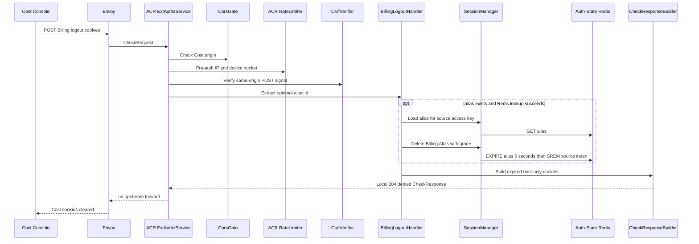

# Billing Alias Logout — God View (Master SoT)

This ACR-local workflow deletes the Cost host alias only. It does not log out
the Cloud IAM Trinity or mutate Billing PostgreSQL.

## Phase 1 — Cost Console → Envoy → ACR deletes alias

### REST input and output

| Part | Contract |
|---|---|
| Method/path | `POST /api/v1/billing/auth/logout` |
| Headers used | host-only Billing alias cookies, `Origin` |
| Payload | none |
| Success | local `204` and expired Billing cookies |
| Failure | invalid/missing alias and Redis lookup/delete failure are idempotent local `204`; only CORS, CSRF or pre-auth quota denies before cookie clearing |

### Key contract

| Key | Store | Operation | Invariant |
|---|---|---|---|
| Billing alias and source reverse index | Auth-State Redis | compare/target delete | Delete only Cost alias records; never delete IAM session |

## Complete edge execution

### CheckRequest and headers

This local interceptor runs after global CORS and pre-auth rate limiting, but
before normal alias verification/post-auth limiting. It intentionally clears
browser Cost cookies even when the alias is absent.

| Header/cookie | Read by | Purpose | Forwarded? |
|---|---|---|---|
| `Origin` | ACR CORS gate | global allowed-origin decision | No |
| `X-Forwarded-For`, optional `client_device_id` | rate limiter | pre-auth rate bucket | No |
| `X-Requested-With` or `Sec-Fetch-Site` | CSRF verifier | POST same-origin/same-site check | No |
| `__Host-billing_session` | logout handler | optional alias lookup key | No |
| Billing secret cookie | none | clearing does not require secret verification | No |

### Ordered ACR processing and output

1. CORS and pre-auth IP/device limits run.
2. `handle_billing_logout` matches exact `POST` path and runs CSRF validation.
3. It extracts an optional alias ID. If Redis returns an alias, it executes an
   atomic pipeline: `EXPIRE iam:domain_alias:billing:{id} 5` and `SREM` from
   `iam:session_alias_index:{source_access_key}`.
4. Missing, malformed alias or lookup/delete error is deliberately ignored;
   it still returns local `204` so the client can reliably clear its Cost host
   cookies. No source IAM session key is deleted.

| Result | Headers | Payload | Upstream |
|---|---|---|---|
| `204` | two expired host-only Billing `Set-Cookie` values | empty | None |
| `403` | CSRF/CORS denial; cookies are not cleared by this response | no body contract | None |
| `429` | pre-auth limiter denial | no body contract | None |

## Failure, replay and revocation semantics

The five-second alias grace prevents an in-flight request from racing a direct
delete; removal from the source index blocks future bulk-revoke enumeration.
This endpoint's deliberate best-effort Redis behavior is an AS-IS failure
semantic: a Redis error can leave alias state until TTL/revocation, while the
browser is nevertheless logged out locally. It must not be documented as a
`503` fail-closed operation without a code change.

## State and security invariants

Logout is idempotent so a stale browser can clear cookies without learning alias
existence. Cloud cookies are host-only and unavailable to Cost, therefore ACR
cannot and must not end the source IAM session here.

## Code map

[`acr/src/billing/logout.rs`](../../acr/src/billing/logout.rs),
[`acr/src/billing/session.rs`](../../acr/src/billing/session.rs).
