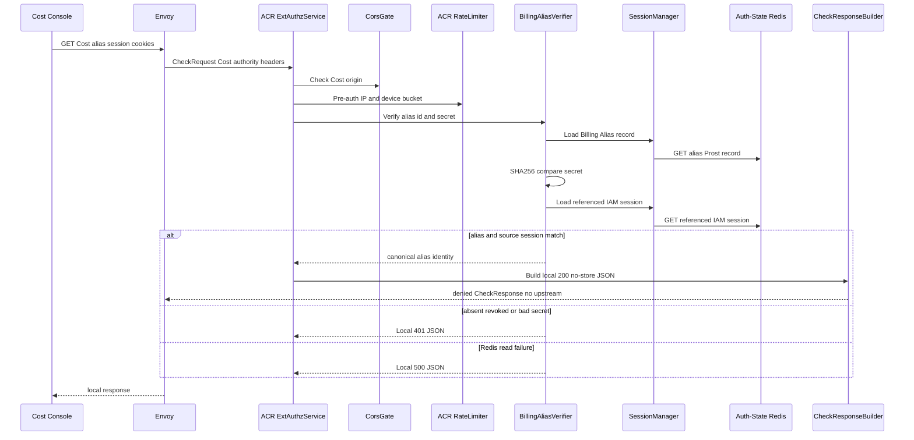

# Billing Alias Session Read — God View (Master SoT)

This ACR-local read lets Cost Console determine whether its host-bound Billing
Alias still resolves to a live IAM session. It is not Render Context and does
not disclose permissions.

## Phase 1 — Cost Console → Envoy → ACR reads alias session

### REST input and output

| Part | Contract |
|---|---|
| Method/path | `GET /api/v1/billing/auth/session` |
| Headers used | `__Host-billing_session`, alias secret cookie, `Origin` |
| Payload | none |
| Success | local `200` session identity/routing presentation fields only |
| Failure | malformed/missing/expired alias or source session `401`; no upstream forward |

### Key contract

| Key | Store | Operation | Invariant |
|---|---|---|---|
| Billing alias | Auth-State Redis | secret-hash verification + read | Alias alone is insufficient; source session must also verify |
| IAM runtime session | Auth-State Redis | read by alias source access key | Revocation/expiry invalidates Cost immediately |

## Complete edge execution

### CheckRequest and headers

This local `GET` interceptor runs after global CORS and pre-auth IP/device rate
limiting but before the normal authenticated-flow post-auth limiter. It reads:

| Header/cookie | Read by | Purpose | Forwarded? |
|---|---|---|---|
| `Origin` | ACR CORS gate | reject an origin outside `allowed_origins` | No |
| `X-Forwarded-For`, optional `client_device_id` | rate limiter | pre-auth bucket | No |
| `__Host-billing_session` | alias verifier | UUID alias lookup key | No |
| `__Host-billing_session_secret` | alias verifier | SHA-256 comparison to stored secret hash | No |
| `x-user-*`, tenant/Zone/proof headers | none | client values are not trusted or reflected | No |

There is no request body, CSRF proof requirement or Cost API forward for this
safe `GET`. The session endpoint deliberately returns neither tenant ID,
permissions, access key, proof key, JWT nor alias secret.

### Ordered ACR processing and output

1. `ExtAuthzService` checks CORS, derives the route group and applies the
   pre-auth limiter.
2. `handle_billing_session_check` matches exact `GET` path and invokes
   `verify_billing_alias` with the cookie header.
3. Verifier parses alias UUID, requires non-empty secret, fetches
   `iam:domain_alias:billing:{alias_id}`, and compares SHA-256(secret).
4. It rereads the referenced IAM runtime session with alias Zone/tenant/user/
   source access key and requires the current source proof key equal the alias
   source proof key.
5. On success ACR returns local no-store JSON. Envoy does not forward it and
   ACR does not rewrite a path or inject upstream identity headers.

| Result | Headers | Payload | Upstream |
|---|---|---|---|
| `200` | `Content-Type: application/json`, `Cache-Control: no-store` | `data.authenticated=true`, `data.user.id`, `data.user.username`, `data.zone_id` | None |
| `401` | same | generic `error_message` | None |
| `500` | same | `Authentication service unavailable` on alias/source Redis read failure | None |
| `403/429` | ACR CORS/rate denial | no session data | None |

## Failure, replay and revocation semantics

This is a read-only operation with no replay key. A missing alias, mismatched
secret, expired source session, or source proof-key rotation all return the
same non-authoritative denial class rather than reveal which binding failed.
Source revocation is decisive even during alias-index lag because the source
session recheck occurs in every invocation.

## State and security invariants

ACR strips all client `x-user-*`, tenant and proof headers. A response never
contains source access/secret, permission, role, JWT or proof private material.
Cost Console obtains navigational permissions only through the separate exact
`GET /api/v1/iam/context/read` owner-rewritten workflow.

## Code map

[`acr/src/billing/verify.rs`](../../acr/src/billing/verify.rs),
[`acr/src/gateway/ext_authz.rs`](../../acr/src/gateway/ext_authz.rs).
