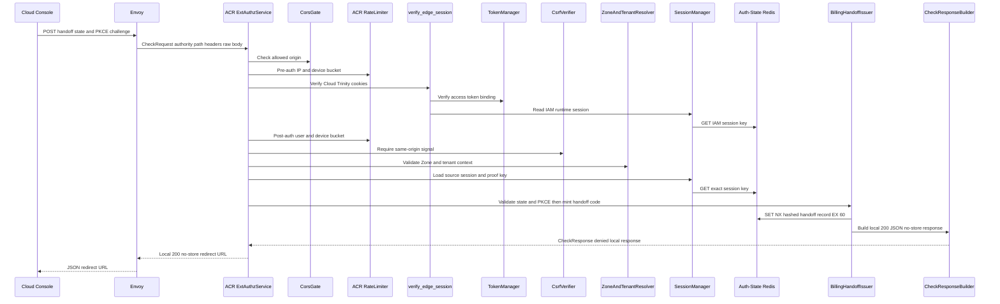

# Billing Domain Session Issue — God View (Master SoT)

This ACR-local workflow converts the verified Cloud IAM Trinity into one
single-use Cost PKCE handoff. It does not create a Billing session, copy
permissions, or accept a browser-selected owner.

## API scope and edge-routing contract

`POST /api/v1/auth/domain-sessions/billing` is a Cloud `/personal` or `/tenant`
owner workflow. ACR verifies the current Trinity, derives the exact active owner
context, then returns a fixed Cost Console redirect. The browser never calls an
internal owner route and no request reaches Cost API.

## Phase 1 — Client → Envoy → ACR issues handoff

### REST input and output

| Part | Contract |
|---|---|
| Method/path | `POST /api/v1/auth/domain-sessions/billing` |
| Headers used | Cloud session cookies, `Origin`, `User-Agent`; client identity headers are discarded |
| JSON payload | `state`, `code_challenge` (base64url SHA-256 PKCE challenge) |
| Success | `200` JSON `redirect_url` on the fixed Cost Console origin |
| Failure | malformed PKCE/state `400`; missing/revoked Trinity or Redis failure `401/503`; no forward |

### Key contract

| Key | Store | Operation / TTL | Invariant |
|---|---|---|---|
| `billing:handoff:{sha256(raw_code)}` | Auth-State Redis | `SET NX EX 60` | Holds user, concrete zone/tenant, source access key, source proof key, `state`, PKCE challenge; raw code is never stored |
| IAM runtime session key | Auth-State Redis | verified read | Source session remains authority until alias exchange |

## Complete edge execution

### CheckRequest and headers

Envoy supplies a `CheckRequest` containing the Cloud authority, `POST` method,
query-free path, request headers and raw bounded body. ACR uses only these
headers at this boundary:

| Header/cookie | Read by | Purpose | Forwarded? |
|---|---|---|---|
| `Origin` | ACR allowed-origin gate | CORS allow-list decision before authentication | No; this endpoint is local |
| `X-Forwarded-For` | ACR pre-auth limiter | Envoy-provided client-IP bucket | No |
| `client_device_id` cookie | ACR pre-auth limiter | Optional device bucket | No |
| `access_token`, `access_key`, `access_secret` cookies | `verify_edge_session` | Verify IAM Trinity and locate source runtime session | No |
| `X-Requested-With` or `Sec-Fetch-Site` | CSRF verifier | State-changing request must be XMLHttpRequest or same-origin/same-site | No |
| `state`, `code_challenge` JSON | `handle_billing_handoff_issue` | Browser binding and PKCE challenge | Stored only in the handoff record |

Client `x-user-*`, `x-tenant-id`, `x-zone-id`, `x-session-proof-*` and any
requested redirect origin are not inputs to this workflow. No such header is
returned or forwarded.

### Ordered ACR processing

1. `ExtAuthzService` checks `Origin` against `allowed_origins`; failed CORS is
   denied before any session/key lookup.
2. `RateLimiter.check_pre_auth` applies the detected route group to Envoy IP
   and optional `client_device_id`; exhaustion is denied before authentication.
3. This path is neither an exact public bypass nor an internal-owner route, so
   `verify_edge_session` verifies the Cloud Trinity and returns canonical
   claims/access key; a Cost Alias cannot call this Cloud-only endpoint.
4. `RateLimiter.check_post_auth` charges the verified user/device bucket;
   `verify_csrf_protection` then requires the permitted same-origin signal.
5. User Zone resolution and tenant resolution validate the active Cloud
   context. ACR loads `iam:user_session:{zone}:{tenant}:{user}:{access_key}`;
   the session must exist and hold a non-empty proof public key.
6. `handle_billing_handoff_issue` validates state (base64url-like, 32–128
   bytes) and 43-character URL-safe PKCE challenge, generates 64 hex handoff
   code characters, serializes the record and reserves the hashed Redis key
   with `SET NX EX 60`.
7. ACR builds the fixed configured Cost-origin fragment redirect and returns a
   local denied-response `200`; Envoy must not select an upstream cluster.

### Local REST output

| Result | Response headers | Response payload | Upstream |
|---|---|---|---|
| `200` handoff issued | `Content-Type: application/json`, `Cache-Control: no-store` | `{"data":{"redirect_url":"<configured-cost-origin>/auth/handoff#code=<opaque>&state=<state>"}}` | None |
| `400` invalid payload | same JSON/no-store headers | `error_message` only | None |
| `401` incomplete/revoked source session | same JSON/no-store headers or ACR denial | generic error only | None |
| `403` missing concrete Zone or CSRF/CORS failure | ACR denial; no identity headers | generic error only | None |
| `429` pre/post-auth limit | ACR denial | no business payload contract | None |
| `503` Security-State Redis failure or `SET NX` failure | ACR unavailable denial | no code/redirect | None |

## Failure, replay and recovery semantics

The raw code is random and `SET NX` collision is treated as unavailable rather
than retrying with ambiguous state. A crash before Redis commit exposes no code;
a crash after commit leaves a one-time record which naturally expires after 60
seconds. Cost must use the next workflow's atomic `GETDEL`, so duplicated
browser navigation has at most one redeemable exchange. Source logout, device
revoke or proof-key change after issue makes exchange fail closed because the
next workflow rechecks the source session.

## State and security invariants

- ACR derives `user_id`, `zone_id`, `tenant_id` and source access key from the
  verified session; JSON has no owner, Zone or permission fields.
- `state` only binds the Cost browser to the original Cost browser state; it is
  not identity evidence. Cost checks it before exchange.
- The raw handoff code is URL-fragment material and is consumed once in the next
  workflow; it must not enter request logs or `Referer`.

## Code map

[`acr/src/billing/exchange.rs`](../../acr/src/billing/exchange.rs),
[`cloud-console/src/app/billing/authorize/page.tsx`](../../cloud-console/src/app/billing/authorize/page.tsx).
