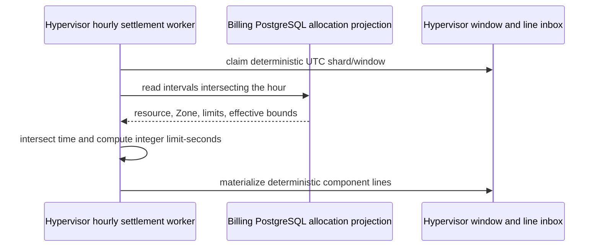
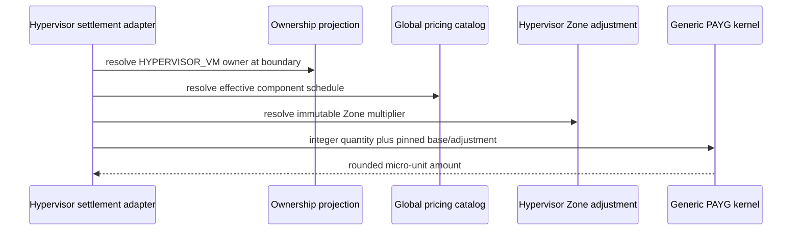
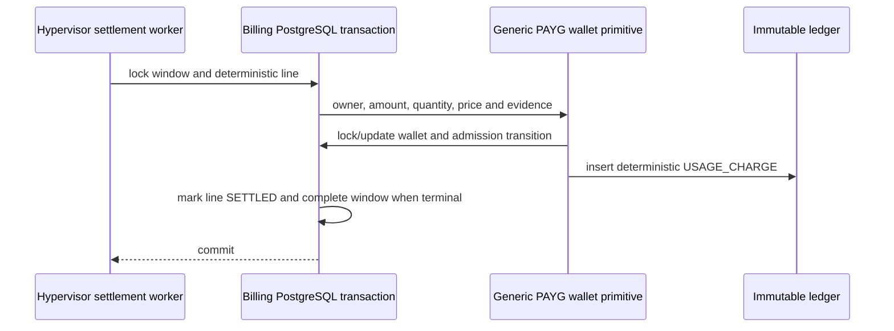

# Billing Hypervisor Allocation Settlement — God View

This Central background workflow closes UTC hourly allocation windows and
charges CPU, memory, GPU and disk limits for Hypervisor VMs. It has no browser
request and no ACR phase. It never reads Proxmox or runtime telemetry.

## Runtime contract

| Item | Contract |
| --- | --- |
| Source | Billing PostgreSQL Hypervisor allocation intervals |
| Window | UTC half-open hour `[window_start, window_end)` |
| Precision | Integer allocated seconds; worker runs in hourly batches, never once per second |
| Sharding | Stable resource UUID shard plus fenced hourly window claim |
| Billable state | Every open allocation interval, independent of VM power state |
| Money SoT | Billing PostgreSQL wallet and immutable ledger |
| Payer authority | Historical resource ownership projection at the interval boundary |
| Price | Effective Global schedule plus Hypervisor-owned Zone adjustment |
| Duplicate | Deterministic window, line and ledger IDs |

## Phase 1 — Close an eligible hourly window

The worker claims one shard/window only after the hour and bounded lifecycle
late-event grace have passed. It reads allocation intervals intersecting the
window. No polling or per-second row is created.

For each interval the exact billable duration is:

```text
allocated_seconds = seconds(intersection(allocation_interval, UTC_hour))
```

The worker materializes one flat line per nonzero component. CPU uses
`CORE_SECOND`, memory uses `MIB_SECOND`, disk uses `GIB_SECOND`, and GPU uses
`GPU_SECOND` with an enforced SKU. Quantity multiplication is checked before
conversion to PostgreSQL BIGINT.



An interval or lifecycle version gap keeps the affected window pending. A
missing interval is never reconstructed from current VM state or telemetry.
Before applying `ACTIVATE`, `REVISE` or `TERMINATE`, the lifecycle workflow
checks the stable resource shard for any `SETTLED` window ending after the
event boundary. A match is quarantined before any interval mutation; historical
money is corrected only through a future append-only correction workflow.

## Phase 2 — Resolve ownership and immutable pricing

For each line, the Hypervisor adapter resolves historical ownership at the
line boundary, then pins the effective Global schedule for its charge kind and
the immutable Hypervisor Zone adjustment. Absence of a Zone adjustment means
explicit Global inheritance `1/1`.

The PAYG kernel receives only integer quantity, opaque module/charge-kind,
base snapshot and adjustment lineage. `ALLOCATED_DURATION` is catalog evidence,
not a Hypervisor branch inside the kernel.



Missing or ambiguous ownership, price, adjustment integrity or inactive wallet
becomes durable `UNRATED`; the adapter never guesses a payer or rate.

## Phase 3 — Atomic wallet and ledger settlement

Each line settles through the generic wallet primitive in the same PostgreSQL
transaction that locks its window/line identity. Promotional balance is used
before cash. Available credit is `cash + remaining promotional +
overdraft_limit` in integer micro-units. Cash may go negative inside that
configured grace amount; crossing zero emits one
`SUSPENDED(CREDIT_EXHAUSTED)` admission transition. Existing VMs continue to
meter and accrue ledger debt until their allocation terminates; this workflow
never stops or deletes a VM.



## Failure and recovery rules

| Failure | Behavior |
| --- | --- |
| Worker crash before commit | Transaction rollback; same window is reclaimed |
| Crash after commit | Deterministic ledger/line identity prevents another debit |
| Ownership projection lag | Line remains UNRATED and is replayed |
| Pricing/adjustment checksum mismatch | Fail closed; do not charge |
| Lifecycle predecessor gap | Keep the event pending for retry; never discard a valid termination |
| Quantity overflow | Line DEAD with bounded evidence; no wrapped charge |
| Wallet exhausted | Charge is recorded according to wallet overdraft contract; wallet becomes suspended |
| Late lifecycle event after closed window | Quarantine for append-only correction policy; never mutate ledger in place |
| Runtime telemetry outage | No effect on allocation billing |

## Charge kinds

| Code | Basis | Unit |
| --- | --- | --- |
| `hypervisor.vcpu.allocated_second` | `ALLOCATED_DURATION` | `CORE_SECOND` |
| `hypervisor.memory_mib.allocated_second` | `ALLOCATED_DURATION` | `MIB_SECOND` |
| `hypervisor.disk_gib.allocated_second` | `ALLOCATED_DURATION` | `GIB_SECOND` |
| `hypervisor.gpu.allocated_second` | `ALLOCATED_DURATION` | `GPU_SECOND` |

## Code map

- `cost-manager/api/migrations/000003_tables_pricing.up.sql`
- `cost-manager/api/migrations/000004_tables_settlement.up.sql`
- `cost-manager/engine/src/service/hypervisor/allocation_lifecycle.rs`
- `cost-manager/engine/src/service/hypervisor/hourly_allocation_settlement.rs`
- `cost-manager/engine/src/engine/snapshot.rs`
- `cost-manager/engine/src/engine/wallet.rs`
- `cost-manager/engine/src/service/register.rs`
