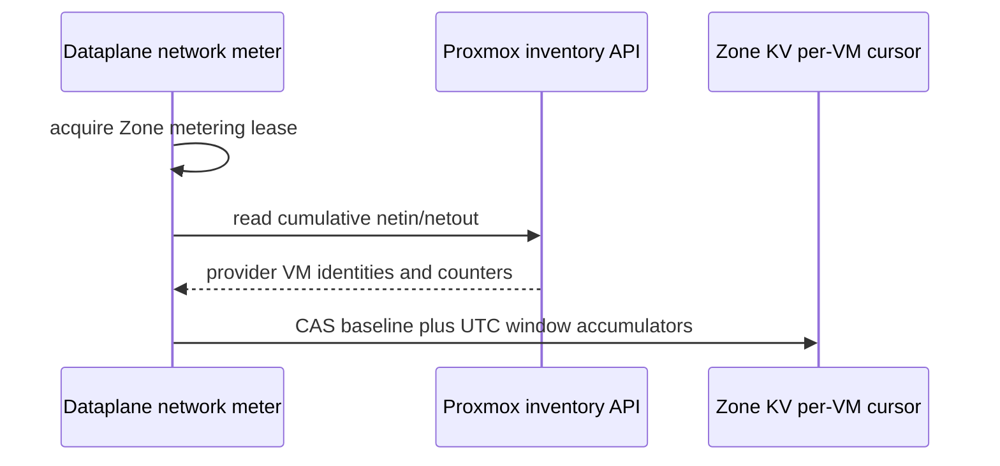
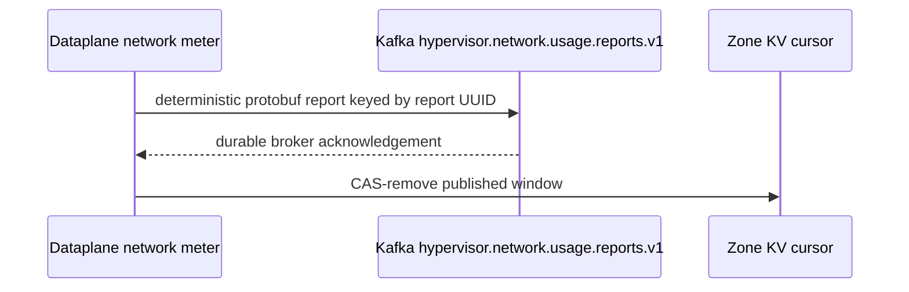
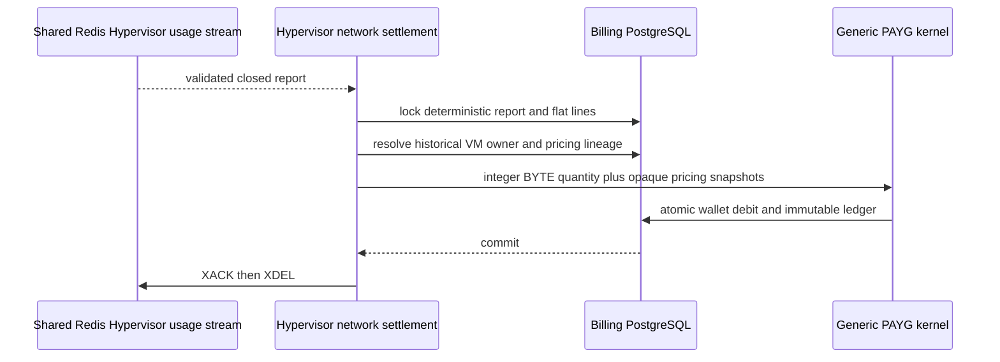

# Billing Hypervisor Network Usage Settlement — God View

This background workflow measures and settles Hypervisor VM network transfer.
It has no browser request and no ACR phase. Runtime charts are explicitly
outside the billing authority boundary.

## Runtime contract

| Item | Contract |
| --- | --- |
| Provider evidence | Proxmox cumulative `netin`/`netout` counters read by the Zone Dataplane |
| Resource authority | Immutable `aurora-{resource UUID}` provider binding in Zone KV |
| Window | UTC half-open hour `[window_start, window_end)` |
| Sampling | Periodic counter deltas; no per-second job and no runtime UI metric input |
| Durable cursor | One flat, CAS-updated Zone KV state per VM |
| Transport | Dedicated Kafka report topic, then dedicated Shared Redis stream |
| Recovery horizon | Report age and Kafka retention are bounded to 30 days |
| Money SoT | Billing PostgreSQL wallet and immutable ledger |
| Price | Effective Global schedule plus Hypervisor-owned Zone adjustment |

## Phase 1 — Dataplane observes cumulative provider counters

One Zone-fenced worker polls the Proxmox VM inventory. It accepts only
non-template VMs whose provider name is the canonical `aurora-{UUID}` name.
For each VM it loads its independent metering cursor from Zone KV, computes
monotonic deltas and allocates the integer bytes across crossed UTC windows by
elapsed time. Counter regression starts a new baseline and never fabricates a
delta. Power state is irrelevant: a stopped VM commonly produces zero delta,
while allocation billing continues in its separate workflow.

VM create establishes the initial counter baseline before first start. VM
delete records a final provider observation after stop and before purge; if the
Zone KV CAS fails, delete remains retryable and the VM is not purged. The
metering worker scans cursor keys in bounded rotating pages, so closed pending
windows are still published after a VM disappears from provider inventory.

The worker polls periodically, not once per second. A delta crossing an hour
boundary is split deterministically by elapsed milliseconds; the final slice
receives the integer remainder so bytes are neither created nor discarded.

## Phase 2 — Publish a closed hourly report

After the UTC hour plus late grace, Dataplane builds one bounded
`HypervisorNetworkUsageReportV1` per VM/window. Report ID, sequence and SHA-256
are deterministic. Kafka acknowledgement happens before the CAS cursor removes
the pending window. A crash at that boundary republishes the identical report.

JO strictly validates the protobuf, time window, identity, sequence and
checksum. Invalid input goes to the existing Kafka DLQ without copying the raw
payload. Valid input is written to a bounded dedicated Hypervisor Redis stream
and passes the configured WAITAOF durability fence before the Kafka offset is
committed. Duplicate reports are intentionally allowed.

## Phase 3 — Cost Engine settles flat network lines

The Hypervisor network consumer verifies Redis envelope fields and persists a
report inbox plus at most two independent lines: `NETWORK_IN` and
`NETWORK_OUT`. It resolves historical `HYPERVISOR_VM` ownership at the report
window, pins the Global schedule and Hypervisor Zone adjustment, and passes
only integer byte quantity and immutable pricing evidence to the generic PAYG
kernel.

Missing ownership, price or checksum remains durable `UNRATED`; it is never
guessed. A report/line/ledger deterministic identity prevents double debit.
The generic wallet primitive consumes promotion before cash and grants only the
configured `overdraft_limit`: admission is suspended when `cash + remaining
promotional + overdraft_limit <= 0`. Network evidence for an existing VM still
settles after suspension and may increase its durable debt.

## Failure and recovery rules

| Failure | Behavior |
| --- | --- |
| First observation | Establish baseline; charge no historical bytes |
| Final observation cannot be persisted | Delete retries before provider purge |
| Counter regression/reset | Establish a new baseline; charge no ambiguous delta |
| Poll crosses UTC boundary | Split exact integer delta by elapsed time |
| Dataplane crash before Kafka ACK | Cursor retains the window; retry |
| Crash after Kafka ACK before cursor CAS | Republish identical report; downstream inbox absorbs it |
| JO crash before Kafka commit | Duplicate Redis entry; report inbox absorbs it |
| Missing payer or pricing | Persist UNRATED and retry; no guessed charge |
| VictoriaMetrics/UI outage | No effect on billing |

## Charge kinds

| Code | Unit |
| --- | --- |
| `hypervisor.network_in.byte` | `BYTE` |
| `hypervisor.network_out.byte` | `BYTE` |

## Dataplane tuning

- `HYPERVISOR_NETWORK_METERING_POLL_SECONDS`: default 60, bounded 10–300.
- `HYPERVISOR_NETWORK_METERING_LATE_GRACE_SECONDS`: default 300, bounded 30–1800.
- `HYPERVISOR_NETWORK_METERING_SCAN_PAGE_SIZE`: default 500, bounded 50–2000.
- `HYPERVISOR_NETWORK_METERING_SCAN_MAX_PAGES`: default 20, bounded 1–200.

## Code map

- `proto/cost-manager/engine/hypervisor_network_usage_report.proto`
- `dataplane/src/executor/hypervisor/network_metering.rs`
- `job-orchestrator/src/hypervisor_metering.rs`
- `cost-manager/engine/src/service/hypervisor/network_usage_settlement.rs`
- `cost-manager/engine/src/service/hypervisor/network_usage_stream.rs`
- `cost-manager/api/migrations/000004_tables_settlement.up.sql`
- `cost-manager/api/migrations/000006_seeds.up.sql`
