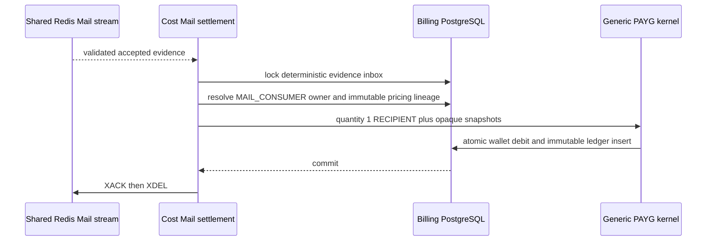

# Billing Mail Accepted Usage Settlement — God View

This background workflow charges exactly one Mail usage unit after Stalwart
JMAP returns a typed `EmailSubmission/set created` result for one recipient.
It has no browser request and no ACR phase. Customer broker delivery, runtime
heartbeats, lag and metrics are never billing authority.

## Runtime contract

| Item | Contract |
| --- | --- |
| Billable fact | One JMAP-accepted recipient submission |
| Non-billable outcomes | Permanent reject, retryable failure and ambiguous JMAP result |
| Charge kind/unit | `mail.delivery.accepted_recipient` / `RECIPIENT` |
| Dataplane transport | Kafka `{prefix}.mail.accepted.usage.v1`, `acks=all` |
| Central handoff | Shared Redis Stream `aurora:mail:accepted:usage` |
| Settlement owner | Cost Engine group `cost-engine-mail-accepted-usage-v1` |
| Money SoT | Billing PostgreSQL ownership, pricing, wallet and immutable ledger |
| Duplicate | Evidence inbox identity plus checksum prevents a second debit |

The PAYG kernel receives only an opaque Mail charge kind, integer quantity,
immutable Global price, Mail-owned Zone adjustment and resolved payer. The
kernel does not know a consumer, broker, recipient or Mail workflow.

## Phase 1 — Dataplane obtains a typed accepted result

Each broker suite creates a trusted source identity before it calls the Mail
processor: Kafka uses consumer/topic/partition/offset, Redis Stream uses
consumer/stream/entry ID, JetStream uses consumer/stream sequence, and
RabbitMQ uses consumer plus the required AMQP message ID. This trusted identity
is separate from the optional event ID inside the customer payload.

The processor validates the fixed envelope, renders the configured template
and submits one recipient to the shared JMAP batcher. Only a typed JMAP
`created` result enters the evidence phase. An invalid, rejected, retryable or
ambiguous result emits no usage evidence.

## Phase 2 — Durable evidence before source settlement

For `Accepted`, Dataplane builds `MailAcceptedUsageV1` with the trusted evidence
ID, Zone, consumer resource ID, accepted UTC time, quantity `1` and canonical
SHA-256. Recipient address, subject, rendered body, template variables,
credential and broker payload are absent.

```mermaid
sequenceDiagram
    participant B as Customer broker suite
    participant P as Mail processor/JMAP
    participant K as Kafka mail.accepted.usage.v1
    B->>P: payload plus trusted source evidence ID
    P->>P: render and JMAP submit
    alt rejected, retryable or ambiguous
        P-->>B: non-accepted outcome; no evidence
    else typed accepted
        P->>K: MailAcceptedUsageV1 keyed by evidence ID
        K-->>P: durable acks=all
        P-->>B: Accepted
        B->>B: ACK/commit native broker message
    end
```

Kafka failure keeps the evidence publish retryable and native broker settlement
must not advance. A crash after Kafka ACK but before broker ACK replays the
same trusted identity. For RabbitMQ, reusing one message ID with different
content produces a checksum conflict and is quarantined rather than charged.

JMAP accepted followed by process death before Kafka ACK remains the published
best-effort Mail ambiguity window. Redelivery may submit again, but eventual
evidence keeps one identity and therefore at most one charge. Billing prefers
undercharge over speculative or duplicate debit.

## Phase 3 — Job Orchestrator validates and relays

JO owns Kafka decoding, bounded contract validation, UUID/time/quantity/checksum
checks and the Kafka-to-Redis durability boundary. Invalid evidence is written
to the sanitized Kafka DLQ without its original payload, then the source offset
is committed. Valid evidence is appended to the bounded Mail Redis stream and
passes the configured `WAITAOF` fence before Kafka commit.

Redis failure leaves the Kafka offset pending. JO crash after `XADD` may append
a duplicate; Cost Engine absorbs it through evidence identity and checksum.

## Phase 4 — Cost Engine settles one flat Mail line

Cost Engine revalidates the Redis envelope and protobuf, opens a fenced pricing
run for `mail.delivery.accepted_recipient`, and inserts/locks the flat Mail
evidence inbox. It resolves historical `MAIL_CONSUMER` ownership at
`accepted_at`, the effective Global schedule and the Mail Zone adjustment.
Missing or ambiguous ownership, wallet or price becomes durable `UNRATED`; no
payer or price is guessed.



A settled duplicate is acknowledged without a second debit. A duplicate ID
with another checksum is quarantined. PostgreSQL or pricing failure leaves the
Redis entry pending for reclaim. Corrections remain append-only and are outside
this unsigned V1 contract. The wallet primitive consumes promotion before cash
and applies the configured integer `overdraft_limit`; it suspends admission only
when `cash + remaining promotional + overdraft_limit <= 0`. Evidence already
accepted by the Mail runtime is still ledgered after suspension rather than
being silently made free.

## Security and failure invariants

- Customer payload identity is never billing identity.
- Runtime metrics, lag, watch projections and broker attempt counts cannot
  create a charge.
- Recipient and rendered content never cross the metering boundary.
- Kafka durability precedes native broker ACK/commit.
- Missing owner, wallet or price never means free settlement or guessed debit;
  it becomes durable unrated evidence.
- Replay is expected at every transport boundary and must be idempotent.
- Mail owns Zone adjustment and evidence semantics; the PAYG kernel stays
  module-agnostic.

## Code map

- `proto/cost-manager/engine/mail_accepted_usage.proto`
- `dataplane/src/executor/mail/metering/accepted_usage.rs`
- `dataplane/src/executor/mail/processor/stream.rs`
- `dataplane/src/executor/mail/runtime/{kafka,redis_stream,nats_jetstream,rabbitmq}.rs`
- `job-orchestrator/src/mail_metering.rs`
- `cost-manager/engine/src/service/mail/accepted_usage_stream.rs`
- `cost-manager/engine/src/service/mail/accepted_usage_settlement.rs`
- `cost-manager/api/migrations/000003_tables_pricing.up.sql`
- `cost-manager/api/migrations/000004_tables_settlement.up.sql`
- `cost-manager/api/migrations/000006_seeds.up.sql`
