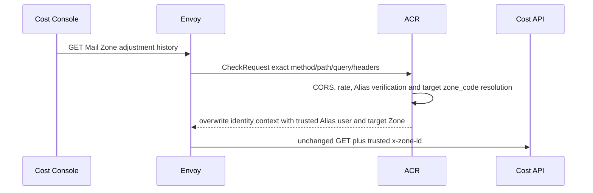

# Billing Mail Zone Price Adjustment List — God View

This operator read lists immutable Mail multiplier versions for exactly the
Zone verified by ACR. It does not publish, cancel or mutate pricing.

## API-scope contract

Cost Console sends
`GET /api/v1/billing/mail/zone-price-adjustments?limit=100&zone_code={code}`
with Billing Alias cookies. ACR resolves exactly one active/draining catalog
code, removes caller Zone headers and overwrites `x-zone-id` with the selected
target. Cost reads only that trusted header and requires
`billing:pricing_schedule:read`; proof is not required for this read.

## Phase 1 — Client → Envoy → ACR

## Phase 2 — Flat CTE read projection

Transport validates `limit` in `1..100` and obtains the trusted Zone. The list
service passes a flat workflow query to its own repository port. One CTE orders
only that Zone's versions by version number, marks the latest row and computes
whether each interval is effective at PostgreSQL `NOW()`. The repository reads
at most `limit+1` rows to return bounded history and `has_more` without a second
count query.

The response contains the trusted `zone_id`, UTC read time and repeated flat
list items. Multiplier numerator/denominator are decimal strings at JSON; all
timestamps are RFC3339Nano UTC. Database rows remain BIGINT integers. Empty
history means Global inheritance `1/1` and `expected_latest_version=0` for the
first publish.

## Failure and security rules

- Missing, repeated, malformed or inactive `zone_code` is denied by ACR before
  Cost is called.
- Invalid limit returns 400.
- Database failure returns 500; no stale local fallback is fabricated.
- A caller selects only catalog code; Cost never trusts query/header Zone data.
- Read results are informational; settlement resolves the effective immutable
  row directly from Billing PostgreSQL at evidence time.

## Code map

- `cost-manager/api/internal/transport/http/handler/mail_pricing_handler.go`
- `cost-manager/api/internal/service/mail_zone_adjustment_list_service.go`
- `cost-manager/api/internal/repository/mail_zone_adjustment_list_repo.go`
- `cost-console/src/page/pricing-schedules/MailZoneAdjustmentPanel.tsx`
