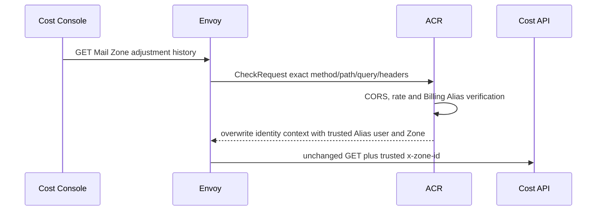

# Billing Mail Zone Price Adjustment List — God View

This operator read lists immutable Mail multiplier versions for exactly the
Zone verified by ACR. It does not publish, cancel or mutate pricing.

## API-scope contract

Cost Console sends
`GET /api/v1/billing/mail/zone-price-adjustments?limit=100` with Billing Alias
cookies. Envoy supplies the exact method, path, query, headers and origin in the
ACR `CheckRequest`. ACR enforces CORS/rate/session, removes caller-provided
proof headers, overwrites caller-provided identity context with the Billing
Alias `x-user-id`, `x-user-name`, `x-zone-id` and `x-tenant-id`, and overwrites
`x-session-proof-verified=false`. It forwards the unchanged method/path/query;
there is no owner-path rewrite. The query contains no `zone_id`.
Cost API requires `billing:pricing_schedule:read`; session proof is not required
for this non-mutating workflow.

## Phase 1 — Client → Envoy → ACR

## Phase 2 — Flat CTE read projection

Transport validates `limit` in `1..100` and obtains the trusted Zone. The list
service passes a flat workflow query to its own repository port. One CTE orders
only that Zone's versions by version number, marks the latest row and computes
whether each interval is effective at PostgreSQL `NOW()`. The repository reads
at most `limit+1` rows to return bounded history and `has_more` without a second
count query.

The response contains the trusted `zone_id`, UTC read time and repeated flat
list items. Multiplier numerator/denominator are decimal strings at JSON; all
timestamps are RFC3339Nano UTC. Database rows remain BIGINT integers. Empty
history means Global inheritance `1/1` and `expected_latest_version=0` for the
first publish.

## Failure and security rules

- Missing/invalid trusted Zone is denied before repository access.
- Invalid limit returns 400.
- Database failure returns 500; no stale local fallback is fabricated.
- A caller cannot enumerate another Zone through path, query or body.
- Read results are informational; settlement resolves the effective immutable
  row directly from Billing PostgreSQL at evidence time.

## Code map

- `cost-manager/api/internal/transport/http/handler/mail_pricing_handler.go`
- `cost-manager/api/internal/service/mail_zone_adjustment_list_service.go`
- `cost-manager/api/internal/repository/mail_zone_adjustment_list_repo.go`
- `cost-console/src/page/pricing-schedules/MailZoneAdjustmentPanel.tsx`
