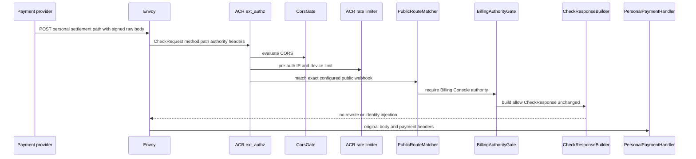
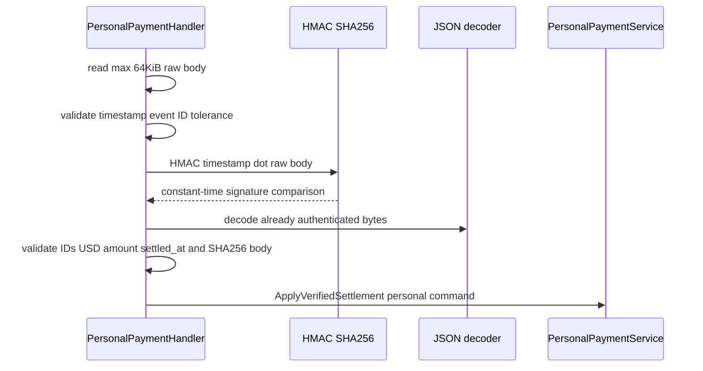
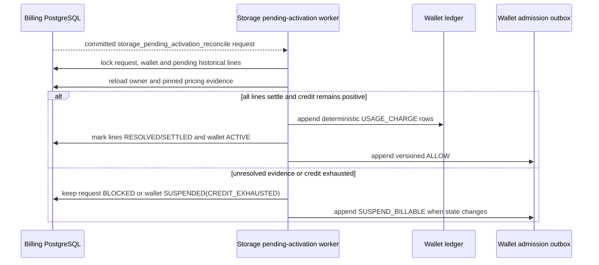
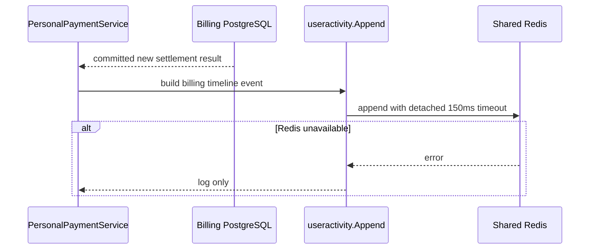

# Personal Payment Settlement — God View (Master SoT)

This is the only workflow that turns a personal checkout into durable money. Browser success, a polling read, and an Alias session have no settlement authority. The payment provider can retry at least once; idempotency is established in PostgreSQL, not in the transport.

## API-scope contract

This is a provider-owned webhook, not `/personal`, `/tenant`, or `/me`. It has no browser principal, no tenant choice, no ACR owner rewrite, and no RBAC middleware. Its authority is the exact public webhook path on the Cost/Billing Console authority plus an application-verified raw-body HMAC. The personal owner is derived later from the locked durable payment intent.

| Boundary | Contract |
|---|---|
| Method/path | `POST /api/v1/billing/webhooks/personal/payment-settled` |
| ACR authority | Billing Console only; another authority is denied before Cost API |
| Required headers | `x-aurora-payment-timestamp`, `x-aurora-payment-signature`, `x-aurora-payment-event-id` |
| JSON body | `payment_intent_id`, `provider_payment_id`, `amount_micro_units`, `currency`, `settled_at` |
| Signed bytes | `timestamp + "." + exact raw body` using configured provider HMAC key; signature is raw URL-safe base64 |
| Success | applied or byte-identical event replay is success; empty success response |

## Phase 1 — Payment provider → Envoy → ACR

ACR performs normal CORS and pre-auth IP/device rate limiting before public-route evaluation. It recognises only the exact personal or tenant settlement paths. The public bypass is then allowed only when the request arrived through Billing Console authority; ACR does no session lookup, proof verification, identity injection, path rewrite, or upstream header mutation for this webhook.

| CheckRequest input | ACR use |
|---|---|
| `:method=POST`, exact `:path` | match configured public bypass and payment webhook allowlist |
| authority/host | must be the Billing Console authority |
| `Origin`, X-Forwarded-For, device cookie | CORS and pre-auth rate limiting only |
| provider HMAC headers and JSON body | opaque to ACR; forwarded unchanged to Cost API |
| client identity, tenant, proof headers | not an authority input; Cost handler ignores them |

| ACR outcome | Response / forward |
|---|---|
| allowed | CheckResponse `200`; Envoy forwards original method/path/body/headers unchanged |
| wrong authority | local permission denied; no upstream request |
| CORS/rate failure | local denial; no inbox row or transaction |



### Phase-1 failure boundary

The provider must retry a transport failure or `5xx` using the same event ID and exact payload. It must not substitute a browser cookie or caller-supplied owner header for its HMAC credentials.

## Phase 2 — Raw-body authentication and canonical settlement command

`PersonalPaymentHandler.ApplySettlement` caps the request body at 64 KiB, reads it once, validates a non-empty event ID (at most 128 characters), parses its timestamp within configured webhook tolerance, decodes the signature, and compares the HMAC in constant time. Only then does it JSON-decode the same bytes, parse UUIDs/time/positive USD amount, calculate `sha256(raw_body)`, and construct `PaymentSettlement` with `OwnerTypePersonal` and the configured provider name.

| Input | Handler rule |
|---|---|
| raw body | maximum 64 KiB and non-empty |
| timestamp | parseable and absolute clock skew within `WebhookTolerance` |
| event ID | non-empty, at most 128 characters |
| signature | `base64.RawURLEncoding`, HMAC-SHA256 over exact timestamp, period, raw body |
| payload | valid UUID intent/payment IDs, positive amount, `USD`, valid settlement time |

| HTTP result | Meaning |
|---|---|
| `204` | transaction applied or compatible duplicate replay |
| `400` | oversized/empty body or invalid settlement fields |
| `401` | missing/stale timestamp, invalid event ID/signature |
| `404` | referenced personal intent absent; inbox is durably rejected |
| `409` | event replay conflict, intent/provider mismatch, reused provider payment, or non-creditable wallet |
| `503` | serializable/deadlock conflict; provider retries unchanged event |



## Phase 3 — Serializable inbox, wallet, ledger and referral transaction

The repository starts a serializable transaction. The webhook inbox is the first durable replay fence, then the payment intent, possible provider-payment conflict, personal wallet, and optional referral reservation are locked in that order. All successful balances, immutable ledger rows, intent state, referral records, and inbox state commit together. Any failure rolls back all uncommitted writes; selected invalid events instead commit an explicit `REJECTED` inbox record so identical bad retries cannot become money later.

```mermaid
sequenceDiagram
    participant S as PersonalPaymentService
    participant R as PersonalPaymentRepository
    participant DB as Billing PostgreSQL
    S->>R: verified personal settlement
    R->>DB: BEGIN SERIALIZABLE
    R->>DB: INSERT webhook inbox provider event hash owner PERSONAL
    alt event already exists
        R->>DB: lock stored inbox and compare hash owner intent
        DB-->>R: replay or replay conflict
    end
    R->>DB: lock PERSONAL payment intent
    R->>DB: compare provider amount currency and provider payment uniqueness
    R->>DB: lock personal wallet
    R->>DB: UPDATE cash balance and preserve PENDING_ACTIVATION if pending
    opt wallet was PENDING_ACTIVATION
        R->>DB: INSERT storage_pending_activation_reconcile request
        R->>DB: INSERT SUSPEND_BILLABLE wallet admission outbox
    else wallet was CREDIT_EXHAUSTED suspension
        R->>DB: transition to ACTIVE and INSERT ALLOW admission outbox
    end
    R->>DB: INSERT deterministic TOP_UP ledger entry
    opt wallet is active and referral reservation is eligible
        R->>DB: advisory owner onboarding lock and reservation lock
        R->>DB: insert deterministic credit grant and PROMO_CREDIT ledger
        R->>DB: insert redemption and mark reservation REDEEMED or REJECTED
    end
    R->>DB: mark intent SETTLED and inbox APPLIED
    R->>DB: COMMIT
```

### Durable transitions and invariants

| Step | Durable rule |
|---|---|
| inbox insert | unique `(provider, provider_event_id)` stores payload hash, PERSONAL owner type and payment intent ID |
| duplicate event | same hash/owner/intent and already SETTLED provider payment returns replay success; a different hash/owner/intent is a conflict |
| intent | must exist with `owner_type=PERSONAL`, same provider, amount and currency; a second intent cannot claim same provider payment ID |
| wallet | `FOR UPDATE`; CLOSED or invalid state is rejected; `PENDING_ACTIVATION` remains `PENDING_ACTIVATION/NOT_ACTIVATED` until historical Storage reconciliation; only `CREDIT_EXHAUSTED` suspension can reopen |
| admission | wallet version, reason and `SUSPEND_BILLABLE`/`ALLOW` outbox row commit with the wallet transition; pending top-up never emits `ALLOW` |
| monetary journal | deterministic SHA1 derived TOP_UP ledger ID records post-credit cash and promotional balances; duplicate insert cannot mint twice |
| referral | activation-only reservation is not redeemed while the wallet remains pending; it is handled by the activation workflow after reconciliation |
| settlement | intent gets provider payment ID and `SETTLED`; inbox gets `APPLIED` in the same commit |

### Rejection, retry and recovery

| Condition | Settlement result | Recovery |
|---|---|---|
| unknown intent, amount/currency/provider mismatch, provider payment reuse, invalid wallet | inbox marked `REJECTED` where applicable; `404`/`409` | no automatic money retry; investigate provider or durable intent mismatch |
| serialization failure/deadlock | transaction rolls back; handler returns `503` | provider retries the exact event ID/body |
| identical replay after success | inbox and settled intent are locked then returned as `Replayed` | handler returns successful empty response; no second ledger/timeline item |
| Redis activity publish fails | money transaction already committed | logged only; must not make provider retry settlement |

## Phase 4 — Storage activation handoff

When the committed wallet was `PENDING_ACTIVATION`, the payment workflow hands
off only a durable request keyed by wallet. The Storage Engine later reloads
historical `WALLET_PENDING_ACTIVATION` lines and their pinned pricing versions;
it may transition the wallet to `ACTIVE` only after those lines are terminal and
the wallet remains credit-positive. This payment workflow never re-rates usage,
calls a Zone, or lifts admission from the webhook path.



## Phase 5 — Best-effort account timeline projection

Only after a new committed settlement, `PersonalPaymentService` submits `useractivity.Append` to Shared Redis with a 150 ms detached timeout. The event uses action `billing.wallet.top_up` or `billing.wallet.activate` (the latter only when a credit-exhausted suspension reopens), system actor, the settled provider event as operation ID, wallet resource, amount/currency, and bounded admission metadata. Pending activation is projected by its Storage reconciliation workflow, not by the webhook. This is a UX projection, not a ledger/retry participant.



## Key contract

| Key/table | Rule |
|---|---|
| `billing.payment_webhook_inbox` | durable at-least-once replay fence; rejected events are durable too |
| `billing.payment_intents` | one personal owner and provider settlement binding |
| `billing.wallets` | locked financial aggregate and activation status |
| `billing.wallet_ledger_entries` | immutable deterministic TOP_UP and optional PROMO_CREDIT journal |
| `billing.personal_referral_reservations`, `credit_grants`, `personal_referral_redemptions` | all referral result records commit atomically with money |
| Shared Redis account timeline | best-effort post-commit projection only |

## Code map

[`acr/src/gateway/ext_authz.rs`](../../acr/src/gateway/ext_authz.rs), [`cost-manager/api/internal/transport/http/handler/personal_payment_handler.go`](../../cost-manager/api/internal/transport/http/handler/personal_payment_handler.go), [`cost-manager/api/internal/service/personal_payment_service.go`](../../cost-manager/api/internal/service/personal_payment_service.go), and [`cost-manager/api/internal/repository/personal_payment_repo.go`](../../cost-manager/api/internal/repository/personal_payment_repo.go).
