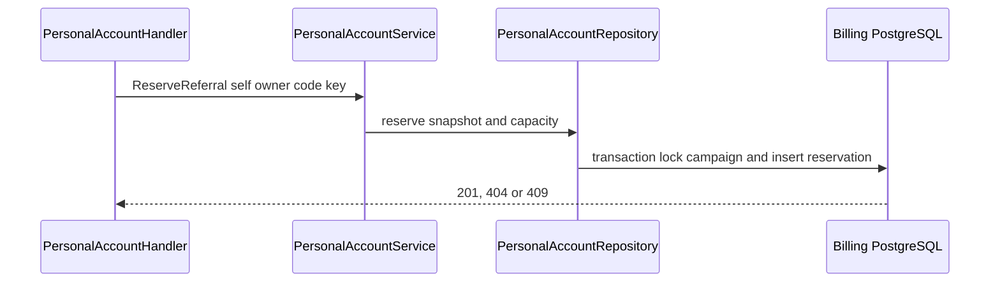
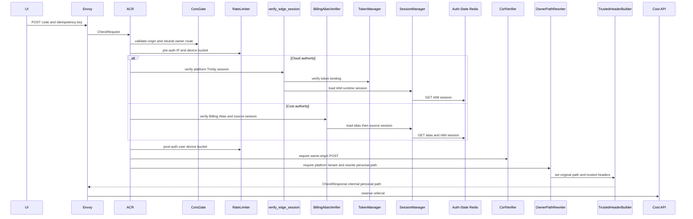
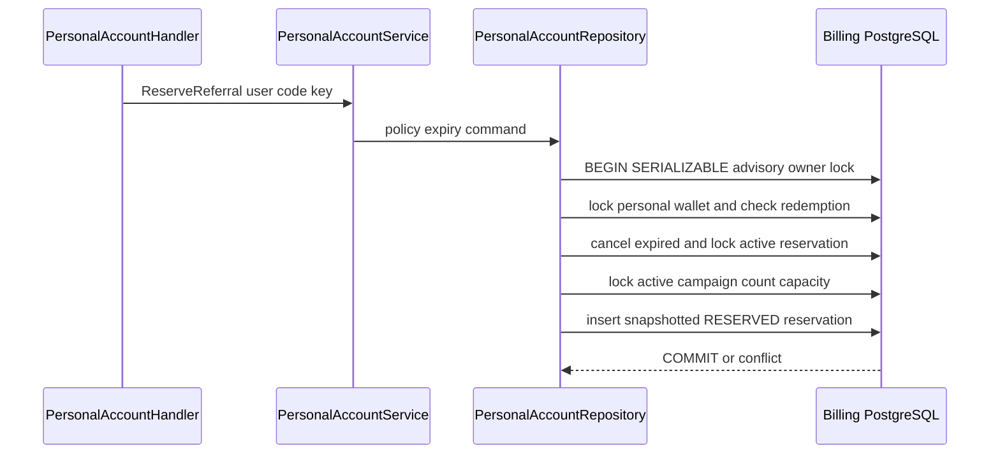

# Personal Referral Reserve — God View (Master SoT)

This `/personal` owner mutation reserves one onboarding referral for the verified user. It never operates on a tenant wallet and does not grant money until payment settlement.

## Phase 1 — Client → Envoy → ACR

| Part | Contract |
|---|---|
| Method/path | neutral `POST /api/v1/billing/wallet/referral` |
| Headers used | Cloud Trinity cookies on Cloud authority or Billing Alias cookies on Cost authority, `Origin`, required `idempotency-key` |
| JSON payload | `code` only |
| ACR output | verified personal rewrite and identity overwrite; no critical proof for this reservation API |
| Failure | unauthenticated `401`; direct owner route denied |

## Phase 2 — Cost API reservation transaction

Handler requires nonempty bounded idempotency key and canonical uppercase code. Service/repository expires obsolete reservation, locks campaign capacity, snapshots grant/minimum/currency into a reservation and records personal onboarding uniqueness. Conflict covers active reservation, redemption, active wallet or exhausted campaign.

## Complete edge and Cost execution

### Branch selection and ACR forward

Platform context alone selects personal `POST /api/v1/billing/wallet/referral`. ACR runs CORS, pre/post rate limits, session/alias source recheck and CSRF for POST, then rewrites to `/api/v1/personal/billing/wallet/referral`, sets `x-original-path`, removes browser raw proof/workspace headers and overwrites browser identity with trusted self context plus proof marker false. This route is not critical in current code; it has no Ed25519 proof consume.

| Authority | Exact trusted headers sent upstream |
|---|---|
| Cloud Trinity | `x-user-id`, `x-user-name`, `x-user-level`, `x-zone-id`, `x-tenant-id`, `x-client-device-id`, `x-session-proof-verified: false`, `x-original-path`, and `x-workspace-id` only from verified `workspace_id` cookie |
| Cost Billing Alias | `x-user-id`, `x-user-name`, `x-zone-id`, `x-tenant-id`, `x-session-proof-verified: false`, `x-original-path`; no level/device/workspace header |

| Input | Owner | Rule |
|---|---|---|
| `idempotency-key` | handler/repository | required, trimmed, 1-128 bytes; becomes durable replay fence |
| JSON `code` | handler | uppercase canonical 4-32 `[A-Z0-9_-]` |
| session tenant | ACR | must be platform sentinel for personal branch |
| client owner/wallet/campaign/amount fields | none | not accepted |

### Serializable reservation transaction

Handler calls service, which sets reservation expiry from policy. Repository starts Serializable transaction, takes advisory lock `user:PERSONAL:ONBOARDING`, locks personal USD wallet `FOR UPDATE`, requires `PENDING_ACTIVATION`, checks durable redemption uniqueness, cancels expired reservations, and locks any active reservation. Same code/key returns it; different key/code returns conflict. It then locks only an active/in-window onboarding campaign, counts redeemed plus unexpired reserved capacity, snapshots campaign version/code/grant/minimum/currency/expiry, inserts reservation and commits.

| Result | Response | Durable effect |
|---|---|---|
| `201` | RESERVED snapshot, expiry and grant terms | reservation row |
| `400` | missing/invalid key/code | none |
| `401/403/429` | edge/CSRF/branch/rate denial | none |
| `404` | wallet/campaign unavailable | none |
| `409` | active/redeemed/nonpending wallet/capacity/idempotency conflict | none |
| `500` | serialization/database failure | rollback; caller may retry same key |

## Failure, replay and settlement handoff

The reservation owns no money. A later personal top-up intent links the active reservation only if wallet is pending and amount/currency meet snapshotted terms; webhook settlement alone may redeem/grant. Serializable retry preserves idempotency: same key/code can return the existing row, while a browser retry after unknown result must not create a second reservation. Tenant context can never reserve personal promotional credit.

## Key contract

The durable idempotency/reservation rows are authority; browser retries with the same key return the same logical reservation. State is `RESERVED`, later `REDEEMED`, `CANCELLED` or `REJECTED` only by settlement/expiry rules.

## Code map

[`cost-manager/api/internal/transport/http/handler/personal_account_handler.go`](../../cost-manager/api/internal/transport/http/handler/personal_account_handler.go).
