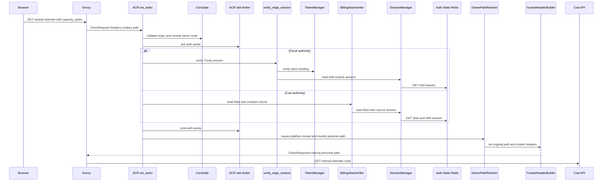
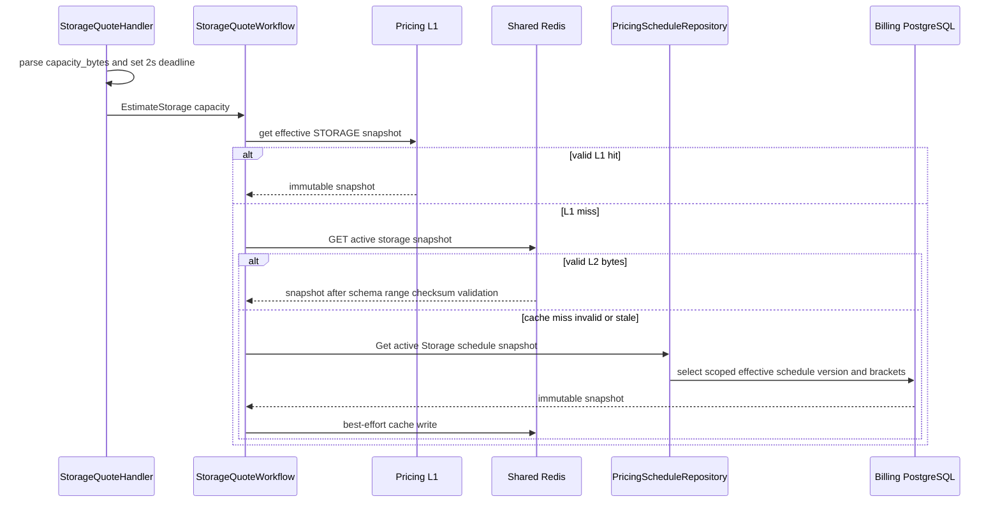
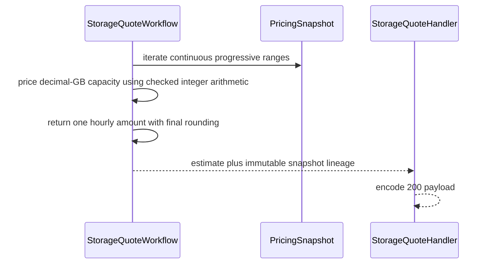

# Personal Storage Estimate — God View (Master SoT)

This self-user read returns a display quote for one hour of storage capacity from
the currently effective immutable pricing snapshot. It does not reserve
capacity, authorize a storage API, debit a wallet, or promise the price a later
billing run will pin. Storage is pay-as-you-go; this workflow never fabricates a
monthly commitment.

## API-scope contract

The browser uses the neutral public route. This is `/personal`: ACR derives the platform owner only from verified Cloud Trinity context or a verified Billing Alias/source IAM session, rewrites to the internal personal route, removes raw proof/workspace headers, overwrites caller identity headers, and injects trusted self context. The Cost API does not call `Authorize`/required-level middleware for self user and does not use wallet balance as an estimate input.

| Boundary | Contract |
|---|---|
| Browser method/path | `GET /api/v1/billing/wallet/estimate/storage?capacity_bytes={positive_int64}` |
| Browser headers used | `Origin`; Cloud Trinity cookies on Cloud authority or Billing Alias ID/secret cookies on Cost authority |
| Browser payload | no body; `capacity_bytes` is a base-10 query integer, `1..1<<60` |
| ACR upstream path | `/api/v1/personal/billing/wallet/estimate/storage?capacity_bytes=...` |
| Response | current hourly micro-unit estimate with snapshot code/version/checksum lineage |
| Durable effect | none |

## Phase 1 — Client → Envoy → ACR

The edge steps are deliberately the same trusted self-context selection as other personal Billing reads: CORS, pre-auth IP/device quota, Cloud Trinity verification or Alias secret/source IAM-session verification, post-auth user quota, then platform-owner path rewrite. GET skips CSRF mutation enforcement and session proof. Direct `/api/v1/personal/...` input is rejected rather than trusted.

| CheckRequest input | ACR use |
|---|---|
| `:method`, `:path`, `Origin` | CORS and neutral GET route selection |
| `X-Forwarded-For`, optional device cookie | pre-auth rate-limit key |
| Cloud Trinity or Billing Alias cookies | Cloud session verification or Cost alias record/secret and source-session recheck |
| query `capacity_bytes` | forwarded intact; not an ACR pricing value |
| client user/tenant/workspace/proof headers | removed as spoofable |

| ACR forward | Rule |
|---|---|
| rewritten `:path` | exact internal personal estimate route and original query |
| Cloud-authority injected headers | verified `x-user-id`, `x-user-name`, `x-user-level`, `x-zone-id`, `x-tenant-id`, `x-client-device-id`, `x-session-proof-verified: false`, `x-original-path`, plus `x-workspace-id` only from verified `workspace_id` cookie |
| Cost-authority injected headers | Alias `x-user-id`, `x-user-name`, `x-zone-id`, `x-tenant-id`, `x-session-proof-verified: false`, `x-original-path`; no level/device/workspace header |
| no forward | CORS, rate, alias/source session, or non-platform owner failure |

## Phase 2 — Capacity validation and effective-price lookup

The storage estimate handler parses `capacity_bytes` as an `int64`, rejects zero,
negative, malformed, and values above `1<<60`, then supplies a two-second
operation context to the storage quote service. The service obtains an effective
Storage pricing snapshot from the pricing cache; cache layers accelerate a read
but cannot become pricing Source of Truth.

| Input | Validation/use |
|---|---|
| `capacity_bytes` | integer in inclusive range `1..1<<60` |
| charge kind | fixed internally to `storage.capacity.gb_hour`; caller cannot request another metric |
| L1 snapshot | in-process, one-minute TTL, immutable, current effective window required |
| L2 snapshot | Shared Redis key during migration, five-minute maximum TTL, fully revalidated before use |
| DB fallback | Scoped Pricing Schedule repository is durable authority after schedule cutover |

### Cache integrity and recovery

Before a Redis payload can answer an estimate, the cache validates IDs, service type, version/effective window, currency/checksum shape, continuous non-negative ranges from zero to one infinity range, and recalculates a 64-character checksum when present. `singleflight` prevents local miss stampedes. An invalidation generation fence prevents an in-flight old read from repopulating L1 after a pricing publish. Redis failure/missed PubSub never makes stale cache authoritative: the request falls through to PostgreSQL, and TTL/cold start rebuilds state.

## Phase 3 — Exact progressive quote calculation and response

For each effective range, the storage quote service calculates the covered bytes
and micro-unit price using checked integer arithmetic, rejects numeric overflow,
and returns one hourly amount. It returns snapshot lineage so the UI can explain
which quote was observed; that lineage is not a future billing reservation.

| Response payload field | Meaning |
|---|---|
| `capacity_bytes` | requested capacity |
| `hourly_estimate_micro_units` | rounded-up progressive hourly charge |
| `currency` | snapshot currency |
| `pricing_schedule_code`, `pricing_schedule_id`, `pricing_schedule_version_id` | immutable effective schedule identity |
| `pricing_version`, `pricing_checksum`, `pricing_effective_from` | audit/display lineage |
| `estimated_at` | UTC calculation time |

| Result | HTTP response | Durable effect |
|---|---|---|
| valid snapshot and arithmetic | `200` estimate payload | none |
| invalid capacity or invalid durable range | `400` | none |
| no effective storage schedule or cache/DB timeout/error | `503` | none |

## Key contract

| Key/table | Owner and rule |
|---|---|
| Cloud Trinity session or `iam:domain_alias:billing:{alias_id}` | ACR self-context binding; Cost Alias rechecks source IAM session |
| process L1 pricing map | one-minute performance cache, generation-fenced |
| `cost-manager:pricing:schedule:v2:storage.capacity.gb_hour:zone:{zone_id}` | Shared Redis five-minute performance cache; must pass full integrity checks |
| effective Pricing Schedule/version/brackets in Billing PostgreSQL | durable pricing SoT |
| `billing.wallets`, `payment_intents`, ledger | intentionally untouched by quote workflow |

## Code map

[`acr/src/gateway/ext_authz.rs`](../../acr/src/gateway/ext_authz.rs), [`cost-manager/api/internal/transport/http/handler/pricing_schedule_handler.go`](../../cost-manager/api/internal/transport/http/handler/pricing_schedule_handler.go), [`cost-manager/api/internal/service/pricing_schedule_service.go`](../../cost-manager/api/internal/service/pricing_schedule_service.go), and [`cost-manager/api/internal/service/pricing_cache.go`](../../cost-manager/api/internal/service/pricing_cache.go).
