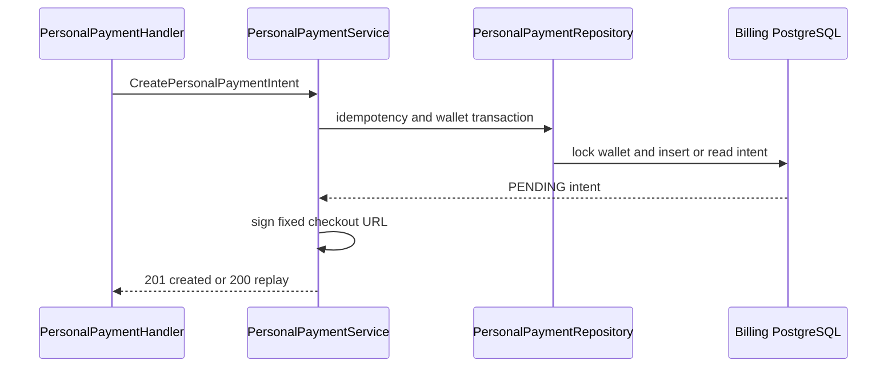
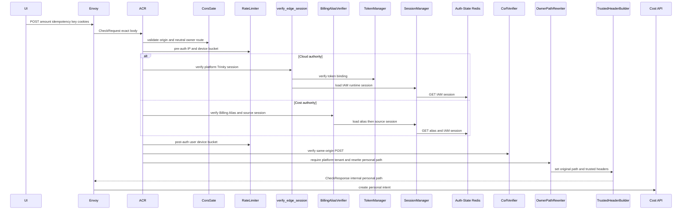
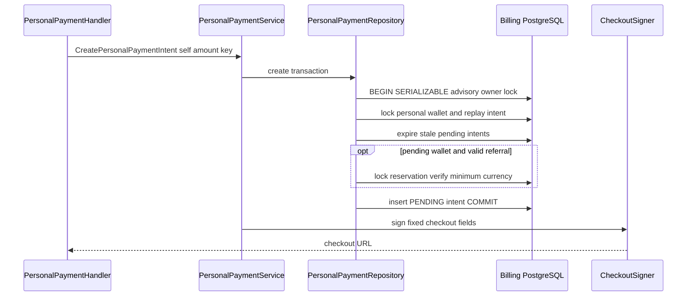

# Personal Top-up Intent Create — God View (Master SoT)

This `/personal` owner workflow creates or replays one personal payment intent. Browser redirect is not settlement evidence.

## Phase 1 — Client → Envoy → ACR

| Part | Contract |
|---|---|
| Method/path | neutral `POST /api/v1/billing/wallet/top-ups` |
| Headers used | Cloud Trinity cookies on Cloud authority or Billing Alias cookies on Cost authority, `Origin`, required `idempotency-key` |
| JSON payload | `amount_micro_units` integer string |
| ACR output | verified personal rewrite to `/api/v1/personal/billing/wallet/top-ups`; overwrites self identity |
| Failure | session failure `401`; direct owner route denied |

## Phase 2 — Cost API creates durable intent

`PersonalPaymentHandler.CreateTopUp` bounds key/amount and invokes service with verified user ID. Repository locks/validates the personal USD wallet and writes a `PENDING` intent keyed by owner plus idempotency key, then service signs the allowlisted checkout URL. Same key/same payload returns existing intent; different amount is `409`.

## Complete edge and Cost execution

### Branch selection and ACR forward

Verified platform context selects this personal POST; a concrete tenant context selects the tenant route instead. ACR checks CORS, pre/post rate limits, Trinity or Alias source-session verification and CSRF, rejects direct internal path, rewrites to `/api/v1/personal/billing/wallet/top-ups`, sets `x-original-path`, removes raw proof/workspace headers, overwrites client identity headers and injects trusted self context with proof marker false. Current personal top-up create path is not an ACR critical path, so no Ed25519 proof is consumed.

| Authority | Exact trusted headers sent upstream |
|---|---|
| Cloud Trinity | `x-user-id`, `x-user-name`, `x-user-level`, `x-zone-id`, `x-tenant-id`, `x-client-device-id`, `x-session-proof-verified: false`, `x-original-path`, and `x-workspace-id` only from verified `workspace_id` cookie |
| Cost Billing Alias | `x-user-id`, `x-user-name`, `x-zone-id`, `x-tenant-id`, `x-session-proof-verified: false`, `x-original-path`; no level/device/workspace header |

| Input | Owner | Rule |
|---|---|---|
| `idempotency-key` | handler/repository | required 1-128 bytes; durable owner-scoped replay key |
| JSON `amount_micro_units` | handler | signed integer string at least configured USD minimum |
| owner/owner_type/currency/intent ID | ACR/service | browser cannot send; PERSONAL/USD/self derive server-side |
| `Origin`, IP, device/session cookies | ACR | CORS/rate/session/CSRF inputs only |

### Serializable intent creation and checkout result

Handler validates key/body then calls `PersonalPaymentService.CreateTopUp` with verified user. Repository starts Serializable transaction, advisory-locks `user:PERSONAL:PAYMENT`, locks personal USD wallet `FOR UPDATE`, permits only pending-activation/active lifecycle, and locks any prior `(owner, PERSONAL, idempotency_key)` intent. Same actor/amount/USD/provider is a replay; any changed field is `409`. It expires old pending intents, optionally locks a valid personal referral reservation when pending activation, requires amount/currency meet its snapshot, inserts PENDING intent and commits. Service signs configured checkout URL after durable intent result.

| Result | Response | Durable effect |
|---|---|---|
| `201` | created intent including checkout URL/expiry and activation flag | PENDING intent |
| `200` | idempotent replay intent | none new |
| `400` | invalid key/amount/body | none |
| `401/403/429` | edge/branch/CSRF/rate denial | none |
| `404` | wallet absent | none |
| `409` | idempotency payload, lifecycle or referral-minimum conflict | none |
| `500/503` | transaction/checkout dependency failure | no partial intent |

## Failure, replay and settlement boundary

Checkout URL is not payment evidence and user redirect does not settle/activate a wallet. A serializable retry uses the same idempotency key; the repository returns same intent only under identical immutable input. A process failure after commit but before response is therefore recoverable through the same key or intent read. Verified provider webhook is the sole next workflow permitted to credit wallet/append ledger/redeem referral.

## Key contract

`payment_intents(owner_id, owner_type, idempotency_key)` is the durable replay fence. Checkout signature covers opaque intent ID, PERSONAL owner type, amount, USD, expiry and fixed return origin. No wallet balance changes in this workflow.

## Code map

[`cost-manager/api/internal/transport/http/handler/personal_payment_handler.go`](../../cost-manager/api/internal/transport/http/handler/personal_payment_handler.go).
