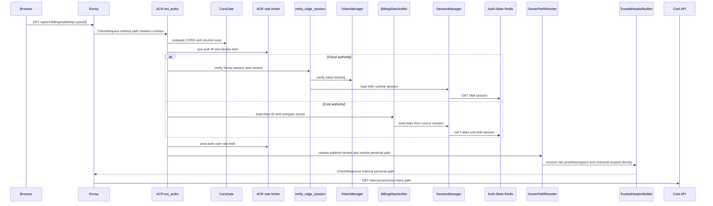
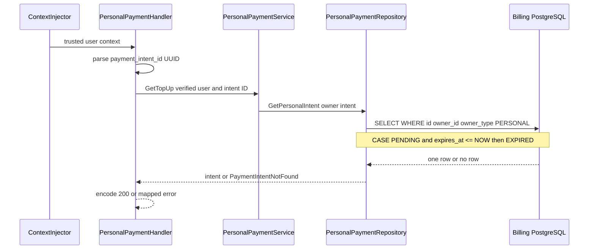
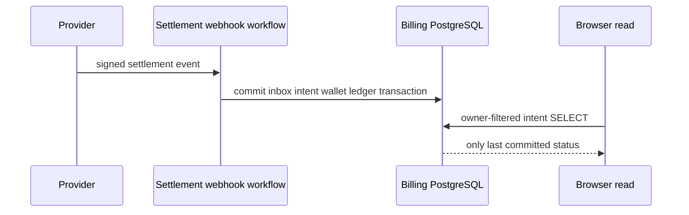

# Personal Top-up Intent Read — God View (Master SoT)

This is the self-user read of one personal payment intent. It never creates a checkout or interprets a browser redirect as settlement; the durable webhook inbox and settlement transaction remain authoritative.

## API-scope contract

The browser calls the neutral public path. This is a `/personal` platform-owned workflow: ACR derives the owner from a verified Billing Alias session, rewrites to the internal personal path, and overwrites upstream identity. The caller cannot supply an owner or tenant. Controlplane does not run permission/role-level authorization for this self-user branch; the repository repeats the durable owner fence.

| Boundary | Contract |
|---|---|
| Browser method/path | `GET /api/v1/billing/wallet/top-ups/{payment_intent_id}` |
| Browser headers used | `Origin`; Cloud authority uses host-only Trinity cookies, Cost authority uses Billing Alias cookies `__Host-billing_session` and `__Host-billing_session_secret` |
| Browser payload | none; `{payment_intent_id}` must be a UUID |
| ACR upstream method/path | `GET /api/v1/personal/billing/wallet/top-ups/{payment_intent_id}` |
| Authority source | verified Billing Alias → verified source IAM session → `x-user-id`; platform tenant sentinel selects `/personal` |
| Success | `200` intent representation; a foreign intent is deliberately `404` |

## Phase 1 — Client → Envoy → ACR

ACR owns the internet-facing route. It executes CORS and pre-auth rate limiting, then accepts Cloud Trinity on Cloud authority or validates the Billing Alias and its source IAM session on Cost authority, before post-auth rate limiting. GET does not need the CSRF mutation gate or session proof. A concrete verified tenant does **not** enter this personal workflow.

| CheckRequest input | ACR use |
|---|---|
| `:method`, `:path`, `Origin` | allow the neutral GET route and evaluate CORS |
| `X-Forwarded-For`, optional `client_device_id` cookie | pre-auth IP/device rate-limit key |
| Cloud Trinity or Billing Alias cookies | Cloud verifies its Trinity session; Cost loads `iam:domain_alias:billing:{alias_id}`, compares secret and rechecks source IAM session |
| client `x-user-id`, `x-user-name`, `x-zone-id`, `x-tenant-id`, `x-workspace-id`, proof headers | raw proof/workspace removed; identity overwritten before forwarding |

| ACR response to Envoy | Value |
|---|---|
| `:status` | `200` CheckResponse on allow |
| rewritten `:path` | `/api/v1/personal/billing/wallet/top-ups/{payment_intent_id}` |
| Cloud-authority injected headers | `x-user-id`, `x-user-name`, `x-user-level`, `x-zone-id`, `x-tenant-id`, `x-client-device-id`, `x-session-proof-verified: false`, `x-original-path`, plus `x-workspace-id` only from the verified `workspace_id` cookie |
| Cost-authority injected headers | Alias `x-user-id`, `x-user-name`, `x-zone-id`, `x-tenant-id`, `x-session-proof-verified: false`, `x-original-path`; no level/device/workspace header |
| removed headers | caller identity/tenant/workspace headers and raw `x-session-proof-*` material |
| local HTTP failures | CORS/rate-limit/session failure, with no upstream request |

### Phase-1 failures and recovery

| Condition | Result | Durable effect / retry |
|---|---|---|
| CORS or pre/post-auth quota denied | ACR local `4xx`/`429` | none; retry only after client condition/window changes |
| Trinity invalid, Alias missing/secret mismatch, or Alias source session revoked | ACR local `401` | none; Cloud reauthenticates Trinity or Cost obtains a fresh Billing Alias through handoff/exchange |
| Alias resolves to concrete tenant | not this owner branch | ACR chooses `/tenant` handling instead; it must not rewrite to `/personal` |
| malformed path UUID | handler `400` | none; no database access |

## Phase 2 — Cost API owner-filtered read

`ContextInjector` accepts only ACR-injected identity. `PersonalPaymentHandler.GetTopUp` parses the UUID, and `PersonalPaymentService.GetTopUp` passes the verified user plus intent ID to `PersonalPaymentRepository.GetPersonalIntent`. The SQL predicate includes both `owner_id` and `owner_type='PERSONAL'`; it returns an expiry **projection** for stale PENDING rows and does not mutate them.

| Input | Validation/use |
|---|---|
| `x-user-id` | required verified self owner |
| `{payment_intent_id}` | UUID parsed by handler |
| durable `payment_intents` row | must match `(id, owner_id, owner_type=PERSONAL)` |

| HTTP result | Payload / headers used | Durable effect |
|---|---|---|
| `200` | intent ID, amount, currency, provider, status, activation flag, expiry, settlement fields as applicable | none |
| `400` | malformed UUID | none |
| `404` | absent **or foreign** intent | none |
| `503` | repository/database failure | none |

## Phase 3 — Settlement visibility boundary

This request has no asynchronous work of its own. It observes the payment intent transactionally committed by the provider webhook workflow. A provider redirect or client-side checkout success never writes `SETTLED`; before the webhook transaction commits, this read may safely return `PENDING`, and an elapsed row is represented as `EXPIRED`.

| Observed state | Meaning |
|---|---|
| `PENDING` | checkout was created; provider settlement is not durably applied |
| projected `EXPIRED` | checkout deadline elapsed; this read did not write a cancellation |
| `SETTLED` | webhook inbox, intent, wallet credit and ledger transaction committed |

## Key contract

| Key/table | Owner and rule |
|---|---|
| Cloud Trinity session or `iam:domain_alias:billing:{alias_id}` | ACR authentication context; Cost Alias rechecks source IAM session |
| `billing.payment_intents` | durable intent SoT; id plus PERSONAL owner fence prevents cross-user reads |
| `billing.payment_webhook_inbox` | settlement replay boundary; not written by this read |

## Code map

[`acr/src/gateway/ext_authz.rs`](../../acr/src/gateway/ext_authz.rs), [`cost-manager/api/internal/transport/http/handler/personal_payment_handler.go`](../../cost-manager/api/internal/transport/http/handler/personal_payment_handler.go), and [`cost-manager/api/internal/repository/personal_payment_repo.go`](../../cost-manager/api/internal/repository/personal_payment_repo.go).
