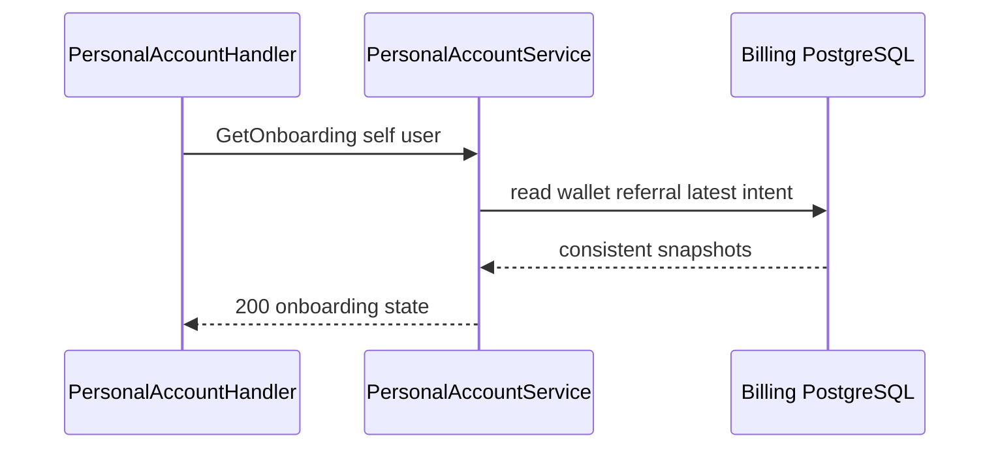
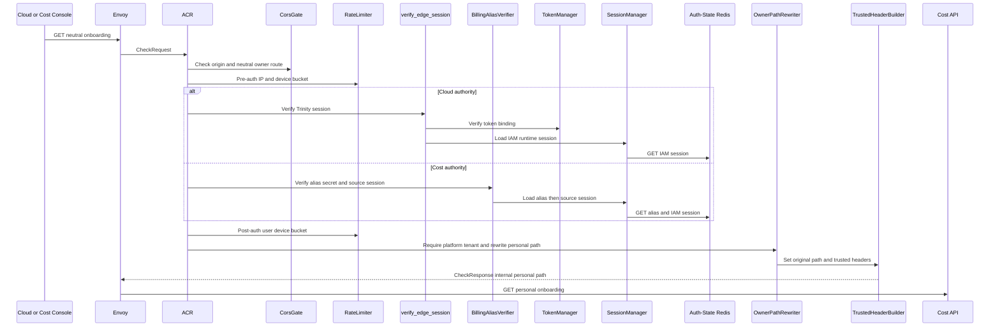
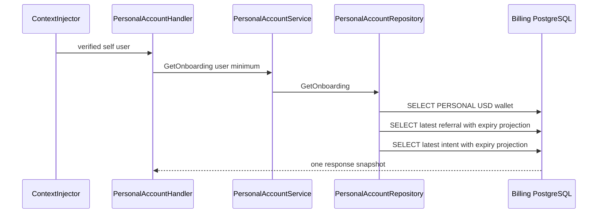

# Personal Wallet Onboarding Read — God View (Master SoT)

This `/personal` owner read assembles the verified user's pending wallet, current referral reservation and latest payment intent. It does not reserve credit or activate a wallet.

## Phase 1 — Client → Envoy → ACR

| Part | Contract |
|---|---|
| Method/path | neutral `GET /api/v1/billing/wallet/onboarding` |
| Headers used | Cloud Trinity cookies on Cloud authority or Billing Alias cookies on Cost authority, `Origin` |
| ACR output | derives personal owner, rewrites to `/api/v1/personal/billing/wallet/onboarding`, injects verified user |
| Failure | invalid session `401`; direct internal path rejected |

## Phase 2 — Cost API composite read

`PersonalAccountHandler.GetOnboarding` passes `ctx_user_id` to service. Repository reads the personal wallet, eligible/latest reservation and latest intent under the self owner; no caller-provided referral/payment IDs are used. Wallet absence is `404`, dependency failure `503`.

## Complete edge and Cost execution

### Branch selection and ACR forward

Only verified `tenant_id=platform` selects this personal workflow. ACR performs CORS, pre/post rate limits and Cloud Trinity or Cost Alias source-session verification, rejects direct internal path, removes raw proof/workspace headers, overwrites client identity, and rewrites neutral GET to `/api/v1/personal/billing/wallet/onboarding` with `x-original-path`. It overwrites verified user/name/Zone/tenant and `x-session-proof-verified=false`; GET has no CSRF mutation proof and no personal `Authorize` middleware.

| Authority | Exact trusted headers sent upstream |
|---|---|
| Cloud Trinity | `x-user-id`, `x-user-name`, `x-user-level`, `x-zone-id`, `x-tenant-id`, `x-client-device-id`, `x-session-proof-verified: false`, `x-original-path`, and `x-workspace-id` only from verified `workspace_id` cookie |
| Cost Billing Alias | `x-user-id`, `x-user-name`, `x-zone-id`, `x-tenant-id`, `x-session-proof-verified: false`, `x-original-path`; no level/device/workspace header |

| Browser input | Used by | Rule |
|---|---|---|
| neutral GET path | ACR rewrite | platform context only; tenant context maps to tenant route which does not implement onboarding |
| Cloud Trinity or Billing Alias cookies | ACR verifier | Cloud session must verify; Cost Alias and referenced source session must remain live |
| Origin/IP/device cookie | CORS/rate limiter | applied before handler |
| query/body/owner/referral/payment header | none | no client selection or mutation input |

### Onboarding snapshot composition

`ContextInjector` provides self user. `PersonalAccountHandler.GetOnboarding` calls service with user and configured minimum top-up. Repository first reads exact personal USD wallet; then independently reads latest onboarding reservation and latest personal intent. SQL projects expired `RESERVED` referral as `CANCELLED` and expired `PENDING` intent as `EXPIRED` in response without mutating their rows. No client can name a reservation/intent and no payment/referral transition occurs.

| Result | Payload | Side effect |
|---|---|---|
| `200` | wallet summary, configured minimum, nullable latest reservation and nullable latest intent | none |
| `401/403/429` | ACR denial | none |
| `404` | personal wallet provision still absent | none |
| `503` | database unavailable | none |

## Failure, consistency and recovery semantics

The three reads are not a locking transaction, so they are a current UI snapshot rather than a settlement decision. The next mutation re-locks durable rows. Retrying is safe. Wallet absence follows the provision Stream/inbox recovery described by this workflow's wallet contract; an unavailable database is never represented as pending or zero balance.

## Key contract

`wallets`, referral reservation and `payment_intents` are durable read models. This endpoint has no Redis key, proof, state transition or side effect.

## Code map

[`cost-manager/api/internal/transport/http/handler/personal_account_handler.go`](../../cost-manager/api/internal/transport/http/handler/personal_account_handler.go).
