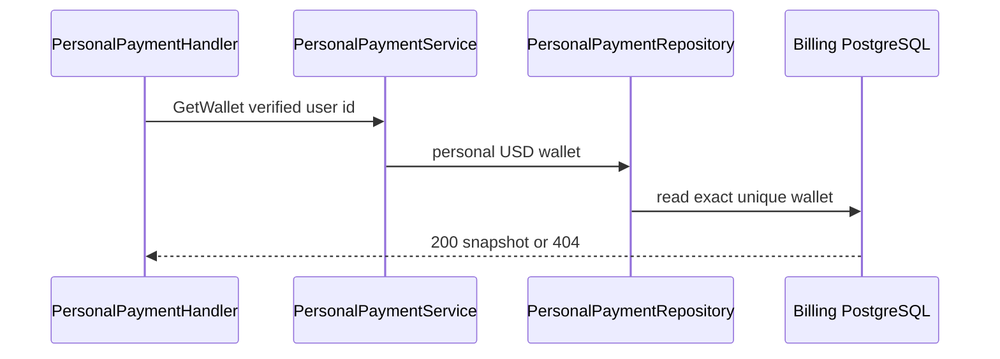
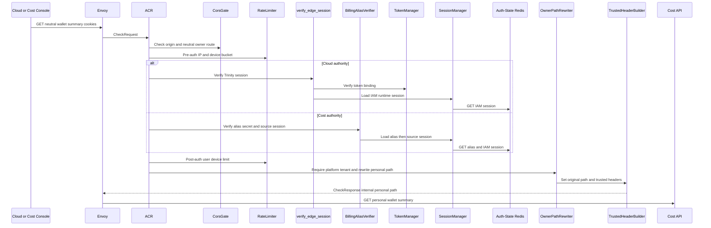
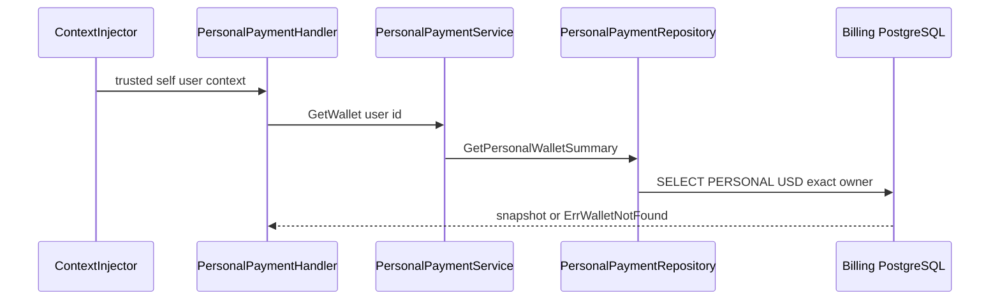
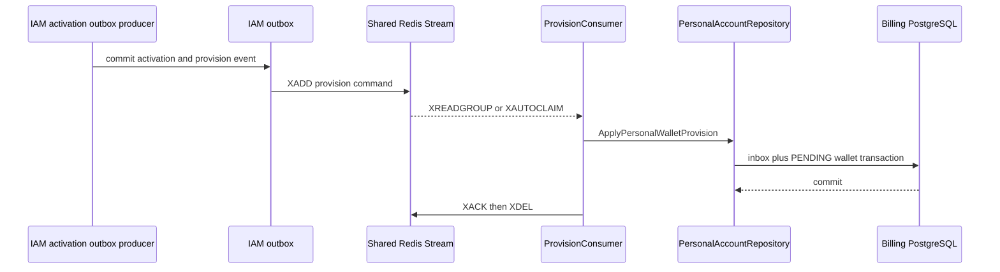

# Personal Wallet Summary — God View (Master SoT)

This `/personal` owner read returns only the verified self user's USD wallet snapshot. A tenant rendered in UI cannot select this wallet.

## API scope and edge-routing contract

Browser calls neutral `GET /api/v1/billing/wallet/summary`. ACR verifies Trinity or Cost Alias, derives personal context, rewrites only internally to `/api/v1/personal/billing/wallet/summary`, sets `x-original-path`, and overwrites identity headers. No `Authorize` permission middleware is used for the personal self branch.

## Phase 1 — Client → Envoy → ACR

| Headers used | Session or Alias cookies, `Origin` |
|---|---|
| Payload | none |
| Output | trusted internal personal path plus `x-user-id`; raw proof/workspace headers removed and client identity overwritten |

## Phase 2 — Cost API self read

`ContextInjector` exposes verified `x-user-id`; `PersonalPaymentHandler.GetWallet` calls service/repository with that ID. Repository reads exactly `(owner_id=user_id, owner_type=PERSONAL, currency=USD)`. No request field or header selects owner/currency.

## Complete edge and Cost execution

### Branch selection, CheckRequest and trusted forward

This file applies only when verified Trinity or Billing Alias has no tenant ID or `tenant_id=platform`. A concrete tenant ID selects the separate tenant summary workflow even though browser URL is identical. Client cannot select branch by path/header.

| Request part | ACR use | Rule |
|---|---|---|
| public method/path | rewrite gate | exact neutral `GET /api/v1/billing/wallet/summary` |
| `Origin`, Envoy IP, optional device cookie | CORS and pre/post limiter | checked before upstream |
| Cloud Trinity or Cost Alias cookies | verifier | Trinity runtime session or alias hash plus referenced IAM session/proof key |
| client Zone/tenant/user/workspace/proof headers | none | removed; never branch/owner evidence |
| body/query | none | empty body; no wallet/currency/owner argument accepted |

After auth, ACR uses verified tenant only. Platform sentinel selects personal suffix, sets `x-original-path`, overwrites `:path` to `/api/v1/personal/billing/wallet/summary`, removes raw proof/workspace input and overwrites identity. GET has no CSRF mutation gate and personal Cost route has no `Authorize`; no role/permission/access key/alias secret is forwarded.

| Authority | Exact trusted headers sent upstream |
|---|---|
| Cloud Trinity | `x-user-id`, `x-user-name`, `x-user-level`, `x-zone-id`, `x-tenant-id`, `x-client-device-id`, `x-session-proof-verified: false`, `x-original-path`, and `x-workspace-id` only when ACR read a verified `workspace_id` cookie |
| Cost Billing Alias | `x-user-id`, `x-user-name`, `x-zone-id`, `x-tenant-id`, `x-session-proof-verified: false`, `x-original-path`; no level/device/workspace header |

### Cost self-owner read and response

`ContextInjector` parses only ACR user UUID. `PersonalPaymentHandler.GetWallet` does not call `Authorize`; it reads user context, adds configured minimum top-up and calls service. Repository queries exactly `owner_id=user`, `owner_type=PERSONAL`, `currency=USD`; it ignores `x-tenant-id`, client wallet ID and client currency. Missing row is `404`, not zero balance.

| Result | Response | Durable effect |
|---|---|---|
| `200` | wallet ID, USD cash/promotional/overdraft micro-unit strings, status, version, update time, minimum | none |
| `401/403/429` | ACR identity/branch/CORS/rate denial | none |
| `404` | personal wallet not provisioned | none |
| `503` | Billing database unavailable | none |

### Wallet-provision recovery context

After IAM activation commits `PersonalAccountActivatedV1`, its lifecycle relay XADDs `iam.personal_account.activated.v1` to `iam:personal-account:activated:v1`. The Cost adapter XREADGROUP/XAUTOCLAIM derives the PERSONAL/USD wallet command and inserts inbox event ID/payload hash plus the unique zero-balance `PENDING_ACTIVATION` wallet in one transaction; only commit is followed by XACK/XDEL. Same event/hash replays safely, different hash fails integrity, duplicate owner fact is absorbed by wallet uniqueness, and consumer/database failure leaves PEL for retry. Summary remains `404` while this is pending.

## Failure, replay and security invariants

Read retry is side-effect free. Redis Stream is transport, not wallet authority. A tenant context never falls back to personal summary; only verified ACR context can switch branch.

## Key contract

`billing.wallets(owner_id, owner_type, currency)` is durable SoT. `404` means provision has not committed; it is never rendered as zero. Database outage is `503`.

## Code map

[`cost-manager/api/internal/transport/http/handler/personal_payment_handler.go`](../../cost-manager/api/internal/transport/http/handler/personal_payment_handler.go).
