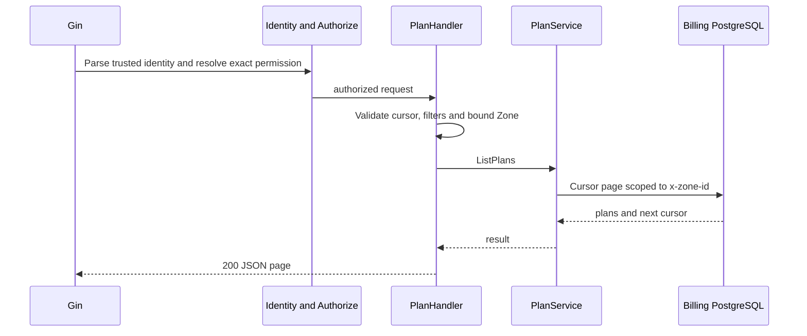
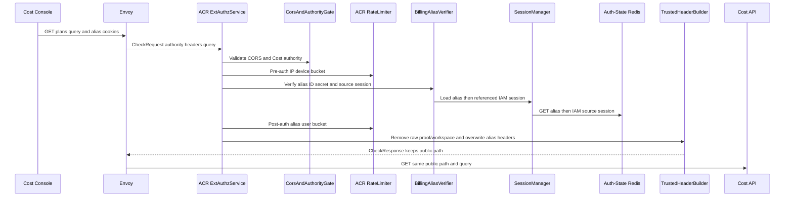
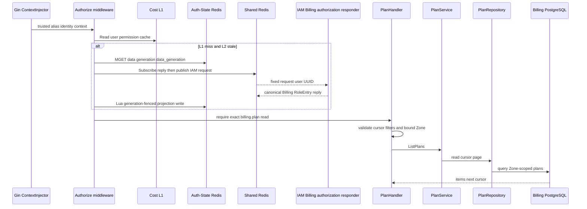

# Billing Plan List — God View (Master SoT)

This operator read lists plans for the caller's verified concrete Zone. It is
not a wallet owner workflow and client `zone_id` may only repeat the session Zone.

## Phase 1 — Client → Envoy → ACR

| Part | Contract |
|---|---|
| Method/path | `GET /api/v1/billing/plans?cursor&limit&service_type&status&zone_id` |
| Headers used | Cost Billing Alias cookies and `Origin`; Cloud authority is denied for this operator route |
| Payload | query only; no client identity or permission header |
| ACR output | verifies session/alias, removes raw proof/workspace headers and overwrites client identity headers with `x-user-id`, `x-zone-id`, `x-tenant-id`; keeps public path; no proof |
| Failure | invalid identity `401`; direct owner prefix rejected; no Cost call |


## Phase 2 — Cost API read

`ContextInjector` parses only ACR headers. `Authorize(billing:plan:read)` uses
the generation-fenced IAM Billing projection; `PlanHandler.ListPlans` validates
cursor/filter and rejects query Zone mismatch before `PlanService.ListPlans` and
repository read. PostgreSQL is the plan authority; no mutation/outbox occurs.



## Complete edge and authorization execution

### Client input, CheckRequest and exact ACR forward

This operator endpoint is available only on Cost Console authority; Cloud
authority may call neutral owner-wallet routes but is denied on this path. The
browser sends no body and no identity/permission input.

| Request part | ACR use | Accepted value / rule |
|---|---|---|
| Method/path | route gate | exact `GET /api/v1/billing/plans`; query is preserved to Cost API |
| `Origin` | CORS gate | must match configured allowed origin when present |
| `X-Forwarded-For`, `client_device_id` cookie | rate limiter | pre-auth IP/device bucket before alias verification |
| Billing alias ID/secret cookies | `verify_billing_alias` | alias secret hash and referenced IAM source session/proof key must match |
| Query `cursor`, `limit`, `service_type`, `status`, `zone_id` | handler only | ACR does not trust `zone_id`; handler compares it to verified alias Zone |
| `x-user-*`, `x-tenant-id`, `x-zone-id`, permission/proof/workspace headers | rejected as authority | ACR removes/overwrites them; client never chooses actor/Zone/tenant |

ACR first performs CORS and pre-auth rate limiting, then validates Billing Alias
and source IAM session. It applies post-auth rate limiting to alias user ID;
GET bypasses CSRF mutation checks. Billing Zone/tenant are bound in the alias,
so ACR does not resolve zone/tenant from browser cookies. It does not rewrite
this operator path and forwards exactly the original method, public path/query
and empty body after removing client proof/workspace headers. It overwrites:

```text
x-user-id, x-user-name, x-zone-id, x-tenant-id
x-session-proof-verified: false
```

It does not forward role, level, permission, alias secret, source access key or
proof key. `x-original-path` is absent because no rewrite occurred.



### Cost component chain and REST output

`ContextInjector` parses ACR UUID headers. `Authorize` calls
`AuthorizationResolver.Resolve(user, critical=false)`: L1 hit is valid only
for five seconds; miss reads the three generation-fenced Auth-State Redis keys.
If L2 misses/stales, one Cost pod wins a two-second lock, subscribes to
`iam.authorization.billing.reply.{request_uuid}` before publishing the fixed
32-byte request to `iam.authorization.billing.get`, waits at most 900ms for IAM,
and Lua-writes projection only if generation did not change. Waiters jitter and
retry L2. Every result must contain exact `billing:plan:read`.

After authorization `PlanHandler.ListPlans` bounds limit, decodes the opaque
cursor, validates service type/status, obtains verified Zone from context and
rejects mismatched query Zone. `PlanService.ListPlans` then calls repository;
PostgreSQL returns one cursor page and next cursor. No business Redis key,
outbox, wallet or ledger changes.

| Result | Response headers | Response payload | Durable effect |
|---|---|---|---|
| `200` | Cost API JSON envelope | plan items and optional next cursor | none |
| `400` | JSON | malformed cursor/filter/Zone UUID | none |
| `401` | ACR JSON/denial | no plan data | none |
| `403` | ACR authority/CORS or Cost permission/Zone mismatch | no plan data | none |
| `429` | ACR limiter denial | no plan data | none |
| `503` | Cost JSON | IAM resolver or dependency unavailable | none |



## Failure, cache and recovery semantics

Invalidation is initiated by IAM role/status mutations: IAM increments Auth-State
generation and removes projection, publishes `authz.invalidate.billing` on
Shared Redis, and every Cost replica drops its local user entry. PubSub only
accelerates L1 eviction; the generation comparison prevents stale L2 writes.
Resolver/Redis/IAM failure is `503`, never permissive. A list retry is safe
because the workflow performs no durable mutation.

## Key contract

| Key/record | Store | Rule |
|---|---|---|
| `authz:billing:{user_id}:data/generation` | Auth-State Redis | L1/L2 may serve only matching generation; IAM is fallback authority |
| `plans.zone_id` | Billing PostgreSQL | trusted `x-zone-id` scopes query; user query cannot cross Zone |

## Code map

[`cost-manager/api/internal/app/route.go`](../../cost-manager/api/internal/app/route.go),
[`cost-manager/api/internal/transport/http/handler/plan_handler.go`](../../cost-manager/api/internal/transport/http/handler/plan_handler.go).
