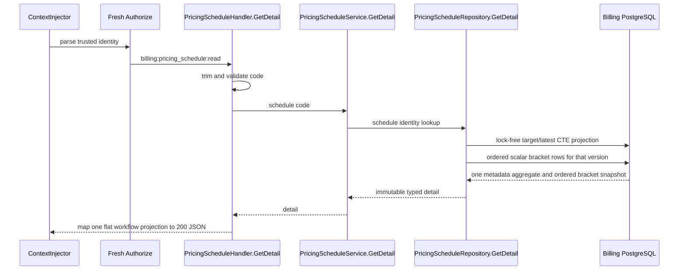

# Billing Pricing Schedule Detail — God View

This workflow returns one controlled Global base schedule and its latest
immutable version. It is not a quote, does not select a wallet or module
adjustment, and does not promise a monthly amount.

## API-scope contract and input

`GET /api/v1/billing/pricing-schedules/{code}` uses the verified Billing Alias
operator identity. The client sends only the canonical schedule `code` path
segment and the session headers. ACR verifies session/origin/rate-limit and
forwards the path unchanged; Cost API performs fresh
`billing:pricing_schedule:read` authorization.

```mermaid
sequenceDiagram
    participant UI as Cost Console
    participant E as Central Envoy
    participant A as ACR ExtAuthz
    participant AR as Auth State Redis
    participant API as Cost API
    UI->>E: GET /api/v1/billing/pricing-schedules/{code}
    E->>A: CheckRequest exact path, used headers, empty body
    A->>A: CORS and rate limits
    A->>AR: verify Alias/session binding
    alt denied or dependency timeout
        A-->>E: local 401/403/429/503
        E-->>UI: error; no upstream forward
    else allowed
        A->>A: strip caller authority headers; inject trusted identity
        A-->>E: allow unchanged path
        E->>API: forward GET
    end
```

## API processing and output



`404 PRICING_SCHEDULE_NOT_FOUND` has no side effect. A malformed code is `400`;
database failure is sanitized `500`. The durable keys are
`pricing_schedules`, `pricing_schedule_versions` and
`pricing_schedule_scalar_brackets`; no cache value is trusted over PostgreSQL.

The JSON response emits `effective_from`/`effective_to` as UTC RFC3339 values
ending in `Z`. Every scalar bracket `BIGINT` (`range_start_quantity`, nullable
`range_end_quantity`, `price_numerator_micro_units`, and
`price_denominator_quantity`) is a base-10 JSON string. The Cost Console keeps
those values as strings through rendering and edit/publish; they are never
coerced through JavaScript `number`.
