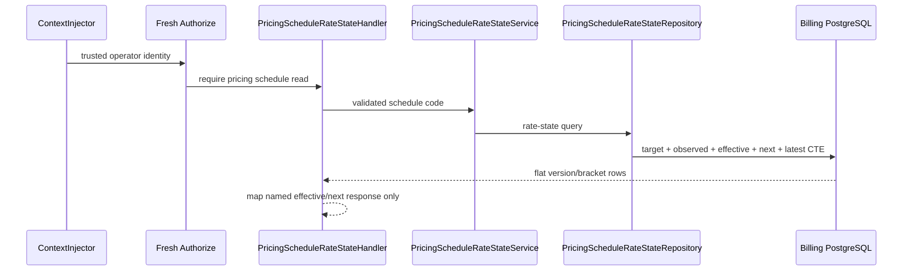

# Billing Pricing Schedule Rate State — God View

This operator read renders one Global pricing schedule as a commercial rate
state. It separates the immutable version effective at the database observation
time from the nearest future scheduled version. It does not quote usage,
mutate a price, choose a Zone, wallet or module, or make a scheduled rate look
effective.

## API-scope contract

| Boundary | Contract |
|---|---|
| Browser method/path | `GET /api/v1/billing/pricing-schedules/{code}/rate-state` |
| Browser input | schedule code only; Alias cookies, `Origin` and tracing headers |
| ACR action | verifies Billing Alias/source IAM session, CORS and rate limits; removes caller identity/proof overrides; forwards the exact path unchanged with trusted identity |
| Cost authority | fresh `billing:pricing_schedule:read` authorization |
| Success | schedule identity, UTC `observed_at`, `latest_version_number`, nullable effective and next scheduled rate snapshots |

The browser never supplies observation time, version ID/number, currency,
brackets, owner or Zone. This route is Cost-authority operator read, not a
`/personal`, `/tenant`, or `/me` owner branch.

## Phase 1 — Client → Envoy → ACR

```mermaid
sequenceDiagram
    participant UI as Cost Console
    participant E as Central Envoy
    participant A as ACR ExtAuthz
    participant AR as Auth State Redis
    participant API as Cost API
    UI->>E: GET rate-state schedule code + Alias cookie
    E->>A: CheckRequest exact path, Origin and session inputs
    A->>A: CORS, pre-auth quota and Billing Alias verification
    A->>AR: load Alias and referenced live IAM session
    alt invalid origin/session or rate limit
        A-->>E: local 401/403/429/503
        E-->>UI: deny; Cost is not called
    else verified operator
        A->>A: strip caller identity/proof headers; inject verified identity
        A-->>E: allow unchanged method/path
        E->>API: GET trusted operator request
    end
```

No session proof is required because this is read-only. ACR does not resolve a
Zone and does not interpret any pricing version.

## Phase 2 — Fresh authorization and one CTE rate-state projection

`ContextInjector` parses only ACR-trusted identity. The authorization
middleware requires `billing:pricing_schedule:read` before the handler runs.
`PricingScheduleRateStateHandler` validates only the code path segment and invokes its
own `PricingScheduleRateStateService` and `PricingScheduleRateStateRepository` port.

The repository uses one PostgreSQL statement: `target` finds exactly the
Global schedule; `observed` is one `NOW()` value; `effective` selects the
non-cancelled half-open interval containing that value; `next_scheduled`
selects the earliest non-cancelled future interval; `latest` supplies OCC
context. Scalar brackets are joined only to those selected versions. All
versions/brackets are immutable; PostgreSQL, not cache, is authority.



## Output and failure semantics

`effective_version` and `next_scheduled_version` are independently nullable.
Each has version identity/status, effective interval, checksum, change reason
and named rate-state bracket records. Every BIGINT bracket field remains a
base-10 JSON string. `observed_at` and timestamps are UTC RFC3339Nano.

| Result | Meaning |
|---|---|
| `200` | truthful rate state; no version may be effective yet, or no future change may exist |
| `400` | empty/malformed code before repository work |
| `401/403/429/503` | edge/authorization dependency failure; no catalog data is exposed |
| `404 PRICING_SCHEDULE_NOT_FOUND` | no schedule with that code |
| `500` | PostgreSQL failure; no cached or fabricated rate fallback |

The UI uses `latest_version_number` only as the optimistic-concurrency baseline
for a later critical publish. It must compare a proposal to the effective and
next snapshots visibly; it cannot infer commercial reality from latest alone.

## Code map

- `cost-manager/api/internal/transport/http/handler/pricing_schedule_rate_state_handler.go`
- `cost-manager/api/internal/service/pricing_schedule_rate_state_service.go`
- `cost-manager/api/internal/repository/pricing_schedule_rate_state_repo.go`
- `cost-console/src/lib/api/billing.ts`
