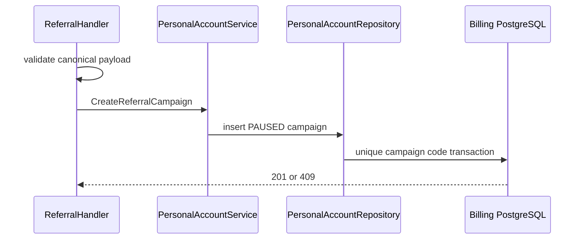
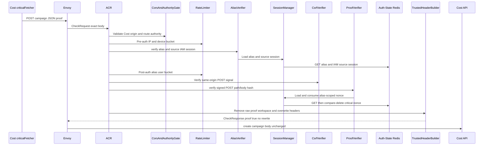
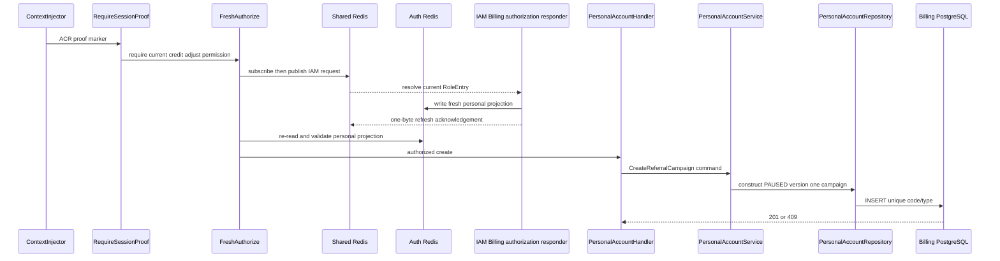

# Billing Referral Campaign Create — God View (Master SoT)

This critical operator mutation creates a new campaign in `PAUSED`; activation is a separate OCC workflow.

## Phase 1 — Client → Envoy → ACR

| Part | Contract |
|---|---|
| Method/path | `POST /api/v1/billing/critical/referrals` |
| Headers used | Cost Billing Alias cookies plus exact proof headers; Cloud authority is denied for this operator route |
| JSON payload | code, name, USD grant/minimum amounts, start/end, optional max redemptions |
| ACR output | verifies and consumes Cost proof, overwrites identity/proof markers, forwards unchanged public route |
| Failure | bad/replayed proof `403`; no API forward |

## Phase 2 — Cost API creates paused campaign

`RequireSessionProof` and fresh `billing:credit:adjust` authorization run before handler. `PersonalAccountHandler.CreateReferralCampaign` canonicalizes code/USD amounts/time window; service/repository inserts the campaign with `PAUSED`. Code uniqueness conflict is `409`; no reservation, wallet grant or payment side effect occurs.

## Complete edge and Cost execution

### Client input and ACR proof boundary

Cost Console obtains one challenge and signs exact POST public path/raw body. ACR checks CORS, pre/post rate limits, Billing Alias secret plus live source IAM session, CSRF same-origin signal, then validates Ed25519 proof with 60-second timestamp skew and Lua-consumes it. ACR removes raw proof/workspace headers, overwrites client identity, and forwards unchanged body only with trusted alias identity/Zone/tenant, `x-session-proof-verified=true` and verified challenge UUID; there is no owner rewrite.

| Trusted headers injected by Cost Billing Alias ACR | Value source |
|---|---|
| `x-user-id`, `x-user-name`, `x-zone-id`, `x-tenant-id` | verified alias record after live source-session recheck |
| `x-session-proof-verified: true`, `x-session-proof-challenge-id` | ACR only after Ed25519 verification and Lua nonce consume |
| `x-original-path`, level/device/workspace | not injected; public operator path is preserved |

| JSON field | Handler validation |
|---|---|
| `code` | uppercase 4–32 `[A-Z0-9_-]` |
| `name` | trimmed, nonempty, at most 128 |
| `amount_micro_units` | positive signed integer string |
| `minimum_top_up_micro_units` | integer string at least configured minimum |
| `currency` | exactly USD |
| `starts_at`, optional `ends_at` | RFC3339; end strictly after start |
| optional `max_redemptions` | positive integer string |

### Fresh permission and campaign insert

Gin validates trusted context, proof marker/challenge UUID, then performs fresh `billing:credit:adjust` resolution through IAM Shared Redis; L1/L2 permission hit cannot authorize a critical request. Handler maps validated JSON to command, service forwards it, repository creates UUID campaign with `PAUSED`, version `1`, type `ONBOARDING_REFERRAL`, and inserts it. Database unique code violation becomes `409`; the caller cannot create an `ACTIVE` campaign in this API.

| Result | Response | Durable effect |
|---|---|---|
| `201` | complete PAUSED campaign/version | one campaign inserted |
| `400` | invalid canonical field | none |
| `401/403/429` | alias/proof/permission/rate denial | none |
| `409` | campaign code exists | none |
| `500/503` | database/IAM failure | no campaign |

## Failure, replay and recovery semantics

Critical proof is consumed before permission/database work, so browser retry after transport ambiguity needs a new proof. Repeating a successful creation is stopped durably by unique campaign code; there is no automatic replay creation key. A failed insert rolls back fully, and no wallet/reservation/ledger side effect is coupled to campaign creation.

## Key contract

Proof key `iam:session_proof:critical:{billing_alias_id}:{challenge_id}` is one-time `EX 60` in Auth-State Redis. ACR passes verified Billing alias ID to the proof verifier; the referenced source IAM session is rechecked separately. `billing.referral_campaigns` is durable SoT; browser retry after a response loss must use a new proof and may receive `409` on identical code.

## Code map

[`cost-manager/api/internal/transport/http/handler/personal_account_handler.go`](../../cost-manager/api/internal/transport/http/handler/personal_account_handler.go).
