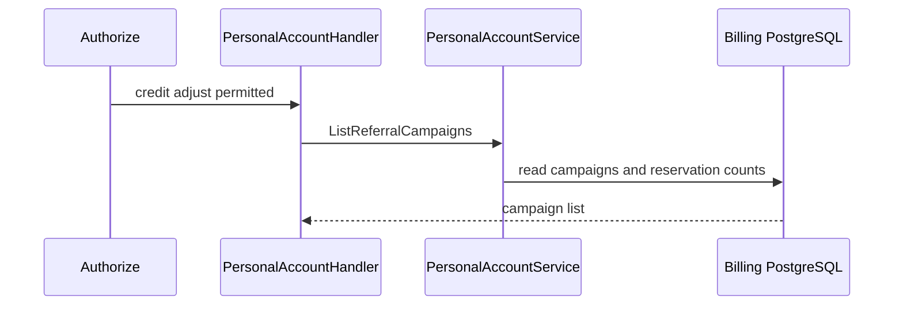
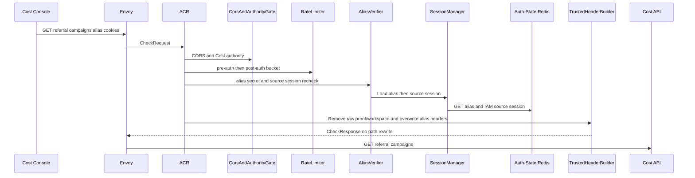
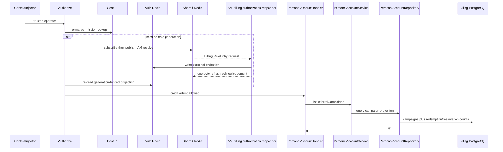

# Billing Referral Campaign List — God View (Master SoT)

This is the operator read of referral campaigns; it is not the personal reservation workflow.

## Phase 1 — Client → Envoy → ACR

| Part | Contract |
|---|---|
| Method/path | `GET /api/v1/billing/referrals` |
| Headers used | Cost Billing Alias cookies and `Origin`; Cloud authority is denied for this operator route |
| Payload | none |
| ACR output | verify source session, remove raw proof/workspace headers and overwrite client identity with verified values; preserve public path |
| Failure | `401` before Cost API |

## Phase 2 — Cost API list

`Authorize(billing:credit:adjust)` resolves exact operator permission. `PersonalAccountHandler.ListReferralCampaigns` calls service then repository to read campaign rows and computed capacity/reservation state from Billing PostgreSQL. There is no wallet, payment, proof consumption or mutation.

## Complete edge and Cost execution

### CheckRequest and ACR forward

This Cost-authority GET reads operator campaign data. ACR performs CORS, pre-auth rate limiting, Billing Alias secret/source-session recheck and post-auth user/device rate limiting. It preserves public path/query, removes raw proof/workspace headers and overwrites client identity with verified user/name/Zone/tenant plus `x-session-proof-verified=false`; no rewrite or `x-original-path` occurs. GET has no CSRF/proof requirement and no client permission header is accepted.

| Trusted headers injected by Cost Billing Alias ACR | Value source |
|---|---|
| `x-user-id`, `x-user-name`, `x-zone-id`, `x-tenant-id` | verified alias record after source IAM-session recheck |
| `x-session-proof-verified: false` | ACR overwrite for this noncritical route |
| `x-original-path`, level/device/workspace | not injected; public path is preserved and Cost Alias has no Cloud device/workspace context |

### Authorization, query and output

`ContextInjector` parses ACR UUID headers. Normal `Authorize(billing:credit:adjust)` uses five-second L1, generation-fenced Auth-State L2, and then subscribe-before-publish IAM Shared Redis request/reply with 900ms deadline/two-second lock if needed. The handler calls service/repository only after exact permission. Repository reads only `ONBOARDING_REFERRAL` campaigns, including redemption count and active unexpired reservation count calculated at SQL `NOW()`.

| Result | Response | Durable effect |
|---|---|---|
| `200` | campaign items with version, times, redeemed and active-reservation counts | none |
| `401/403/429` | edge/permission/rate denial | none |
| `503` | resolver/database unavailable | none |

## Failure, cache and recovery semantics

This workflow has no idempotency key because it writes nothing. IAM invalidation is still correctness-relevant: generation prevents old RoleEntry bytes from being installed after role/status changes; any resolver failure denies rather than returns an unauthorized campaign list.

## Key contract

Authorization projection keys are cache fences only. Campaign lifecycle rows in Billing PostgreSQL are durable SoT; missing permission is `403`, DB failure `503`.

## Code map

[`cost-manager/api/internal/transport/http/handler/personal_account_handler.go`](../../cost-manager/api/internal/transport/http/handler/personal_account_handler.go).
