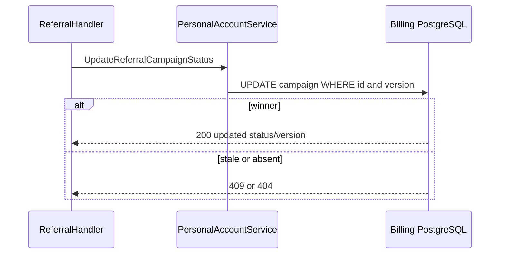
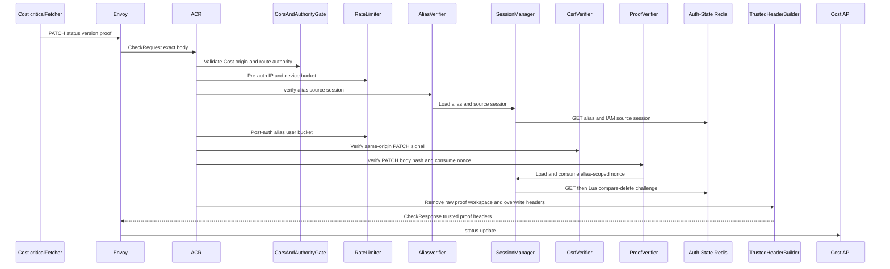
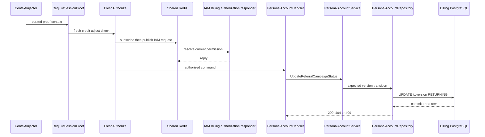

# Billing Referral Campaign Status Update — God View (Master SoT)

This critical operator workflow changes one campaign between `PAUSED`, `ACTIVE` and `ENDED` with version OCC.

## Phase 1 — Client → Envoy → ACR

| Part | Contract |
|---|---|
| Method/path | `PATCH /api/v1/billing/critical/referrals/{id}/status` |
| Headers used | Cost Billing Alias cookies and Cost proof headers; Cloud authority is denied for this operator route |
| JSON payload | `status`, `expected_version` |
| ACR output | verifies alias/source, consumes exact proof, injects trusted identity and proof marker |
| Failure | invalid/replayed proof `403` before API |

## Phase 2 — Cost API transition/OCC

Proof middleware and fresh `billing:credit:adjust` authorization gate `UpdateReferralCampaignStatus`. Handler validates UUID/status/version; service/repository updates only matching current version, increments version and preserves historic reservations. Missing campaign is `404`, stale version `409`, malformed transition `400`.

## Complete edge and Cost execution

### Client input and ACR proof boundary

The Cost-authority PATCH follows CORS, pre/post rate limiting, alias/source-session recheck, CSRF and one-time Ed25519 proof verification before forward. The signature binds query-free public path, PATCH method and exact JSON body; ACR consumes nonce, removes raw proof/workspace context, overwrites client identity, then injects only trusted alias identity/Zone/tenant, proof marker and challenge UUID. No owner rewrite occurs.

| Trusted headers injected by Cost Billing Alias ACR | Value source |
|---|---|
| `x-user-id`, `x-user-name`, `x-zone-id`, `x-tenant-id` | verified alias record after live source-session recheck |
| `x-session-proof-verified: true`, `x-session-proof-challenge-id` | ACR only after signature verification and Lua nonce consume |
| `x-original-path`, level/device/workspace | not injected; public operator path is preserved |

| Input | Handler rule |
|---|---|
| path `id` | non-nil UUID |
| JSON `status` | exactly `ACTIVE`, `PAUSED` or `ENDED` |
| JSON `expected_version` | positive integer string |
| client owner/permission/proof header | raw proof removed; identity overwritten; permission header is never an authority input |

### Fresh authorization and OCC state transition

`RequireSessionProof` and critical `Authorize(billing:credit:adjust)` force current IAM permission through Shared Redis request/reply. Handler passes canonical command to service. Repository updates exactly one `promotion_campaigns` row for referral type when `(id, version)` matches, increments version and returns representation. `0 rows` is classified by checking existence: absent `404`; existing stale version `409`. Existing reservations retain their campaign snapshot, so a status change never retroactively edits grant/amount/time captured by a reservation.

| Result | Response | Durable effect |
|---|---|---|
| `200` | campaign status and next version | one OCC transition |
| `400` | invalid UUID/status/version | none |
| `401/403/429` | edge/proof/permission/rate denial | none |
| `404` | campaign absent | none |
| `409` | expected version stale | none |
| `500/503` | DB/IAM unavailable | no partial transition |

## Failure, replay and recovery semantics

Proof replay is stopped at ACR. OCC is durable conflict control for concurrent operator tabs; only one matching version can commit. If response is lost after commit, a fresh request with old version returns `409`, and GET campaign list is the authority for the new state. No Redis cache controls campaign state.

## Key contract

The durable campaign version is the concurrency fence; no Redis cache can decide status. Ending a campaign blocks new reservation but never retroactively mutates already snapshotted settlement terms.

## Code map

[`cost-manager/api/internal/transport/http/handler/personal_account_handler.go`](../../cost-manager/api/internal/transport/http/handler/personal_account_handler.go).
