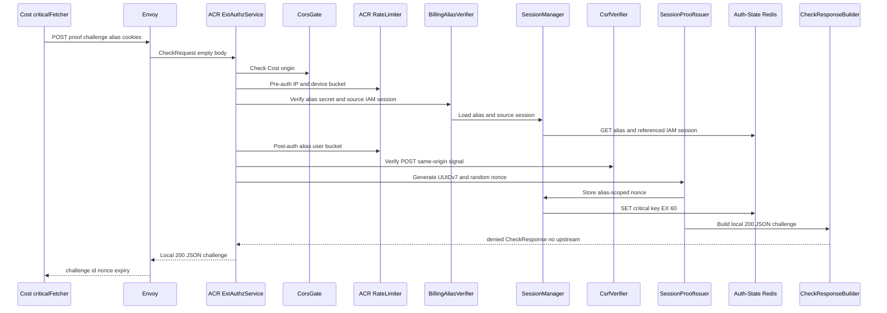

# Billing Critical Session-Proof Challenge — God View (Master SoT)

This ACR-local workflow issues the one-time nonce required before a Cost
critical mutation. It binds proof to the Cost-origin public key stored in the
Billing Alias and never forwards to Cost API.

## Phase 1 — Cost Console → Envoy → ACR issues proof challenge

### REST input and output

| Part | Contract |
|---|---|
| Method/path | `POST /api/v1/billing/auth/session-proof/challenge` |
| Headers used | host-only Billing alias cookies, `Origin` |
| Payload | none |
| Success | local `200` JSON `challenge_id`, `nonce`, `expires_in=60` |
| Failure | missing/revoked alias `401`; Auth-State failure `503`; no forward |

### Key contract

| Key | Store | Operation / TTL | Invariant |
|---|---|---|---|
| `iam:session_proof:critical:{billing_alias_id}:{challenge_id}` | Auth-State Redis | `SET EX 60` nonce bound to the verified Billing Alias | Next critical request must sign method, public path, exact body hash and timestamp |

## Complete edge execution

### CheckRequest and headers

The endpoint is local only after normal Billing Alias authentication. Its
`CheckRequest` body is empty; the client supplies no nonce or identity.

| Header/cookie | Read by | Purpose | Forwarded? |
|---|---|---|---|
| `Origin` | CORS gate | Cost origin allow-list before auth | No |
| `X-Forwarded-For`, `client_device_id` cookie | rate limiter | pre-auth then post-auth buckets | No |
| Billing alias ID and secret cookies | Billing alias verifier | verify alias secret and live source IAM session | No |
| `X-Requested-With` or `Sec-Fetch-Site` | CSRF verifier | POST same-origin/same-site requirement | No |
| client `x-session-proof-*`, `x-user-*`, tenant/Zone headers | none | never accepted as identity or proof input | No |

### Ordered ACR processing and local response

1. Global CORS and pre-auth IP/device rate limits run.
2. Because the request is on Cost authority and matches the Billing alias path,
   `verify_billing_alias` verifies alias ID/secret and rechecks source IAM
   runtime session/proof key in Auth-State Redis.
3. Post-auth limiter charges `alias.user_id`; CSRF validation passes only with
   allowed same-origin signal. Billing uses Zone/tenant bound in the alias and
   does not read a client Zone/workspace cookie.
4. `issue_critical_challenge` creates UUIDv7 `challenge_id` and a random
   32-byte base64 nonce from two UUIDv4 values, then writes the key below with
   `SET EX 60`.
5. ACR returns a local denied-response `200`; it performs neither rewrite nor
   upstream forward. The client next signs the exact request it wants to make.

| Result | Response headers | Response payload | Upstream |
|---|---|---|---|
| `200` | `Content-Type: application/json` | `challenge_id`, `nonce`, `expires_in: 60` | None |
| `401` | ACR denial | no nonce | None |
| `403` | CORS/CSRF denial | no nonce | None |
| `429` | limiter denial | no nonce | None |
| `503` | unavailable denial | no nonce | None |



## Next-request consume contract

The challenge itself does not authorize a mutation. For a future
`/api/v1/billing/critical/*` request, ACR reads headers
`x-session-proof-challenge-id`, `x-session-proof-timestamp` and
`x-session-proof-signature`; it bounds clock skew to 60 seconds, calculates
`sha256(exact_raw_body)`, and verifies the Ed25519 message:

```text
aurora.session-proof.v1
challenge_id
nonce
UPPERCASE_METHOD
query-free-public-path
sha256_hex_exact_raw_body
timestamp
```

Only a valid signature causes Lua compare-and-delete of the nonce. ACR then
removes raw signature/timestamp/challenge/marker headers, overwrites identity
headers and injects `x-session-proof-verified=true` plus the verified challenge
ID upstream. Invalid/replayed/mutated body, path, method or stale timestamp
never reaches Cost API.

### Key contract

| Key | Store | Operation / TTL | Owner and invariant |
|---|---|---|---|
| `iam:session_proof:critical:{billing_alias_id}:{challenge_id}` | Auth-State Redis | `SET EX 60`; later `GET` then Lua compare-and-delete | ACR passes the verified alias ID as its Billing proof access key; the nonce is one-time |
| Billing alias + referenced IAM session | Auth-State Redis | verify reads before issue and every critical request | ACR; proof cannot outlive alias/source session |

## Failure, replay and recovery semantics

Redis write failure issues no challenge. A challenge left after browser failure
expires naturally; clients request a new one rather than reusing a signature.
Redis read/consume outage, missing public key or any cryptographic mismatch is
fail-closed. No proof private key, nonce, signature or raw payload is logged or
forwarded.

## State and security invariants

ACR later Lua-compares and consumes this key only after Ed25519 verification
against the Cost public key. It strips client proof markers and injects
`x-session-proof-verified=true` only for the exact verified request.

## Code map

[`acr/src/gateway/ext_authz.rs`](../../acr/src/gateway/ext_authz.rs),
[`cost-console/src/lib/api/criticalFetcher.ts`](../../cost-console/src/lib/api/criticalFetcher.ts).
