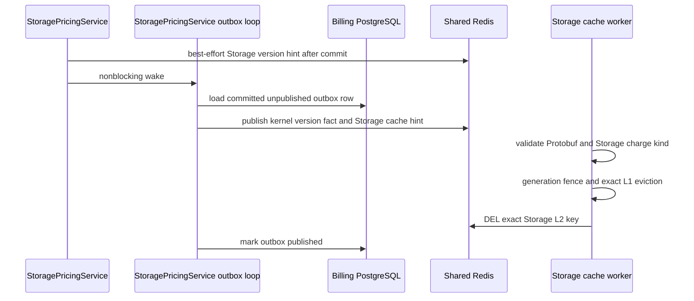

# Billing Storage Base Price Version Publish — God View

This critical operator workflow appends one immutable Global base-price version
owned by Storage. The pricing-schedule workflow remains the read-only catalog
base for list/detail/metadata; it cannot publish a version for Storage,
Hypervisor, Mail, or any future product.

## API and authority contract

| Boundary | Contract |
|---|---|
| Method/path | `POST /api/v1/billing/critical/storage/pricing-schedules/{code}/versions` |
| Edge authority | verified Billing Alias, CSRF, one-time request proof, rate limits |
| API authority | fresh `billing:pricing_schedule:publish` permission and verified operator ID |
| Accepted schedules | active `storage.capacity.gb_hour`, `storage.network_in.byte`, or `storage.network_out.byte` schedules whose catalog module is exactly `storage` |
| JSON | `expected_latest_version`, UTC `effective_from`, `change_reason`, and progressive scalar `brackets` |
| BIGINT wire form | every bracket quantity and numerator/denominator is a base-10 JSON string; never a JavaScript number |
| Success | `201`; all times are UTC `Z`, all BIGINT fields remain decimal strings |

The request cannot choose a module, charge kind, pricing model, currency, Zone,
wallet, plan, formula, discount, or checksum. The Storage publish-target query
derives those authoritative values from the active catalog row. Transport owns
JSON binding and exact `int64` parsing. The Storage service owns commercial
rules: UTC microsecond normalization, progressive-range continuity, effective
window policy, model ownership, and canonical checksum. Repository logic owns
transactional OCC and database state transitions only.

## Immutable transaction

```mermaid
sequenceDiagram
    participant UI as Cost Console
    participant A as ACR
    participant H as StoragePricingHandler
    participant S as StoragePricingService
    participant R as StoragePricingRepository
    participant DB as Billing PostgreSQL
    UI->>A: POST Storage base version with proof
    A->>A: verify Alias, CSRF, proof and fresh route authority
    A->>H: trusted operator request
    H->>H: bind JSON and parse BIGINT strings
    H->>S: flat Storage publish command and brackets
    S->>R: get Storage-owned publish target by code
    R->>DB: CTE fence active schedule to module storage
    S->>S: validate business ranges, normalize UTC, calculate checksum
    S->>R: append immutable version
    R->>DB: BEGIN; lock Storage schedule; enforce OCC/effective ordering
    R->>DB: close predecessor; insert version, brackets and outbox
    DB-->>R: COMMIT
    R-->>H: version and bracket lineage
    H-->>UI: 201 UTC/string-safe response
```

`expected_latest_version = 0` is explicit and valid only for a schedule without
a version. A stale value returns `409`. A successor can close the predecessor's
effective interval but never rewrites historical rates. Version, brackets, and
`billing.pricing_outbox` commit atomically.

## Storage-owned cache invalidation

After commit, Storage wakes its own outbox loop and publishes a best-effort Protobuf hint to
`billing.pricing.storage.version.published.v1`. The Storage worker subscribes
only to that channel, accepts only Storage charge kinds, increments its local
generation fence, removes only the matching Storage L1 entry, and deletes only:

`cost-manager:storage:pricing:snapshot:v1:{storage_charge_kind}`

Its L2 value is the Storage-only binary protobuf
`StoragePricingSnapshotCacheEntryV1`; it is not the generic publish event and
it is never JSON.

Storage's `RunPricingOutboxRelay` claims only Storage rows and republishes both
the kernel pricing fact and Storage cache hint. There is no generic cross-module
relay. A lost subscriber notification is recovered by cache expiry or cold start.
L1 has a one-minute TTL and L2 a one-hour TTL; both enforce the snapshot effective
window. PostgreSQL remains pricing authority. Hypervisor and Mail have separate key prefixes,
channels, cache state, and workers; there is no shared mutable pricing cache.



## Failure and isolation rules

- Invalid JSON, integer string, overflow, or missing explicit OCC returns `400`
  before the service/repository.
- Unknown or non-Storage schedule returns `404`; the generic catalog handler
  has no publish method or route.
- Stale OCC or invalid effective ordering returns `409` with no partial rows.
- Cache publication failure does not roll back a committed price; outbox and
  TTL recovery repair visibility.
- A foreign-module cache event cannot delete a Storage key.
- Cost Engine resolves the Global version as kernel data; Storage applies its
  separate Zone multiplier in the Storage adapter. The kernel never knows
  Storage.

## Code map

- `cost-console/src/lib/api/billing.ts`
- `cost-console/src/page/pricing-schedules/page.tsx`
- `cost-manager/api/internal/transport/http/handler/storage_pricing_handler.go`
- `cost-manager/api/internal/service/storage_pricing_service.go`
- `cost-manager/api/internal/repository/storage_pricing_repo.go`
- `cost-manager/api/internal/service/pricing_schedule_service.go`
- `cost-manager/api/internal/app/route.go`
