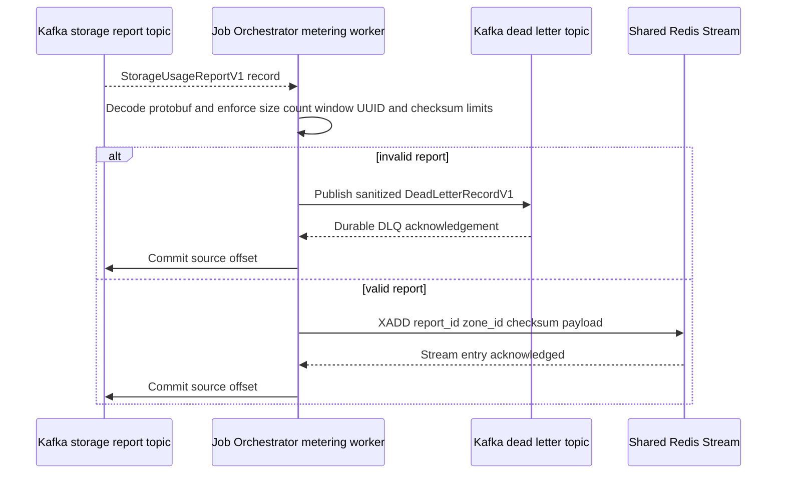
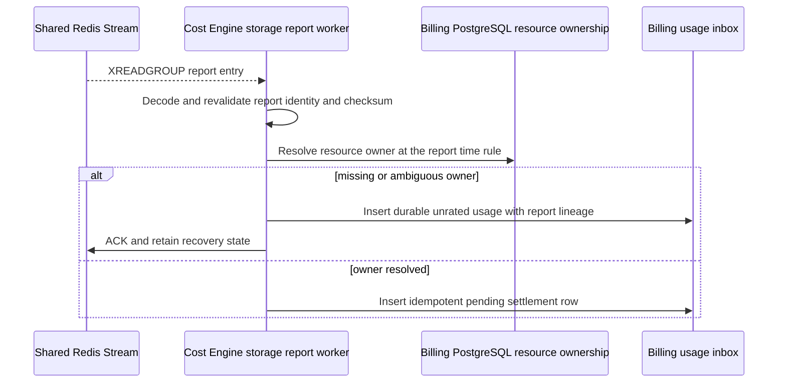
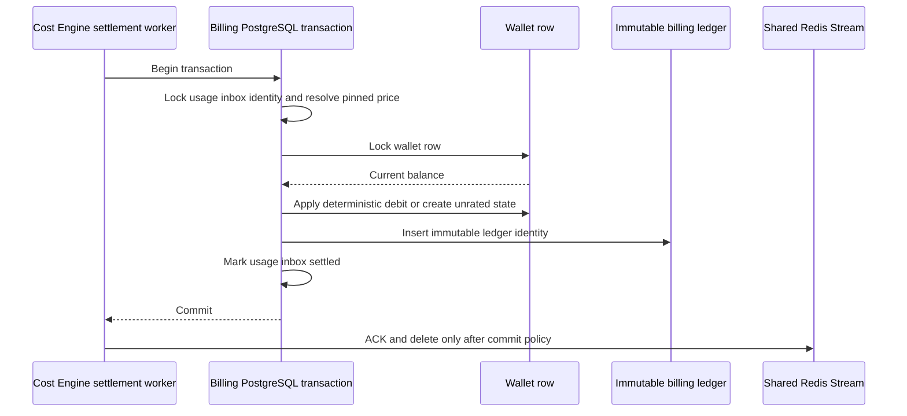

# Storage Usage Billing Settlement — God View

This is the Central background workflow that accepts a Zone-owned storage usage
report and, after validation and durable handoff, settles usage against Billing
PostgreSQL. It has no browser request and therefore no ACR phase. Zone reports
contain resource usage, not payer authority. Central resolves ownership and
pricing from durable Billing state at the approved time rule.

**Implementation status:** the Protobuf contract and JO Kafka-to-Shared-Redis
relay are implemented in shadow mode. Cost Engine still has the legacy Central
ClickHouse polling path; wallet mutation must remain on that path until the
report consumer passes the God Plan gates. The new relay never debits a wallet.

## Runtime contract

| Item | Contract |
| --- | --- |
| Source | Kafka `{prefix}.storage.usage.reports.v1` |
| Consumer | Job Orchestrator storage metering worker |
| Handoff | Shared Redis Stream `aurora:storage:usage:reports` |
| Settlement owner | Cost Engine storage report workflow |
| Money SoT | Billing PostgreSQL wallet, usage inbox and immutable ledger |
| Invalid input | Sanitized Kafka dead-letter record then source offset commit |
| Transient failure | Do not commit or ACK the source boundary |
| Duplicate | Same report or line lineage is idempotent; no second debit |

## Phase 1 — JO validates and durably relays a report

JO consumes Kafka manually. It rejects empty or oversized payloads, unknown
schema versions, nil UUIDs, invalid half-open windows, excessive aggregate
count, missing checksum, invalid correction lineage, unknown resource UUID
shape and checksum mismatch. It publishes only a sanitized error record for an
invalid payload. The original is truncated to a bounded diagnostic payload and
never becomes a DLQ place for secrets.

If Redis `XADD` fails, JO returns an error without committing Kafka. If JO
crashes after `XADD` but before commit, Kafka redelivery is expected; the Cost
Engine inbox and report identity must absorb the duplicate. Kafka is the source
transport boundary, while Redis is the bounded Central handoff and not the
money authority.

## Phase 2 — Cost Engine report intake and ownership resolution

The future Cost Engine consumer reads the Redis stream with a named consumer
group and reclaim timeout. It validates the stream payload again because Redis
is a transport boundary. It resolves the resource owner in Billing PostgreSQL
using the report window and the approved ownership-generation rule. Missing or
ambiguous ownership becomes durable `unrated_usage`; the engine never guesses a
wallet from a client credential or resource name.

## Phase 3 — Atomic wallet and ledger settlement

For a resolved line, the worker pins the pricing version under the approved
billing-time rule, locks exactly one wallet, and writes inbox state, wallet
mutation and immutable ledger entry in one PostgreSQL transaction. The ledger
identity is derived from report ID, aggregate resource, direction and
correction lineage. The Redis entry is acknowledged only after commit.

Any PostgreSQL error rolls back wallet, ledger and inbox together. Redis
reclaim retries the same report. A replay that reaches a committed inbox is a
no-op, not a second debit. A correction is an append-only adjustment ledger
entry linked to the original report; settled history is never edited or
deleted.

## Contract and key table

| Key or contract | Value |
| --- | --- |
| Protobuf | `aurora.storage.metering.v1.StorageUsageReportV1` |
| Kafka consumer group | `aurora-job-orchestrator-storage-usage-v1` |
| Redis stream | `aurora:storage:usage:reports` |
| Redis consumer group | `cost-engine-storage-metering-v1` |
| DLQ | Existing Kafka dead-letter topic from `KafkaTransport` |
| Idempotency | Report UUID, line resource UUID, direction, correction lineage and checksum |
| Durable settlement | Billing PostgreSQL usage inbox plus wallet and ledger transaction |

## Failure and cutover rules

| Failure | Behavior |
| --- | --- |
| Malformed or checksum-invalid report | DLQ, then Kafka commit; no Redis relay and no wallet mutation |
| Redis outage | Kafka offset remains unsettled and report is retried |
| JO crash after XADD | Kafka redelivery is safe through settlement idempotency |
| Billing PostgreSQL outage | Redis entry remains pending for reclaim |
| Missing owner or wallet | Durable unrated state; never speculative debit |
| Wallet or ledger write failure | Entire transaction rolls back |
| Corrected report | New adjustment lineage only |
| Legacy Central ClickHouse | Remains diagnostic/current billing dependency until Phase 8 cutover; never run both charge paths simultaneously |

## Code map

- `job-orchestrator/src/storage_metering.rs`
- `job-orchestrator/src/infra/kafka.rs`
- `job-orchestrator/src/contracts.rs`
- `proto/cost-manager/engine/storage_usage_report.proto`
- Future owner: `cost-manager/engine/src/service/storage/usage_report_settlement.rs`
- Current legacy path: `cost-manager/engine/src/service/storage/egress_billing.rs`
- Plan and gates: `cost-manager/tmp/zone-local-storage-metering-refactor-plan.md`
