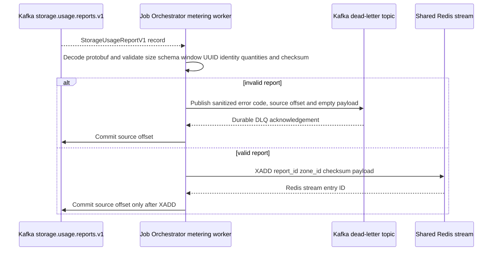
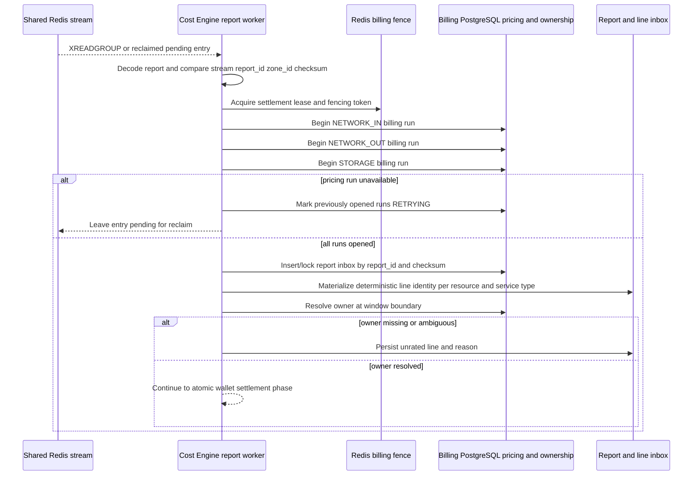
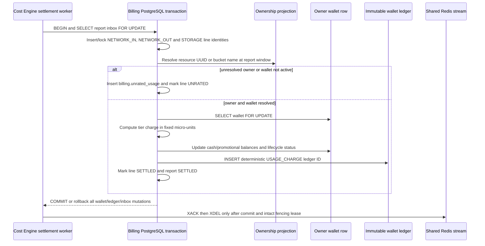

# Storage Usage Billing Settlement — God View

This is the Central background workflow that receives one Zone-owned hourly
`StorageUsageReportV1` and settles its three possible usage kinds against
Billing PostgreSQL. It has no browser request and therefore no ACR phase. The
Zone supplies observations only; Central resolves owner, price and wallet
from durable Billing state.

Central ClickHouse is not part of this workflow. Zone ClickHouse is only the
local journal that produces the report. Billing PostgreSQL is the sole money
Source of Truth.

## Runtime contract

| Item | Contract |
| --- | --- |
| Source | Kafka `{prefix}.storage.usage.reports.v1` |
| Kafka consumer | Job Orchestrator `aurora-job-orchestrator-storage-usage-v1` |
| Central handoff | Shared Redis Stream `aurora:storage:usage:reports` |
| Settlement owner | Cost Engine storage report consumer group `cost-engine-storage-metering-v1` |
| Billable units | `NETWORK_IN/BYTE`, `NETWORK_OUT/BYTE`, `STORAGE/GB_HOUR_MICRO` |
| Money SoT | Billing PostgreSQL wallet, report/line inbox, ownership projection and immutable ledger |
| Invalid input | Sanitized Kafka DLQ record, then source offset commit |
| Transient failure | Keep Kafka offset or Redis entry pending; retry/reclaim |
| Duplicate | Deterministic report/line IDs and inbox status make replay idempotent |

## Phase 1 — Job Orchestrator validates and relays Kafka

JO owns the Kafka-to-Redis transport boundary. It validates payload size,
schema, UUIDs, hourly window shape, aggregate bounds, identity shape,
billable quantity and SHA-256. Storage capacity aggregates use a validated
`resource_name`; transfer aggregates use a non-nil `resource_id`. The original
payload is never copied into the dead-letter record.

If `XADD` fails, JO returns an error and does not commit Kafka. A crash after
`XADD` but before commit causes a Kafka redelivery; the Cost Engine absorbs it
through the report ID and payload checksum.

## Phase 2 — Cost Engine validates, opens pricing runs and resolves ownership

The Cost Engine consumes the Redis stream with reclaimable pending entries. It
revalidates the transport metadata against the canonical protobuf, then starts
one fenced billing run for each service type in the report:
`NETWORK_IN`, `NETWORK_OUT` and `STORAGE`. If any run cannot be opened, all
already-open runs are marked retryable and no wallet transaction starts.

For transfer aggregates, the resource UUID is looked up in the Billing
ownership projection. For capacity aggregates, the report carries a bucket
name and the engine resolves the current ownership projection by
`resource_type=STORAGE_BUCKET`, Zone, and the report's half-open time window.
Missing or ambiguous ownership becomes durable `UNRATED`; no wallet is guessed.

The engine never consults Central ClickHouse, client credentials or an
untrusted owner field. The Zone report is an observation, not authorization.

## Phase 3 — Atomic wallet, line inbox and ledger settlement

All billable lines are settled in one PostgreSQL transaction per report. The
transaction locks the report and line inbox identities, then the owner wallet.
`NETWORK_IN` and `NETWORK_OUT` use byte quantity and the corresponding pinned
Tier snapshot. `STORAGE` uses the fixed-point GB-hour quantity and the Storage
Tier snapshot. A storage line keeps the original bucket name while its
deterministic synthetic UUID satisfies the existing UUID-based ledger/index
contract.

If a ledger identity already exists after a crash, the engine reconciles the
line as settled without debiting again. Any PostgreSQL or fence error rolls
back the transaction; Redis reclaim retries the same report. A report with
unrated lines is durably marked `UNRATED`, allowing a later reconciliation
workflow without speculative charging.

Corrections remain append-only. The current unsigned wire contract cannot
express a safe negative adjustment, so a correction is persisted as `DEAD`
with `STORAGE_USAGE_CORRECTION_POLICY_NOT_ENABLED` and does not mutate a
wallet or settled history.

## Contract and key table

| Key or contract | Value |
| --- | --- |
| Protobuf | `aurora.storage.metering.v1.StorageUsageReportV1` |
| Usage units | `BYTE` for network; `GB_HOUR_MICRO` for storage |
| Kafka consumer group | `aurora-job-orchestrator-storage-usage-v1` |
| Redis stream/group | `aurora:storage:usage:reports` / `cost-engine-storage-metering-v1` |
| Pricing runs | One fenced run each for `NETWORK_IN`, `NETWORK_OUT`, `STORAGE` |
| Line identity | UUIDv5 of report, resource identity and service type |
| Storage identity | Synthetic UUIDv5 plus durable `resource_name` bucket reference |
| Durable state | `billing.storage_usage_report_inbox`, `storage_usage_line_inbox`, `unrated_usage` |
| Money state | `billing.wallets` and `billing.wallet_ledger_entries` |
| Fence | `storage:report:settlement:lock` plus monotonic fencing counter |

## Failure and security rules

| Failure | Behavior |
| --- | --- |
| Malformed/checksum-invalid report | Sanitized DLQ, Kafka commit, no Redis relay or wallet mutation |
| Redis outage | Kafka offset remains pending |
| JO crash after XADD | Kafka redelivery is safe through report checksum/idempotency |
| Pricing run failure | Already-open runs become retryable; report remains pending |
| Billing PostgreSQL outage | Redis entry remains pending for reclaim |
| Missing/ambiguous owner or wallet | Durable `UNRATED`; never debit a guessed owner |
| Wallet/ledger SQL failure | Entire transaction rolls back |
| Fence loss before ACK | Do not ACK; reclaim the report |
| Duplicate report/line | Inbox and deterministic ledger identity prevent a second debit |
| Correction | Durable `DEAD` quarantine until signed adjustment policy exists |
| Central ClickHouse | Absent from the charge path; only Zone-local metering journals exist |

## Code map

- `job-orchestrator/src/storage_metering.rs`
- `proto/cost-manager/engine/storage_usage_report.proto`
- `cost-manager/engine/src/service/storage/usage_report_settlement.rs`
- `cost-manager/engine/src/engine/snapshot.rs`
- `cost-manager/api/migrations/000008_storage_usage_contract.up.sql` (current
  storage settlement contract and indexes; historical migrations remain
  checksum-immutable)
- `cost-manager/tmp/zone-local-storage-metering-refactor-plan.md`
