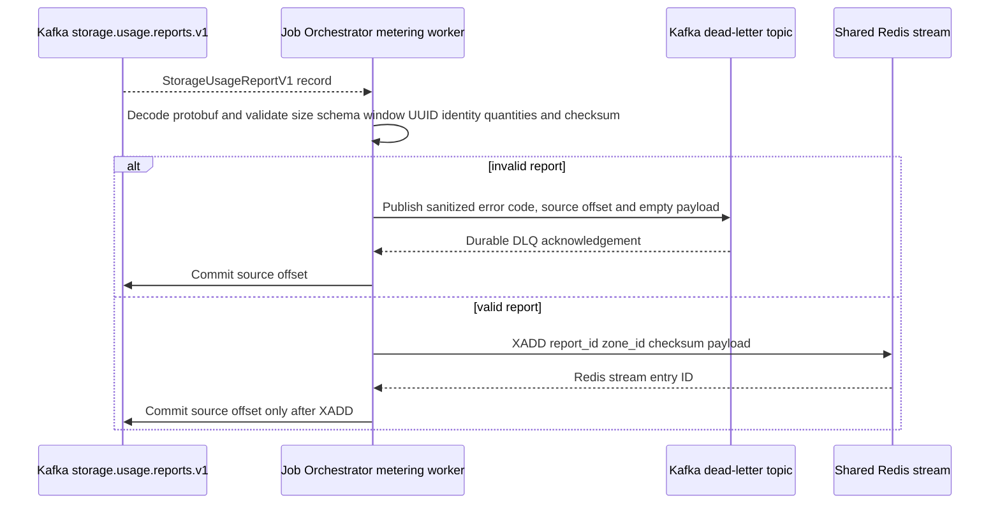
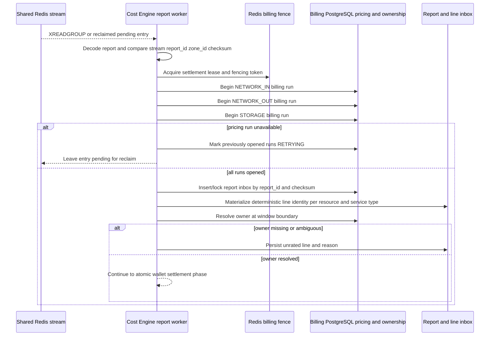
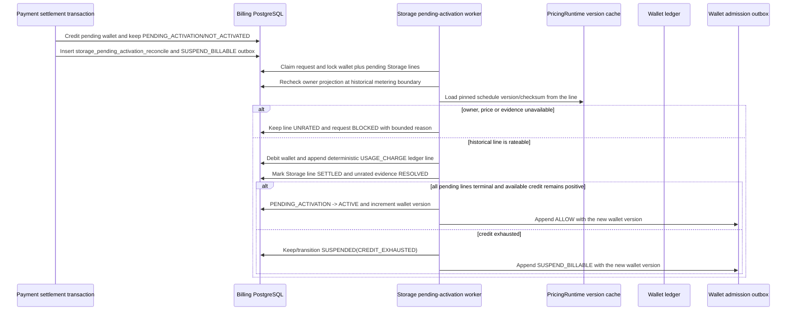

# Storage Usage Billing Settlement — God View

This is the Central background workflow that receives one Zone-owned hourly
`StorageUsageReportV1` and settles its three possible usage kinds against
Billing PostgreSQL. It has no browser request and therefore no ACR phase. The
Zone supplies observations only; Central resolves owner, price and wallet
from durable Billing state.

Central ClickHouse is not part of this workflow. Zone ClickHouse is only the
local journal that produces the report. Billing PostgreSQL is the sole money
Source of Truth.

## Runtime contract

| Item | Contract |
| --- | --- |
| Source | Kafka `{prefix}.storage.usage.reports.v1` |
| Kafka consumer | Job Orchestrator `aurora-job-orchestrator-storage-usage-v1` |
| Central handoff | Shared Redis Stream `aurora:storage:usage:reports` |
| Settlement owner | Cost Engine storage report consumer group `cost-engine-storage-metering-v1` |
| Billable units | `NETWORK_IN/BYTE`, `NETWORK_OUT/BYTE`, `STORAGE/BYTE_HOUR` |
| Money SoT | Billing PostgreSQL wallet, report/line inbox, ownership projection and immutable ledger |
| Invalid input | Sanitized Kafka DLQ record, then source offset commit |
| Transient failure | Keep Kafka offset or Redis entry pending; retry/reclaim |
| Duplicate | Deterministic report/line IDs and inbox status make replay idempotent |

## Phase 0 — Supervised Cost Engine bootstrap

The release image contains the Go Cost API and the Rust Cost Engine, but they
remain separate process and Vault identities. The API authenticates with its
own Vault principal, removes that identity from the child environment, and
maps only the dedicated Engine token, AppRole or Kubernetes role into the
child. A shared or missing Engine identity fails startup.

The API starts the Engine before opening its HTTP listener. The Engine
bootstraps Billing PostgreSQL, the immutable pricing catalog and Shared Redis,
starts all three critical workflows, then atomically writes its process-scoped
readiness marker. `/health/ready` returns success only while that marker exists,
the Engine process is running, and the API can ping Billing PostgreSQL and
Shared Redis. `/health/live` proves only that the supervising API process is
alive.

If settlement, pending-activation reconciliation or the pricing listener exits
unexpectedly, the Engine supervisor exits non-zero. The API observes the child
exit, removes readiness, shuts down its HTTP surface and exits so the workload
controller restarts the whole unit. An API-only healthy pod is never allowed
to advertise Billing readiness while charging is stopped.

## Phase 1 — Job Orchestrator validates and relays Kafka

JO owns the Kafka-to-Redis transport boundary. It validates payload size,
schema, UUIDs, hourly window shape, aggregate bounds, identity shape,
billable quantity and SHA-256. Storage capacity aggregates use a validated
`resource_name`; transfer aggregates use a non-nil `resource_id`. The original
payload is never copied into the dead-letter record.



If `XADD` fails, JO returns an error and does not commit Kafka. A crash after
`XADD` but before commit causes a Kafka redelivery; the Cost Engine absorbs it
through the report ID and payload checksum.

## Phase 2 — Cost Engine validates, opens pricing runs and resolves ownership

The Cost Engine consumes the Redis stream with reclaimable pending entries. It
revalidates the transport metadata against the canonical protobuf, then starts
one fenced billing run for each service type in the report:
`NETWORK_IN`, `NETWORK_OUT` and `STORAGE`. If any run cannot be opened, all
already-open runs are marked retryable and no wallet transaction starts.

For transfer aggregates, the resource UUID is looked up in the Billing
ownership projection. For capacity aggregates, the report carries a bucket
name and the engine resolves the current ownership projection by
`resource_type=STORAGE_BUCKET`, Zone, and the report's half-open time window.
Missing or ambiguous ownership becomes durable `UNRATED`; no wallet is guessed.



The engine never consults Central ClickHouse, client credentials or an
untrusted owner field. The Zone report is an observation, not authorization.

## Phase 3 — Atomic wallet, line inbox and ledger settlement

All billable lines are settled in one PostgreSQL transaction per report. The
transaction locks the report and line inbox identities, then the owner wallet.
`storage.network_in.byte` and `storage.network_out.byte` use byte quantity and
the corresponding pinned Global base Pricing Schedule snapshot.
`storage.capacity.gb_hour` uses the exact occupied byte-hour quantity and its
Global base schedule. Before opening the run, the Storage adapter resolves the
immutable Storage Zone adjustment effective at the report boundary. The PAYG
kernel receives only the base snapshot plus adjustment numerator/denominato
and lineage; it never reads a Zone or knows Storage. Base and adjustment are
multiplied as one exact rational and rounded once at the money boundary. The
Storage adapter then invokes the generic PAYG wallet primitive with resolved
owner, price, evidence and opaque module/charge-kind codes. That primitive owns
the wallet lock, promotional-before-cash debit, bounded overdraft threshold,
lifecycle/admission transition and deterministic ledger insert; it never
resolves Storage ownership. Available credit is the integer micro-unit sum
`cash + remaining promotional + overdraft_limit`. Cash may become negative
within that configured grace amount. Crossing zero suspends new billable work,
while already allocated resources continue producing immutable debt evidence. A
storage line keeps the original bucket name while its
deterministic synthetic UUID satisfies the existing UUID-based ledger/index
contract.

```mermaid
sequenceDiagram
    participant E as Cost Engine settlement worker
    participant P as Billing PostgreSQL transaction
    participant A as Storage Zone adjustment policy
    participant O as Ownership projection
    participant W as Owner wallet row
    participant L as Immutable wallet ledger
    participant R as Shared Redis stream

    E->>P: BEGIN and SELECT report inbox FOR UPDATE
    P->>A: Resolve immutable adjustment at Zone/window boundary
    P->>P: Pin Global base plus adjustment lineage
    P->>P: Insert/lock NETWORK_IN, NETWORK_OUT and STORAGE line identities
    P->>O: Resolve resource UUID or bucket name at report window
    alt unresolved owner or wallet not active
        P->>P: Insert billing.unrated_usage and mark line UNRATED
    else owner and wallet resolved
        P->>W: SELECT wallet FOR UPDATE
        P->>P: Compute exact base x adjustment; round once to fixed micro-units
        P->>W: Update cash/promotional balances and lifecycle status
        P->>L: INSERT deterministic USAGE_CHARGE ledger ID
        P->>P: Mark line SETTLED and report SETTLED
    end
    P-->>E: COMMIT or rollback all wallet/ledger/inbox mutations
    alt every line settled
        E->>R: XACK then XDEL after commit and intact fencing lease
    else any line remains UNRATED
        E-->>R: leave entry pending for bounded reclaim/replay
    end
```

If a ledger identity already exists after a crash, the engine reconciles the
line as settled without debiting again. Any PostgreSQL or fence error rolls
back the transaction; Redis reclaim retries the same report. A report with
unrated lines is durably marked `UNRATED` and is not ACKed. Stream reclaim
replays the same deterministic lines until their dependency exists; successful
replay marks matching `billing.unrated_usage` evidence `RESOLVED` and only then
settles and ACKs the report. The pending-activation worker remains the targeted
wallet-activation recovery path, while normal stream replay covers ownership o
wallet projection lag. This allows later reconciliation
workflow without speculative charging.

Corrections remain append-only. The current unsigned wire contract cannot
express a safe negative adjustment, so a correction is persisted as `DEAD`
with `STORAGE_USAGE_CORRECTION_POLICY_NOT_ENABLED` and does not mutate a
wallet or settled history.

## Phase 4 — Pending-activation historical reconciliation

`PENDING_ACTIVATION` is not a free allowance. When a valid closed report has a
resolved owner but its wallet is still pending, the settlement transaction keeps
the line, pinned schedule version, run identity and report evidence, marks the
line `UNRATED` with `WALLET_PENDING_ACTIVATION`, and leaves wallet admission
suspended. A verified top-up credits the wallet and creates the Storage-owned
`billing.storage_pending_activation_reconcile` request in the same transaction;
it never emits `ALLOW` directly.



The worker never rates at top-up time and never calls a Zone or the browser. It
uses deterministic line/ledger identity, so replay after a crash cannot debit
the same historical fact twice. Missing or ambiguous ownership, checksum
mismatch, unsupported currency or a missing pinned run blocks activation and
remains bounded operational evidence. The worker processes at most 500 lines
per transaction. A nonterminal batch returns the request to `PENDING`; it may
resume from either `PENDING_ACTIVATION` or
`SUSPENDED(CREDIT_EXHAUSTED)`. `BLOCKED` is reserved for a missing business
dependency, and admission is appended only for an actual lifecycle transition.

## Contract and key table

| Key or contract | Value |
| --- | --- |
| Protobuf | `aurora.storage.metering.v1.StorageUsageReportV1` |
| Usage units | `BYTE` for network; `BYTE_HOUR` for storage capacity |
| Kafka consumer group | `aurora-job-orchestrator-storage-usage-v1` |
| Redis stream/group | `aurora:storage:usage:reports` / `cost-engine-storage-metering-v1` |
| Pricing runs | One fenced run per nonzero charge kind with Global base version plus Storage adjustment lineage |
| Wallet primitive | Generic atomic debit/admission/ledger invariant; module adapter supplies authority and evidence |
| Line identity | UUIDv5 of report, resource identity and charge kind |
| Storage identity | Synthetic UUIDv5 plus durable `resource_name` bucket reference |
| Durable state | `billing.storage_usage_report_inbox`, `storage_usage_line_inbox`, `unrated_usage` |
| Money state | `billing.wallets` and `billing.wallet_ledger_entries` |
| Fence | report-scoped `storage:report:settlement:lock:{report_id}` plus one monotonic fencing counter |
| Pending activation | `billing.storage_pending_activation_reconcile` keyed by wallet |

## Phase 5 — Wallet admission fan-out and Zone enforcement

Every wallet transition is committed with a Cost-owned
`wallet_admission_outbox` row. The Cost relay claims only committed rows and
publishes the same minimal owner-level `CommercialAdmissionChangedV1` to each
module-specific stream. It does not resolve Storage resources. Storage
Controlplane owns its local owner-to-bucket projection, creates scoped Zone
outbox rows in the same transaction and relays those rows after commit.

```mermaid
sequenceDiagram
    participant B as Billing PostgreSQL wallet transaction
    participant R as Cost wallet admission relay
    participant S as Shared Redis stream
    participant C as Controlplane Storage projection
    participant K as Kafka Zone admission topic
    participant Z as Zone Control admission consumer
    participant V as Zone admission KV
    participant E as Zone Control/Public authorizer

    B->>B: Commit wallet status, version, reason and wallet_admission_outbox
    R->>B: Claim unpublished outbox row with claim token
    R->>S: XADD minimal CommercialAdmissionChangedV1 to the Storage-specific stream
    R->>S: WAITAOF durability fence
    R->>B: Mark the claimed row published
    S-->>C: Consumer group delivers event
    C->>C: Apply owner policy_version and resolve Storage-owned resources
    C->>C: Append scoped Zone delivery to PostgreSQL outbox in the same commit
    C->>K: Relay one scoped event per target Zone and mark delivered after Kafka ACK
    K-->>Z: Zone Control consumer receives target event
    Z->>V: CAS resource admission by policy_version
    E->>V: Read admission before billable ticket issue/transfer
    alt missing, stale or SUSPEND_BILLABLE
        E-->>E: Deny billable operation; revoke/delete remains allowed
    else ALLOW and non-expired
        E-->>E: Continue assertion/ticket path
    end
```

The Central projection and Zone KV are rebuildable read models. A lower or
duplicate policy version is a no-op; a missing or expired `ALLOW` fails closed.
The browser, SDK and Zone authorizers never call Billing synchronously.

## Failure and security rules

| Failure | Behavior |
| --- | --- |
| Malformed/checksum-invalid report | JO uses sanitized DLQ before relay; a defensive Cost consumer persists recoverable identity as `DEAD`, otherwise atomically moves the entry to its bounded Redis DLQ so the group cannot be poisoned |
| Redis outage | Kafka offset remains pending |
| JO crash after XADD | Kafka redelivery is safe through report checksum/idempotency |
| Pricing run failure | Already-open runs become retryable; report remains pending |
| Billing PostgreSQL outage | Redis entry remains pending for reclaim |
| Missing/ambiguous owner or wallet | Durable `UNRATED`; never debit a guessed owner |
| Wallet/ledger SQL failure | Entire transaction rolls back |
| Fence loss before ACK | Do not ACK; reclaim the report |
| Duplicate report/line | Inbox and deterministic ledger identity prevent a second debit |
| Correction | Durable `DEAD` quarantine until signed adjustment policy exists |
| Pending wallet | Historical lines remain `UNRATED` until Storage reconciliation settles them; top-up alone never opens admission |
| Central ClickHouse | Absent from the charge path; only Zone-local metering journals exist |
| Engine bootstrap failure | No HTTP readiness; the combined workload exits and is restarted |
| Critical Engine workflow exits | Engine and supervising API exit; readiness cannot remain green |
| API and Engine Vault identity overlap | Startup is rejected before the child receives credentials |

## Code map

- `job-orchestrator/src/storage_metering.rs`
- `proto/cost-manager/engine/storage_usage_report.proto`
- `cost-manager/engine/src/service/storage/usage_report_settlement.rs`
- `cost-manager/engine/src/service/storage/pending_activation_reconcile.rs`
- `cost-manager/engine/src/engine/runtime.rs`
- `cost-manager/engine/src/engine/snapshot.rs`
- `cost-manager/engine/src/engine/wallet.rs`
- `cost-manager/engine/src/service/register.rs` (critical-workflow supervisor)
- `cost-manager/engine/src/main.rs` (Engine readiness and fail-fast lifecycle)
- `cost-manager/api/internal/app/cost_engine_process.go` (isolated child identity and lifecycle)
- `cost-manager/api/internal/app/cost_health_handler.go` (minimal readiness capabilities)
- `cost-manager/api/internal/app/app.go` (wiring only)
- `k8s/cost-manager-deployment.yaml` (projected Vault identity, TLS and probes)
- `cost-manager/api/migrations/000002_tables_core.up.sql` (greenfield wallet,
  ownership and admission baseline)
- `cost-manager/api/migrations/000003_tables_pricing.up.sql` (Charge Kind
  Registry, immutable Pricing Schedules and settlement runs)
- `cost-manager/api/migrations/000004_tables_settlement.up.sql` (Storage inbox,
  unrated evidence and immutable ledger baseline)
- `cost-manager/api/migrations/000005_indexes_and_triggers.up.sql` (pricing and
  settlement enforcement)
- `cost-manager/api/migrations/000006_seeds.up.sql` (controlled PAYG seed
  schedules and cross-runtime checksum vectors)
