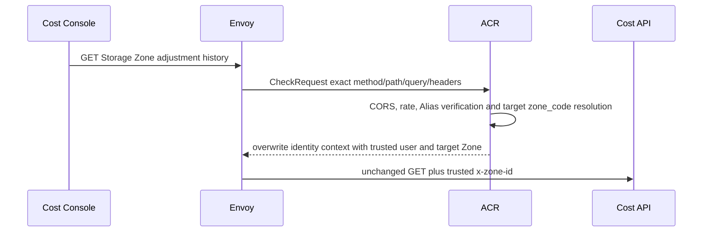

# Billing Storage Zone Price Adjustment List — God View

This operator read lists immutable Storage multiplier versions for exactly the
Zone verified by ACR. It does not publish, cancel or mutate pricing.

## API-scope contract

Cost Console sends
`GET /api/v1/billing/storage/zone-price-adjustments?limit=100&zone_code={code}`
with Billing Alias cookies. The selectable `zone_code` is never a Zone UUID or
authority header. ACR verifies the Alias, resolves exactly one active/draining
catalog code, removes caller Zone headers and overwrites `x-zone-id` with the
resolved target. Cost reads only that trusted header and requires
`billing:pricing_schedule:read`; proof is not required for this read.

## Phase 1 — Client → Envoy → ACR

## Phase 2 — Flat CTE read projection

Transport validates `limit` in `1..100` and obtains the trusted Zone. The
Storage list service passes its flat query to its own repository port. One CTE
orders only that Zone's versions, marks the latest row and computes which
half-open interval is effective at PostgreSQL `NOW()`. The repository reads at
most `limit+1` rows to return bounded history and `has_more` without a second
count query.

The response contains trusted `zone_id`, UTC observation time and repeated flat
Storage list items. Multiplier numerator/denominator are decimal strings at
JSON; timestamps are RFC3339Nano UTC. PostgreSQL retains BIGINT integers. Empty
history means Global inheritance `1/1` and expected first version `0`.

## Failure and security rules

- Missing, repeated, malformed or inactive `zone_code` is denied by ACR before
  Cost is called.
- Invalid limit returns 400.
- Database failure returns 500 without a fabricated cache fallback.
- A caller selects only catalog code; Cost never trusts query/header Zone data.
- Settlement independently resolves its immutable effective version from
  Billing PostgreSQL at report time.

## Code map

- `cost-manager/api/internal/transport/http/handler/storage_pricing_handler.go`
- `cost-manager/api/internal/service/storage_zone_adjustment_list_service.go`
- `cost-manager/api/internal/repository/storage_zone_adjustment_list_repo.go`
- `cost-console/src/page/pricing-schedules/StorageZoneAdjustmentPanel.tsx`
