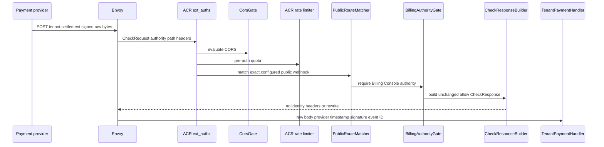
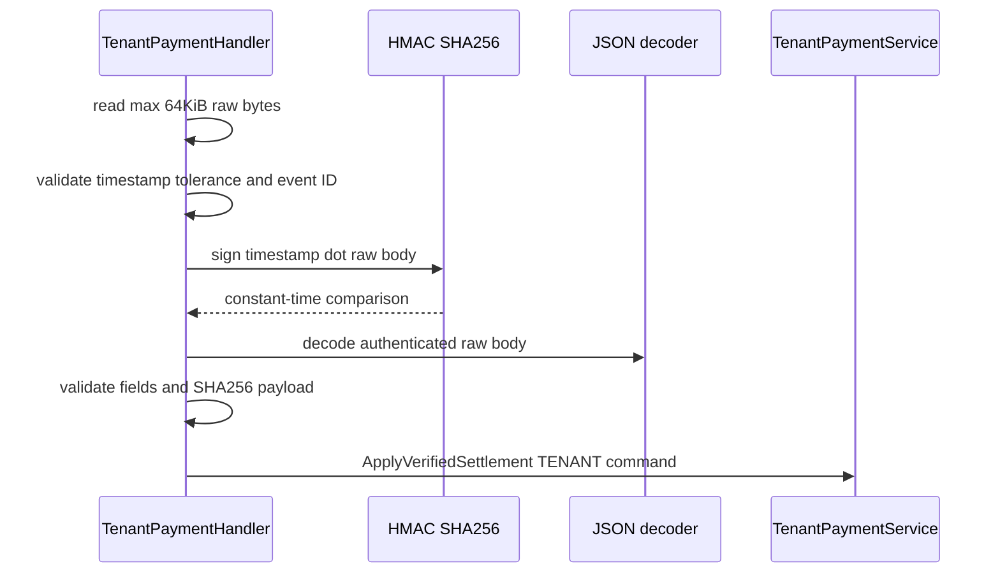
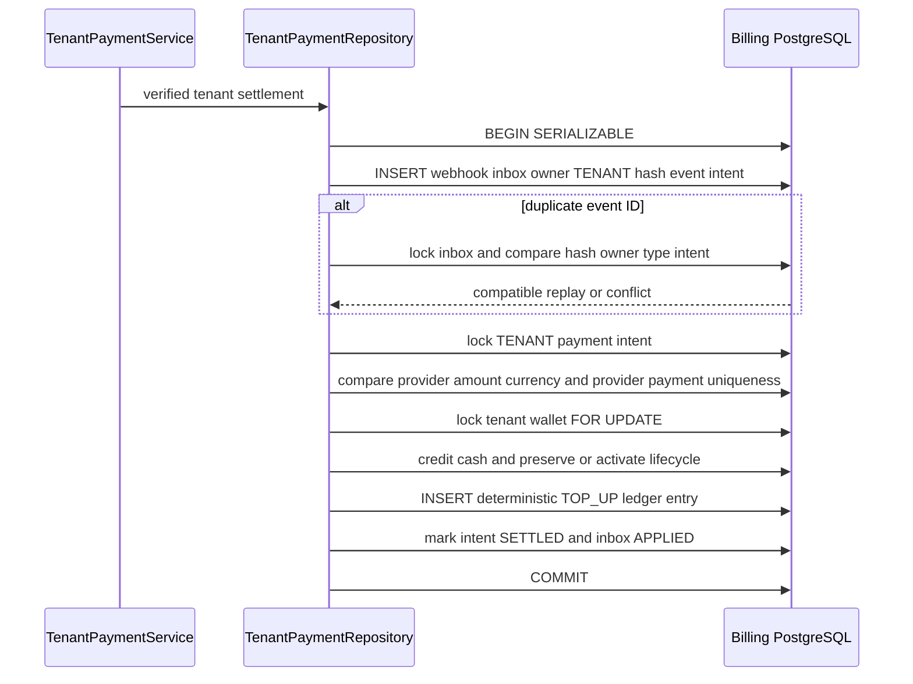
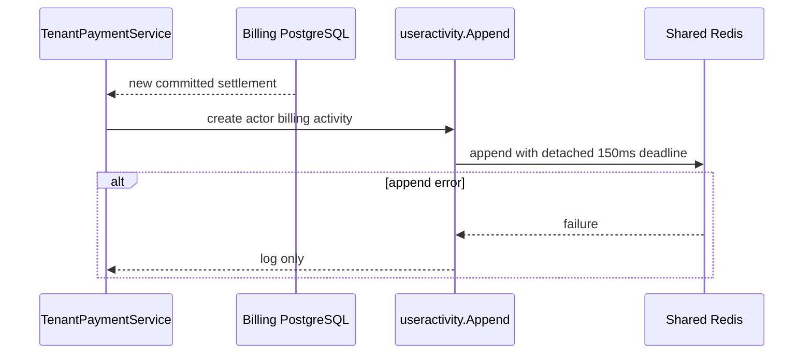

# Tenant Payment Settlement — God View (Master SoT)

This is the only workflow that credits a tenant wallet from a provider payment. A browser checkout return, an Alias session, and tenant authorization cannot settle money. Provider delivery is at-least-once; PostgreSQL records the durable replay decision.

## API-scope contract

This is a provider-owned webhook rather than `/personal`, `/tenant`, or `/me`. It has no browser principal, no ACR owner rewrite, no tenant header authority and no RBAC middleware. The exact Billing Console authority/path public bypass lets the raw message reach Cost; handler HMAC authentication establishes transport authority, and the locked durable TENANT intent derives the owner.

| Boundary | Contract |
|---|---|
| Method/path | `POST /api/v1/billing/webhooks/tenant/payment-settled` |
| ACR authority | Billing Console authority only |
| Required headers | `x-aurora-payment-timestamp`, `x-aurora-payment-signature`, `x-aurora-payment-event-id` |
| JSON body | `payment_intent_id`, `provider_payment_id`, `amount_micro_units`, `currency`, `settled_at` |
| Authentication | raw URL-safe-base64 HMAC-SHA256 of `timestamp + "." + exact raw body` |
| Success | empty successful response for a new apply or compatible replay |

## Phase 1 — Payment provider → Envoy → ACR

ACR still evaluates CORS and pre-auth rate limiting before the configured exact public bypass. It requires Billing Console authority for either payment webhook path, then sends the original method, path, body and provider headers upstream unchanged. It performs no session lookup, CSRF check, alias lookup, proof verification, trusted identity injection or rewrite.

| CheckRequest input | ACR use |
|---|---|
| `:method=POST`, exact path | configured bypass match |
| authority/host | must be Billing Console authority |
| `Origin`, X-Forwarded-For, device cookie | CORS and pre-auth rate gate |
| HMAC headers/body | opaque and forwarded unchanged |
| caller user/tenant/workspace/proof headers | no settlement authority; handler ignores them |

| Edge failure | Result | Durable effect |
|---|---|---|
| wrong authority or non-exact route | ACR local denial | no inbox row |
| CORS/rate rejection | ACR local `4xx`/`429` | no inbox row |
| accepted bypass | handler remains responsible for all payment authentication | none yet |

## Phase 2 — Raw-body HMAC authentication and command construction

`TenantPaymentHandler.ApplySettlement` gives the request an eight-second operation deadline, caps it at 64 KiB, reads raw bytes once, checks timestamp tolerance, event ID length and URL-safe-base64 HMAC in constant time. Only authenticated bytes are JSON-decoded. The handler requires valid non-nil IDs, a positive USD amount, valid settlement timestamp, and calculates `sha256(raw_body)` before sending a canonical `PaymentSettlement` with configured provider and `OwnerTypeTenant` to the service.

| Input | Handler rule |
|---|---|
| body | non-empty, maximum 64 KiB |
| timestamp | parseable and within configured `WebhookTolerance` |
| event ID | non-empty and at most 128 characters |
| HMAC signature | exact timestamp/period/raw-body message with configured provider webhook key |
| JSON | UUID intent and provider-payment IDs, positive amount, USD, valid settled time |

| Result | HTTP effect |
|---|---|
| valid command, transaction applies/replays | success empty response |
| oversized/empty body or malformed settlement | `400` |
| stale/missing timestamp, event ID or HMAC failure | `401` |
| unknown intent | `404`, after durable inbox rejection |
| mismatch/replay conflict/non-creditable wallet | `409` |
| serializable/deadlock conflict | `503`; provider retries unchanged event |

## Phase 3 — Serializable tenant inbox, wallet and ledger settlement

`TenantPaymentRepository` starts a serializable transaction. It inserts the webhook inbox first, locks a duplicate inbox when the event ID already exists, then locks the TENANT intent, checks provider/amount/currency and provider-payment uniqueness, and locks the tenant wallet. On success it credits cash, transitions only PENDING_ACTIVATION to ACTIVE, writes one deterministic TOP_UP ledger entry, marks intent SETTLED and inbox APPLIED, then commits all state together.

| Durable rule | Invariant |
|---|---|
| webhook inbox | unique `(provider, provider_event_id)` fences replay with stored payload hash, TENANT owner type and intent ID |
| duplicate success | only same hash/owner/intent and same settled provider payment is replay success; otherwise conflict |
| intent | must be `owner_type=TENANT` and match provider, amount and currency; a provider payment ID cannot be reused by another intent |
| wallet | locked by ID plus tenant owner/type; CLOSED/invalid lifecycle rejects; PENDING_ACTIVATION becomes ACTIVE; a SUSPENDED wallet accepts paid cash but stays SUSPENDED |
| ledger | deterministic SHA1-derived TOP_UP ID records post-credit balances and avoids a second credit |
| atomicity | inbox, intent, wallet and ledger are one commit or all roll back |
| referral | no personal reservation, grant, redemption or promotional mutation is queried here |

### Rejection, retry and recovery

| Condition | Durable outcome | Retry behavior |
|---|---|---|
| unknown intent, mismatch, provider payment reuse, invalid wallet | explicit inbox `REJECTED` where applicable | provider should not change/repay event; reconcile the durable mismatch |
| serializable/deadlock error | no partial money write | provider retries exact same event ID/body |
| committed compatible duplicate | inbox remains/gets APPLIED, no new ledger | success response prevents retry storm money duplication |
| timeline Redis error | settlement commit remains valid | log only; never ask provider to replay money |

## Phase 4 — Best-effort actor timeline projection

For a new committed result only, `TenantPaymentService` appends a 150 ms detached Shared Redis user-activity event for the verified tenant actor. It carries `billing.wallet.top_up` or `billing.wallet.activate`, resource `tenant_wallet`, provider event operation ID, tenant ID, amount/currency and activation metadata. It is a UX projection and is not the tenant wallet ledger.

## Key contract

| Key/table | Rule |
|---|---|
| `billing.payment_webhook_inbox` | durable at-least-once event/replay fence |
| `billing.payment_intents` | durable tenant owner plus provider settlement binding |
| `billing.wallets` | locked tenant monetary aggregate and lifecycle |
| `billing.wallet_ledger_entries` | immutable deterministic TOP_UP record |
| Shared Redis user activity | best-effort post-commit projection only |

## Code map

[`acr/src/gateway/ext_authz.rs`](../../acr/src/gateway/ext_authz.rs), [`cost-manager/api/internal/transport/http/handler/tenant_payment_handler.go`](../../cost-manager/api/internal/transport/http/handler/tenant_payment_handler.go), [`cost-manager/api/internal/service/tenant_payment_service.go`](../../cost-manager/api/internal/service/tenant_payment_service.go), and [`cost-manager/api/internal/repository/tenant_payment_repo.go`](../../cost-manager/api/internal/repository/tenant_payment_repo.go).
