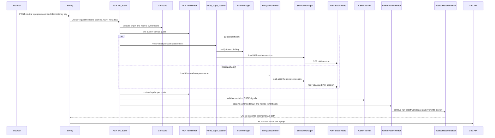
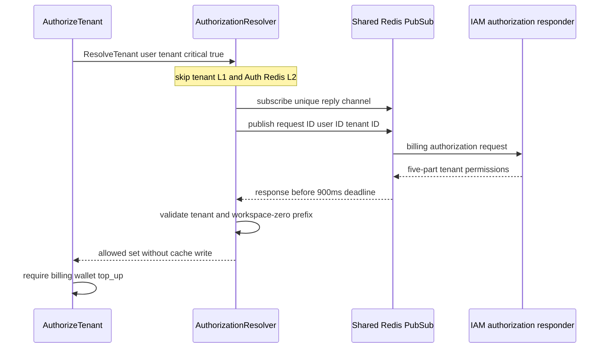
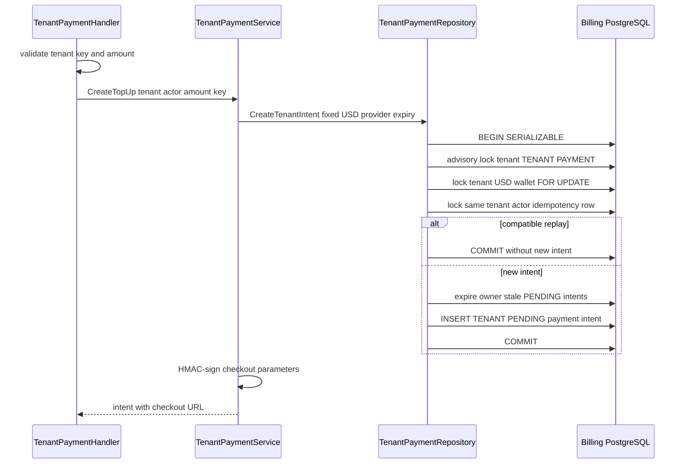

# Tenant Top-up Intent Create — God View (Master SoT)

This creates or replays one PENDING checkout intent for the active tenant. It does not credit money, activate the wallet, or treat a checkout redirect as settlement; only the tenant provider-webhook workflow can do that.

## API-scope contract

The browser calls a neutral route, but this is a `/tenant` financial mutation. ACR derives the concrete tenant from verified Cloud Trinity context or a verified Billing Alias/source IAM session, applies CSRF, rewrites to `/tenant`, and overwrites all trusted identity headers. Cost obtains a **fresh** IAM tenant permission (`critical=true`) and the repository repeats tenant ownership under a serializable transaction.

| Boundary | Contract |
|---|---|
| Browser method/path | `POST /api/v1/billing/wallet/top-ups` |
| Browser headers used | `Origin`, Cloud Trinity cookies on Cloud authority or Billing Alias cookies on Cost authority, `idempotency-key` |
| Browser JSON payload | `{ "amount_micro_units": "<integer>" }` |
| ACR upstream path | `POST /api/v1/tenant/billing/wallet/top-ups` |
| Permission | `billing:wallet:top_up` on active tenant/workspace-zero authority |
| Success | `201` new PENDING intent, or `200` compatible idempotency replay with checkout URL |

## Discrepancy requiring security-contract decision

The old document claimed this workflow requires a one-time Billing session proof. The current code does **not** implement that claim: `acr/src/gateway/ext_authz.rs` verifies a Billing proof only for paths beginning `/api/v1/billing/critical/`, while this neutral route is `/api/v1/billing/wallet/top-ups`; `route.go` applies `AuthorizeTenant(..., critical=true)` but not `RequireSessionProof()`. Therefore the AS-IS contract below is fresh authorization plus CSRF, **not** proof-of-possession. This must be decided before this document can state that a proof protects top-up creation:

1. make the route a critical ACR route and add `RequireSessionProof`, or
2. formally keep this mutation CSRF + fresh-IAM-authorized only.

No code is changed by this documentation reconciliation.

## Phase 1 — Client → Envoy → ACR

ACR evaluates CORS and pre-auth IP/device quota, validates Cloud Trinity context on Cloud authority or Billing Alias secret/source IAM session on Cost authority, then applies post-auth quota and the state-changing CSRF check. For a concrete verified tenant it rewrites the neutral owner route to the tenant internal route. Raw proof/workspace headers are removed and client identity/tenant headers are overwritten; the forward includes only verified context and `x-session-proof-verified: false` under the current route contract.

| CheckRequest input | ACR use |
|---|---|
| `:method=POST`, `:path`, `Origin` | CORS and neutral owner-route matching |
| X-Forwarded-For/device cookie | pre-auth quota |
| Cloud Trinity or Billing Alias ID/secret cookies | Cloud session check or Cost Alias lookup, secret compare and source IAM-session recheck |
| CSRF headers/cookie | mutation CSRF validation after authenticated session |
| `idempotency-key` | forwarded to handler; not an ACR identity value |
| caller user/tenant/workspace/proof headers | untrusted and removed/overwritten |

| ACR forward | Value |
|---|---|
| rewritten `:path` | `/api/v1/tenant/billing/wallet/top-ups` |
| Cloud-authority injected headers | verified `x-user-id`, `x-user-name`, `x-user-level`, `x-zone-id`, concrete `x-tenant-id`, `x-client-device-id`, `x-session-proof-verified: false`, `x-original-path`, plus `x-workspace-id` only from verified `workspace_id` cookie |
| Cost-authority injected headers | Alias `x-user-id`, `x-user-name`, `x-zone-id`, concrete `x-tenant-id`, `x-session-proof-verified: false`, `x-original-path`; no level/device/workspace header |
| no forward | CORS/rate/session/CSRF failure, platform tenant, direct internal route |

### Phase-1 failure boundary

| Condition | Result | Durable effect |
|---|---|---|
| invalid/revoked Alias or source session | local `401` | none |
| CORS/CSRF rejection or quota limit | local `4xx`/`429` | none |
| no concrete tenant | no tenant rewrite | none |
| raw session-proof header present | removed; it is not verified on this path | none |

## Phase 2 — Fresh scoped tenant authorization

`ContextInjector` supplies ACR-authenticated user and tenant. `AuthorizeTenant(\"billing:wallet:top_up\", true)` calls `ResolveTenant` with `critical=true`, which bypasses both the 2-second tenant L1 and 5-second Auth Redis L2. It subscribes before publishing a 48-byte user/tenant request to IAM, waits at most 900 ms, validates the exact tenant/workspace-zero five-part permission, and does not cache the critical result.

| Authorization outcome | HTTP effect |
|---|---|
| exact permission present | handler executes |
| absent/malformed permission or stale membership | `403` |
| IAM or Redis unavailable, no responder, timeout | `503`; no intent transaction |

## Phase 3 — Idempotent tenant intent transaction and checkout construction

The handler enforces a non-empty `idempotency-key` of at most 128 characters, parses the integer string, and requires the configured USD minimum. The service fixes currency/provider from policy and gives the intent the configured TTL. The repository serializes each tenant payment branch with an advisory lock, locks the tenant USD wallet, checks compatible idempotent replay before expiring stale PENDING intents, and commits a new PENDING intent. Only after that durable commit does the service attach a signed checkout URL to the response.

| Input | Rule |
|---|---|
| trusted user/tenant | actor is verified user; owner is verified tenant |
| `idempotency-key` | scoped durably by tenant + actor + key |
| amount | base-10 `int64`, at least configured USD minimum |
| policy | fixed provider, `USD`, intent TTL; browser cannot select either |

| Durable/result condition | HTTP result | Settlement effect |
|---|---|---|
| active or pending-activation tenant wallet and new key | `201` PENDING intent | none yet |
| same tenant/actor/key and same amount/currency/provider | `200` replay | none |
| same key with changed payment fields | `409` idempotency conflict | none |
| wallet absent/invalid state | `404`/mapped conflict | none |
| serializable/deadlock/repository error | `503` | transaction rolls back; browser repeats same key |

The checkout signature covers `aurora.checkout.v1`, intent ID, owner type `TENANT`, amount, currency, expiry UNIX time and return URL. The return URL only carries `payment_intent_id`; it remains a browser navigation and cannot settle the intent.

## Key contract

| Key/table | Rule |
|---|---|
| Cloud Trinity session or `iam:domain_alias:billing:{alias_id}` | ACR source of verified active tenant; Cost Alias rechecks source IAM session |
| tenant authorization L1/L2 | bypassed for this critical authorization request |
| `billing.wallets` | locked tenant USD aggregate; owner/type fence must match |
| `billing.payment_intents` | PENDING intent fenced by tenant, actor and idempotency key |
| provider webhook inbox/ledger | intentionally untouched here; settlement owns crediting |

## Code map

[`acr/src/gateway/ext_authz.rs`](../../acr/src/gateway/ext_authz.rs), [`cost-manager/api/internal/app/route.go`](../../cost-manager/api/internal/app/route.go), [`cost-manager/api/internal/transport/middleware/identity.go`](../../cost-manager/api/internal/transport/middleware/identity.go), [`cost-manager/api/internal/service/authorization_resolver.go`](../../cost-manager/api/internal/service/authorization_resolver.go), [`cost-manager/api/internal/service/tenant_payment_service.go`](../../cost-manager/api/internal/service/tenant_payment_service.go), and [`cost-manager/api/internal/repository/tenant_payment_repo.go`](../../cost-manager/api/internal/repository/tenant_payment_repo.go).
