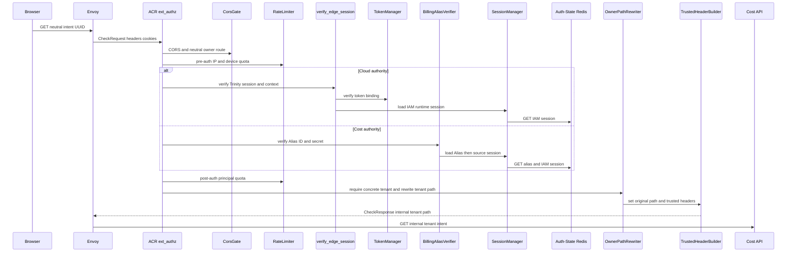
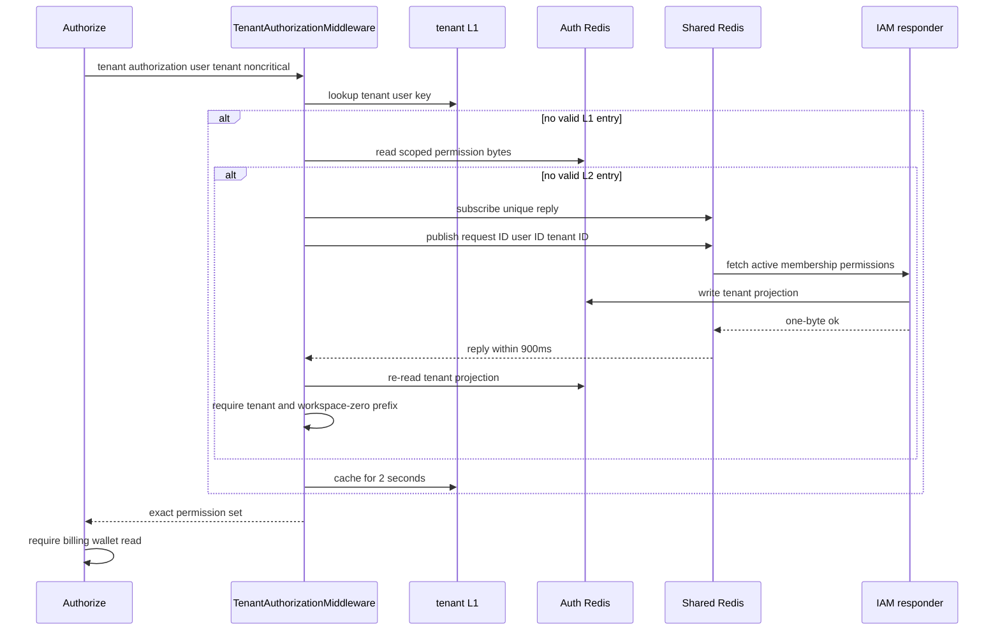
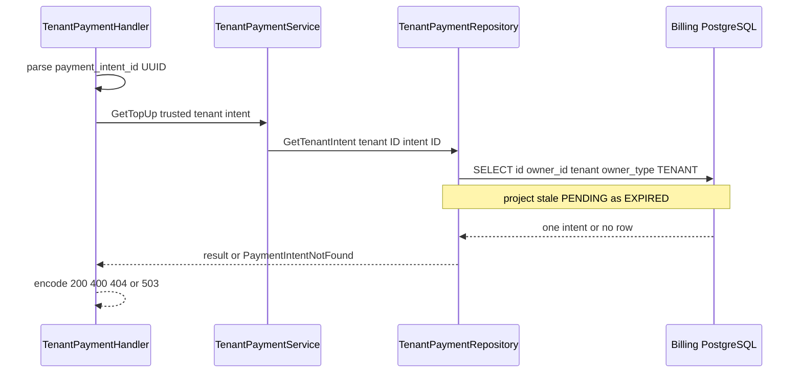

# Tenant Top-up Intent Read — God View (Master SoT)

This reads one checkout intent in the active tenant. It intentionally hides whether a UUID belongs to another tenant and never lets a checkout return page settle the intent.

## API-scope contract

The browser uses a neutral route, while ACR derives a concrete `/tenant` owner from verified Cloud Trinity context or a verified Billing Alias/source IAM session and rewrites the path. Cost checks `billing:wallet:read` against that exact tenant before querying; the repository repeats the tenant/TENANT durable ownership predicate.

| Boundary | Contract |
|---|---|
| Browser method/path | `GET /api/v1/billing/wallet/top-ups/{payment_intent_id}` |
| Browser headers used | `Origin`; Cloud Trinity cookies on Cloud authority or Billing Alias ID/secret cookies on Cost authority |
| Browser payload | UUID path parameter only |
| ACR upstream path | `/api/v1/tenant/billing/wallet/top-ups/{payment_intent_id}` |
| Permission | `billing:wallet:read` on verified tenant/workspace-zero scope |
| Success | `200` only for a matching tenant intent |

## Phase 1 — Client → Envoy → ACR

ACR runs CORS, pre-auth IP/device quota, then Cloud Trinity verification on Cloud authority or Billing Alias secret/source-session verification on Cost authority, and post-auth quota. It accepts GET without CSRF mutation proof, requires verified context to carry a concrete tenant, and overwrites all identity context before the tenant rewrite. Client `x-tenant-id`/workspace/proof fields cannot choose scope.

| CheckRequest input | ACR use |
|---|---|
| method/path/Origin | CORS and neutral Billing route selection |
| X-Forwarded-For/device cookie | pre-auth rate key |
| Cloud Trinity or Billing Alias cookies | Cloud verified user/zone/concrete tenant or Cost Alias/session recheck |
| client identity/tenant/workspace/proof headers | raw proof/workspace removed; identity/tenant overwritten as spoofed |

| Allow forward | Value |
|---|---|
| `:path` | `/api/v1/tenant/billing/wallet/top-ups/{payment_intent_id}` |
| Cloud-authority injected headers | verified `x-user-id`, `x-user-name`, `x-user-level`, `x-zone-id`, `x-tenant-id`, `x-client-device-id`, `x-session-proof-verified: false`, `x-original-path`, plus `x-workspace-id` only from verified `workspace_id` cookie |
| Cost-authority injected headers | Alias `x-user-id`, `x-user-name`, `x-zone-id`, `x-tenant-id`, `x-session-proof-verified: false`, `x-original-path`; no level/device/workspace header |
| denied locally | CORS/rate/session error, platform tenant, or direct internal owner route |

## Phase 2 — Tenant permission resolution

ContextInjector exposes only ACR-injected user and tenant. The tenant authorization middleware uses its two-second L1 then five-second shared Auth Redis projection. A miss is subscribe-before-publish; IAM refills that projection and replies one-byte ok, then Cost re-reads and validates it.

| Failure | Result | Durable effect |
|---|---|---|
| role/membership permission absent | `403` | no query |
| IAM/Auth Redis/Shared Redis failure | `503` | no query |
| authorization invalidation | L1 entries for changed user are removed | later reads reload current authority |

## Phase 3 — Owner-fenced intent projection

The handler parses a non-nil UUID within its three-second operation deadline and calls `TenantPaymentService.GetTopUp`. `TenantPaymentRepository.GetTenantIntent` selects by intent ID plus trusted tenant and `owner_type='TENANT'`; it projects an elapsed PENDING row as `EXPIRED` without mutating it. There is no provider status fetch, checkout refresh, wallet update or ledger mutation.

| Result | Response | Durable effect |
|---|---|---|
| matching tenant intent | `200` ID, actor, amount/currency, provider, status, activation flag, expiry/settlement and checkout fields | none |
| malformed UUID | `400` | none |
| absent or other-tenant intent | `404` | none |
| database error/deadline | `503` | none |

## Key contract

| Key/table | Rule |
|---|---|
| Cloud Trinity session or `iam:domain_alias:billing:{alias_id}` | verified active tenant source at edge; Cost Alias rechecks source IAM session |
| scoped tenant auth projections | performance-only; exact tenant/workspace-zero parse fence |
| `billing.payment_intents` | durable intent status with `(id, owner_id, owner_type=TENANT)` read fence |
| `billing.payment_webhook_inbox`, `wallets`, ledger | settlement workflow owns them; this read never writes |

## Code map

[`acr/src/gateway/ext_authz.rs`](../../acr/src/gateway/ext_authz.rs), [`cost-manager/api/internal/transport/middleware/tenant_authorization.go`](../../cost-manager/api/internal/transport/middleware/tenant_authorization.go), and [`cost-manager/api/internal/repository/tenant_payment_repo.go`](../../cost-manager/api/internal/repository/tenant_payment_repo.go).
