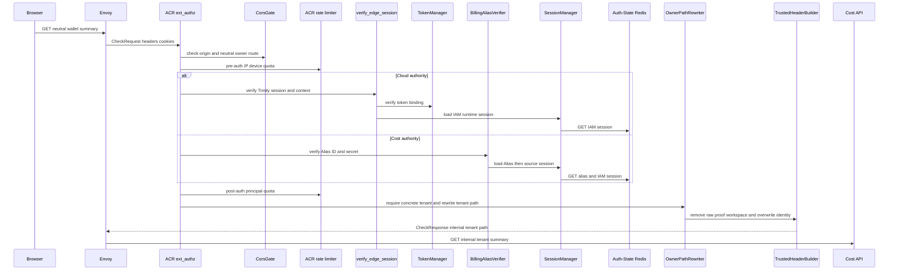
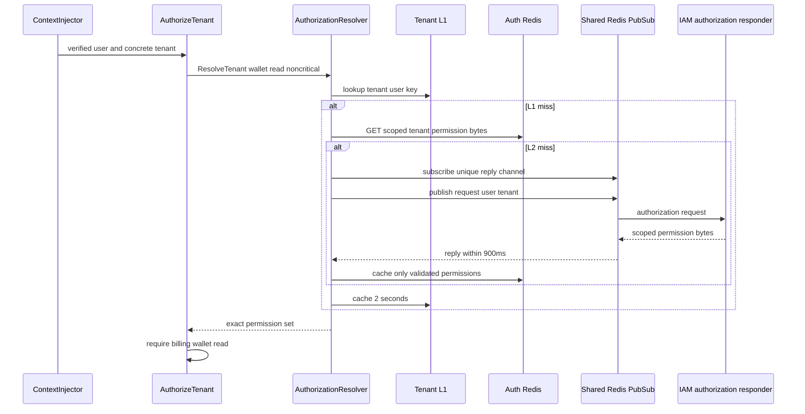
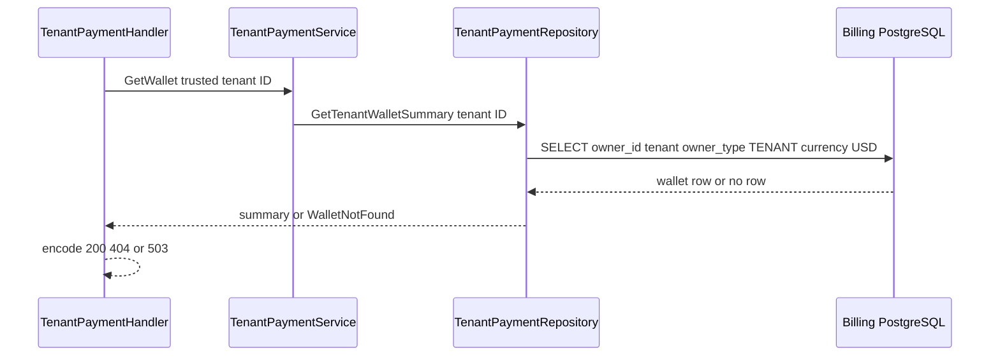

# Tenant Wallet Summary — God View (Master SoT)

This workflow reads the USD wallet owned by the active verified tenant. It never accepts a user-selected tenant or falls back to the caller's personal wallet.

## API-scope contract

The browser calls a neutral route, but this is a `/tenant` workflow. ACR derives the active tenant membership from a verified Billing Alias/source IAM session and rewrites to the tenant owner path. Cost authorizes the exact tenant-scoped permission and the repository queries the durable `(owner_id, owner_type=TENANT, currency=USD)` fence.

| Boundary | Contract |
|---|---|
| Browser method/path | `GET /api/v1/billing/wallet/summary` |
| Browser headers used | `Origin`; Cloud Trinity cookies on Cloud authority or Billing Alias ID/secret cookies on Cost authority |
| Browser payload | none |
| ACR upstream path | `GET /api/v1/tenant/billing/wallet/summary` |
| Permission | `billing:wallet:read` scoped to `{tenant_id}:00000000-0000-0000-0000-000000000000` |
| Success | `200` USD wallet summary for active tenant only |

## Phase 1 — Client → Envoy → ACR

ACR runs CORS, pre-auth IP/device rate limiting, then Cloud Trinity verification on Cloud authority or Billing Alias secret/source IAM-session verification on Cost authority, and post-auth quota. The verified tenant must be concrete; it chooses `/tenant`, not an HTTP tenant header or cookie supplied by the browser. GET has no CSRF mutation gate and no session proof requirement.

| CheckRequest input | ACR use |
|---|---|
| method/path/Origin | CORS and neutral Billing GET route matching |
| X-Forwarded-For and device cookie | pre-auth rate limiting |
| Cloud Trinity or Billing Alias cookies | Cloud session claims or Cost alias secret compare retrieve verified user, zone and tenant; Cost rechecks source session |
| client `x-user-id`, `x-tenant-id`, `x-zone-id`, `x-workspace-id`, proof headers | removed as untrusted |

| ACR forward | Rule |
|---|---|
| `:path` | rewrite to `/api/v1/tenant/billing/wallet/summary` and set `x-original-path` |
| Cloud-authority injected headers | `x-user-id`, `x-user-name`, `x-user-level`, `x-zone-id`, concrete `x-tenant-id`, `x-client-device-id`, `x-session-proof-verified: false`, `x-original-path`, plus `x-workspace-id` only from verified `workspace_id` cookie |
| Cost-authority injected headers | Alias `x-user-id`, `x-user-name`, `x-zone-id`, concrete `x-tenant-id`, `x-session-proof-verified: false`, `x-original-path`; no level/device/workspace header |
| denied locally | missing/revoked Alias/source session, platform tenant, CORS/rate error, direct internal path |

## Phase 2 — Tenant authorization with revocation-aware projection

`ContextInjector` makes the ACR-injected user and tenant available. `AuthorizeTenant` calls `AuthorizationResolver.ResolveTenant(user, tenant, critical=false)` and requires the exact five-part Billing permission. A normal cache hit is an optimization bounded by 2 seconds in process or 5 seconds in Auth Redis; any cache miss asks IAM over Shared Redis and validates that every returned permission has the requested tenant and workspace-zero prefix. User invalidation messages evict all matching tenant L1 entries.

| Layer | Exact behavior |
|---|---|
| tenant L1 | key `{tenant_id}:{user_id}`, 2-second TTL; process-local only |
| tenant L2 | `authz:billing:tenant:{{tenant_id}}:{user_id}:data`, 5-second TTL; bytes parsed as five-part tenant permissions |
| IAM request | subscribe to unique `iam.authorization.billing.reply.{request_id}` before publishing 48-byte request ID/user ID/tenant ID to `iam.authorization.billing.get` |
| reply | 900 ms deadline; must start success marker and contain only `tenant:workspace-zero:billing:resource:action` permissions for active tenant |
| invalidation | Shared Redis `authz.invalidate.billing` removes user L1 and every tenant L1 suffix for that user; IAM/Auth Redis are correctness authority |

### Authorization failure/recovery

| Condition | Result | Recovery |
|---|---|---|
| permission absent, malformed IAM reply, inactive membership | `403`; handler never runs | membership/role mutation must be corrected then authorization re-resolved |
| Auth/Shared Redis or IAM unavailable, timeout | `503` | retry read; no wallet operation was attempted |
| L1 invalidation lost | bounded L1 TTL; durable/IAM path on refresh | permission mutation publishes invalidation and fences its authoritative projection |

## Phase 3 — Owner-fenced wallet read

Only after middleware success, `TenantPaymentHandler.GetWallet` reads the trusted tenant context under its handler deadline, calls `TenantPaymentService.GetWallet`, and `TenantPaymentRepository.GetTenantWalletSummary` selects one USD wallet with both tenant owner and TENANT owner type. The handler cannot name a different tenant; a missing wallet is a truthful `404`, not a personal fallback or implicit provision.

| Result | Response | Durable effect |
|---|---|---|
| wallet exists | `200` ID, USD cash/promotional/overdraft balances, lifecycle status, version, updated time | none |
| no matching tenant USD wallet | `404` | none |
| database error/deadline | `503` | none |

## Key contract

| Key/table | Owner and rule |
|---|---|
| Cloud Trinity session or `iam:domain_alias:billing:{alias_id}` | ACR establishes active tenant, never the browser; Cost Alias rechecks source session |
| `authz:billing:tenant:{{tenant_id}}:{user_id}:data` | short-lived validated authorization projection only |
| `iam.authorization.billing.get` / reply channel | IAM request/reply correctness path on cache miss |
| `billing.wallets` | durable owner/type/currency wallet fence |

## Code map

[`acr/src/gateway/ext_authz.rs`](../../acr/src/gateway/ext_authz.rs), [`cost-manager/api/internal/transport/middleware/identity.go`](../../cost-manager/api/internal/transport/middleware/identity.go), [`cost-manager/api/internal/service/authorization_resolver.go`](../../cost-manager/api/internal/service/authorization_resolver.go), and [`cost-manager/api/internal/repository/tenant_payment_repo.go`](../../cost-manager/api/internal/repository/tenant_payment_repo.go).
