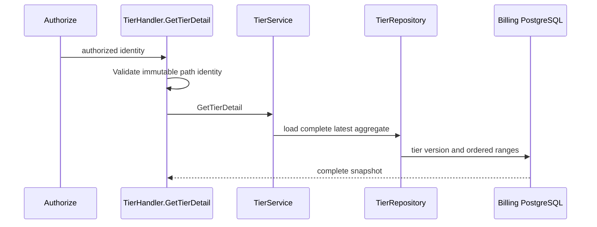
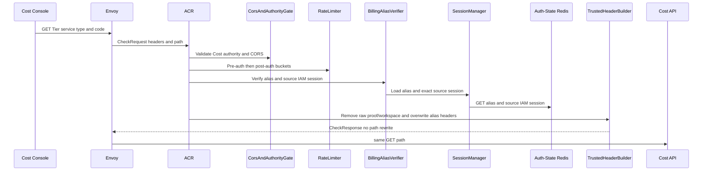
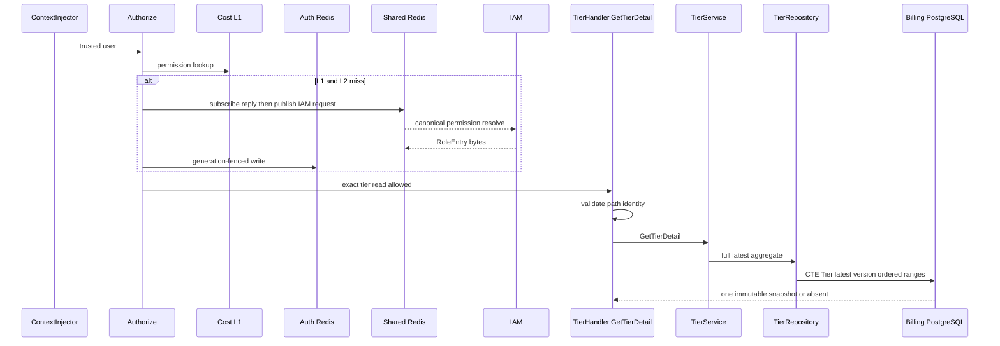

# Billing Tier Detail — God View (Master SoT)

This operator read returns one Tier and its complete latest immutable pricing
aggregate for edit. It is not interchangeable with the paginated list.

## Phase 1 — Client → Envoy → ACR

| Part | Contract |
|---|---|
| Method/path | `GET /api/v1/billing/tiers/{service_type}/{code}` |
| Headers used | Cost Billing Alias cookies and `Origin`; Cloud authority is denied for this operator route |
| Payload | path `service_type` and canonical Tier `code` |
| ACR output | verifies identity, removes raw proof/workspace headers, overwrites client identity, and forwards same public path |
| Failure | identity failure `401`; direct internal owner path never reaches API |

## Phase 2 — Cost API aggregate read

`Authorize(billing:tier:read)` precedes `TierHandler.GetTierDetail`. Handler
allowlists service type and code; service/repository loads Tier plus all sorted
ranges of the latest version. A missing Tier returns `404`; no handler may build
the edit aggregate from the list projection.

## Complete edge and Cost execution

### Client input, CheckRequest and ACR forward

Only Cost authority may call this operator path. `CheckRequest` carries GET method, public path, alias cookies and no body.

| Input | Component | Contract |
|---|---|---|
| `Origin` | ACR CORS gate | allowed origin before authentication |
| Envoy IP and optional device cookie | ACR pre-auth limiter | bounded before alias lookup |
| Billing alias cookies | `verify_billing_alias` | UUID alias, hashed secret, live referenced IAM session and matching source proof key |
| `service_type`, `code` path | Tier handler | service type allowlist; code `^[A-Z][A-Z0-9_]{0,63}$` |
| identity/permission/proof/workspace headers | ACR | raw proof/workspace removed and identity overwritten; client copies cannot affect actor or result |

ACR applies CORS, pre-auth rate limiting, alias/source-session verification, post-auth rate limit and GET CSRF pass. It preserves this public operator path, removes raw proof/workspace input, sets trusted `x-user-id`, `x-user-name`, `x-zone-id`, `x-tenant-id`, `x-session-proof-verified=false`, and sets no `x-original-path`. It never forwards alias secret, source access key, role, level or permission snapshot.

### Cost authorization and full aggregate read

`ContextInjector` parses verified UUID headers. `Authorize(billing:tier:read)` uses normal resolver behavior: five-second L1, generation-equal Auth-State L2, or subscribe-before-publish Shared Redis IAM request with 900ms deadline, two-second refresh lock and Lua generation-fenced write. It returns `503` rather than authorize stale/unknown permission.

`TierHandler.GetTierDetail` validates both path fields and calls service. Service trims code; repository executes a single CTE: selects Tier by composite identity, selects its highest non-cancelled version, joins every range ordered by `range_start`, and builds one `TierDetail`. This is one immutable aggregate; pagination/list rows are not consulted. Missing Tier/latest version is `404`.

| Result | Headers | Payload | Side effect |
|---|---|---|---|
| `200` | JSON envelope | Tier identity/metadata and complete latest version/ranges/checksum | none |
| `400` | JSON | invalid service type/code | none |
| `401/403/429` | edge or authorization denial | no aggregate | none |
| `404` | JSON | Tier absent | none |
| `500/503` | JSON | database/resolver unavailable | none |

## Failure, cache and recovery semantics

Read retries are side-effect free. IAM invalidation removes L1 and prevents an in-flight resolver from installing old L2 bytes through generation comparison. Tier version history is never reconstructed from cache: a database failure remains an error, and a concurrent new version is observed only as the next complete aggregate.

## Key contract

Tier/range UUIDs in the response are historic read identifiers only; publish
never accepts old range IDs for mutation. Billing DB is SoT; no L1 pricing
snapshot authorizes the edit view.

## Code map

[`cost-manager/api/internal/transport/http/handler/tier_handler.go`](../../cost-manager/api/internal/transport/http/handler/tier_handler.go).
