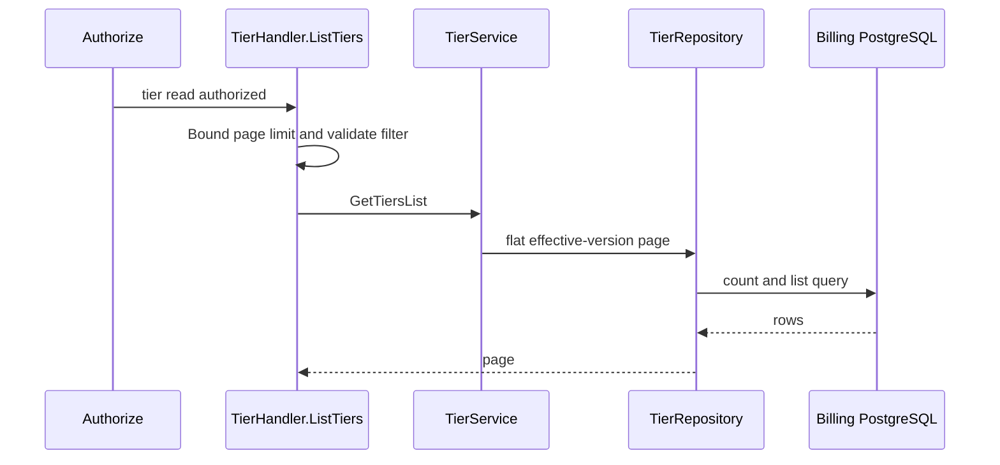
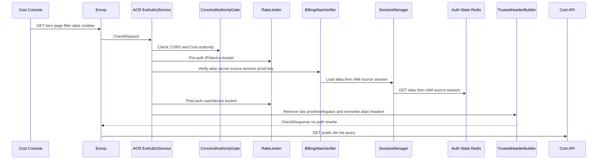
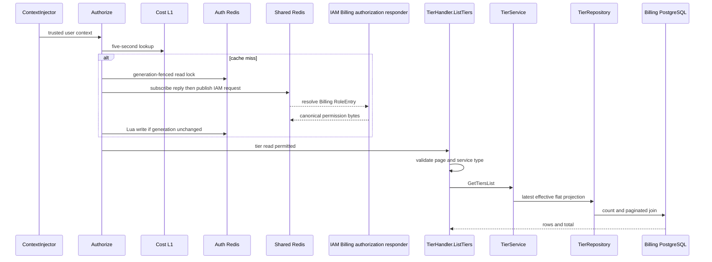

# Billing Tier List — God View (Master SoT)

This operator read returns paginated Tier metadata and effective-version rows.
It is distinct from the full immutable aggregate required for edit.

## Phase 1 — Client → Envoy → ACR

| Part | Contract |
|---|---|
| Method/path | `GET /api/v1/billing/tiers?page&limit&service_type&search` |
| Headers used | Cost Billing Alias cookies and `Origin`; Cloud authority is denied for this operator route |
| Payload | bounded query only |
| ACR output | alias/Trinity verification; inject trusted identity/routing headers; preserves path |
| Failure | identity failure `401`; no owner rewrite and no Cost call |

## Phase 2 — Cost API list

Gin `Authorize(billing:tier:read)` resolves exact permission. `TierHandler.ListTiers`
normalizes pagination and `service_type`; `TierService.GetTiersList` asks the
repository for the flat display projection. It does not select ranges as a
write aggregate and does not change pricing cache.

## Complete edge and Cost execution

### Client input, CheckRequest and ACR forward

The route is Cost-authority operator surface. ACR rejects it on Cloud authority; the browser sends only GET query and Billing Alias cookies.

| Request part | ACR/handler use | Rule |
|---|---|---|
| `Origin` | CORS gate | checked before alias/session state |
| `X-Forwarded-For`, `client_device_id` cookie | pre-auth limiter | IP and optional device bucket |
| Billing alias ID/secret cookies | alias verifier | hash comparison and source IAM session/proof-key recheck |
| `page`, `limit`, `service_type`, `search` | `TierHandler.ListTiers` | bounded page/limit; service type allowlist; search remains query filter |
| client identity, role, permission, proof, workspace headers | ACR | raw proof/workspace removed and identity overwritten; never authorization input |

After CORS/pre-auth check, ACR verifies Billing Alias, charges post-auth user/device rate limits and keeps exact public path/query. GET needs no CSRF or critical proof. ACR removes raw proof/workspace headers and overwrites `x-user-id`, `x-user-name`, `x-zone-id`, `x-tenant-id`, `x-session-proof-verified=false`; no `x-original-path` is emitted and no alias secret/access key/permission header crosses Envoy.

### Cost middleware, handler, service and repository

`ContextInjector` accepts only ACR UUID identity. `Authorize` requires exact `billing:tier:read`. Normal resolution first checks five-second Cost L1; then validates Auth-State Redis `data`, `generation` and `data_generation` as one fence. A miss elects a two-second lock owner; it subscribes before publishing a 16-byte request UUID plus user UUID to IAM Shared Redis, waits 900 milliseconds, validates protobuf RoleEntry values, and writes L2 only under unchanged generation. Lock waiters jitter; resolver errors return `503`.

`TierHandler.ListTiers` default-bounds page/limit, validates optional service type, and calls `TierService.GetTiersList`. `TierRepository.ListTiers` executes a count and flat query that join each Tier's latest currently-effective, non-cancelled version and its ranges. The flat list is display-only and must not be used as complete edit aggregate.

| Result | Response headers | Payload | Side effect |
|---|---|---|---|
| `200` | Cost API JSON envelope | flat Tier/range rows, page metadata, total | none |
| `400` | JSON | invalid page/filter/service type | none |
| `401/403/429` | ACR or Cost denial | no Tier data | none |
| `500/503` | JSON | dependency/resolver failure | none |

## Failure, cache and recovery semantics

IAM invalidation increments generation and removes authoritative L2 projection before publishing Cost L1 invalidation; L1 is only a bounded stale window. Query retries cannot change pricing history. Database reads use current effective-time SQL; a version becoming effective between two requests creates a new read snapshot, not an inconsistent partial row set.

## Key contract

`authz:billing:{user_id}:*` is an Auth-State Redis cache/projection fence, not
a Tier authority. `billing.tiers` and immutable `tier_versions` remain durable
SoT. Invalid query is `400`; missing permission `403`; database failure `500`.

## Code map

[`cost-manager/api/internal/transport/http/handler/tier_handler.go`](../../cost-manager/api/internal/transport/http/handler/tier_handler.go).
