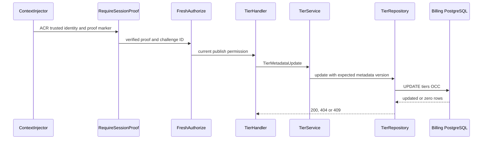
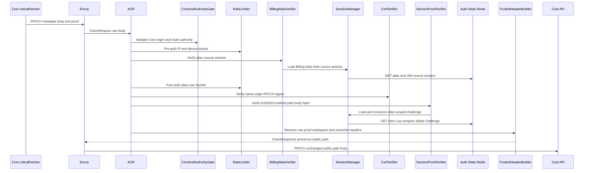
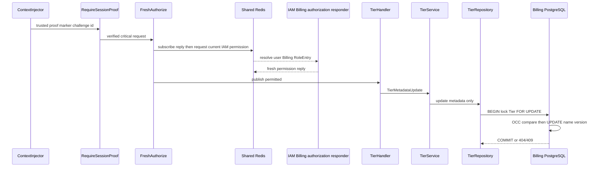

# Billing Tier Metadata Update — God View (Master SoT)

This critical operator mutation changes only a Tier display name using metadata OCC. It never publishes a price, changes a range, or wakes Cost Engine.

## Phase 1 — Client → Envoy → ACR

| Part | Contract |
|---|---|
| Method/path | `PATCH /api/v1/billing/critical/tiers/{service_type}/{code}/metadata` |
| Headers used | Cost Billing Alias cookies plus proof challenge ID, timestamp, Ed25519 signature |
| JSON payload | `name`, `metadata_version` |
| ACR output | verifies identity and Cost proof over exact PATCH/path/body; consumes nonce; injects identity and `x-session-proof-verified=true` |
| Failure | proof replay/mismatch `403`; no API forward |

## Phase 2 — Cost API OCC update

`RequireSessionProof` and fresh `Authorize(billing:tier:publish)` fail before `TierHandler.UpdateTierMetadata`. Handler validates path/body; service updates only if service type, code and metadata version match. Zero affected rows becomes `404` or `409`; commit changes only Tier name and `metadata_version`.

## Complete edge and Cost execution

### Client input, CheckRequest and trusted forward

This critical operator route is Cost-authority only. Cost critical fetcher obtains an alias-bound challenge, serializes JSON once, hashes exact wire body and signs the public query-free path.

| Input | ACR/Cost use | Rule |
|---|---|---|
| `Origin`, Envoy IP, device cookie | CORS and pre/post rate limits | checked before forward |
| Billing alias cookies | alias verifier | secret hash and live source IAM session/proof key |
| `X-Requested-With` or `Sec-Fetch-Site` | ACR CSRF | required for PATCH |
| proof ID/timestamp/signature | ACR proof verifier | at most 60s skew; binds PATCH, public path and SHA-256 raw body |
| JSON `name`, `metadata_version` | handler | trimmed name 1-128; positive version |
| path service type/code | handler | canonical immutable Tier identity |

After alias verification and post-auth rate limit, ACR consumes proof only after signature success. It removes raw proof/workspace headers and overwrites client identity headers; it forwards unchanged method/path/body with ACR-overwritten `x-user-id`, `x-user-name`, `x-zone-id`, `x-tenant-id`, `x-session-proof-verified=true` and verified challenge ID. There is no owner rewrite or `x-original-path`.

### Fresh authorization and metadata transaction

`ContextInjector` parses only ACR context. `RequireSessionProof` requires marker and UUID challenge header. Critical `Authorize` bypasses Cost L1 and Auth-State L2 data hits: it subscribes before publishing request UUID/user UUID to IAM Shared Redis, validates reply, and uses generation lock/fence only to protect concurrent refresh. IAM/resolver error is `503`; missing exact `billing:tier:publish` is `403`.

Handler validates path/body. Service trims values. Repository begins transaction, locks Tier identity `FOR UPDATE`, distinguishes absent Tier from version mismatch, updates only name and metadata version, then commits. It never reads/writes Tier version/range/pricing-outbox rows.

| Result | Response | Durable state |
|---|---|---|
| `200` | updated metadata version/name | one Tier row commit |
| `400` | invalid path/body | none |
| `401/403/429` | edge/proof/permission/rate denial | none |
| `404` | composite Tier absent | none |
| `409` | metadata version stale | none |
| `500/503` | transaction/resolver unavailable | no partial update |

## Failure, replay and recovery semantics

Proof replay fails at ACR before authorization; network retry needs a new challenge/signature. An ACR proof consume followed by Cost failure is not automatically retried because proof is burned. Database rollback leaves no metadata change. Retry after unknown response must use current metadata version, so OCC is durable concurrency fence.

## Key contract

The proof key is `iam:session_proof:critical:{billing_alias_id}:{challenge_id}` in Auth-State Redis (`EX 60`, consume once). ACR passes verified Billing alias ID to the proof verifier; source IAM-session validity is separately rechecked through the alias. Tier metadata is durable in `billing.tiers`; there is deliberately no pricing outbox record for this API.

## Code map

[`cost-manager/api/internal/transport/http/handler/tier_handler.go`](../../cost-manager/api/internal/transport/http/handler/tier_handler.go), [`cost-manager/api/internal/service/tier_service.go`](../../cost-manager/api/internal/service/tier_service.go).
