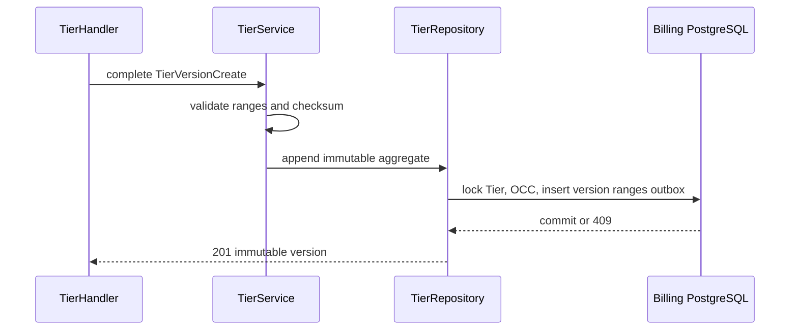
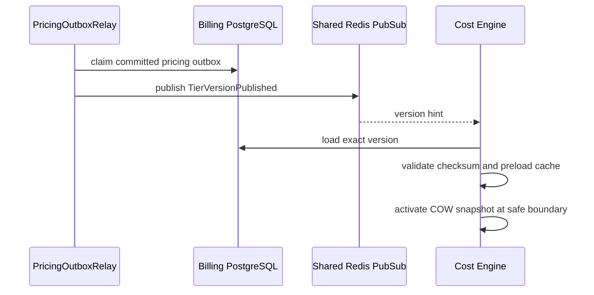
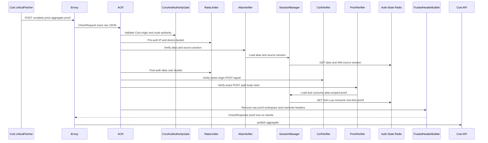
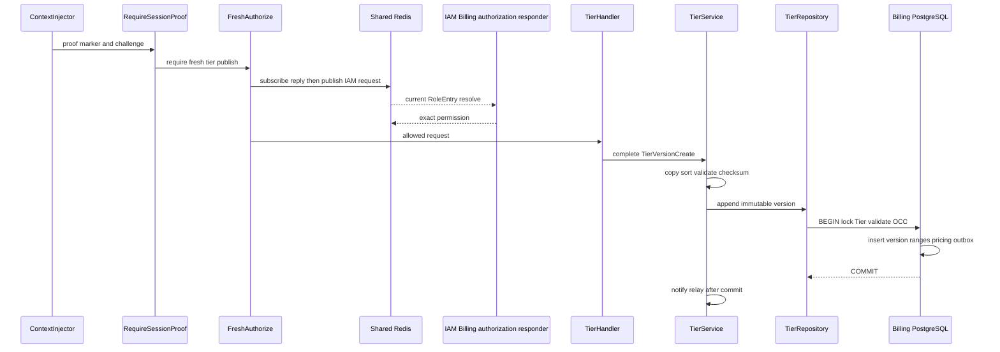
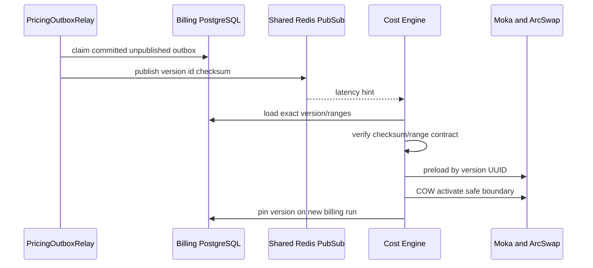

# Billing Tier Version Publish — God View (Master SoT)

This critical operator workflow appends one complete immutable pricing version, then safely delivers it to Cost Engine. It never modifies old ranges.

## Phase 1 — Client → Envoy → ACR

| Part | Contract |
|---|---|
| Method/path | `POST /api/v1/billing/critical/tiers/{service_type}/{code}/versions` |
| Headers used | Cost Billing Alias cookies and exact Cost proof headers; Cloud authority is denied for this operator route |
| JSON payload | `expected_latest_version`, `effective_from`, `change_reason`, full `ranges[]` |
| ACR output | consumes verified proof and injects trusted identity/proof marker; keeps public path |
| Failure | identity/proof failure before Cost API |

## Phase 2 — Cost API commits immutable version/outbox

`RequireSessionProof` then fresh `billing:tier:publish` authorization gates the handler. `TierHandler.CreateTierVersion` validates full ranges; service requires start zero, contiguous non-overlap and one final infinity range. Repository locks Tier, checks `expected_latest_version`, inserts version/ranges and `pricing_outbox` in one PostgreSQL transaction.

## Phase 3 — Outbox relay → Engine activation

After commit, local wake is only a hint. Relay claims committed outbox rows, publishes `TierVersionPublished` on Shared Redis PubSub, and Engine loads the exact version from PostgreSQL, verifies checksum/ranges, preloads Moka and publishes an `ArcSwap` copy-on-write snapshot only at a safe run boundary. Startup and periodic reconciliation repair lost PubSub messages.

## Complete edge, transaction and activation execution

### Client input and ACR forward

This Cost-authority critical route follows the exact alias, CORS, pre/post rate-limit, CSRF and Ed25519 proof boundary. ACR verifies alias/source session, requires the same-origin POST signal, verifies the signature over public path plus SHA-256 exact raw JSON, consumes the one-time proof key, removes raw proof/workspace headers, overwrites client identity, and forwards unchanged body/path only with trusted identity, Zone/tenant, proof marker and challenge ID. This route has no owner rewrite or `x-original-path`.

| Trusted headers injected by Cost Billing Alias ACR | Value source |
|---|---|
| `x-user-id`, `x-user-name`, `x-zone-id`, `x-tenant-id` | verified alias record after source IAM-session recheck |
| `x-session-proof-verified: true`, `x-session-proof-challenge-id` | ACR only after exact method/path/body signature and Lua nonce consume |
| `x-original-path`, level/device/workspace | not injected; the public operator path is preserved |

| Client field | Owner | Validation before durable write |
|---|---|---|
| path service type/code | handler | allowlisted service type and canonical code |
| `expected_latest_version` | repository | positive OCC value against locked Tier |
| `effective_from` | service | non-zero and at most one minute in past |
| `change_reason` | service | trimmed, nonempty, at most 2000 bytes |
| full `ranges[]` | service | at most 1000; sorted copy starts zero, exact contiguous boundaries, final infinity only, nonnegative price |

### Fresh authorization and immutable PostgreSQL commit

`ContextInjector`, `RequireSessionProof`, then critical `Authorize` enforce current `billing:tier:publish` through subscribe-before-publish Shared Redis IAM request/reply; L1/L2 permission hits are not accepted. `TierHandler` maps body to `TierVersionCreate`; service copies/sorts ranges, validates all invariant and calculates deterministic SHA-256 checksum over code/service type/ranges.

Repository starts transaction and locks Tier `FOR UPDATE`; it reads latest version/effective window, rejects missing Tier/OCC/effective conflict, inserts new version plus all ranges and one pricing-outbox record in same transaction, then commits. Existing versions/ranges are never updated/deleted. Only after commit service emits nonblocking relay wake.

| Result | Response | Durable effect |
|---|---|---|
| `201` | immutable version/ranges/checksum | version, ranges and outbox commit together |
| `400` | malformed identity/ranges | none |
| `401/403/429` | edge/proof/permission/rate denial | none |
| `404` | Tier absent | none |
| `409` | latest/effective conflict | none |
| `500/503` | DB/IAM/relay dependency error | no partial version/outbox |

### Phase 3 — durable outbox delivery and Engine run safety

`PricingOutboxRelay` claims committed unpublished records with retry metadata, publishes `TierVersionPublished` protobuf on Shared Redis PubSub and follows its claim/mark-published contract. Engine treats PubSub solely as latency hint: it loads exact version from Billing PostgreSQL, verifies checksum/ranges, caches by version UUID, then copy-on-write activates only at safe run boundary. Startup and periodic reconciliation inspect durable catalog/outbox, so crash after commit/wake or PubSub loss cannot silently leave Engine stale. A billing lease pins `billing_runs.tier_version_id` and the immutable snapshot until completion/retry.

## Failure, replay and recovery semantics

Duplicate proof is denied before DB. Concurrent publishers serialize on locked Tier and one receives `409`. Commit before relay wake is safe because outbox/reconciler owns recovery; relay/Redis outage never rolls back price. Duplicate/lost PubSub cannot duplicate version or change running charge because database version identity/checksum and run pin fence it. Engine checksum/catalog failure fails billing work closed.

## Key contract

`pricing_outbox` is durable delivery SoT; PubSub is not. Every billing run pins `billing_runs.tier_version_id`, so duplicate or lost events cannot change a partially running charge. Conflicts are `409`; invalid aggregate `400`; no partial version/outbox is committed.

## Code map

[`cost-manager/api/internal/repository/tier_repo.go`](../../cost-manager/api/internal/repository/tier_repo.go), [`cost-manager/api/internal/service/pricing_outbox_relay.go`](../../cost-manager/api/internal/service/pricing_outbox_relay.go), [`cost-manager/engine/src/engine/runtime.rs`](../../cost-manager/engine/src/engine/runtime.rs).
