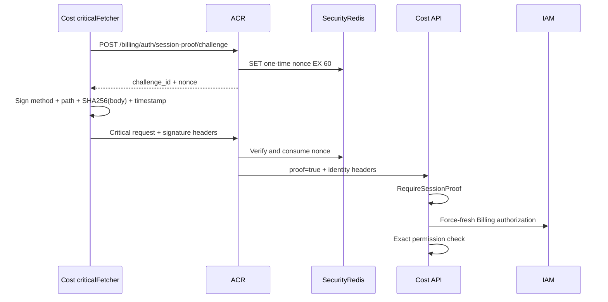

# Cost Console IAM Session Alias — God View (Master SoT)

> Đây là Source of Truth cho luồng đi từ IAM session trên Cloud Console sang Cost Console. Cost không có user credential store, ACR không copy quyền sang token/alias, và browser không chia sẻ cookie giữa hai host.

## 0. Control header

| Thuộc tính | Contract |
|---|---|
| Identity SoT | IAM PostgreSQL `users` |
| Authorization SoT | IAM PostgreSQL `user_role.list_perm` |
| Source origin | `https://cloud.aurora.local` |
| Target origin | `https://cost-manager.aurora.local` |
| Source session | IAM Trinity hiện có |
| Target session | Opaque alias trỏ về source IAM session |
| Security-State store | ACR Redis HA, AOF, `noeviction` |
| Shared cache store | Controlplane Redis HA, dữ liệu có thể rebuild/evict |
| Handoff TTL | 60 giây, one-time `GETDEL` |
| Alias TTL | `SESSION_TTL_SECS`, mặc định 30 phút |
| Target refresh token | Không phát |
| Target JWT | Không phát |
| Cookie scope | Hai `__Host-*` cookie, host-only, `Secure`, `HttpOnly`, `SameSite=Lax` |
| Authorization transport | Cost L1 → shared Redis L2 → NATS request IAM |
| Critical proof | Cost-origin Ed25519 key + one-time nonce |

## 1. Security boundaries

### 1.1 Hai Redis có vai trò khác nhau

| Redis | Writer/reader | Dữ liệu |
|---|---|---|
| ACR Security-State | ACR read/write | IAM sessions, Cost aliases, source→alias index, handoff code, nonce, rate limit, recovery state |
| Controlplane shared cache | IAM write; ACR catalog read; Cost cache read/lock/write-through | Billing permission projection, zone/config catalog và cache business có thể dựng lại |

Cost không có credential vào Security-State Redis. Controlplane và Cost không được ghi IAM session. Redis cache bị mất chỉ làm cache miss; Redis Security-State bị mất làm session fail-closed.

### 1.2 Những thiết kế bị cấm

| Thiết kế | Trạng thái | Lý do |
|---|---|---|
| `billing.users`, `employee_code + secret_key` | Đã bỏ | Nhân đôi IAM identity và credential lifecycle |
| Billing login form | Đã bỏ | Cost chỉ nhận alias từ IAM |
| Wildcard parent-domain cookie | Không dùng | Một subdomain không được đọc cookie của subdomain khác |
| Copy IAM Trinity sang Cost | Không dùng | Tăng blast radius và làm lộ source credential |
| Billing JWT chứa role/permission | Đã bỏ | Permission stale cho đến khi token hết hạn |
| ACR gọi IAM để render quyền lúc exchange | Đã bỏ | Authentication alias và authorization có lifecycle khác nhau |
| `GetUserPlatformAuthorization` | Đã bỏ | Không còn role/level snapshot dành riêng cho target token |
| Direct Cost → Controlplane PostgreSQL | Cấm | Phá ownership và coupling tầng dữ liệu |

Ba endpoint sau là local interceptor của ACR, không forward tới Cost API:

- `POST /api/v1/billing/auth/exchange`;
- `GET /api/v1/billing/auth/session`;
- `POST /api/v1/billing/auth/logout`.

## 2. Authorization-code + PKCE handoff

```mermaid
sequenceDiagram
    actor User
    participant CostUI as Cost Console
    participant CloudUI as Cloud Console
    participant Envoy
    participant ACR
    participant SecurityRedis as ACR Security-State Redis

    User->>CostUI: GET /auth/start
    CostUI->>CostUI: Generate state + verifier
    CostUI->>CostUI: challenge = BASE64URL(SHA256(verifier))
    CostUI->>CostUI: Store state/verifier in sessionStorage
    CostUI->>CloudUI: /billing/authorize?state&code_challenge
    CloudUI->>Envoy: POST /api/v1/auth/domain-sessions/billing
    Note over CloudUI,Envoy: Browser sends host-only Cloud IAM cookies
    Envoy->>ACR: ext_authz check
    ACR->>SecurityRedis: Verify IAM Trinity/source session
    ACR->>ACR: Verify CSRF + concrete zone + tenant
    ACR->>SecurityRedis: SET handoff hash NX EX 60
    ACR-->>CloudUI: Fixed Cost redirect URL
    CloudUI->>CostUI: /auth/handoff#code&state
    CostUI->>CostUI: Remove fragment; verify state
    CostUI->>CostUI: Generate/load Cost Ed25519 key
    CostUI->>Envoy: POST exchange(code, verifier, public_key)
    Envoy->>ACR: Local intercept
    ACR->>SecurityRedis: GETDEL handoff
    ACR->>ACR: Verify PKCE challenge
    ACR->>SecurityRedis: Recheck source IAM session
    ACR->>SecurityRedis: Save alias + source reverse index
    ACR-->>CostUI: 204 + two host-only cookies
```

### 2.1 Browser state

Cost tạo:

- `state`: 32 random bytes, Base64URL;
- `code_verifier`: 48 random bytes, Base64URL;
- `code_challenge`: Base64URL không padding của SHA-256 verifier.

`state` và verifier chỉ nằm trong `sessionStorage` của Cost origin. Cloud chỉ thấy `state` và challenge. ACR không nhận verifier ở issue phase.

Khi Cost nhận fragment:

1. đọc `code` và returned `state`;
2. xóa fragment khỏi address bar trước network call;
3. so sánh state với sessionStorage;
4. gửi code, verifier và Cost device public key tới exchange;
5. xóa state/verifier sau exchange thành công.

### 2.2 Handoff record

Redis key:

```text
billing:handoff:{sha256(raw_code)}
```

Payload:

- `user_id`, `username`;
- concrete `zone_id`, source `tenant_id`;
- `source_access_key`;
- public key đã bind vào source IAM session;
- `state`;
- `code_challenge`.

Raw code ghép từ hai UUIDv4 độc lập (xấp xỉ 244 bit entropy hiệu dụng), không lưu trong Redis và nằm trong URL fragment nên không đi vào request log/`Referer`. Exchange dùng `GETDEL`: code bị consume kể cả verifier sai, tránh brute-force/replay trên cùng authorization code.

### 2.3 Alias record

Cost nhận đúng hai cookie:

```text
__Host-billing_session
__Host-billing_session_secret
```

Alias binary trong Security-State Redis chứa:

- IAM identity và routing context;
- source access key + source proof public key;
- Cost-origin proof public key;
- SHA-256 của alias secret;
- created timestamp.

Alias không chứa role, level, permission, authorization revision hoặc JWT. Mỗi Billing request ACR kiểm tra alias secret rồi đọc lại source IAM session. Alias chết ngay khi source session hết hạn/revoke, kể cả reverse-index invalidation bị chậm.

## 3. Trusted identity headers

Sau khi verify alias, ACR overwrite đúng các header:

```text
x-user-id
x-user-name
x-zone-id
x-tenant-id
x-session-proof-verified
x-session-proof-challenge-id  # chỉ có khi critical proof hợp lệ
```

ACR không gửi:

```text
x-user-role-id
x-user-level
x-user-permissions
x-authz-revision
```

Cost `RequireIdentity` chỉ parse identity/routing context. `Authorize` tự resolve permission server-side. Envoy phải xóa/overwrite các identity/proof header client gửi và NetworkPolicy chỉ cho Envoy gọi Cost pod.

## 4. Billing permission resolution

Canonical output cho Cost luôn là key ba phần:

```text
billing:{object}:{behavior}
```

IAM chấp nhận hai dạng source:

- runtime platform role: `billing:object:behavior`;
- bootstrap role: `identity:*:billing:object:behavior` hoặc `identity:<nil-uuid>:billing:object:behavior`.

Key năm phần có workspace UUID cụ thể bị bỏ. Contract của writer là workspace-scoped permission luôn phải giữ prefix năm phần; không được ghi key ba phần vào workspace row.

```mermaid
sequenceDiagram
    participant API as Cost API pod
    participant L1 as Cost in-process L1
    participant L2 as Shared Redis L2
    participant NATS
    participant IAM
    participant DB as IAM PostgreSQL

    API->>L1: Resolve(user_id)
    alt L1 hit and normal route
        L1-->>API: permission set
    else L1 miss
        API->>L2: MGET data + generation + data_generation
        alt valid generation-fenced L2
            L2-->>API: RoleEntry bytes
        else L2 miss/stale
            API->>L2: SET refresh lock NX PX
            API->>NATS: iam.authorization.billing.get(user_id)
            NATS->>IAM: queue request
            IAM->>DB: Get active user RoleEntry rows
            IAM->>IAM: Filter platform Billing; sort + dedupe
            IAM->>L2: Lua write only if generation unchanged
            IAM-->>API: RoleEntry protobuf bytes
            API->>L2: Generation-fenced write-through
        end
        API->>L1: Cache 5 seconds
    end
```

### 4.1 L2 keys and race fence

Tất cả key dùng cùng Redis Cluster hash tag:

```text
{iam:authz:billing:<user_id>}:data
{iam:authz:billing:<user_id>}:generation
{iam:authz:billing:<user_id>}:data_generation
{iam:authz:billing:<user_id>}:lock
```

Reader chỉ nhận data khi `generation == data_generation`. Loader:

1. lấy distributed lock bằng unique token;
2. đọc expected generation;
3. request IAM;
4. Lua chỉ ghi `data` và `data_generation` nếu generation vẫn bằng expected;
5. release lock bằng compare-and-delete.

Lock chỉ chống stampede. Generation mới là correctness fence. Waiter dùng jitter để nhiều pod không tranh lock cùng nhịp.

### 4.2 Normal và critical route

| Route | Resolution |
|---|---|
| Normal read/write | L1 5 giây → L2 → IAM |
| `/api/v1/billing/critical/*` | Bỏ L1 và L2, buộc request IAM mới; vẫn dùng distributed lock và generation-fenced write |

Critical flow không được dùng permission snapshot cũ. Nếu IAM/NATS/Redis unavailable, Cost trả `503`, không fail-open.

### 4.3 Invalidation

Sau `AssignUserRole`, `UpdateRole` hoặc `UpdateUserStatus` commit:

1. Controlplane xóa local `user_role` L1;
2. Lua `INCR generation`, expire generation và xóa `data`/`data_generation`;
3. publish `iam.user_role.invalidated`;
4. mọi Cost replica xóa local L1;
5. Cost subscriber lặp lại Lua invalidation làm fallback cho đường Redis từ Controlplane.

Role update ảnh hưởng nhiều user phải invalidation toàn bộ danh sách, không return giữa vòng lặp. `GetUserRolePermissions` chỉ trả quyền khi `users.status = active`; suspended/disabled không resolve được Billing permission.

## 5. Exact authorization

Cost match exact string, không suy luận bằng role name/level:

| Permission | API hiện tại |
|---|---|
| `billing:plan:read` | List plans |
| `billing:tier:read` | List/detail tiers |
| `billing:tier:publish` | Update Tier metadata, publish immutable Tier version |
| `billing:subscription:write` | Activate personal subscription |
| `billing:wallet:read` | Wallet read surface tương lai |
| `billing:ledger:read` | Ledger read surface tương lai |
| `billing:credit:adjust` | Credit adjustment critical surface tương lai |

## 6. Critical session proof

Cost và Cloud có storage origin khác nhau nên Cost sinh Ed25519 keypair riêng. Private key được re-import non-extractable và lưu IndexedDB; alias chỉ giữ public key.



Nonce chỉ consume sau signature hợp lệ. Replay, body/path/method mismatch và timestamp quá 60 giây đều fail.

## 7. Revocation and race matrix

| Case | Control | Outcome |
|---|---|---|
| Hai tab redeem cùng code | `GETDEL` | Một tab thành công |
| State mismatch | Cost origin compare | Không exchange |
| Verifier sai | PKCE compare sau `GETDEL` | Code bị burn |
| Logout sau issue | Source session recheck | Exchange `401` |
| Logout/revoke sau alias | Per-request source recheck + reverse index | Alias `401` |
| Role đổi trong lúc IAM load | Generation-fenced Lua | Snapshot cũ không ghi lại |
| N pod cache miss | token lock + jitter + singleflight | Một loader chính |
| Workspace role có Billing key | Chỉ wildcard/nil platform prefix được rút gọn | Không global escalation |
| User disabled | Active-user join + invalidation | Không permission |
| NATS/IAM/Redis lỗi | Fail closed | `503` |
| Cost cookie mất/hết hạn | `/auth/start` PKCE lại | Không login form |

## 8. Production gates

- [ ] Security-State Redis HA/AOF/`noeviction`; shared cache Redis HA và cho phép eviction.
- [ ] Hai Redis dùng credential/ACL riêng; Cost không có quyền vào Security-State.
- [ ] NATS Core có nhiều IAM queue subscriber cho `iam.authorization.billing.get`.
- [ ] Subject invalidation là fan-out, không queue group ở phía Cost.
- [ ] `BILLING_CONSOLE_ORIGIN` là constant HTTPS allowlist, không lấy redirect URI từ client.
- [ ] Envoy overwrite/remove identity, permission legacy và proof headers.
- [ ] K8s NetworkPolicy cấm direct public traffic tới Cost API/ACR.
- [ ] Metrics có handoff issue/exchange/replay, alias verification, L1/L2 hit, lock contention, generation reject, IAM timeout và authorization deny.
- [ ] E2E cover root, billing_admin, support read-only, platform_user, disabled user, workspace-only Billing permission và concurrent role update.
- [ ] Chaos test cover Redis cache failover, Security-State failover, NATS loss và IAM pod rolling restart.
- [ ] Nếu cần durable invalidation không giới hạn stale window normal route, thêm transactional IAM outbox/JetStream; không dùng NATS Core như durability boundary.

## 9. Code map

| Concern | File |
|---|---|
| PKCE handoff/exchange | `acr/src/billing/exchange.rs` |
| Opaque alias + reverse index | `acr/src/billing/session.rs` |
| Alias/source verification | `acr/src/billing/verify.rs` |
| ACR dispatch/header overwrite | `acr/src/gateway/ext_authz.rs` |
| Redis role split config | `acr/src/config.rs`, `acr/src/main.rs` |
| IAM permission responder + L2 writer | `controlplane/internal/iam/transport/pubsub/handler/auth.go` |
| IAM RBAC invalidation | `controlplane/internal/iam/service/rbac_platform_service.go`, `user_service.go` |
| Cost L1/L2/NATS resolver | `cost-manager/api/internal/service/authorization_resolver.go` |
| Cost identity/permission middleware | `cost-manager/api/internal/transport/middleware/identity.go` |
| Cloud authorize bridge | `cloud-console/src/app/billing/authorize/page.tsx` |
| Cost PKCE/session bootstrap | `cost-console/src/lib/store/useAuthStore.ts` |
| Cost critical base | `cost-console/src/lib/api/criticalFetcher.ts` |

## 10. Change rule

Mọi thay đổi session/permission Billing phải cập nhật God View này trong cùng change-set. Không tái sử dụng Prost tag cũ của alias. Nếu thay wire format RoleEntry hoặc Redis key, triển khai reader tương thích trước writer mới.
