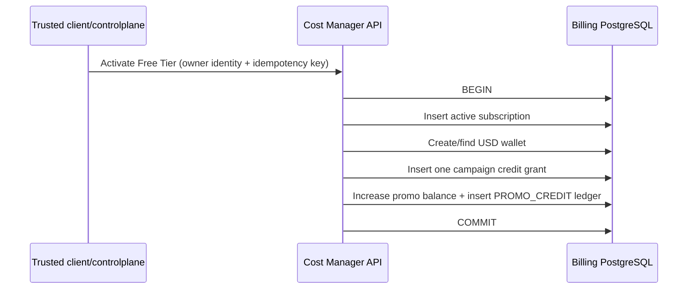

# Free Tier entitlement and promotional credit God View

## 1. Product decision

Free Tier is not represented by a zero-price usage range. Base Tier pricing remains a global immutable
service price. Successful Free Tier activation grants a promotional USD balance and `pack_plans` controls
which resource plans the subscription may use.

## 2. Invariants

- The edge supplies trusted owner identity; request body cannot choose another personal owner.
- One active subscription exists per owner type.
- One grant exists per `(campaign_id, owner_id, owner_type)` even under concurrent retries.
- The Free Tier seed defines the campaign and pack only; it never seeds a specific customer wallet.
- Promotional credit has currency, effective window and optional service scope.
- `pack_plans` is an entitlement catalog. A resource must be explicitly assigned a plan before limits can
  be enforced; wallet credit does not itself grant resource creation permissions.

## 3. Source map

| Concern | Source |
|---|---|
| Pack/subscription/campaign schema | `cost-manager/api/migrations/000002_tables.up.sql` |
| Free Tier seed | `cost-manager/api/migrations/000006_seeds.up.sql` |
| Activation transaction | `cost-manager/api/internal/repository/account_repo.go` |
| HTTP contract | `cost-manager/api/internal/transport/http/handler/account_handler.go` |

