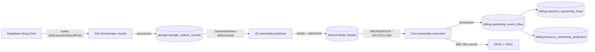

# Resource ownership — Central Shared Redis God View

> Source of Truth cho ownership lifecycle từ Storage Controlplane tới Cost Manager.
> Ownership là luồng Central↔Central: không dùng Kafka, NATS Core hay Zone JetStream KV.

## 1. Topology và ownership



Các boundary:

- Dataplane chỉ báo `job_id/version/status/topic`; không quyết định owner.
- JO resolve `resource_id`, owner và Zone từ authoritative Storage outbox.
- Shared Redis là durable at-least-once transport nội vùng Central.
- Cost là service duy nhất ghi Billing inbox/projection/head.
- Billing inbox là idempotency fence; Redis không phải business SoT.

## 2. Storage outbox tối giản

Không tạo lifecycle outbox thứ hai. Chính `storage.storage_outbox_records` đã giữ:

- `event_id`, `job_topic`, `job_version`;
- `resource_id`, `owner_id`, `owner_type`;
- immutable payload và typed `zone_id`;
- terminal status và `completed_at`.

Ownership delivery chỉ bổ sung:

```text
ownership_published_at
ownership_attempt_count
ownership_last_error
ownership_locked_by
ownership_locked_until
```

`status` vẫn chỉ là job lifecycle. Ownership pending được xác định bằng:

```sql
status = 'SUCCEEDED'
AND job_topic IN ('storage.bucket.create', 'storage.bucket.delete')
AND ownership_published_at IS NULL
```

Retention không được xóa row thỏa điều kiện này.

## 3. Contract deterministic

`ResourceOwnershipChangedV1` không chứa secret/policy/credential.

| Field | Nguồn |
|---|---|
| `event_id` | UUIDv5(`source_job_id + event_type`) |
| `event_type` | create success → `RESOURCE_CREATED`; delete success → `RESOURCE_DELETED` |
| `resource_id` | Storage outbox |
| `owner_id`, `owner_type` | Storage outbox do Controlplane đóng dấu |
| `zone_id` | Cột UUID `zone_id` của durable storage outbox |
| `resource_name` | decode immutable Storage command payload trong JO memory |
| `source_version` | lifecycle version do platform sở hữu; create=1/delete=2 hiện tại |
| `effective_at` | durable `completed_at`, không lấy clock của lần retry |
| `source_job_id` | Storage outbox `event_id` |

Nếu result tương lai mang `resource_id`, field đó chỉ được dùng để correlation và phải khớp
Controlplane outbox. Không nhận owner/tenant/workspace từ Dataplane.

## 4. Producer state machine

```text
PENDING
  ├─ XADD + WAITAOF đạt policy ──> PUBLISHED
  └─ transient failure ──────────> PENDING + last_error
```

Fast path chạy ngay sau result DB commit. Failure không chặn Kafka result offset vì durable
Storage row vẫn pending. Recovery relay:

- startup drain ngay;
- batch nhỏ với `FOR UPDATE SKIP LOCKED`;
- lease có `locked_by/locked_until`;
- scan fallback 30 giây + jitter;
- không hot-poll và không giữ DB transaction qua Redis network call.

`XADD` và `WAITAOF` phải chạy tuần tự trên cùng dedicated Redis connection. Production yêu cầu
local AOF, ít nhất một replica AOF ACK và eviction policy không xóa pending Stream entry.
`XLEN` capacity guard và `XADD` nằm trong cùng Lua script; stream đầy thì JO giữ intent ở
PostgreSQL thay vì tăng RAM Shared Redis vô hạn.

Crash sau `XADD` nhưng trước `ownership_published_at` tạo duplicate hợp lệ. Cost inbox so sánh
`event_id + payload_hash`; cùng ID khác hash là integrity incident.

## 5. Cost consumer

```text
NEW ──XREADGROUP──> PEL
PEL ──Billing TX commit──> XACK + XDEL
PEL ──pod chết/idle 30s──> XAUTOCLAIM bởi pod khác
invalid contract ──> atomic DLQ + XACK + XDEL
DB/transient failure ──> giữ PEL, không ACK
```

Billing transaction:

1. insert `billing.ownership_event_inbox`;
2. cùng `event_id + hash` → retry idempotent;
3. cùng `event_id`, khác hash hoặc cùng `resource_id + source_version` nhưng khác event → fail closed;
4. advisory transaction lock theo `resource_id`;
5. ignore version không cao hơn head; version cao hơn phải đúng `head + 1`, nếu có gap thì rollback
   và giữ Redis entry pending để CREATE không bị DELETE ở replica khác vượt qua;
6. update effective-dated projection và ownership head;
7. mark inbox `APPLIED`;
8. commit;
9. sau đó mới `XACK + XDEL`.

Ordering chỉ theo resource/source version; không có global ordering.

## 6. Failure semantics

| Failure | Recovery |
|---|---|
| JO chết trước result DB commit | Kafka result replay |
| DB commit, chết trước Redis | Kafka replay hoặc ownership recovery scan |
| Redis accepted, chưa mark published | duplicate; Cost inbox dedupe |
| Shared Redis outage | Storage row giữ pending; result pipeline tiếp tục |
| Cost chết trong Billing TX | DB rollback; Redis entry ở PEL |
| Cost commit, chết trước ACK | redelivery; inbox dedupe |
| Contract poison hoặc cùng `event_id` khác hash | Bounded Redis DLQ chỉ giữ length/hash rồi atomic ACK/delete; không copy raw poison payload |
| Source row invalid | giữ pending + alert; không giả vờ published |
| Out-of-order delete/create | `resource_ownership_head.source_version` fence |

Không tuyên bố exactly-once. External/storage side effect và Central delivery đều at-least-once.

## 7. Notification không thuộc ownership durability

Job notification được JO `XADD` trực tiếp vào `stream:{job_notifications}` sau business DB commit.
Notification là realtime UI hint:

- short bounded retry;
- failure ghi metric/log nhưng không rollback result;
- deterministic `notification_id` cho exact delivery và stable `transaction_id=job_id` để UI merge progression;
- UI query Controlplane API để lấy terminal state authoritative.

Không có PostgreSQL notification outbox.

## 8. Security và ACL

- JO credential: chỉ `XADD/WAITAOF` ownership stream.
- Cost credential: chỉ group/read/claim/ack/delete ownership stream và XADD DLQ.
- Ownership/DLQ keys dùng cùng Redis Cluster hash tag `{billing}`.
- Không log payload, owner UUID hoặc resource UUID làm metric label.
- Không có JO credential tới Billing DB.
- Không có Cost credential tới Controlplane DB.

## 9. Source map

| Concern | Source |
|---|---|
| Storage outbox schema | `controlplane/internal/storage/migrations/000002_storage_outbox.up.sql` |
| Ownership delivery fields | `controlplane/internal/storage/migrations/000006_ownership_delivery.up.sql` |
| JO publisher/recovery | `job-orchestrator/src/outbox/ownership.rs` |
| Shared Redis durability fence | `job-orchestrator/src/outbox/redis.rs` |
| Result apply | `job-orchestrator/src/results/apply.rs` |
| Ownership protobuf | `proto/job-orchestrator/resource_ownership.proto` |
| Cost Redis consumer | `cost-manager/api/internal/transport/redis/handler/resource_ownership_handler.go` |
| Billing inbox/projection transaction | `cost-manager/api/internal/repository/resource_ownership_repo.go` |
| Ownership version uniqueness | `cost-manager/api/migrations/000003_indexes.up.sql` |
| Notification transport | `job-orchestrator/src/results/notify.rs` |
| Shared L2 HA persistence/eviction | `k8s/infra/redis-operator.yaml` |

`storage.resource_lifecycle_events` và JetStream ownership path là rollback-only legacy. Runtime mới
không ghi/đọc chúng; table chỉ được drop bằng migration riêng sau rollout verification window.

## 10. Rolling deployment

Thứ tự bắt buộc để không tạo transport gap:

1. apply migration `000006`;
2. rollout toàn bộ JO mới — Redis Stream có thể tích lũy an toàn trong lúc Cost cũ vẫn consume
   lifecycle path cũ từ các JO cũ còn lại;
3. rollout Cost mới để drain Redis Stream;
4. kiểm tra pending age/count, DLQ và Billing reconciliation;
5. chỉ sau verification window mới drop legacy table/credential.

Rollback phải đảo theo cặp JO + Cost; không rollback riêng JO về legacy sau khi Cost đã bỏ consumer cũ.
