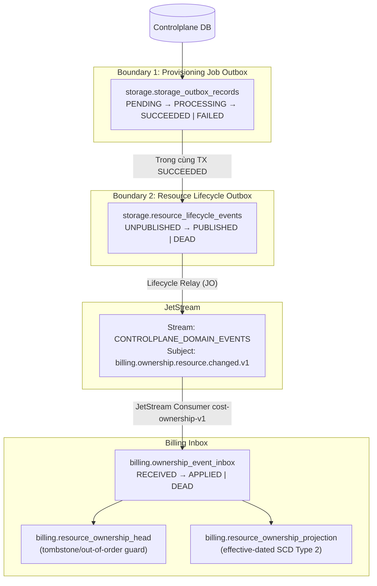
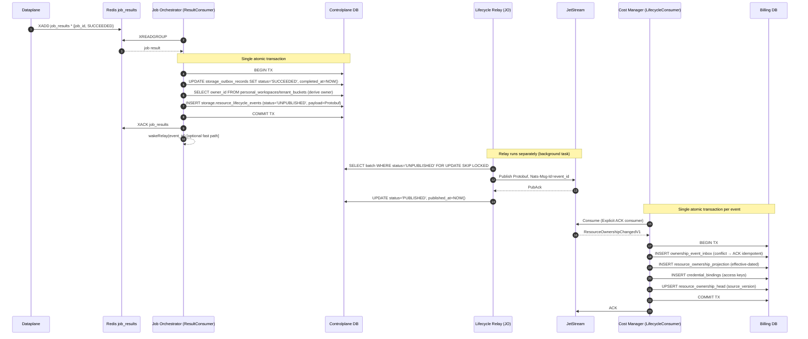
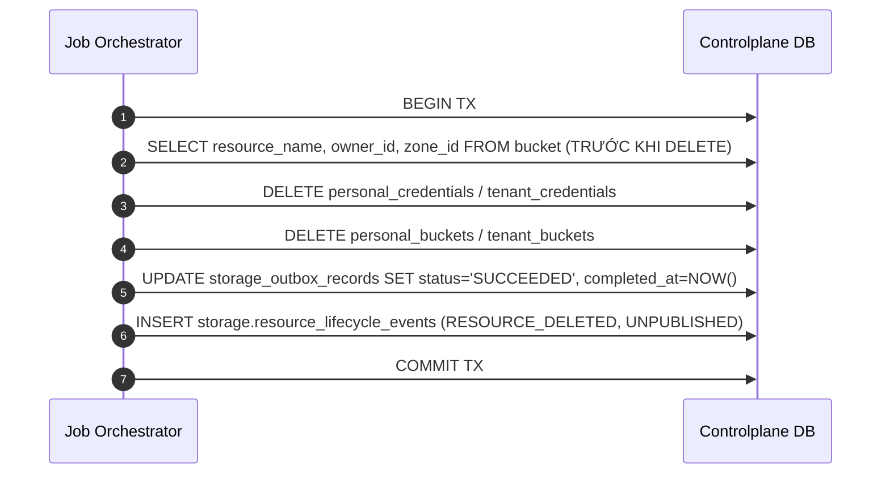

# Resource Ownership Event Pipeline — God View

> [!IMPORTANT]
> Tài liệu này là **Source of Truth (SoT) duy nhất** cho toàn bộ pipeline ownership event từ bucket create/delete trong Controlplane cho đến ownership projection trong Billing.
> Mọi thay đổi liên quan đến: resource lifecycle outbox, JetStream relay, billing inbox, ownership consumer, state machines đều phải tham chiếu và cập nhật file này trước.

---

## Mục Lục

1. [Nguyên tắc kiến trúc](#1-nguyên-tắc-kiến-trúc)
2. [Hai Reliability Boundary](#2-hai-reliability-boundary)
3. [Contract Protobuf ResourceOwnershipChangedV1](#3-contract-protobuf-resourceownershipchangedv1)
4. [State Machines](#4-state-machines)
5. [Luồng End-to-End](#5-luồng-end-to-end)
6. [Race Condition và Crash Recovery](#6-race-condition-và-crash-recovery)
7. [JetStream Configuration](#7-jetstream-configuration)
8. [Source Map](#8-source-map)

---

## 1. Nguyên tắc kiến trúc

- Bucket không có `status` — tồn tại trong DB là đủ để xác định active.
- Billing không truy cập trực tiếp DB Controlplane (zero cross-DB query ở hot path).
- Mọi bucket create/delete thành công đều phát **durable ownership event** vào JetStream.
- Resource tạo rồi xóa sau 10 phút vẫn phải giữ đủ hai event và lịch sử ledger.
- Owner phải derive từ DB: personal qua `personal_workspaces.owner_id`, tenant qua `tenant_buckets.tenant_id`. Không dùng `outbox.user_id` làm payer.
- Tuyệt đối không có secret key/policy trong lifecycle payload.

---

## 2. Hai Reliability Boundary



**Boundary 1 — Provisioning Job Outbox**: Controlplane → Dataplane. Outbox record giữ 30 ngày sau terminal để audit. Không bao giờ DELETE record khi job SUCCEEDED.

**Boundary 2 — Resource Lifecycle Outbox**: Controlplane → Billing. Ghi trong cùng transaction với Boundary 1 SUCCEEDED. Không gọi NATS trong transaction.

---

## 3. Contract Protobuf ResourceOwnershipChangedV1

```protobuf
syntax = "proto3";
package billing.ownership.v1;

message ResourceOwnershipChangedV1 {
  bytes  event_id        = 1;  // UUID bytes (16 bytes), deterministic từ source_job_id + event_type
  string event_type      = 2;  // "RESOURCE_CREATED" | "RESOURCE_DELETED"
  int32  schema_version  = 3;  // Luôn = 1 cho schema này
  bytes  resource_id     = 4;  // UUID bytes của bucket
  string resource_type   = 5;  // "STORAGE_BUCKET"
  string resource_name   = 6;  // Tên vật lý bucket (e.g. ws-abc123)
  bytes  owner_id        = 7;  // UUID bytes của owner (personal_workspaces.owner_id hoặc tenant_id)
  string owner_type      = 8;  // "PERSONAL" | "TENANT"
  bytes  zone_id         = 9;  // UUID bytes của zone
  int64  source_version  = 10; // Ownership version tăng dần; CREATED=1, mỗi change tăng thêm
  string effective_at    = 11; // RFC3339 UTC — thời điểm ownership event có hiệu lực
  bytes  source_job_id   = 12; // UUID bytes của job tạo ra event này
  string traceparent     = 13; // W3C traceparent để distributed tracing
}
```

**Quy tắc bất biến của payload**:
- `event_id` PHẢI deterministic: `UUID_v5(lifecycle_namespace, source_job_id_bytes || event_type_bytes)`.
- Không có secret key, policy JSON, hay bất kỳ credential nào trong payload.
- Provisioning outbox giữ hai identity độc lập: `owner_id/owner_type` là payer của Billing;
  `actor_user_id` là người thực hiện request để notification/audit. Tenant ID không bao giờ được dùng
  thay user ID trên notification subject.
- `owner_id` phải được derive hoặc kiểm chứng lại từ DB ngay tại thời điểm xử lý kết quả; Billing chỉ
  nhận cặp `(owner_id, owner_type)` và không dùng `actor_user_id` để chọn wallet.
- `source_version` cho `RESOURCE_CREATED` bắt đầu từ 1; mỗi lần ownership change tăng 1.

---

## 4. State Machines

### 4.1 Provisioning Job Outbox

```
PENDING
  │
  ▼ (Dataplane nhận job)
PROCESSING
  │
  ├──[Thành công]──► SUCCEEDED  (completed_at được set; record giữ 30 ngày)
  │
  └──[Thất bại]───► FAILED      (completed_at + error_code + error_message được set)
```

- `SUCCEEDED`: UPDATE outbox, set `completed_at`. Đồng thời trong cùng TX: insert ownership event.
- `FAILED` (create): UPDATE outbox + DELETE bucket record khỏi DB (clean rollback cho retry).
- `FAILED` (delete/resize): UPDATE outbox, giữ nguyên resource.
- Retry `SUCCEEDED`: no-op (guard `WHERE status IN ('PENDING', 'PROCESSING')`).
- **Không bao giờ DELETE outbox record khi SUCCEEDED.**

### 4.2 Resource Lifecycle Outbox

```
UNPUBLISHED
  │
  ▼ (Lifecycle relay claim lease + publish JetStream)
  ├──[PubAck nhận được]──► PUBLISHED   (published_at được set)
  │
  └──[Max retry exceeded]─► DEAD       (cần manual intervention hoặc DLQ)
```

- Relay chỉ UPDATE `published_at` / `status = PUBLISHED` SAU KHI nhận `PubAck`.
- Nếu relay crash sau DB commit nhưng trước PubAck: relay polling `UNPUBLISHED` sẽ retry.
- `locked_by` + `locked_until`: claim lease theo batch để nhiều relay instance không tranh nhau.
- Không bao giờ xóa `UNPUBLISHED` records (chưa có bằng chứng publish).

### 4.3 Billing Inbox

```
RECEIVED
  │
  ▼ (Consumer xử lý event trong transaction)
  ├──[Thành công]──────────► APPLIED   (processed_at được set)
  │
  ├──[Duplicate event]──────► ACK idempotently (không insert lại)
  │
  ├──[Transient error]──────► NAK với backoff (JetStream redeliver)
  │
  └──[Permanent error]──────► DEAD     (push DLQ + TERM message gốc)
```

---

## 5. Luồng End-to-End

### 5.1 Bucket Create Succeeded



### 5.2 Bucket Delete Succeeded



### 5.3 Out-of-Order: DELETE đến trước CREATE

```
Event RESOURCE_DELETED (source_version=2) đến trước RESOURCE_CREATED (source_version=1)

Xử lý DELETE:
  → INSERT inbox (event_id = delete_event_id)
  → UPSERT resource_ownership_head: {resource_id, last_source_version=2, resource_state=DELETED}
  → Close ownership projection nếu đang mở (effective_to = effective_at)
  → ACK

Sau đó RESOURCE_CREATED (source_version=1) đến:
  → INSERT inbox → conflict nếu cùng event_id (không thể xảy ra — event_id khác)
  → Đọc resource_ownership_head: resource_state=DELETED, last_source_version=2
  → CREATE có source_version <= last (và state=DELETED) → BỎ QUA, ACK idempotently
  → Không resurrect resource
```

---

## 6. Race Condition và Crash Recovery

| Tình huống | Xử lý |
|---|---|
| Relay crash sau INSERT ownership event nhưng trước PubAck | Relay polling `UNPUBLISHED` retry; `Nats-Msg-Id=event_id` JetStream dedup |
| JetStream publish nhưng relay chưa UPDATE DB | Relay nhận PubAck và cập nhật; duplicate publish được dedup bởi JetStream |
| Billing nhận duplicate event (restart trước ACK) | `ownership_event_inbox` PK conflict → rollback → ACK idempotently |
| Payload hash mismatch | Security incident; TERM message gốc, push DLQ, alert |
| Two relay instances tranh nhau | `locked_by` + `locked_until` claim lease; `FOR UPDATE SKIP LOCKED` |
| Resource create/delete giữa hai lần reconcile gRPC (Phase 7) | Lifecycle events đã capture đủ hai event trong Boundary 2 |
| Bucket tồn tại trong DB nhưng chưa có ownership projection | Billing consumer xử lý sẽ insert; gRPC reconciler (Phase 7) backup |

---

## 7. JetStream Configuration

### Dev (single node)

```hcl
# nats-server.conf
jetstream {
  store_dir: "/data/nats"
  max_memory_store: 256MB
  max_file_store: 4GB
}
```

**Stream**: `CONTROLPLANE_DOMAIN_EVENTS`
- Subject filter: `billing.ownership.resource.changed.v1`
- Storage: `File`
- Retention: `Limits`
- Max age: `72h` (dev) / `168h` (staging)
- Replicas: `1` (dev) / `3` (prod)

**Consumer**: `cost-ownership-v1` (Cost Manager)
- Delivery: `Push` hoặc `Pull` explicit ACK
- Ack policy: `Explicit`
- Ack wait: `30s`
- Max deliver: `10` (sau đó TERM → DLQ)

**Headers bắt buộc khi publish**:
- `Nats-Msg-Id: {event_id}` — JetStream idempotent publish dedup
- `Content-Type: application/protobuf`
- `Schema-Version: 1`
- `traceparent: {w3c_traceparent}`

---

## 8. Source Map

| Concern | Source |
|---|---|
| Provisioning job outbox schema | `controlplane/internal/storage/migrations/000002_storage_outbox.up.sql` |
| Resource lifecycle outbox schema | `controlplane/internal/storage/migrations/000004_lifecycle_outbox.up.sql` |
| Cleanup index (terminal jobs) | `controlplane/internal/storage/migrations/000005_outbox_retention_index.up.sql` |
| Proto contract | `job-orchestrator/proto/resource_ownership.proto` |
| Lifecycle event insert (Rust) | `job-orchestrator/src/reverse_provider/storage/db/lifecycle.rs` |
| Resolve create/delete + insert event | `job-orchestrator/src/reverse_provider/storage/db/bucket.rs` |
| Lifecycle relay | `job-orchestrator/src/lifecycle_relay/relay.rs` |
| JetStream dev config | `controlplane/dev/nats/jetstream.conf` |

| Billing inbox schema | `cost-manager/api/migrations/000002_tables.up.sql` (billing.ownership_event_inbox & resource_ownership_head) |
| Billing lifecycle consumer | `cost-manager/api/internal/service/lifecycle_consumer.go` |
| Ownership projection schema | `cost-manager/api/migrations/000002_tables.up.sql` (billing.resource_ownership_projection) |
