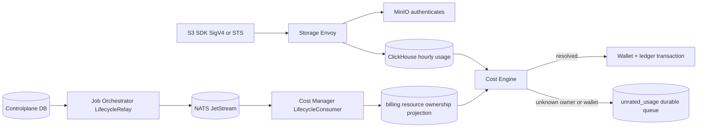

# Storage usage billing — owner resolution God View

## 1. Contract

Controlplane là Source of Truth của bucket/credential ownership. Billing DB chỉ giữ
projection effective-dated để Cost Engine không query chéo database theo từng usage row.

Ownership projection được cập nhật qua **JetStream lifecycle event consumer** thay vì polling cross-DB.
Billing DB không bao giờ kết nối trực tiếp vào Controlplane DB.

## 2. Identity semantics

| Field | Meaning | Trust owner |
|---|---|---|
| `actor_user_id` | User/session that obtained a temporary credential, optional for static/shared keys | IAM/Controlplane |
| `credential_id` | Static or STS credential identity | Storage Controlplane |
| `resource_id` | Immutable bucket UUID | Storage Controlplane |
| `billable_owner_id` | Wallet owner that pays | Resource ownership projection |
| `billable_owner_type` | `PERSONAL` or `TENANT` | Resource ownership projection |

Client-provided `x-user-id` or `x-owner-*` is never billing evidence. For personal buckets the billable
owner is `personal_workspaces.owner_id`; for tenant buckets it is `tenant_buckets.tenant_id`.

## 3. Projection and replay invariants

- Projection rows use `[effective_from,effective_to)` and old ownership is never overwritten.
- Static credentials are reconciled into `billing.credential_bindings`; STS usage can still resolve by
  bucket ownership when the temporary access key is not retained in Controlplane.
- **Ownership events cược deliver qua JetStream** (stream `CONTROLPLANE_DOMAIN_EVENTS`, subject `controlplane.storage.resource.lifecycle.v1`).
- Consumer `cost-ownership-v1` dùng **Explicit ACK** — at-least-once, idempotent qua `billing.ownership_event_inbox`.
- ACK chỉ được gửi sau khi transaction commit thành công trong Billing DB.
- Billing resolves ownership at the metering hour. Unknown ownership is persisted in `unrated_usage` and
  does not silently disappear when the billing checkpoint advances.
- Bucket name is a lookup attribute only. Ledger lineage stores immutable `resource_id` and owner snapshot.
- Out-of-order events được xử lý qua `billing.resource_lifecycle_head` — delete với `source_version` cao hơn
  sẽ chuyển state thành DELETED và chặn create cũ hơn khỏi resurrect resource.

## 4. Metering security

Storage Envoy extracts the SigV4 access-key identifier into an internal metering header and overwrites any
client-supplied value. Raw `Authorization` is forwarded to MinIO but never written into access logs.
Only successful storage responses enter chargeable aggregates. MinIO direct data-plane ports must remain
private so a caller cannot bypass the trusted ingress and metering path.

## 5. Source map

| Concern | Source |
|---|---|
| Storage ownership SoT | `controlplane/internal/storage/migrations/000001_storage_tables.up.sql` |
| Resource lifecycle outbox | `controlplane/internal/storage/migrations/000004_lifecycle_outbox.up.sql` |
| JetStream relay | `job-orchestrator/src/lifecycle_relay/relay.rs` |
| Proto contract | `job-orchestrator/proto/resource_lifecycle.proto` |
| Billing inbox schema | `cost-manager/api/migrations/000007_ownership_inbox.up.sql` |
| Lifecycle consumer | `cost-manager/api/internal/service/lifecycle_consumer.go` |
| Billing projection schema | `cost-manager/api/migrations/000002_tables.up.sql` |
| Storage ingress metering identity | `controlplane/dev/envoy/envoy-storage.yaml` |
| Hourly usage schema | `controlplane/dev/clickhouse/init.sql` |
| Owner resolution and debit | `cost-manager/engine/src/service/storage/egress_billing.rs` |
| Pipeline God View | `god_view/billing/resource_lifecycle_god_view.md` |
