# Tier Catalog — God View (Master SoT)

> **IMPORTANT — SINGLE SOURCE OF TRUTH (SoT)**
> Tài liệu này là nguồn chuẩn cho workflow đọc Tier end-to-end. Mọi thay đổi liên quan đến route, contract, auth, schema, cách diễn giải range, pagination hoặc việc dùng Tier để tính tiền **phải cập nhật tài liệu này trước hoặc trong cùng change-set**.

## 0. Control header

| Thuộc tính | Giá trị AS-IS |
|---|---|
| Domain | Billing Catalog / Tier Catalog |
| Canonical endpoints | `GET /api/v1/billing/tiers`, `PATCH /tiers/metadata`, `POST /tiers/versions` dưới billing v1 group |
| Public host | `https://cost-manager.aurora.local` |
| UI consumer | Cost Console — Tier table |
| Edge | Envoy + ACR `ext_authz` |
| API owner | Cost Manager API |
| Durable SoT | PostgreSQL: `billing.tiers`, `billing.tier_versions`, `billing.tier_version_ranges` |
| Read model | Một row phẳng cho mỗi range của pricing version có hiệu lực |
| Write model | Metadata mutable riêng; pricing append-only immutable version + outbox |
| Cache | Engine: Moka cache theo version ID + `ArcSwap<CatalogSnapshot>`; API/UI không cache Tier |
| API timeout | Handler/DB context `5s` |
| Edge timeout | Envoy route `15s`; ACR `ext_authz` `2s`; connect `1s` |
| Pagination | Offset pagination, mặc định `page=1`, `limit=10`, trần `limit=100` |
| Tình trạng Cost Engine | Storage egress pin `NETWORK_OUT` Tier version theo durable billing run; không còn fallback `billing.prices` |
| Mức bảo mật hiện tại | **P0: billing auth có nhánh fail-open khi thiếu/sai JWT** |
| Verified against | Commit `16b3baf4840c28ec931b03838ca02b6b25814be2`, 2026-07-18 |

### 0.1 Hai sự thật không được hiểu sai

| Sự thật | Hệ quả |
|---|---|
| Pricing đã publish là immutable aggregate | Thay range/price luôn tạo version mới; sửa `name` không tạo pricing version |
| Engine không activate L1 giữa billing run | Event được preload pending; COW active snapshot chỉ sau durable run completion |
| ACR giữ nguyên `/api/v1/billing/*`; nó không tự thêm `/billing` | Cost Manager bắt buộc đăng ký chính xác `/api/v1/billing/tiers`; thiếu route sẽ `404` |

### 0.2 Severity gate

| Mức | Ý nghĩa | Release gate |
|---|---|---|
| P0 | Có thể truy cập sai quyền hoặc tính tiền sai | Block production rollout |
| P1 | Có thể trả dữ liệu sai/stale hoặc mất tính nhất quán | Block rollout nếu ảnh hưởng price contract |
| P2 | Suy giảm hiệu năng/HA/observability | Cần owner và deadline |
| P3 | UX hoặc maintainability | Có thể đưa vào backlog có kiểm soát |

---

## 1. Phạm vi và ranh giới domain

### 1.1 In scope / out of scope

| In scope | Out of scope nhưng có liên quan |
|---|---|
| F5/session readiness trước khi UI gọi Tier | Login và cấp session ban đầu |
| Search, filter, pagination của Tier table | CRUD plan/subscription |
| Envoy routing và ACR authorization | Deployment topology chi tiết |
| Cost Manager handler → service → repository | Billing settlement/ledger hoàn chỉnh |
| Schema `tiers`, immutable versions/ranges, outbox, billing runs | Mọi bảng chi phí khác ngoài điểm nối ledger cần thiết |
| Race condition, logic, security, HA, data integrity | Thiết kế UI ngoài Tier table |

### 1.2 Domain flow hiện tại

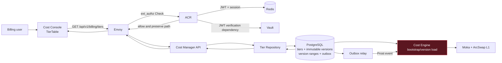

### 1.3 Trách nhiệm theo component

| Component | Owns | Không được tự suy diễn |
|---|---|---|
| Cost Console | State filter/page/loading, render flat ranges | Không tự tính giá billing thực tế |
| Envoy | TLS, host route, timeout/retry, gọi ACR | Không thêm `/billing` vào path |
| ACR | Session verification, rate limit, zone resolution, identity headers | Không sở hữu Tier data |
| Cost Manager handler | Bind/normalize input, timeout, response envelope | Không sở hữu durability rule |
| Tier service | Validate metadata/pricing request, canonical ranges, checksum | Không mutate version đã publish |
| Tier repository | COUNT + SELECT, filter, ordering, mapping | Không bảo đảm snapshot nhất quán giữa hai query |
| PostgreSQL | Durable versions, effective windows, outbox, billing-run pin | Gap/overlap full-set vẫn cần domain validation ngoài CHECK đơn giản |
| Cost Engine | Bootstrap/cache/pin version, progressive charge, ledger lineage | Không activate pending catalog giữa run |

Pricing outbox không poll PostgreSQL theo nhịp 500 ms. Sau khi transaction tạo version và outbox commit, Tier service gửi non-blocking local wake cho relay; wake được coalesce và relay drain theo batch đến khi rỗng. Startup và reconciliation 30–39 giây có jitter là safety net cho trường hợp process crash giữa commit và wake, đồng thời cập nhật trạng thái version theo effective window mà không tạo synchronized polling giữa các replica.

### 1.4 Causal reach — dữ liệu Tier tác động tới đâu

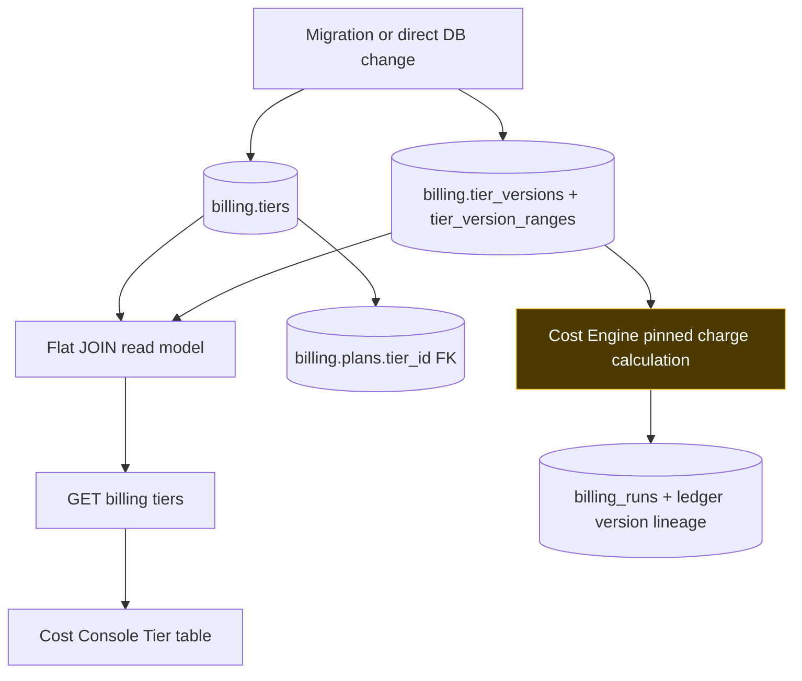

| Change | UI Tier table | Plan relation | Actual charge AS-IS |
|---|---:|---:|---:|
| Đổi `name` | Có | Không | Không; chỉ tăng metadata version |
| Đổi `code/service_type` | Không được phép | Identity ổn định | Không |
| Publish `base_unit_price`/boundary mới | Khi version tới effective window | Không trực tiếp | Billing run kế tiếp sau safe activation |
| Xóa Tier/version đã publish | Không được phép | FK `RESTRICT` | Lịch sử charge được giữ nguyên |

---

## 2. Public contract và data lineage

### 2.1 Route contract

| Layer | Match/route | Path sau layer | Control |
|---|---|---|---|
| Browser | Base URL `/api/v1` + `/billing/tiers` | `/api/v1/billing/tiers` | Same-origin request |
| Envoy vhost | Host `cost-manager.aurora.local`, prefix `/api/` | Không đổi | Forward `cost_manager_cluster` |
| ACR classifier | `starts_with("/api/v1/billing")` | Không đổi | Billing auth + billing rate group |
| Cost Manager | Group `/api/v1/billing`, GET `/tiers` | Handler `ListTiers` | Canonical route |
| Cost Manager | GET `/tiers/:code?service_type=...` | Handler `GetTierDetail` | Full aggregate cho Edit |
| Cost Manager | PATCH `/tiers/metadata` | Handler `UpdateTierMetadata` | Name-only OCC |
| Cost Manager | POST `/tiers/versions` | Handler `CreateTierVersion` | Append immutable pricing snapshot |

> `/api/v1/tiers` **không phải public compatibility route trong code hiện tại**. Client phải dùng `/api/v1/billing/tiers`.

### 2.2 Request parameters

| Parameter | Type | Default/normalize | Validation AS-IS | Cause → effect |
|---|---:|---:|---|---|
| `page` | int | `<=0` → `1` | Không có upper bound | Page rất lớn → OFFSET lớn/chậm; có thể overflow phép nhân |
| `limit` | int | `<=0` → `10`; `>100` → `100` | Cap tại handler | Hạn chế payload nhưng không hạn chế OFFSET |
| `service_type` | string | Empty = all | Không allowlist/trim | Giá trị lạ → `200` empty, không phải `400` |
| `search` | string | Empty = all | Không trim/max length | `%` và `_` trở thành wildcard SQL; search rộng, khó dùng index |

### 2.3 Success response

```json
{
  "message": "Successfully retrieved tiers",
  "data": {
    "tiers": [
      {
        "id": "<tier_range_uuid>",
        "tier_id": "<tier_uuid>",
        "name": "Standard Storage Base Tier",
        "code": "STORAGE_STD_BASE",
        "service_type": "STORAGE",
        "metadata_version": 1,
        "pricing_version": 1,
        "range_start": 0,
        "range_end": 51200,
        "base_unit_price": 15000,
        "created_at": "<range_created_at>",
        "updated_at": "<parent_tier_updated_at>"
      }
    ],
    "pagination": {
      "page": 1,
      "limit": 10,
      "total": 6
    }
  }
}
```

### 2.4 Field lineage

| API field | DB source | Meaning | UI behavior | Integrity note |
|---|---|---|---|---|
| `id` | `tier_version_ranges.id` | Version-range identity | React row key | Immutable UUID |
| `tier_id` | `tiers.id` | Parent Tier | Không hiển thị | Stable business aggregate |
| `name` | `tiers.name` | Tên biểu giá | Hiển thị | Không unique |
| `code` | `tiers.code` | Business code | Hiển thị | Unique ở DB |
| `service_type` | `tiers.service_type` | Loại dịch vụ | Badge/filter | Chưa có CHECK enum |
| `metadata_version` | `tiers.metadata_version` | Name-only OCC token | Gửi khi PATCH metadata | Không đổi pricing version |
| `pricing_version` | `tier_versions.version_number` | Immutable snapshot version | Expected latest khi publish | Monotonic theo Tier |
| `range_start` | `tier_version_ranges.range_start` | Boundary bắt đầu, MB | Chia `1024` để hiện GB | DB CHECK + aggregate validation |
| `range_end` | `tier_version_ranges.range_end` | Boundary kết thúc; `0` = vô hạn | `0` render `> start` | Một infinity/version |
| `base_unit_price` | `tier_version_ranges.base_unit_price` | Micro-units/MB/hour | Format số và Edit modal | DB CHECK không âm |
| `created_at` | `tier_version_ranges.created_at` | Ngày tạo version range | Hiển thị vi-VN | Không bị rewrite |
| `updated_at` | `tiers.updated_at` | Ngày update metadata | Chưa hiển thị | Pricing publish không đổi name metadata |

### 2.5 Entity relationship

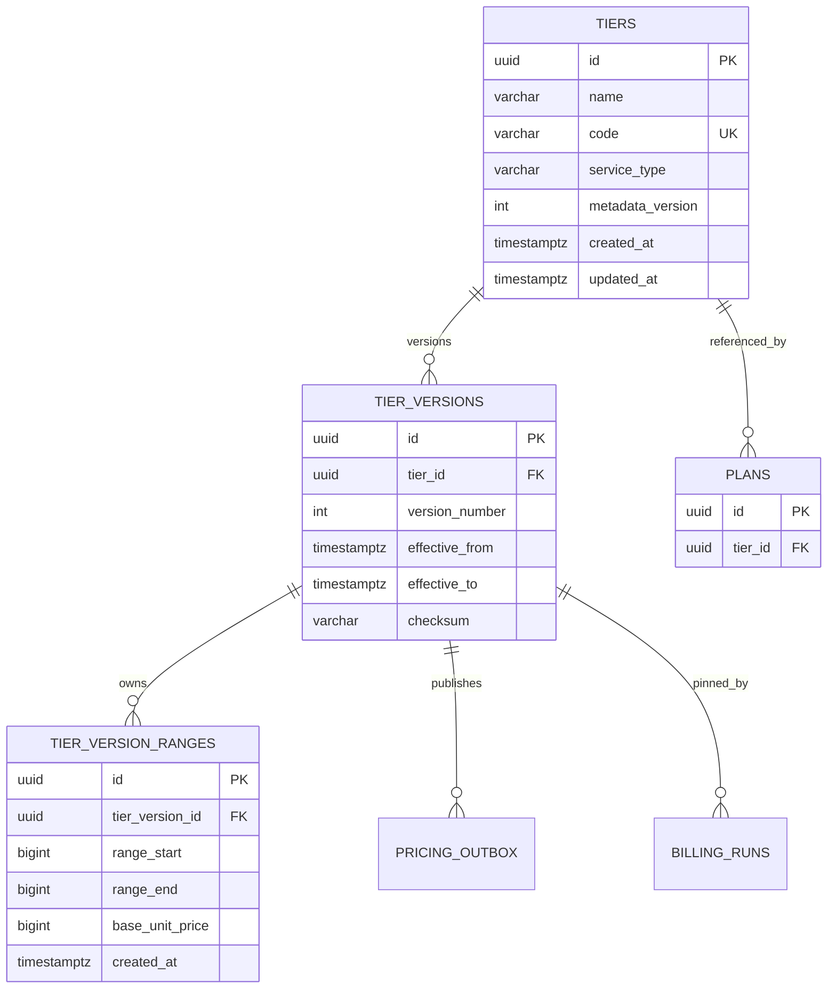

### 2.6 Data invariants

| Invariant mong muốn | Enforced AS-IS? | Failure effect | Gate đề xuất |
|---|---:|---|---|
| `tiers.code` unique | Có | Tránh hai Tier cùng business code | Giữ unique index |
| `tiers.service_type` unique | Có | Không có hai Tier/range schedule cạnh tranh | Unique index |
| Range thuộc immutable version | Có | Không orphan/rewrite pricing history | FK `ON DELETE RESTRICT` |
| `range_start >= 0` | Có | UI và pricing semantics vô nghĩa | DB CHECK + service validation |
| `range_end = 0 OR range_end > range_start` | Có | Range đảo/ngắn rỗng | DB CHECK + service validation |
| `base_unit_price >= 0` | Có | Giá âm | DB CHECK + service validation |
| Chỉ một unlimited range/version | Có | Nhiều range vô hạn cùng áp dụng | Partial unique index |
| Không overlap | Có qua API | Một usage match nhiều mức giá | Canonical sort + adjacent boundary validation |
| Không gap | Có qua API | Usage không match mức giá | Full aggregate validation trong transaction boundary |
| Boundary inclusive/exclusive thống nhất | Có | Sai giá tại đúng điểm biên | `[start,end)` progressive executable tests |
| `service_type` thuộc allowlist | Không | Catalog rác hoặc filter khó đoán | CHECK/enum + API validation |

> Boundary contract là `[start,end)` và progressive aggregation theo từng metering row. Monthly cumulative semantics chưa nằm trong workflow này.

### 2.7 Seed baseline

| Service type | Code | Range MB | Base unit price |
|---|---|---:|---:|
| STORAGE | `STORAGE_STD_BASE` | `0–51,200` | `15,000` |
| STORAGE | `STORAGE_STD_BASE` | `>51,200` | `12,000` |
| NETWORK_IN | `NETWORK_IN_BASE` | `0–102,400` | `0` |
| NETWORK_IN | `NETWORK_IN_BASE` | `>102,400` | `5,000` |
| NETWORK_OUT | `NETWORK_OUT_BASE` | `0–10,240` | `0` |
| NETWORK_OUT | `NETWORK_OUT_BASE` | `>10,240` | `90,000` |

---

## 3. Happy path end-to-end

### 3.1 Sequence chuẩn

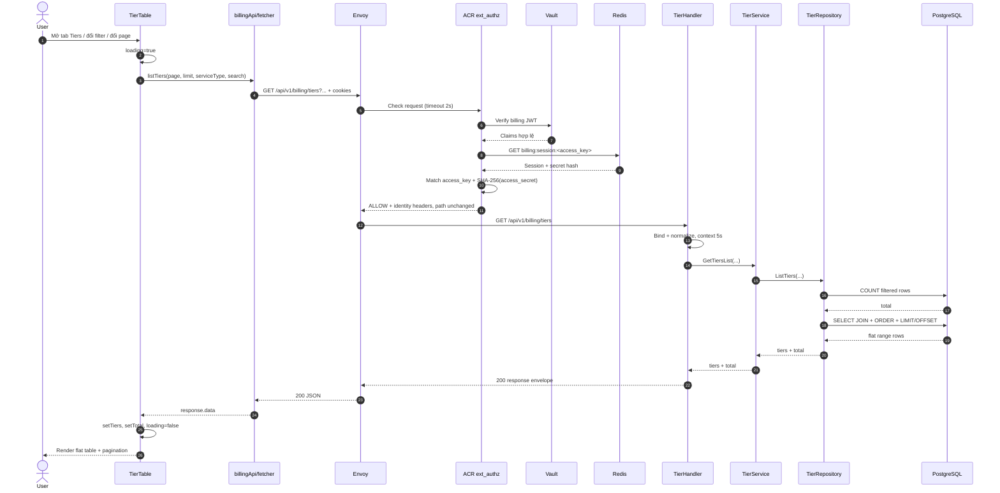

### 3.2 Cause/effect theo phase

| # | Cause/trigger | Control/transform | Effect/output | Evidence owner |
|---:|---|---|---|---|
| 1 | Mount Tier tab hoặc state đổi | React `useEffect` | Sinh request mới | `TierTable.tsx` |
| 2 | API client nhận filter | Encode `search`, bỏ `service_type=all` | URL canonical | `billing.ts` |
| 3 | Host + prefix match | Envoy route `/api/` | Chọn Cost Manager cluster | `envoy.yaml` |
| 4 | Billing path | ACR classify billing | Billing auth/rate/zone flow | `ext_authz.rs` |
| 5 | Session hợp lệ | Verify JWT + Redis + secret | Claims + identity headers | `billing/verify.rs` |
| 6 | Path không rewrite | `/api/v1/billing/tiers` giữ nguyên | Gin match route | `route.go` |
| 7 | Query input | Bind + normalize | Page/limit hợp lệ theo AS-IS | `tier_handler.go` |
| 8 | Repository read | COUNT, rồi SELECT JOIN | `total` + flat rows | `tier_repo.go` |
| 9 | Handler map | Entity → JSON | Stable response contract | `tier_handler.go` |
| 10 | Fetcher unwrap | Trả `resJson.data` | UI nhận `TiersResponse` | `fetcher.ts` |

### 3.3 Repository query model

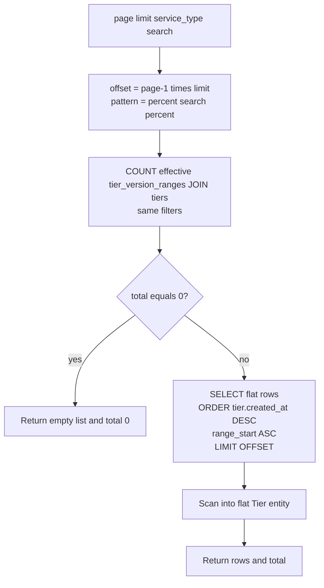

### 3.4 Timeout/retry budget

| Layer | Budget/behavior | HA effect | Risk |
|---|---|---|---|
| Envoy → ACR | `2s` | ACR unavailable mặc định fail-closed | Auth dependency chậm → request bị chặn |
| Envoy → Cost Manager connect | `1s` | Fail fast khi endpoint chết | Cluster hiện chỉ một endpoint khai báo |
| Envoy API route | `15s` | Retry 1 lần trên connect/refused/reset | Không retry HTTP 5xx; GET retry an toàn về semantics |
| Envoy per try | `5s` | Bound mỗi attempt | Tổng path có thể bị budget chồng nhau |
| Handler → DB | `5s` | Hủy query khi quá hạn | DB chậm → `500`, không map riêng `504` |
| DB pool | Bounded pool | Backpressure | Search rộng có thể giữ connection lâu |

### 3.5 Route activation chain

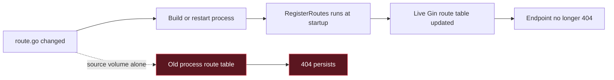

| Observation | Root cause | Required action |
|---|---|---|
| Source đã có `/billing`, runtime vẫn 404 | Gin route table được dựng khi process start; `go run` không hot-reload | Restart/redeploy Cost Manager workload, rồi probe canonical endpoint |
| ACR log ALLOWED nhưng client nhận 404 | Edge đã forward; downstream route không match hoặc runtime cũ | Kiểm tra live route/process, không đổ lỗi mặc định cho forwarder |

---

## 4. Auth, security và trust boundary

### 4.1 Decision flow AS-IS

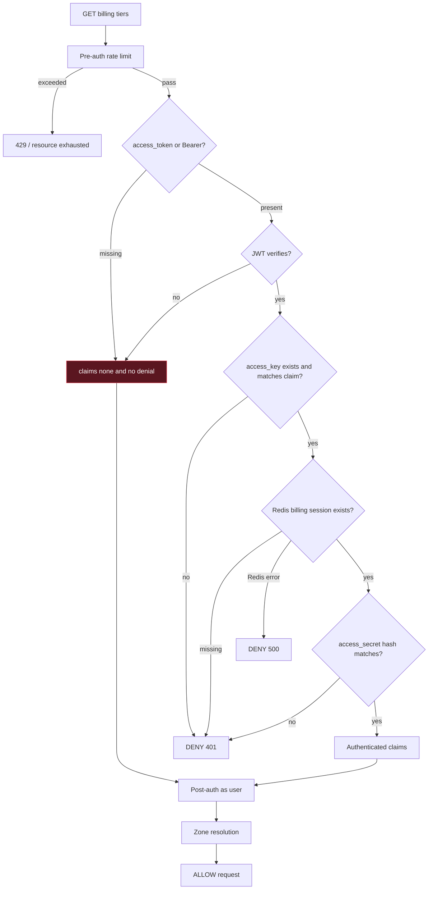

### 4.2 Critical security finding

| ID | Severity | Cause | Effect | Current evidence | Required invariant |
|---|---|---|---|---|---|
| TIER-SEC-001 | **P0** | Thiếu JWT hoặc JWT verify lỗi trả `claims=None`, `denial_response=None` | `ext_authz` tiếp tục với user `anonymous`, cuối flow trả ALLOW | `billing/verify.rs` missing-token và verify-error branches; `ext_authz.rs` không require `billing_claims.is_some()` | Mọi `/api/v1/billing/**` ngoài explicit public allowlist phải DENY nếu không có claims hợp lệ |

### 4.3 Security control matrix

| Control | AS-IS | Good property | Gap/risk |
|---|---|---|---|
| TLS/HSTS | Envoy edge | Bảo vệ transport | Phụ thuộc DNS/cert vận hành |
| HttpOnly Secure cookies | Login/session | JS không đọc secret | SameSite/CSRF vẫn phải kiểm đúng |
| JWT signature/expiry | ACR | Chống sửa token | Verify phụ thuộc Vault mỗi billing request; cần xác nhận issuer/audience policy |
| Redis revocation | ACR | Session có thể revoke | Redis auth error fail-closed 500 |
| Access secret hash | ACR | Ràng buộc Trinity session | Cần constant-time compare nếu threat model yêu cầu |
| CSRF | Chỉ chạy khi có claims | Bảo vệ authenticated mutations | Anonymous fail-open né điều kiện; GET Tier ít tác động nhưng lộ catalog |
| Rate limit | Pre/post auth | Có IP/device/user controls | Redis error fail-open; `INCR` và `EXPIRE` tách rời |
| SQL parameters | pgx positional args | Chống SQL injection | Wildcard/scan amplification vẫn còn |
| Identity headers | ACR inject khi có claims | Downstream có trusted context | Cost Manager Tier route không enforce header/auth |
| Direct service port | Cost Manager `8084` | Hữu dụng nội bộ | Nếu publish/bypass network policy thì đi vòng ACR |

### 4.4 Zone coupling

| Cause | Effect on global Tier catalog | Risk |
|---|---|---|
| Billing request luôn chạy zone resolution | Cookie/header zone stale hoặc zone inactive có thể chặn Tier | Global catalog bị phụ thuộc domain zone không cần thiết |
| Anonymous fail-open vẫn đi zone resolution | Có thể cho qua hoặc fail khác nhau tùy context | Hành vi auth khó dự đoán, khó quan sát |

### 4.5 Trust boundary bắt buộc

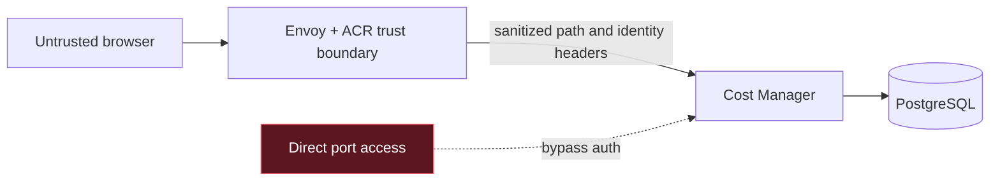

| Boundary rule | Enforcement target |
|---|---|
| Không trust client-supplied `x-user-*` | Envoy phải strip/overwrite; ACR inject |
| Cost Manager không public trực tiếp | Kubernetes NetworkPolicy/security group/internal-only service |
| Billing route phải require claims | ACR explicit deny, không dựa vào absence of denial |
| Catalog read policy phải explicit | Chọn public hoặc authenticated; không để “vô tình public” |

---

## 5. Frontend state flow và races

### 5.1 State machine AS-IS

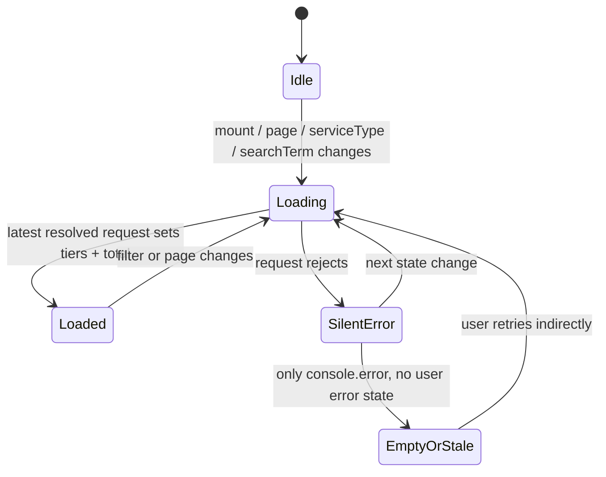

### 5.2 UI cause/effect table

| User action | State mutation | Network effect | Render effect |
|---|---|---|---|
| Mở tab Tier | Component mount | 1 request; dev StrictMode có thể 2 | Loading → table |
| Gõ một ký tự | `searchTerm` đổi, page reset 1 | Request ngay mỗi keystroke | Có thể flicker/race |
| Đổi service | `serviceType` đổi, page reset 1 | Request mới | Badge-filtered rows |
| Previous/Next | `page` đổi | Request page mới | Pagination |
| Request lỗi | Chỉ `console.error` | Không retry/cancel | Dữ liệu cũ hoặc empty message; user không biết lỗi |

### 5.3 Out-of-order response race

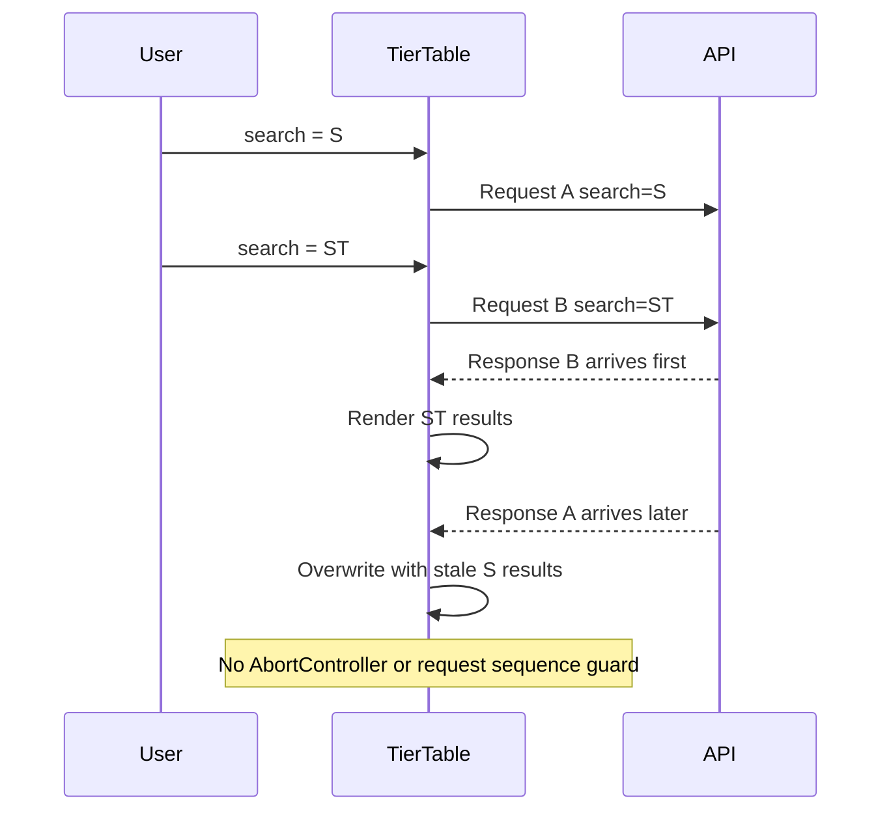

| Race | Severity | Root cause | Effect | Control target |
|---|---|---|---|---|
| Stale result overwrite | P1 | Mọi response đều được `setTiers` | Filter hiện tại nhưng rows của filter cũ | Abort previous request hoặc monotonic request ID |
| Loading false quá sớm | P2 | Request cũ `finally` chạy khi request mới còn pending | Spinner tắt dù request mới chưa xong | Track active request count/ID |
| Request burst | P2 | Không debounce search | Tăng load ACR/Redis/Vault/API/DB | Debounce 250–400ms + min length policy |
| Error looks like empty/stale | P2 | Không có `error` state | Chẩn đoán sai “không có Tier” | Explicit error view + retry action |

---

## 6. Cause → effect control matrix

| ID | Trigger/cause | Immediate effect | Downstream effect | User symptom | Control/decision |
|---|---|---|---|---|---|
| TIER-CE-001 | Cost Manager thiếu `/api/v1/billing/tiers` | Gin no route | Envoy nhận downstream 404 | API 404 | Canonical route contract test |
| TIER-CE-002 | Source route đã sửa, process chưa restart | Live route table cũ | 404 tiếp tục | “Code đúng nhưng API vẫn 404” | Restart/redeploy + readiness probe |
| TIER-CE-003 | ACR giữ nguyên billing path | Downstream nhận `/billing/tiers` | Route chỉ `/api/v1/tiers` không match | 404 | Downstream canonical route phải có `/billing` |
| TIER-CE-004 | Thiếu/sai JWT | ACR returns no claims/no denial | Anonymous request được ALLOW | Catalog truy cập không auth | P0 explicit deny |
| TIER-CE-005 | access_key/secret thiếu hoặc sai | ACR deny | Không tới Cost Manager | 401 | Clear cookies/re-auth; audit log |
| TIER-CE-006 | Redis session missing | Session expired/revoked | Không tới Cost Manager | 401 | Re-login; session expiry metric |
| TIER-CE-007 | Redis auth lookup error | ACR fail-closed | Request dừng ở edge | 500/503-like auth failure | Redis HA + SLO + circuit policy |
| TIER-CE-008 | Redis rate-limit error | Rate limit fail-open | Burst tới Vault/API/DB | Latency/load spike | Atomic Lua + explicit failure policy |
| TIER-CE-009 | ACR/Vault >2s | ext_authz timeout | Envoy chặn API | 5xx | Cache verified key material; HA Vault |
| TIER-CE-010 | Stale zone context | Zone resolution rejects | Global catalog bị chặn | 403 hoặc auth error | Tách global catalog khỏi zone requirement nếu policy cho phép |
| TIER-CE-011 | `service_type` lạ | Query exact match none | `total=0` | Empty table | Allowlist + 400 hoặc documented empty semantics |
| TIER-CE-012 | Search chứa `%`/`_` | SQL wildcard broadened | Scan rộng | Chậm/kết quả bất ngờ | Escape wildcard hoặc document pattern search |
| TIER-CE-013 | Search đổi nhanh | Concurrent requests | Response cũ overwrite mới | Rows không khớp input | Cancel/sequence guard |
| TIER-CE-014 | Insert/delete giữa COUNT và SELECT | Hai statement thấy hai snapshots | `total` lệch rows | Page count sai tạm thời | Repeatable-read transaction hoặc single query/window count |
| TIER-CE-015 | Nhiều row cùng sort key | Thứ tự không deterministic | OFFSET page duplicate/missing | Row nhảy giữa page | Add unique `r.id` tie-breaker; cân nhắc cursor |
| TIER-CE-016 | Range overlap/gap | Catalog chứa pricing ambiguity | Engine tương lai tính sai | Charge dispute | DB/domain invariants trước khi wiring engine |
| TIER-CE-017 | Đổi `base_unit_price` | API/UI đổi | Engine không đổi | UI price khác actual charge | Không release price change nếu chưa reconcile engine |
| TIER-CE-018 | DB/API error | Handler maps generic 500 | UI chỉ console error | Empty/stale table | Typed errors, UI error state, trace ID |
| TIER-CE-019 | Cost Manager chỉ một endpoint | Pod chết/unready | Envoy không có backend tốt | 503 | >=2 replicas + health-aware discovery |
| TIER-CE-020 | Direct 8084 reachable | Bypass Envoy/ACR | Unauthenticated DB read | Security exposure | NetworkPolicy/internal Service |

---

## 7. Database consistency và pagination races

### 7.1 COUNT/SELECT split-brain window

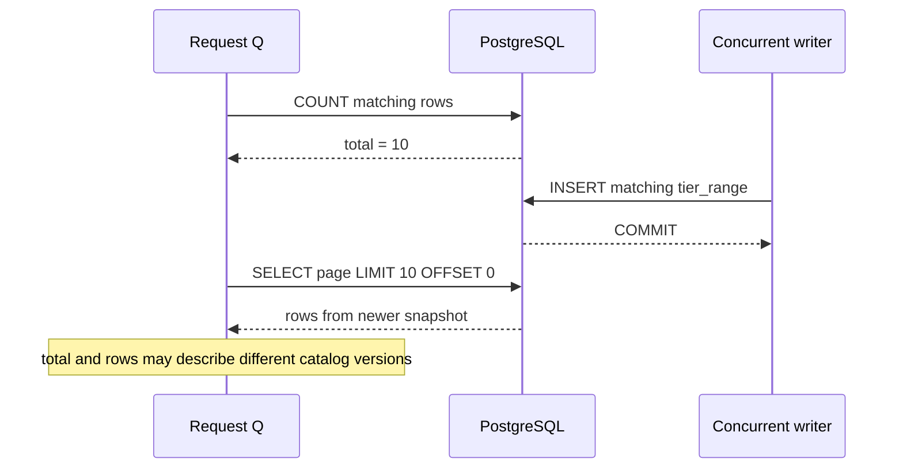

### 7.2 Risk register — logic/data

| Risk | Severity | AS-IS evidence | Failure mode | Target invariant |
|---|---|---|---|---|
| Two-statement snapshot drift | P1 | COUNT then SELECT outside explicit transaction | Total/rows mismatch | One logical snapshot |
| Offset drift under writes | P1 | LIMIT/OFFSET | Duplicate/missing rows across pages | Stable cursor or immutable snapshot version |
| Non-unique ordering | P1 | `created_at DESC, range_start ASC` | Ties reorder | Append `r.id ASC` |
| No overlap/gap constraints | P0 before engine wiring | Schema has PK/FK only | Ambiguous/unpriced usage | Transactional validation + constraints |
| Sentinel `range_end=0` | P1 | Convention only | Unlimited and zero boundary confused | Explicit nullable infinity or CHECK |
| Parent/range timestamp mismatch | P2 | Range created + parent updated | Audit/change detection wrong | Range `updated_at` + catalog version |
| Large OFFSET | P2 | Page has no max | Increasing DB work | Cursor pagination / max page |
| Search scan | P2 | Leading `%` ILIKE | Sequential scans/load amplification | Trigram index or prefix policy |
| Version/range lookup index | Implemented | `(tier_id,effective_from)` và `(tier_version_id,range_start)` | Theo dõi query plan khi catalog lớn |

### 7.3 Safe future mutation transaction

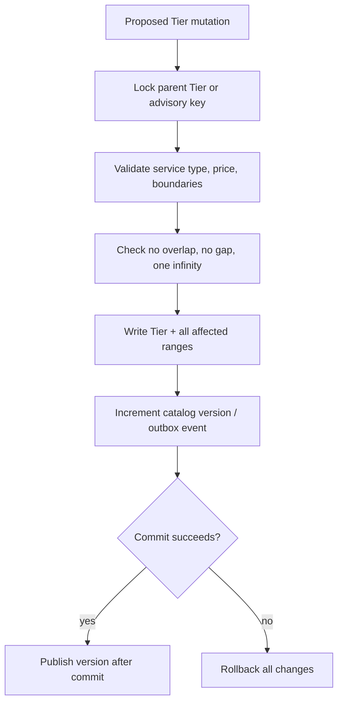

> Không thêm mutation endpoint đơn lẻ kiểu “update một range” trước khi có transaction boundary cho toàn bộ Tier. Một Tier hợp lệ là invariant của **cả tập ranges**, không phải từng row độc lập.

### 7.4 Immutable pricing version contract

| Concern | Contract |
|---|---|
| Metadata endpoint | `PATCH /api/v1/billing/tiers/metadata` chỉ sửa `name`, tăng `metadata_version` |
| Pricing endpoint | `POST /api/v1/billing/tiers/versions` append một immutable pricing snapshot |
| Lookup identity | Client gửi `code + service_type`; repository lookup bằng cả hai field |
| Immutable identity | `code`, `service_type` tuyệt đối không nằm trong `SET` |
| Missing parent | Repository trả taxonomy `ErrTierNotFound`; HTTP trả `404` |
| Pricing OCC | Client gửi `expected_latest_version`; lệch trả `409` |
| Metadata OCC | Client gửi `metadata_version`; sửa name không tạo pricing version/outbox |
| Range semantics | Version mới chứa toàn bộ ranges mới; không update/delete ranges đã publish |
| Atomicity | Version, ranges và outbox cùng một PostgreSQL transaction |
| Boundary | Chuẩn `[range_start, range_end)`; `range_end = 0` là infinity |

Mỗi `service_type` chỉ có một Tier. Database giữ `UNIQUE(service_type)`. Mỗi pricing version phải
chứa chuỗi range liên tục bắt đầu tại `0`, không gap/overlap, đúng một infinity ở cuối và price không âm.

### 7.5 Outbox, Engine L1 và safe activation

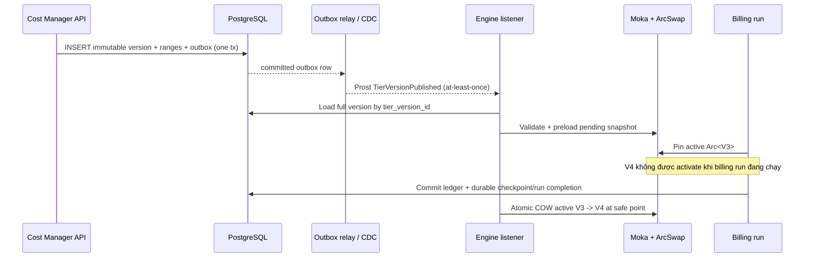

PostgreSQL là durable pricing SoT; event chỉ là notification. Engine bootstrap lại active/scheduled/
historical versions từ DB khi L1 trống hoặc process restart. Prost chỉ dùng cho transport; runtime
calculation dùng immutable Rust structs. Moka cache theo `tier_version_id`, không cache từng range;
`ArcSwap<CatalogSnapshot>` là active pointer.

Billing run pin `tier_version_id` bền vững trong `billing.billing_runs`. Listener được preload version
mới trong lúc job chạy nhưng chỉ activate sau khi ledger và checkpoint của run đã hoàn tất. Crash/failover
phải resume đúng pinned version. Không có pricing snapshot hợp lệ thì fail-closed, không dùng fallback price.
Version cho run mới được chọn tại billing-run boundary (`window_end`) trong active catalog; run retry/replay
không resolve lại theo clock mà dùng đúng pinned ID. Đây là policy “giá mới áp dụng từ lần tính kế tiếp” đã chốt.

Engine áp dụng progressive formula trên từng metering quantity theo MB: với mỗi range `[start,end)`,
`billable_units = max(0, min(quantity,end)-start)` (infinity dùng chính quantity), sau đó cộng
`billable_units * base_unit_price`. Micro-units chỉ đổi sang currency unit sau khi cộng toàn bộ ranges;
không dùng `f64`. Billing-period aggregation khác từng metering row phải được bổ sung thành workflow
riêng nếu product chuyển semantics quota/range sang monthly cumulative usage.

---

## 8. HA, cloud-native và performance posture

### 8.1 Current vs target

| Concern | AS-IS | Target HA/cloud-native | Priority |
|---|---|---|---|
| Cost Manager replicas | Envoy config trỏ một logical endpoint | >=2 replicas, readiness/liveness, PDB, anti-affinity | P1 |
| ACR dependency | ext_authz fail-closed khi unreachable | >=2 replicas, low-latency SLO, bounded queue | P1 |
| Redis session | Hard dependency cho valid session | Redis HA/Sentinel/Cluster, persistence appropriate to revocation SLA | P1 |
| Vault JWT verify | Per-request dependency observed | HA Vault + locally cached versioned public verification keys | P1 |
| PostgreSQL | Bounded pgx pool | HA primary/failover, backups, PITR, pool sized per replica | P1 |
| Tier caching | None | Versioned cache only after invalidation semantics defined | P2 |
| Search | Leading wildcard | Trigram index or constrained search contract | P2 |
| Pagination | OFFSET | Deterministic cursor for large/mutable datasets | P2 |
| Migration | Embedded migration + advisory lock | Giữ serialized migration; tách migration job khi rollout scale lớn | P1 |
| Price rollout | Immutable version/effective time/outbox đã có | Bổ sung operator audit UI và retention policy | P1 |

### 8.2 Dependency blast radius

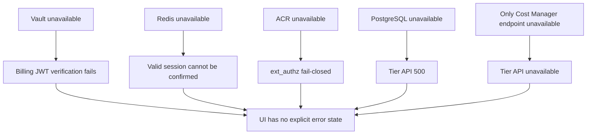

### 8.3 Retry safety

| Operation | Safe to retry? | Condition |
|---|---:|---|
| `GET /billing/tiers` | Có | Read-only; retry only transient connect/reset, bounded |
| Metadata mutation | Có | `metadata_version` OCC; retry chỉ với cùng expected version |
| Pricing publish | Có điều kiện | `expected_latest_version`, append-only transaction và duplicate-safe outbox consumer |
| DB transaction mutation | Có thể | Retry serialization/deadlock với bounded attempts, không publish trước commit |

---

## 9. Failure matrix và runbook

### 9.1 HTTP/failure ownership

| Symptom/status | Likely owner | First evidence | Likely cause |
|---|---|---|---|
| `404` | Cost Manager routing/runtime | Envoy upstream status + Gin route log | Route thiếu hoặc process chưa restart |
| `401` | ACR billing verify | `billing.verify` / authz log | Key/secret/session expired |
| `403` | ACR policy/zone/CSRF | Authz reason | Zone/context mismatch |
| `429` | ACR rate limiter | Pre/post rate key | Request burst |
| `500` from API | Handler/repository/DB | `handler.tier.list` log | Bind-independent repository failure |
| Envoy `5xx` before upstream | Envoy/ACR/cluster | Envoy access log flags | ext_authz timeout, connect failure, no healthy upstream |
| `200`, empty | Valid business response or bad filter | Query params + total | No match; service type not validated |
| `200`, wrong/stale rows | UI/database race | Request timing + filter state | Out-of-order response or snapshot drift |
| UI says empty after failure | Cost Console | Browser console/network | Missing UI error state |

### 9.2 Diagnostic decision tree

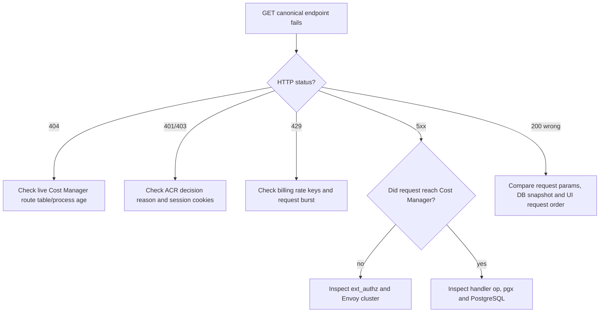

### 9.3 Read-only runbook

| Step | Check | Expected | If not |
|---:|---|---|---|
| 1 | Request exact `/api/v1/billing/tiers?page=1&limit=10` | Không 404 | Kiểm route/runtime version |
| 2 | Correlate Envoy request ID/status/upstream | `cost_manager_cluster` selected | Kiểm host/prefix/vhost |
| 3 | Inspect ACR auth decision | Authenticated claim required by target policy | P0 nếu anonymous ALLOW |
| 4 | Inspect Cost Manager handler log | `handler.tier.list` reached | Nếu không: edge/route issue |
| 5 | Compare `pagination.total` with count filter | Cùng logical catalog version | Nếu lệch: snapshot race |
| 6 | Verify ranges for each Tier | Ordered, no gap/overlap, one infinity | Block price publication |
| 7 | Compare UI Tier price with engine price source | Expected to differ AS-IS | Không tuyên bố Tier governs billing |

### 9.4 Observability contract cần có

| Signal | Labels/fields tối thiểu | Purpose |
|---|---|---|
| `tier_list_requests_total` | status, service_type, auth outcome | Error/traffic rate |
| `tier_list_duration_seconds` | layer, result | Latency budget |
| `tier_list_rows` | page_size, service_type | Cardinality/load |
| `billing_auth_decisions_total` | authenticated/anonymous/denied, reason | Detect fail-open |
| `tier_catalog_version` | version/effective_at | Reconcile API/engine |
| Trace | request_id, user hash, route, DB spans | Root-cause across edge/API/DB |
| Audit event | actor, before/after, catalog version | Future mutations/non-repudiation |

> Không log raw `access_token`, `access_key` hoặc `access_secret`. Log identity phải hash/redact theo policy.

---

## 10. Test matrix và acceptance gates

### 10.1 Required tests

| Layer | Test | Expected |
|---|---|---|
| Route | Canonical GET `/api/v1/billing/tiers` | Handler matched, không 404 |
| Route | `/api/v1/tiers` | 404 trừ khi compatibility policy được thêm có chủ đích |
| Auth | Không JWT | 401/403, tuyệt đối không ALLOW |
| Auth | JWT invalid | 401/403 |
| Auth | JWT valid, Redis session absent | 401 |
| Auth | JWT valid, secret mismatch | 401 |
| Auth | Valid Trinity session | 200 + request tới Cost Manager |
| Input | `page<=0`, `limit<=0`, `limit>100` | Normalize đúng contract |
| Input | Invalid integer binding | 400 |
| Input | Invalid service type | Decision phải explicit: 400 khuyến nghị |
| Repository | No matching rows | `[]`, total 0 |
| Repository | Stable order ties | Không đổi thứ tự giữa calls |
| Repository | Concurrent insert/delete | Total/rows cùng snapshot/version |
| Schema | Negative price/range | DB rejects |
| Schema | Overlap/gap/multiple infinity | Transaction rejects |
| UI | Rapid search A → AB | Chỉ AB được render |
| UI | Request error | Explicit error + retry, không giả empty |
| E2E | Source route deployed | Readiness và canonical probe pass trước traffic shift |
| Reconciliation | Tier price vs engine price | Không divergence khi Tier trở thành charge SoT |

### 10.2 Release gates

| Gate | Condition | Current status |
|---|---|---|
| G0 — Contract | Canonical route + response test | Route hiện có; dedicated test cần xác nhận |
| G1 — Security | Anonymous/invalid JWT denied | **FAIL — P0** |
| G2 — Integrity | Range invariants enforced | **PARTIAL — API + CHECK pass; direct-DB no-gap enforcement chưa có** |
| G3 — Determinism | Stable order + consistent count/page | **FAIL** |
| G4 — HA | >=2 healthy API/ACR endpoints, dependency SLO | Chưa chứng minh |
| G5 — UX | Cancel/debounce/error state | **FAIL** |
| G6 — Pricing reconciliation | API catalog == charge source | **PARTIAL — wired; cần PostgreSQL/NATS/ledger integration reconciliation test** |

### 10.3 Definition of Done khi Tier trở thành pricing SoT

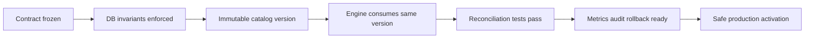

Không được đánh dấu “Tier drives billing” cho tới khi tất cả điều kiện sau đạt:

| # | Condition |
|---:|---|
| 1 | Boundary/progressive pricing formula được định nghĩa bằng ví dụ executable |
| 2 | DB chặn negative, overlap, gap, multiple infinity và invalid service type |
| 3 | Mỗi catalog change có version, effective time, actor và audit trail |
| 4 | Cost Engine đọc đúng Tier version thay vì `billing.prices`/fallback |
| 5 | Usage event gắn pricing version để replay deterministic |
| 6 | Reconciliation test chứng minh UI quote = engine charge |
| 7 | Rollback không sửa lịch sử charge đã chốt |

---

## 11. Change control

### 11.1 Impact checklist

| Khi thay đổi | Phải kiểm tra |
|---|---|
| Route/path | UI client, Envoy match, ACR classifier/rewrite exclusion, Gin route, E2E probe |
| Request params | DTO, UI state, indexes/query plan, API docs, invalid input behavior |
| Response field | DB lineage, entity, handler map, TypeScript interface, render/tests |
| Range semantics | Schema constraints, seed, engine formula, invoices, reconciliation |
| Auth policy | Session endpoint, ext_authz, zone dependency, direct-port isolation |
| Pagination/order | Unique sort key, concurrent writes, total semantics, UI page state |
| Cache | Key dimensions, catalog version, invalidation, stale-read SLA |
| Mutation | Transaction, lock/version precondition, outbox, audit, rollback |
| Deployment | Migration compatibility, readiness, rolling update, rollback order |

### 11.2 Decision log template

| Field | Required content |
|---|---|
| Decision | Điều gì được thay đổi/chốt |
| Cause | Vấn đề hoặc requirement gốc |
| Expected effect | Hành vi downstream mong muốn |
| Unintended effects | Blast radius/races/security |
| Invariants | Điều luôn phải đúng |
| Evidence | Test, query plan, metric, migration check |
| Rollback | Cách quay lại không làm hỏng dữ liệu lịch sử |
| Owner/date | Người chịu trách nhiệm và effective time |

---

## 12. Source map

| Concern | Source of implementation truth |
|---|---|
| Frontend Tier API/types | `cost-console/src/lib/api/billing.ts` |
| Shared fetch/error unwrap | `cost-console/src/lib/api/fetcher.ts` |
| Tier UI state/render | `cost-console/src/page/plan/sections/TierTable.tsx` |
| Envoy Cost Manager route/ext_authz | `controlplane/dev/envoy/envoy.yaml` |
| Billing path/auth orchestration | `acr/src/gateway/ext_authz.rs` |
| Billing session verification | `acr/src/billing/verify.rs` |
| Billing rate limits | `acr/src/gateway/ratelimit.rs` |
| Cost Manager route | `cost-manager/api/internal/app/route.go` |
| Tier query DTO | `cost-manager/api/internal/transport/http/dto/tier_dto.go` |
| Tier handler/response | `cost-manager/api/internal/transport/http/handler/tier_handler.go` |
| Tier service | `cost-manager/api/internal/service/tier_service.go` |
| Tier repository/SQL | `cost-manager/api/internal/repository/tier_repo.go` |
| Flat Tier entity | `cost-manager/api/internal/domain/entity/tier.go` |
| Immutable pricing/outbox/run schema | `cost-manager/api/migrations/000002_tables.up.sql` |
| Tier seed | `cost-manager/api/migrations/000006_seeds.up.sql` |
| Outbox relay + Prost publish | `cost-manager/api/internal/service/pricing_outbox_relay.go`, `pricing_event.proto` |
| Engine bootstrap/Moka/ArcSwap | `cost-manager/engine/src/engine/runtime.rs`, `snapshot.rs` |
| Storage egress pinned charge | `cost-manager/engine/src/service/storage/egress_billing.rs` |
| Storage owner resolution | `god_view/billing/storage_usage_billing_god_view.md` |
| Wallet and ledger | `god_view/billing/wallet_ledger_god_view.md` |
| Free Tier credit/entitlement | `god_view/billing/free_tier_entitlement_god_view.md` |

---

## 13. Executive risk summary

| Priority | Finding | Why it matters | Exit condition |
|---:|---|---|---|
| 1 | Billing missing/invalid JWT can fail-open | Catalog protection is accidental, not enforced | Explicit deny tests pass |
| 2 | Runtime reconciliation chưa có integration proof | Deployment/config drift có thể làm Engine chưa nhận version | E2E outbox, bootstrap, ledger reconciliation |
| 3 | Range integrity is not constrained | Future engine can overcharge/undercharge | DB + transactional invariants |
| 4 | UI requests race | User can see stale rows for current filter | Cancel/sequence guard |
| 5 | COUNT and SELECT are separate snapshots | Pagination metadata can contradict rows | Single snapshot/version |
| 6 | Offset ordering is non-deterministic | Rows can duplicate/disappear across pages | Unique order/cursor |
| 7 | Single logical Cost Manager endpoint and several hard dependencies | Wider outage blast radius | Replicas, health routing, dependency HA |
| 8 | Errors are hidden in UI | Operators/users misdiagnose failures as empty data | Explicit error state + request correlation |

**Current authoritative conclusion:** Tier pricing source đã chuyển sang immutable PostgreSQL versions. Cost Manager tách metadata update khỏi pricing publish và ghi transactional outbox; Engine bootstrap/cache bằng Moka, pin version trong durable billing run và chỉ COW `ArcSwap` sau completion. Source compile/unit tests đã pass nhưng production gate vẫn cần integration reconciliation với PostgreSQL, NATS, ClickHouse và ledger; GET auth fail-open/pagination races vẫn là rủi ro độc lập cần xử lý.
