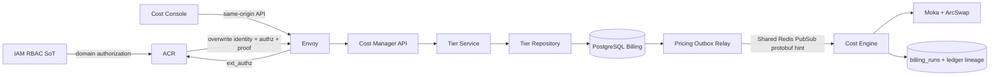
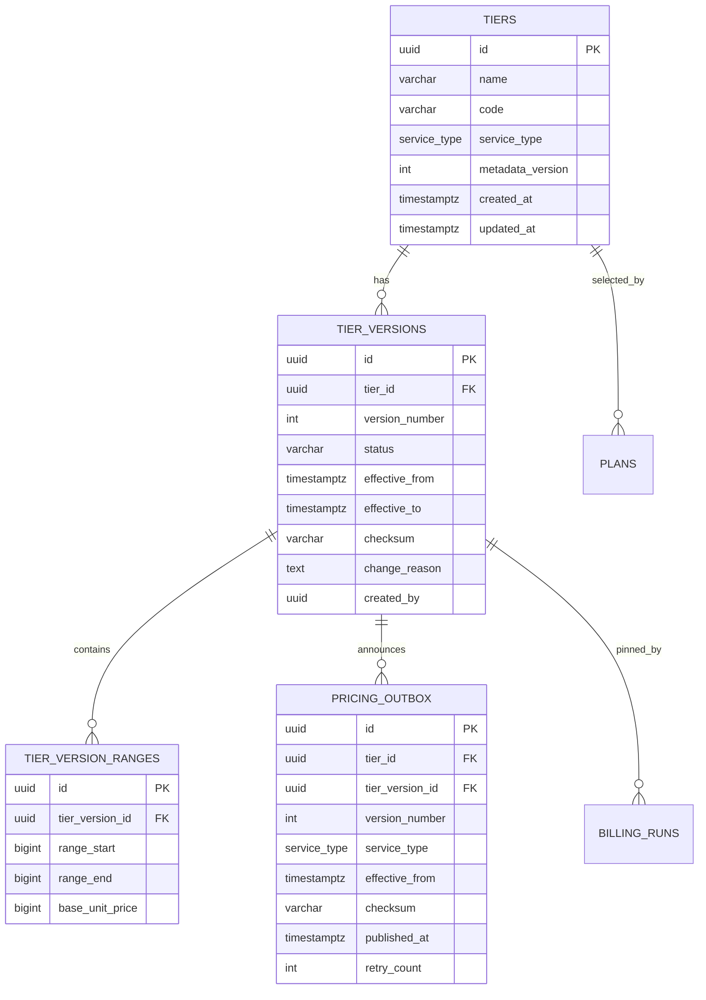
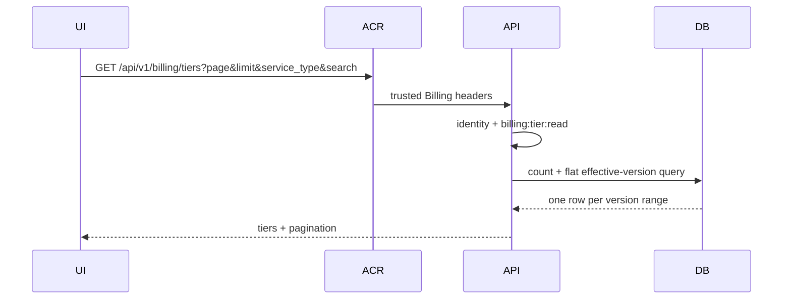

# Tier Catalog — God View (Master SoT)

> Đây là SoT cho toàn bộ workflow đọc metadata Tier, publish immutable pricing version, phát outbox và Cost Engine pin/COW snapshot. Auth handoff chi tiết nằm tại `god_view/billing/cost_console_domain_trinity_god_view.md`.

## 0. Control header

| Thuộc tính | AS-IS contract |
|---|---|
| Public host | `https://cost-manager.aurora.local` |
| Read routes | `GET /api/v1/billing/tiers`, `GET /api/v1/billing/tiers/:service_type/:code` |
| Critical write routes | `PATCH /api/v1/billing/critical/tiers/:service_type/:code/metadata`, `POST /api/v1/billing/critical/tiers/:service_type/:code/versions` |
| Identity | IAM user → ACR Billing domain Trinity |
| Read permission | `billing:tier:read` |
| Write permission | `billing:tier:publish` + verified Ed25519 session proof |
| Stable identity | `(service_type, code)`; cả hai immutable |
| Mutable metadata | `name`, protected by `metadata_version` OCC |
| Pricing write model | Full immutable aggregate per `tier_version` |
| Pricing event | Transactional `billing.pricing_outbox` |
| Engine L1 | Moka by version UUID + `ArcSwap<CatalogSnapshot>` |
| Durable run pin | `billing.billing_runs.tier_version_id` |
| Currency unit | USD micro-units; integer `BIGINT` |
| Range boundary | Progressive `[range_start, range_end)`; `range_end=0` only for final infinity |

## 1. Non-negotiable invariants

1. `code` và `service_type` không được sửa sau khi Tier được tạo.
2. Sửa `name` không tạo pricing version và không phát pricing outbox.
3. Sửa boundary/price luôn append một full snapshot mới; không update/delete ranges cũ.
4. Mỗi version phải bắt đầu tại `0`, liên tục, không gap/overlap, và kết thúc bằng đúng một infinity range.
5. Version đã được billing run pin phải replay được vĩnh viễn; FK dùng `RESTRICT`.
6. Engine đang chạy không bị đổi snapshot giữa chừng. Event chỉ preload; activation chờ lease/run boundary an toàn.
7. Client không chọn zone tùy ý. Cost API dùng `x-zone-id` đã bind trong Billing Trinity.
8. Mutation thiếu nonce Ed25519 hoặc exact permission phải fail trước handler.

## 2. Component boundaries



| Component | Owns | Không được làm |
|---|---|---|
| Cost Console | Filter/page/Edit form, target-origin critical signer | Không tự tính final charge |
| ACR | Billing Trinity, zone binding, permission headers, session proof | Không đọc Tier tables |
| Middleware | Parse trusted identity, exact permission, proof marker | Không authorize bằng role name |
| Handler | Path/query/body validation, timeout, response envelope | Không sửa pricing history trực tiếp |
| Service | Aggregate invariants, checksum, effective-time rules | Không partial-update ranges |
| Repository | Transaction/OCC/locking/outbox atomically | Không publish trước PostgreSQL commit |
| Relay | Batch drain committed outbox, retry/backoff | Không xóa immutable business rows |
| Engine | Load/validate/cache/pin/charge | Không fallback giá hard-code |

## 3. Route and authorization matrix

| Route | Middleware | Handler |
|---|---|---|
| `GET /api/v1/billing/tiers` | identity + `billing:tier:read` | `ListTiers` |
| `GET /api/v1/billing/tiers/:service_type/:code` | identity + `billing:tier:read` | `GetTierDetail` |
| `PATCH /api/v1/billing/critical/tiers/:service_type/:code/metadata` | identity + proof + `billing:tier:publish` | `UpdateTierMetadata` |
| `POST /api/v1/billing/critical/tiers/:service_type/:code/versions` | identity + proof + `billing:tier:publish` | `CreateTierVersion` |

Envoy và ACR giữ nguyên path. `/api/v1/tiers` và legacy mutation routes không phải compatibility routes.

`service_type` được trim rồi allowlist: `STORAGE`, `NETWORK_IN`, `NETWORK_OUT`, `VM`. `code` phải match `^[A-Z][A-Z0-9_]{0,63}$`.

## 4. Durable data model



### 4.1 Identity and uniqueness

- DB unique `(code, service_type)`.
- Mỗi Tier có monotonic unique `(tier_id, version_number)`.
- Mỗi version unique `(tier_version_id, range_start)`.
- Range, version, Tier và billing-run linkage dùng UUID.
- `created_by` lấy từ parsed Billing identity context, không từ body/header raw.

### 4.2 Range semantics

Với sorted ranges `r[0..n-1]`:

```text
r[0].range_start == 0
for i < n-1: r[i].range_end == r[i+1].range_start
for i < n-1: r[i].range_end > r[i].range_start
r[n-1].range_end == 0
base_unit_price >= 0
```

Charge progressive tính riêng phần quantity nằm trong từng interval. `range_end=0` không có nghĩa là zero-length; nó là infinity sentinel của range cuối.

## 5. Read workflows

### 5.1 List



`limit` mặc định 10, tối đa 100; `page` mặc định 1. Flat list phục vụ table, không được dùng để dựng Edit snapshot vì pagination có thể cắt mất ranges.

### 5.2 Detail for Edit

UI luôn gọi detail bằng immutable identity trong path. Response gồm:

- Tier `id`, `code`, `service_type`, `name`, `metadata_version`;
- full latest version `id`, `version_number`, effective window, checksum;
- toàn bộ sorted ranges.

Không gửi range IDs cũ khi publish. IDs thuộc lịch sử và không được mutate.

## 6. Metadata update

Request:

```json
{
  "name": "Standard Storage",
  "metadata_version": 3
}
```

Transaction chỉ update Tier nếu `(service_type, code, metadata_version)` match. Thành công tăng `metadata_version` một lần. `row affected = 0` phải phân loại:

- Tier identity không tồn tại → `404 TIER_NOT_FOUND`;
- Tier tồn tại nhưng version khác → `409 TIER_VERSION_CONFLICT`.

Không insert `tier_versions`; không insert outbox; Engine cache không đổi.

## 7. Pricing publish workflow

Request là complete aggregate:

```json
{
  "expected_latest_version": 4,
  "effective_from": "2026-07-24T00:00:00Z",
  "change_reason": "July storage pricing",
  "ranges": [
    {"range_start": 0, "range_end": 10737418240, "base_unit_price": 10},
    {"range_start": 10737418240, "range_end": 0, "base_unit_price": 8}
  ]
}
```

```mermaid
sequenceDiagram
    participant UI as Cost criticalFetcher
    participant ACR
    participant API
    participant DB
    participant Relay
    participant Engine
    UI->>ACR: request nonce
    ACR-->>UI: challenge
    UI->>ACR: POST critical versions + Ed25519 proof
    ACR->>API: proof=true + IAM actor/permission
    API->>API: validate full sorted aggregate + checksum
    API->>DB: BEGIN, lock Tier/version boundary
    DB->>DB: compare expected latest version
    DB->>DB: insert version + all ranges + outbox
    DB->>DB: commit
    API->>Relay: non-blocking local wake
    API-->>UI: 201 immutable version
    Relay->>DB: claim committed outbox batch
    Relay->>Engine: TierVersionPublished protobuf
    Engine->>DB: load version and verify checksum
    Engine->>Engine: preload Moka; activate at safe boundary
```

### 7.1 Concurrency

| Race | Control | Result |
|---|---|---|
| Hai admin publish cùng latest version | row lock + `expected_latest_version` OCC | Một commit; một `409` |
| Metadata và pricing đồng thời | metadata OCC riêng; pricing version riêng | Không tạo false conflict nếu name độc lập |
| Hai event relay replicas | outbox claim/locking | Một logical publish attempt per claim |
| Duplicate Redis PubSub event | `(tier_version_id, checksum)` idempotent preload | Không duplicate catalog version |
| Event tới khi run đang charge | run giữ pinned `Arc`/version ID | Run dùng giá cũ tới completion |
| Engine crash giữa run | durable `billing_runs.tier_version_id` | Resume đúng version cũ |

DB transaction không đủ để cho phép delete/reinsert: atomic rewrite vẫn phá replay và các run đã pin.

## 8. Outbox and activation

Tier version và outbox record commit trong cùng transaction. Relay không poll mỗi 500 ms. Sau commit service gửi local wake được coalesce; relay drain theo batch. Shared Redis PubSub chỉ là latency hint: relay chỉ mark published khi có listener, còn Startup và periodic reconciliation của Engine là safety net cho crash giữa commit và wake hoặc PubSub outage.

Engine startup load toàn catalog từ PostgreSQL và fail closed nếu catalog rỗng/sai checksum/sai range. Runtime:

1. Shared Redis PubSub event yêu cầu preload exact version.
2. Engine load version từ DB, validate checksum/ranges.
3. Moka cache lưu theo version UUID.
4. `ArcSwap` publish catalog snapshot copy-on-write.
5. Billing worker acquire durable lease và pin exact version cho window.
6. Pending version không thay object mà run đang giữ.
7. Reconciler định kỳ tự chữa event bị mất.

## 9. Zone boundary

Billing Trinity bắt buộc chứa concrete zone UUID. `ListPlans` luôn lấy zone từ middleware identity. Nếu client vẫn gửi `zone_id` query thì giá trị phải đúng bằng session zone; mismatch trả `403`.

Tier base catalog là global business identity nhưng mọi request vẫn có concrete zone để audit/routing. Plan mới là entity áp zone multiplier lên Tier.

## 10. Failure matrix

| Case | Response/behavior |
|---|---|
| Thiếu/sai Billing Trinity | `401` tại ACR/middleware |
| Thiếu read/publish permission | `403` |
| Critical mutation thiếu/replay proof | `403` |
| Invalid `service_type`/`code` | `400` |
| Tier không tồn tại | `404` |
| Metadata/pricing OCC conflict | `409` |
| Effective window conflict | `409` |
| Gap/overlap/missing infinity/negative price | `400` |
| DB timeout/failure trước commit | `500`; không version/outbox partial |
| Commit thành công, process chết trước wake | Startup/jitter reconciler relay record |
| Shared Redis unavailable hoặc không có Engine listener | Outbox giữ unpublished record + retry metadata |
| Engine checksum mismatch | Không activate; billing fail closed cho version đó |
| Catalog empty at Engine startup | Engine bootstrap fails |

## 11. Observability

Metrics/logs cần mang low-cardinality labels; UUID đưa vào structured logs/traces, không dùng làm metric label:

- API request count/latency theo route/status;
- auth denial theo reason (`missing_identity`, `permission`, `proof`, `zone_mismatch`);
- Tier publish conflict/validation failure;
- outbox pending age, retry count, batch size, publish latency;
- Engine event decode/load/checksum failure;
- catalog reconcile duration/result;
- billing run pinned version trong trace/log;
- active/pending version gauge theo service type.

Không log handoff code, JWT, access secret, raw Ed25519 signature hay full permission token.

## 12. Production release gates

- [ ] Greenfield migration không còn `billing.users`.
- [ ] IAM seed RoleEntry test decode đúng root/admin/support/audit/billing_admin snapshots.
- [ ] Billing auth missing/invalid token fail closed.
- [ ] ACR identity/proof headers overwrite client values.
- [ ] NetworkPolicy chỉ cho Envoy gọi Cost Manager HTTP.
- [ ] Middleware tests cover malformed/cross-domain permissions và missing proof.
- [ ] Service tests cover gap, overlap, infinity, overflow và checksum determinism.
- [ ] Repository concurrency test chứng minh một winner khi publish đồng thời.
- [ ] Outbox crash-after-commit recovery test.
- [ ] Engine bootstrap, duplicate event, lost event reconcile và run-resume tests.
- [ ] Cost Console mutation chỉ gọi `criticalFetcher`.
- [ ] Không có legacy employee login route/UI/transport/proto reference.

## 13. Code map

| Concern | File |
|---|---|
| HTTP routes | `cost-manager/api/internal/app/route.go` |
| Trusted identity + permission + proof | `cost-manager/api/internal/transport/middleware/identity.go` |
| Tier input/response | `cost-manager/api/internal/transport/http/handler/tier_handler.go` |
| Tier invariants | `cost-manager/api/internal/service/tier_service.go` |
| Transaction/OCC/outbox | `cost-manager/api/internal/repository/tier_repo.go` |
| Pricing relay | `cost-manager/api/internal/service/pricing_outbox_relay.go` |
| Durable schema | `cost-manager/api/migrations/000002_tables.up.sql` |
| Engine catalog/COW | `cost-manager/engine/src/engine/runtime.rs` |
| Engine range charge | `cost-manager/engine/src/engine/snapshot.rs` |
| Billing run pin | `cost-manager/engine/src/engine/runner.rs` |
| Cost UI API | `cost-console/src/lib/api/billing.ts` |
| Critical base | `cost-console/src/lib/api/criticalFetcher.ts` |
