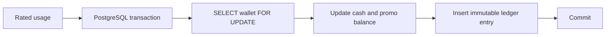

# Wallet and ledger God View

## 1. Money model

All monetary values are signed `BIGINT` USD micro-units. One USD equals `1_000_000` micro-units. Tier
prices, wallet balances, promotional grants and ledger entries therefore share one exact integer unit.



## 2. Invariants

- A wallet is unique by `(owner_id, owner_type, currency)`.
- `wallet_ledger_entries` is append-only. Usage charges are negative; top-ups and grants are positive.
- Wallet mutation and ledger insert commit in the same transaction.
- Usage charge id is deterministic from service/resource/hour so crash or retry cannot double-debit.
- Duplicate ledger id rolls back the attempted balance mutation and is treated as idempotent success.
- Promotional and cash balances are separate. Promotional credit is spent first and cannot become cash.
- Missing owner/wallet produces an `unrated_usage` row with deterministic id rather than a skipped charge.
- Each ledger usage row pins billing run, tier version, resource and ownership lineage.

## 3. HA/race controls

| Race | Control |
|---|---|
| Two engine replicas debit the same wallet | Redis lease + durable fencing + wallet row lock |
| Lease expires during a row transaction | Billing-run fencing token checked under row lock |
| Same ClickHouse aggregate replayed | Deterministic ledger primary key |
| Wallet provisioned after usage | `unrated_usage` durable retry queue |
| Concurrent top-up and usage charge | Same wallet `FOR UPDATE` serialization |

## 4. Source map

| Concern | Source |
|---|---|
| Wallet/ledger schema | `cost-manager/api/migrations/000002_tables.up.sql` |
| Wallet/index constraints | `cost-manager/api/migrations/000003_indexes.up.sql` |
| Egress debit transaction | `cost-manager/engine/src/service/storage/egress_billing.rs` |
| Billing run/version pin | `cost-manager/engine/src/engine/runtime.rs` |

## 5. Cloud Console wallet summary read path

Cloud Console may show a compact personal-wallet snapshot in the global header, but the header is never a billing
authority and must not receive an owner identifier from the browser.

```mermaid
sequenceDiagram
    actor User
    participant CloudUI as Cloud Console
    participant Envoy
    participant Cost as Cost Manager API
    participant PG as Billing PostgreSQL

    CloudUI->>Envoy: GET /api/v1/billing/me/wallet/summary
    Envoy->>Envoy: ext_authz verifies IAM session and injects trusted identity
    Envoy->>Cost: Forward `/api/v1/billing/me/` route branch
    Cost->>Cost: RequireIdentity + fixed self scope
    Cost->>PG: Read PERSONAL/USD wallet by trusted owner_id
    PG-->>Cost: cash + promotional + overdraft + version
    Cost-->>CloudUI: Snapshot; micro-units serialized as strings
```

Invariants:

- The Cloud vhost uses the extensible `/api/v1/billing/me/` prefix to `cost_manager_cluster` before generic
  Controlplane `/api/`; browser code never targets the internal Cost Manager address.
- `/api/v1/billing/me/*` is explicitly self-scoped and uses the normal IAM session. ACR reserves the remaining
  Billing branches (`/billing/tiers`, `/billing/critical/*`, `/billing/auth/*`) for the Cost Console alias.
- `owner_id`, `owner_type` and wallet selection are derived/validated server-side. A client-provided owner header is
  not billing evidence. The `/me` endpoint is fixed to PERSONAL/USD and does not grant the broader operator
  `billing:wallet:read` permission to ordinary platform users.
- The response exposes exact micro-unit components as strings. It is a read snapshot only; it cannot authorize,
  reserve or charge funds.
- Wallet absence returns `404`, authorization failure returns `403`, and a billing/database outage returns `503`;
  the Console must never render an error as zero balance.
- The header uses a bounded memory query with auth-generation fencing and does not poll NATS/Centrifugo for money.
