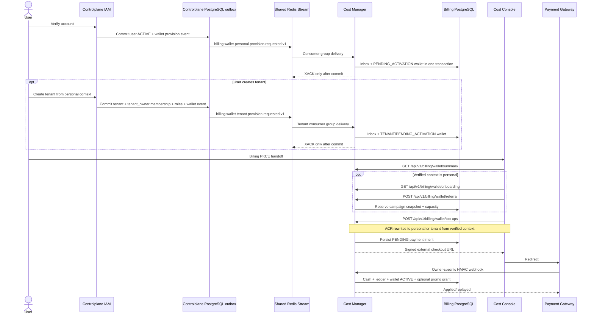

# Personal and tenant wallet payment God View

## 1. Product contract

Aurora does not automatically activate a Free Tier subscription or grant credit when an IAM account is
verified. Verification provisions a zero-balance personal wallet in `PENDING_ACTIVATION`. A verified payment
settlement of at least USD 1 activates the wallet. An optional onboarding referral may add promotional credit
in the same settlement transaction.

Creating a tenant atomically records a zero-balance tenant wallet provision intent. Tenant wallets use the
same verified-payment activation rule, but never reserve or redeem personal referral credit.

The legacy `FREE_TIER` pack and `FREE_TIER_100_USD` campaign remain immutable migration history but seed migration
`000006_seeds.up.sql` moves them to `DEPRECATED`/`ENDED`. No public API activates them.

```text
IAM account ACTIVE != Billing wallet ACTIVE
```

## 2. End-to-end topology



After email activation, Cloud Console links to the configured Cost Console `/auth/start`. The user signs in to
Cloud if needed, then the existing PKCE handoff issues a host-bound Billing Alias. Cloud navigation exposes
Cost Management to every authenticated principal because `/billing/wallet/*` is a neutral owner surface; ACR
rewrites it to exactly one internal personal/tenant branch from the verified session. Admin
campaign and pricing surfaces remain permission-gated by the shared IAM Render Context.

## 3. Wallet provisioning

`billing.wallet.personal.provision.requested.v1` and `billing.wallet.tenant.provision.requested.v1` are durable
Central-internal commands transported by separate Shared Redis Streams. They are not cross-Zone jobs and do
not use Kafka or NATS.

Cost Manager commits:

1. `personal_wallet_provision_inbox` with `user_id`, or
   `tenant_wallet_provision_inbox` with `tenant_id + actor_user_id`;
2. unique `(owner_id, owner_type, currency)` wallet;
3. wallet state `PENDING_ACTIVATION`, cash `0`, promotional `0`;
4. the matching owner-specific inbox state `APPLIED`.

Duplicate event IDs must carry the same payload hash. Different event IDs for the same owner are absorbed by
the wallet unique constraint. Redis delivery is ACKed only after the transaction commits; pending messages are
reclaimed by another Cost replica after failure.

The two inboxes are intentionally separate. Personal events cannot carry a tenant actor and tenant events
cannot omit one. The shared `wallets`, `payment_intents`, `payment_webhook_inbox` and append-only ledger remain
one money core so provider references and webhook event IDs stay globally unique across owner types.

## 4. IAM and HTTP security boundary

| Surface | Authentication | Authorization |
|---|---|---|
| Cloud Console `/billing/wallet/*` | IAM Trinity | ACR verified owner rewrite |
| Cost Console `/billing/wallet/*` | Host-bound Billing Alias | ACR verified owner rewrite |
| Internal personal wallet route | Not accepted from client | `PERSONAL`, actor=user |
| Internal tenant wallet read | Not accepted from client | exact `{tenant}:nil:billing:wallet:read` |
| Internal tenant wallet top-up | Not accepted from client | fresh exact `{tenant}:nil:billing:wallet:top_up` |
| Cost Console referral catalogue | Billing Alias | `billing:credit:adjust` |
| Referral create/status mutation | Billing Alias + Ed25519 session proof | `billing:credit:adjust` |
| Personal/tenant settlement webhook | Two exact ACR bypasses + raw-body HMAC | Payment provider signing secret |

ACR selects the session mechanism using both path and authority. It rejects direct
`/api/v1/{personal|tenant}/billing/*` input, verifies identity and tenant context, then overwrites `:path`,
`x-original-path` and identity headers. A Billing Alias cannot become a general IAM credential. Browser
requests never choose `owner_id`, `owner_type`, wallet ID or currency.

The webhook is the only public Billing path without browser identity. Its bypass entry must be exact:

```text
POST /api/v1/billing/webhooks/personal/payment-settled
POST /api/v1/billing/webhooks/tenant/payment-settled
```

ACR assigns this path a dedicated `payment_webhook` pre-auth rate group. It is not coupled to the low
Argon2/login limit because provider traffic may legitimately arrive through shared egress IPs; Cost still caps
the body at 64 KiB and rejects requests before PostgreSQL unless exact-body HMAC succeeds.

Cost Manager verifies timestamp tolerance and HMAC over:

```text
{unix_timestamp}.{exact_raw_body}
```

The body is capped at 64 KiB before allocation. Provider event ID, provider payment ID and payload hash are
durable replay boundaries.

## 5. Referral lifecycle

```text
RESERVED ──settlement valid──> REDEEMED
    ├──────reservation timeout──> CANCELLED
    └──────settlement invalid───> REJECTED
```

- Campaign creation always starts `PAUSED`; activation is a separate proof-protected OCC mutation.
- Campaign code, amount, currency, minimum top-up and grant expiry are snapshotted into a reservation.
- Unexpired reservations occupy campaign capacity.
- Expired reservations are cancelled before a replacement reservation is inserted.
- `personal_referral_redemptions` has a unique `(user_id, redemption_kind)` constraint. An account may
  reserve again after timeout but can redeem onboarding credit only once.
- `EXTENSION` is a separate future redemption kind; it must not weaken the onboarding uniqueness rule.

## 6. Checkout and settlement

The browser only creates a payment intent. The returned checkout URL contains:

- opaque payment intent ID;
- signed owner type (`PERSONAL` or `TENANT`);
- exact USD micro-unit amount;
- currency;
- expiry;
- allowlisted Cost Console return URL;
- HMAC signature over all fields.

`PAYMENT_CHECKOUT_BASE_URL`, checkout signing key and webhook signing key are required configuration. Checkout
and webhook keys must be different and supplied from a production Secret.

Settlement locks the payment intent and wallet, then commits:

1. webhook inbox/deduplication fenced by owner type;
2. wallet cash increase;
3. `TOP_UP` append-only ledger row with deterministic ID;
4. wallet transition to `ACTIVE`;
5. optional personal-only `credit_grants` row;
6. optional promotional balance increase;
7. optional `PROMO_CREDIT` ledger row with deterministic ID;
8. unique referral redemption;
9. payment intent `SETTLED`;
10. webhook inbox `APPLIED`.

Cash and promotional balances are never merged. Browser success/redirect is not settlement evidence.
Subsequent top-ups use the matching owner-specific durable intent/webhook path. A settlement received after
administrative suspension credits already-paid funds but does not lift suspension. Only
`PENDING_ACTIVATION` transitions to `ACTIVE`.

## 7. Failure semantics

| Failure | Required behavior |
|---|---|
| Browser retries create-intent | Same owner + idempotency key returns the same intent |
| Idempotency key reused with different amount | `409`, no second intent |
| Webhook event replayed with same hash | Idempotent success |
| Webhook event ID reused with different hash | `409`, no wallet mutation |
| Amount/currency/provider mismatch | Durable webhook rejection, no wallet mutation |
| Settlement arrives after checkout expiry | Cash is still credited; expired referral is not granted |
| Referral invalid after payment | Cash and wallet activation commit; referral records rejection |
| Two Cost replicas settle concurrently | Serializable transaction + intent/wallet row locks |
| Cost crashes before commit | Provider retry safely replays |
| Timeline/notification unavailable | Money transaction remains committed; activity is best effort |
| Wallet suspended after intent creation | Paid funds are credited, suspension remains; personal referral is not granted again |
| Wallet closed | Settlement is rejected for operator reconciliation/refund |
| Balance exceeds PostgreSQL `BIGINT` | Webhook is durably rejected; no ledger or wallet overflow is committed |
| Usage arrives while wallet is pending activation | Cost Engine quarantines it as `WALLET_PENDING_ACTIVATION`; it does not create debt or activate the wallet |

At-least-once delivery is expected. No component claims exactly-once across payment provider and PostgreSQL.

## 8. API contract

| Method | Path | Scope |
|---|---|---|
| `GET` | `/api/v1/billing/wallet/summary` | Verified personal or tenant owner |
| `GET` | `/api/v1/billing/wallet/onboarding` | Personal only |
| `POST` | `/api/v1/billing/wallet/referral` | Personal only + idempotency key |
| `POST` | `/api/v1/billing/wallet/top-ups` | Personal self, or tenant `billing:wallet:top_up` |
| `GET` | `/api/v1/billing/wallet/top-ups/:id` | Personal self, or tenant `billing:wallet:read` |
| `GET` | `/api/v1/billing/referrals` | Billing operator |
| `POST` | `/api/v1/billing/critical/referrals` | Billing operator + proof |
| `PATCH` | `/api/v1/billing/critical/referrals/:id/status` | Billing operator + proof + OCC |
| `POST` | `/api/v1/billing/webhooks/personal/payment-settled` | Signed provider |
| `POST` | `/api/v1/billing/webhooks/tenant/payment-settled` | Signed provider |

Money values are integer strings in JSON to prevent JavaScript rounding.

## 9. Source map

| Concern | Source |
|---|---|
| Wallet & Account DDL schema | `cost-manager/api/migrations/000002_tables.up.sql` |
| Wallet & Account Seed data | `cost-manager/api/migrations/000006_seeds.up.sql` |
| Personal wallet provisioning/read/referral | `cost-manager/api/internal/repository/personal_account_repo.go` |
| Tenant wallet provisioning | `cost-manager/api/internal/repository/tenant_account_repo.go` |
| Personal intent/referral/settlement | `cost-manager/api/internal/repository/personal_payment_repo.go` |
| Tenant intent/settlement | `cost-manager/api/internal/repository/tenant_payment_repo.go` |
| Checkout signing/business policy | `cost-manager/api/internal/service/personal_payment_service.go`, `tenant_payment_service.go` |
| Owner HTTP/webhook boundary | `cost-manager/api/internal/transport/http/handler/personal_payment_handler.go`, `tenant_payment_handler.go` |
| Tenant provisioning transaction | `controlplane/internal/hierarchy/repository/tenant_repo.go` |
| Pre-activation charging fence | `cost-manager/engine/src/service/storage/egress_billing.rs` |
| ACR session/bypass dispatch | `acr/src/gateway/ext_authz.rs`, `acr/src/config.rs` |
| Post-verification handoff | `cloud-console/src/app/activate/page.tsx`, `cloud-console/src/shell/navigation.ts` |
| Personal UI | `cost-console/src/page/onboarding/WalletOnboarding.tsx` |
| Admin UI | `cost-console/src/page/referrals/ReferralCampaigns.tsx` |

## 10. Production gates

- [ ] Payment gateway independently verifies checkout signatures and only redirects to the signed return URL.
- [ ] Production checkout/webhook keys come from separate Secret values and support planned rotation.
- [ ] Explicit `BYPASS_ENDPOINTS` configuration includes only the two exact webhook method/paths.
- [ ] Cost API pods are reachable only through Envoy; payment provider source controls are applied where stable.
- [ ] Billing PostgreSQL runs HA with synchronous durability appropriate for money data.
- [ ] Provider retries use stable event and payment identifiers.
- [ ] Alerts cover webhook rejection, settlement latency, serializable retry and stale pending intents.
