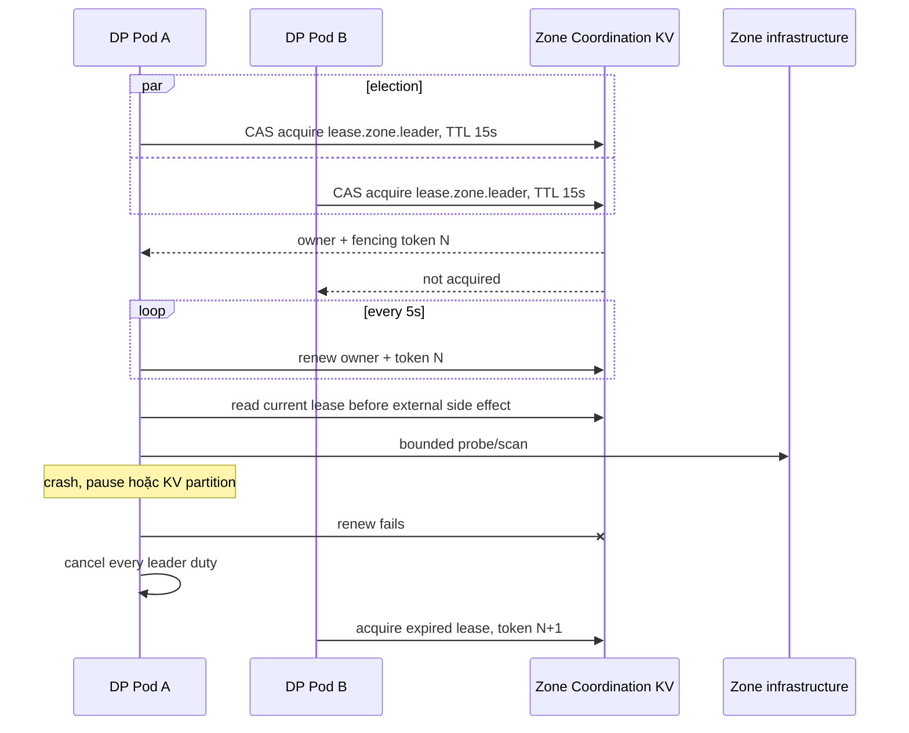
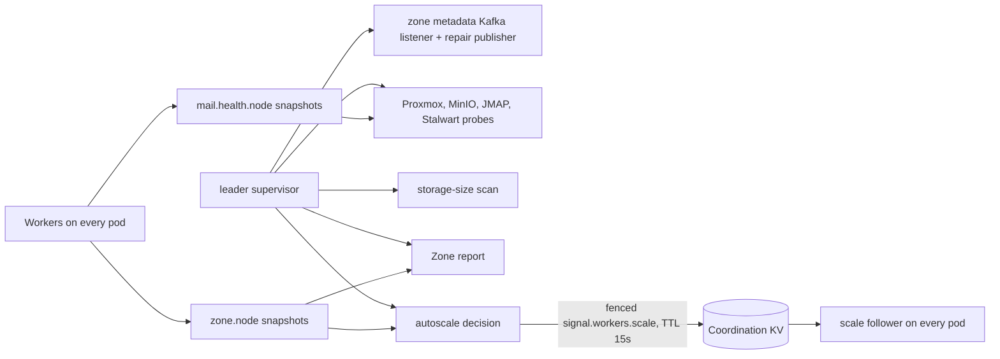
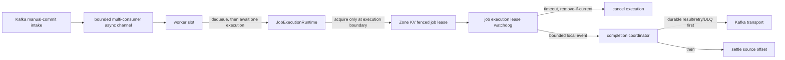

# Dataplane Zone Leader–Worker — God View

> [!IMPORTANT]
> Đây là Source of Truth cho coordination topology bên trong một Dataplane Zone.
> Mọi pod chạy cùng binary và có thể được bầu; tại một thời điểm chỉ holder của
> `AURORA_ZONE_COORDINATION/lease.zone.leader` sở hữu Zone-wide singleton duties.

## 1. Role boundary

| Role | Trách nhiệm |
|---|---|
| Leader | Metadata listener/repair, Zone report, aggregate Kafka lag, worker scale decision, Proxmox/MinIO/JMAP/Stalwart health probe, storage-size scan |
| Worker trên mọi pod | Kafka job intake, bounded queue, executor, job lease/fencing, mail consumer slot, local CPU/RAM/runtime snapshot |
| Zone KV | Leader/job/slot lease, fencing, current health và short-lived scale directive |

Leader là control-role overlay; pod giữ leader vẫn có thể chạy worker. Việc này tránh mất một replica
capacity và không thay đổi Kafka consumer-group delivery. “Chỉ leader ping hạ tầng” áp dụng cho recurring
health/inventory/measurement probe; worker vẫn gọi MinIO/Proxmox/JMAP khi thực thi business job đã được route.

## 2. Election và failover

- Owner ID gồm hostname và boot UUID; process mới không renew được incarnation cũ.
- Chỉ coordinator renew lease. Các duty dùng read-only current-owner check để không CAS tranh nhau.
- KV read/renew lỗi làm leader fail-closed; không tiếp tục probe hoặc publish.
- Một duty thoát/panic làm cả session resign và khởi tạo lại, tránh partial leader.
- Graceful shutdown cancel duty, bounded-drain rồi release khi owner/fencing vẫn khớp.

## 3. Leader duties

Health snapshots carry the leader fencing token and use monotonic CAS writes. Metadata and storage-size
Kafka paths remain at-least-once; invalid records go durable DLQ before settlement.

## 4. Kafka lag và scale signal

`krafka::Consumer::lag()` chỉ đọc cached watermark/position của partition đang assign cho local consumer;
nó không đại diện toàn consumer group và không mở một broker polling client mới.

1. Mỗi pod có đúng một `NodeRuntimeSampler` đọc cgroup v2 (fallback `/proc`) mỗi 5 giây.
   Snapshot immutable nằm trong RAM và được fan-out đồng thời cho admission, OTel và
   `zone.node.{hostname-boot_uuid}`;
   admission không tự đọc `/proc` thêm lần nữa.
2. Snapshot mang CPU, RAM, CPU throttling, working-set bytes, worker state counts,
   admitted jobs, lag và timestamp riêng của resource/lag. `sample_valid=false`
   hoặc quá 15 giây là stale.
3. Leader chỉ aggregate các snapshot fresh; nếu node snapshot mới nhưng invalid/stale,
   leader giữ target trước đó thay vì scale mù. CPU/RAM/throttling dùng giá trị max trong Zone
   để bảo vệ node nóng nhất. Node GET chạy bounded concurrency 32; key cũ quá 5 phút được
   leader dọn với concurrency 16 để pod churn không làm scan/RAM tăng vô hạn.
4. Leader ghi `signal.workers.scale` gồm Zone ID, target per node, expiry và leader fencing token.
5. Scale policy cần 2 observation liên tiếp để scale-up, 6 observation calm để scale-down;
   cooldown tương ứng là 15 giây và 30 giây. Scale-down giảm từng slot thay vì rơi thẳng về baseline.
6. Scale follower trên mọi pod chỉ apply directive đúng Zone, lag fresh, chưa hết hạn, trong
   `[MIN_WORKERS, MAX_WORKERS]` và không lùi `leader_fencing_token + issued_at`.
7. Directive `lag_stale=true`, mất hoặc hết hạn không tự scale theo dữ liệu cũ; worker giữ
   capacity hiện tại trong cửa sổ failover.

Scale directive là soft coordination state, không phải business desired state và không thay Kubernetes HPA.

## 5. Worker execution, drain và lease watchdog

- Mỗi worker slot chỉ nhận job mới sau khi `JobExecutionRuntime` hiện tại hoàn tất hoặc bị watchdog cancel.
  `target_per_node` vì vậy là concurrency bound thật, không còn là số receive-loop tạo detached task.
- `WorkerJobRuntime` giữ một wiring immutable cho Kafka, Zone KV, lease registry, admission counter
  và cloneable receiver. Worker chờ trực tiếp trên bounded `async-channel`; không còn
  `Arc<Mutex<mpsc::Receiver>>` serializing waiter.
- Executor nhận `Arc<ValidatedJob>` và binary payload dùng `Arc<[u8]>`; clone phục vụ dispatch/tracing
  là O(1). Retry chỉ materialize `Vec<u8>` khi delay hết và thực sự publish; DLQ không copy raw payload,
  chỉ mang byte length + SHA-256 fingerprint.
- Admission validate `job_version > 0`, route `mail→MAIL`/`storage→STORAGE`, Zone và W3C context trước
  side effect. `vps` fail-closed cho tới khi JO có durable IAM/VPS result owner; không chạy side effect
  rồi để result bị JO quarantine.
- Kafka intake không acquire lease trước queue. Worker acquire lease sau dequeue, nên queue dwell
  không tiêu thụ TTL và executor không thể bắt đầu bằng lease đã stale. Contention chờ xấp xỉ TTL,
  Zone KV error dùng backoff ngắn; bounded retry publisher tối đa 32 concurrent task, publish
  record mới durable rồi mới settle source cũ.
- Slot có state `Starting | Ready | Draining` và generation. Scale-down cancel receive-loop nhưng
  không giết job đang chạy; biased cancellation không nhận job mới sau drain, slot chỉ được
  xoá/tái sử dụng sau khi task cũ thoát.
- Bootstrap tạo ngay `MIN_WORKERS`; cấu hình fail-fast nếu limit ngoài `1..=512` hoặc
  `MIN_WORKERS > MAX_WORKERS`, nên failover leader không làm pod chạy dưới baseline.
- Watchdog renew fenced lease 30 giây theo chu kỳ 10 giây. Mỗi registry entry có
  `registration_id`; snapshot cũ chỉ được cancel/deregister khi ID vẫn current. Phase
  `Preparing → Executing → Completing` bắt deadline đúng trước executor: PROCESSING không thể tới sau
  terminal timeout, còn lease vẫn renew cho tới khi durability/settlement hoàn tất.
- Renewal có timeout 3 giây, concurrency 128 và `MAX_WORKERS=512`, nên worst-case renewal wave vẫn nằm
  trong TTL thay vì để một KV outage kéo scan trôi vô hạn.
- Watchdog không publish business result trực tiếp. Nó `try_send` vào bounded completion queue và giữ
  bounded pending ownership để retry khi reporter bận; completion coordinator publish terminal result
  durable rồi mới settle Kafka source. Queue/Kafka lỗi giữ source offset unsettled để replay.
- Kafka settlement serialize theo partition, purge epoch cũ, hỗ trợ sparse offset và giữ cửa sổ
  fetched-but-not-terminal tối đa `4 × Ready workers`; record cao không commit vượt record thấp.
- Intake, retry scheduler, completion reporter hoặc watchdog exit/panic ngoài shutdown sẽ fence active
  executors, graceful-stop process và trả lỗi để Docker/Kubernetes restart; không chạy half-alive.
- Worker, intake, runtime sampler, scale follower, watchdog, completion/retry scheduler và mọi async lease
  cleanup thuộc graceful-shutdown barrier; không đóng mail runtime/OTel trước khi tracked work thoát.

## 6. Failure matrix

| Failure/race | Guard | Outcome |
|---|---|---|
| Hai pod cùng election | Zone KV CAS | Một leader current |
| Leader cũ resume sau TTL | owner + monotonic fencing | Probe/publish check fail; health write token cũ bị reject |
| Zone KV partition | renew/read fail-closed | Leader duties cancel; workers tiếp tục job path theo lease/admission |
| Duty panic | JoinSet supervision | Resign toàn session và bầu lại |
| Probe treo | Client timeout + cancellation + bounded drain | Không giữ failover vô hạn |
| Local lag thiếu/stale | Freshness + stale aggregation | Giữ scale target trước, report stale |
| Scale signal từ leader cũ | Coordination fenced CAS + TTL + monotonic follower fence | Worker bỏ directive cũ, out-of-order hoặc hết hạn |
| Scale telemetry stale | `lag_stale` rejection | Giữ capacity hiện tại |
| Scale oscillation | Confirmation windows + cooldown | Không churn slot theo sample 5 giây đơn lẻ |
| Scale-down trong lúc chạy job | Draining slot + generation | Job hiện tại hoàn tất; ID không bị reuse sớm |
| Nhiều worker chờ cùng queue | Cloneable bounded receiver | Không có async receiver mutex/hot lock |
| Job chờ queue lâu hơn lease TTL | Acquire lease sau dequeue | Không giữ/expire lease trong queue |
| Lease contention/KV outage | Bounded delayed retry publisher | Retry durable trước source settlement; queue full giữ source unsettled |
| Watchdog snapshot cũ | registration + phase recheck dưới registry lock | Không cancel/report nhầm execution mới hoặc đua terminal result |
| Timeout report queue/Kafka lỗi | Bounded queue + pending retention + no source settlement | Không block lease renew; Kafka replay phục hồi |
| Record cao hoàn tất trước record thấp | Per-partition terminal set + bounded settlement window | Không commit vượt gap; không tăng RAM/replay window vô hạn |
| Critical job-runtime task panic/exit | Process-level supervisor + active cancellation fence | Fail-safe shutdown; source chưa settle được replay sau restart |
| Worker chết in-flight | Kafka replay + job lease/fencing | At-least-once; executor vẫn cần idempotency |

Leader election không tạo exactly-once cho external side effect. Job/result/storage/report consumers vẫn phải
giữ stable ID, ordering theo aggregate, bounded retry và idempotency boundary riêng.

Log của các duty cũng là at-least-once: leader event phải mang fencing token, còn physical
emission được phân biệt bằng `boot_id + process_sequence`. Schema, backpressure và collector
checkpoint tuân theo `god_view/dataplane/telemetry_god_view.md`.

## 7. Code map

- `dataplane/src/leader/leadership.rs`: election, fenced session, duty supervision và resignation.
- `dataplane/src/leader/zone_metadata.rs`: Kafka metadata projection và cold-start/periodic repair.
- `dataplane/src/leader/zone_report.rs`: Zone aggregate/report.
- `dataplane/src/leader/infra/hypervisor.rs`: recurring Proxmox health probe.
- `dataplane/src/leader/infra/storage.rs`: MinIO health probe và customer bucket-size scan.
- `dataplane/src/leader/infra/mail.rs`: recurring JMAP/Stalwart health probe.
- `dataplane/src/leader/worker_scaling.rs`: zonal lag aggregation, hysteresis và resource-aware scale policy.
- `dataplane/src/observability/metrics.rs`: one-sample cgroup/proc probe, job/watchdog/scale OTel instruments.
- `dataplane/src/workerpool/runtime.rs`: immutable worker wiring và bounded multi-consumer queue.
- `dataplane/src/workerpool/pool.rs`: execution-aware worker slots, generation và shutdown barrier.
- `dataplane/src/workerpool/scale_follower.rs`: worker-side fenced directive apply.
- `dataplane/src/job_runtime/intake.rs`: Zone-gated Kafka intake và ready-worker admission.
- `dataplane/src/job_runtime/execution.rs`: worker-owned execution and cancellation boundary.
- `dataplane/src/job_runtime/completion.rs`: unified durable result/retry/DLQ and settlement.
- `dataplane/src/job_runtime/coordination/`: generation-safe deadline và fenced lease renewal.
- `dataplane/src/infra/zone_kv.rs`: lease, current-owner check và fenced coordination CAS.
