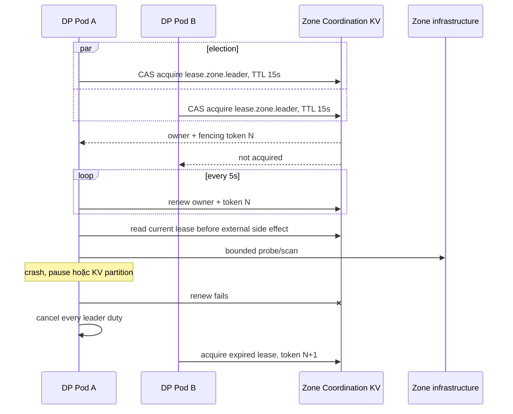
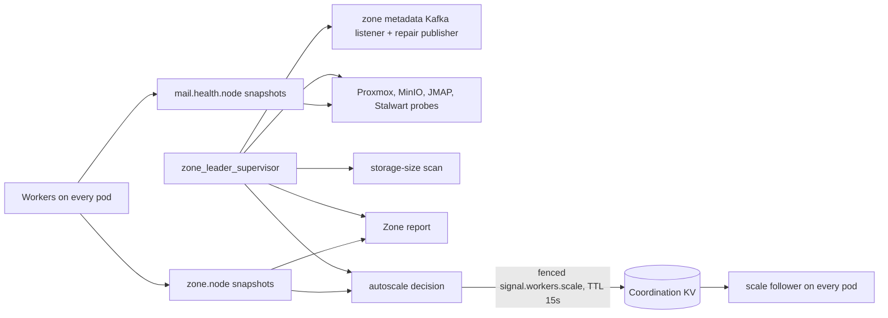

# Dataplane Zone Leader–Worker — God View

> [!IMPORTANT]
> Đây là Source of Truth cho coordination topology bên trong một Dataplane Zone.
> Mọi pod chạy cùng binary và có thể được bầu; tại một thời điểm chỉ holder của
> `AURORA_ZONE_COORDINATION/lease.zone.leader` sở hữu Zone-wide singleton duties.

## 1. Role boundary

| Role | Trách nhiệm |
|---|---|
| Leader | Metadata listener/repair, Zone report, aggregate Kafka lag, worker scale decision, Proxmox/MinIO/JMAP/Stalwart health probe, storage-size scan |
| Worker trên mọi pod | Kafka job intake, bounded queue, executor, job lease/fencing, mail consumer slot, local CPU/RAM/runtime snapshot |
| Zone KV | Leader/job/slot lease, fencing, current health và short-lived scale directive |

Leader là control-role overlay; pod giữ leader vẫn có thể chạy worker. Việc này tránh mất một replica
capacity và không thay đổi Kafka consumer-group delivery. “Chỉ leader ping hạ tầng” áp dụng cho recurring
health/inventory/measurement probe; worker vẫn gọi MinIO/Proxmox/JMAP khi thực thi business job đã được route.

## 2. Election và failover

- Owner ID gồm hostname và boot UUID; process mới không renew được incarnation cũ.
- Chỉ coordinator renew lease. Các duty dùng read-only current-owner check để không CAS tranh nhau.
- KV read/renew lỗi làm leader fail-closed; không tiếp tục probe hoặc publish.
- Một duty thoát/panic làm cả session resign và khởi tạo lại, tránh partial leader.
- Graceful shutdown cancel duty, bounded-drain rồi release khi owner/fencing vẫn khớp.

## 3. Leader duties

Health snapshots carry the leader fencing token and use monotonic CAS writes. Metadata and storage-size
Kafka paths remain at-least-once; invalid records go durable DLQ before settlement.

## 4. Kafka lag và scale signal

`krafka::Consumer::lag()` chỉ đọc cached watermark/position của partition đang assign cho local consumer;
nó không đại diện toàn consumer group và không mở một broker polling client mới.

1. Mỗi pod ghi cached local assignment lag và stale bit vào `zone.node.{node_id}`.
2. Leader chỉ nhận snapshot fresh tối đa 15 giây và cộng lag toàn Zone.
3. Nếu bất kỳ snapshot lag stale hoặc không còn node fresh, leader giữ target trước đó.
4. Leader ghi `signal.workers.scale` gồm Zone ID, target per node, expiry và leader fencing token.
5. Scale follower trên mọi pod chỉ apply directive đúng Zone, chưa hết hạn và trong
   `[MIN_WORKERS, MAX_WORKERS]`.
6. Directive mất/hết hạn không tự scale theo dữ liệu cũ; worker giữ capacity hiện tại trong cửa sổ failover.

Scale directive là soft coordination state, không phải business desired state và không thay Kubernetes HPA.

## 5. Failure matrix

| Failure/race | Guard | Outcome |
|---|---|---|
| Hai pod cùng election | Zone KV CAS | Một leader current |
| Leader cũ resume sau TTL | owner + monotonic fencing | Probe/publish check fail; health write token cũ bị reject |
| Zone KV partition | renew/read fail-closed | Leader duties cancel; workers tiếp tục job path theo lease/admission |
| Duty panic | JoinSet supervision | Resign toàn session và bầu lại |
| Probe treo | Client timeout + cancellation + bounded drain | Không giữ failover vô hạn |
| Local lag thiếu/stale | Freshness + stale aggregation | Giữ scale target trước, report stale |
| Scale signal từ leader cũ | Coordination fenced CAS + TTL | Worker bỏ directive cũ/hết hạn |
| Worker chết in-flight | Kafka replay + job lease/fencing | At-least-once; executor vẫn cần idempotency |

Leader election không tạo exactly-once cho external side effect. Job/result/storage/report consumers vẫn phải
giữ stable ID, ordering theo aggregate, bounded retry và idempotency boundary riêng.

Log của các duty cũng là at-least-once: leader event phải mang fencing token, còn physical
emission được phân biệt bằng `boot_id + process_sequence`. Schema, backpressure và collector
checkpoint tuân theo `god_view/dataplane/observability_logging_god_view.md`.

## 6. Code map

- `dataplane/src/leader/zone_leader_supervisor.rs`: election, renew, duty supervision và resignation.
- `dataplane/src/leader/zone_leader_session.rs`: leader session và fail-closed side-effect guard.
- `dataplane/src/leader/zone_metadata_kafka_listener.rs`, `zone_metadata_repair_publisher.rs`: Kafka metadata projection/repair.
- `dataplane/src/leader/zone_report_publisher.rs`: Zone aggregate/report.
- `dataplane/src/leader/hypervisor_health_probe.rs`, `storage_health_probe.rs`, `mail_infrastructure_health_probe.rs`: recurring infra probes.
- `dataplane/src/leader/storage_bucket_size_scanner.rs`: MinIO customer bucket size scan.
- `dataplane/src/leader/zone_worker_scale_controller.rs`: zonal lag aggregation và scale decision.
- `dataplane/src/workerpool/scale_follower.rs`: worker-side fenced directive apply.
- `dataplane/src/infra/zone_kv.rs`: lease, current-owner check và fenced coordination CAS.
