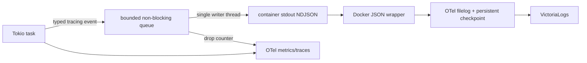

# Dataplane Structured Logging — God View

> [!IMPORTANT]
> Đây là Source of Truth cho log lifecycle của Aurora Dataplane. Log là diagnostic
> at-least-once, không phải business state và không thay Kafka result/DLQ hoặc Zone KV health.

## 1. Data flow và ownership

- Dataplane chỉ emit log qua một `tracing` subscriber và một stdout stream.
- `tracing-subscriber` sở hữu JSON serialization; callsite không tự ghép JSON string.
- `tracing-appender` tách filesystem/stdout write khỏi Tokio executor bằng queue hữu hạn.
- Queue đầy thì log được drop và tăng `dataplane_logs_dropped_total`; không block job executor.
- Filelog persist fingerprint/offset bằng `file_storage` để bound replay/gap khi collector restart.
- Filelog chỉ tail canonical `/var/lib/docker/containers/*/*-json.log`; không đọc thêm symlink
  trỏ tới cùng file.
- VictoriaLogs exporter dùng persistent sending queue và retry vô hạn có backoff; collector restart
  không làm mất batch đã enqueue thành công.
- Không bật thêm OTLP Logs cho cùng record nếu stdout/filelog vẫn hoạt động, tránh dual-ingestion.
- Trace sampler là ParentBased: giữ quyết định từ upstream, ratio chỉ giới hạn root trace mới;
  log error/state transition không bị trace sampling loại bỏ.

## 2. Identity và ordering

Mọi record mang các field chung:

| Nhóm | Field |
|---|---|
| Process | `service_name`, `service_version`, `deployment_environment`, `zone_id`, `node_id`, `boot_id`, `pid` |
| Ordering | `process_sequence`, `timestamp` |
| Event | `log_type`, `level`, `op`, `event_code`, `outcome`, `message`, `error` |
| Correlation | `trace_id`, `event_id`, `operation_id` |
| Kafka | `kafka_topic`, `kafka_partition`, `kafka_offset`, `assignment_epoch` |
| Fencing | `leader_fencing_token`, `fencing_token`, `runtime_generation`, `slot` |

`boot_id + process_sequence` là physical emission identity trong một process incarnation.
Không suy luận global ordering chỉ từ timestamp vì nhiều node không có đồng hồ tuyệt đối đồng bộ.

`event_id` là logical identity ổn định qua retry/failover. DLQ event ID được derive xác định từ
`source topic + partition + offset + error code`; publish-before-settle replay vẫn giữ cùng ID.

## 3. HA và duplicate semantics

- Log transport là at-least-once; collector/backend có thể replay record sau crash.
- Không deduplicate theo message text vì hai replica có thể phát cùng nội dung cho hai sự kiện thật.
- Backend chỉ deduplicate logical event theo `event_id` ở các event class có contract ID.
- Leader transition và singleton duty failure phải mang `leader_fencing_token`.
- Runtime slot transition phải mang slot lease `fencing_token` và `runtime_generation`.
- Kafka lỗi phải mang topic/partition/offset/assignment epoch nhưng không mang raw payload.
- Mất leader lease hoặc không verify được current owner làm side effect fail-closed và phát
  rate-limited diagnostic.

## 4. Coverage và volume control

Log bắt buộc tại:

1. Bootstrap/shutdown và observability pipeline health.
2. State transition của leader, worker scale follower và mail consumer runtime.
3. Kafka decode/contract rejection, durable DLQ publish và source settlement.
4. Zone KV read/write lỗi có thể biến snapshot/report/scale thành stale.
5. External infrastructure transition, timeout và recovery.

Không log mỗi successful poll, heartbeat hoặc renew tick. Warning/error trùng theo
`op + event_code + error` bị suppress trong bounded window; lần emit sau mang
`suppressed_count`. Tổng suppress được xuất qua `dataplane_logs_suppressed_total`.

## 5. Security và size boundary

- Cấm raw payload, encrypted envelope, credential, Authorization header và customer secret.
- `Config` chứa secret không được derive/log `Debug`.
- Error/message field bị giới hạn bởi `APP_LOG_MAX_FIELD_BYTES`; collector không được nhận
  một line vô hạn rồi split thành nhiều JSON fragment.
- Structured identifiers phải đi field riêng; không nhét payload hoặc secret vào message để
  tìm kiếm.
- JSON-looking line parse lỗi được collector đánh dấu `app_json_parse_error=true`.

## 6. Backpressure và shutdown

| Failure | Outcome |
|---|---|
| stdout/collector chậm | Queue đầy có bounded loss, job path không bị block |
| Repeated broker/KV error | First event + periodic summary, metrics vẫn phản ánh suppress/drop |
| Normal SIGTERM | `LoggerGuard` sống đến cuối `main`, flush queue khi drop |
| Process abort/SIGKILL | Queue tail có thể mất; durable business outcome vẫn thuộc Kafka/KV |
| Collector restart | Persistent filelog offset/fingerprint resume ingestion |
| VictoriaLogs tạm unavailable | Persistent exporter queue retry với bounded backoff |

Các deployment phải đặt termination grace period đủ cho Dataplane drain worker, flush
OTel provider và drop `LoggerGuard`.

## 7. Code map

- `dataplane/src/observability/logger.rs`: schema, queue, rate limit, process identity và metrics.
- `dataplane/src/main.rs`: sở hữu `LoggerGuard` trong toàn bộ process lifetime.
- `dataplane/src/job_lifecycle/consumer.rs`: job command DLQ/settlement observability.
- `dataplane/src/leader/`: leader fencing và Zone-wide duty observability.
- `dataplane/src/executor/mail/runtime/context.rs`: mail runtime state-transition log.
- `controlplane/dev/otel/otel-collector.yml`: Docker/app parse, checkpoint và backend export.
