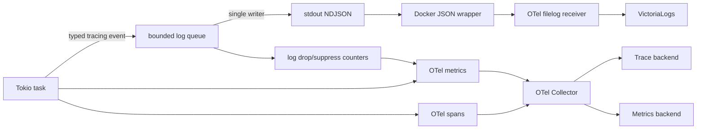
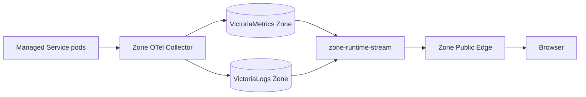
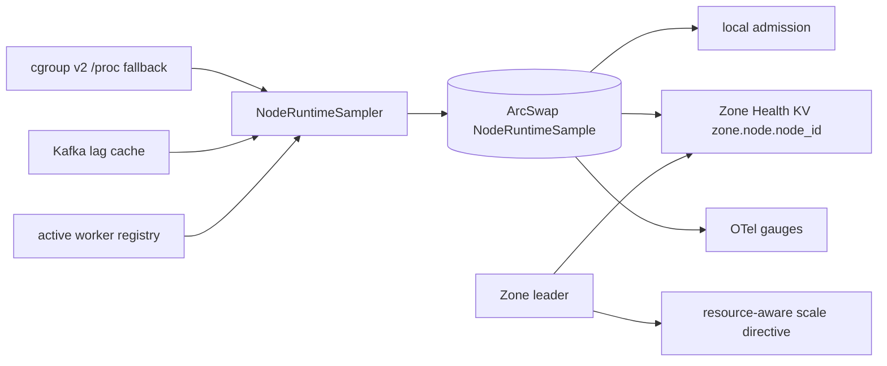
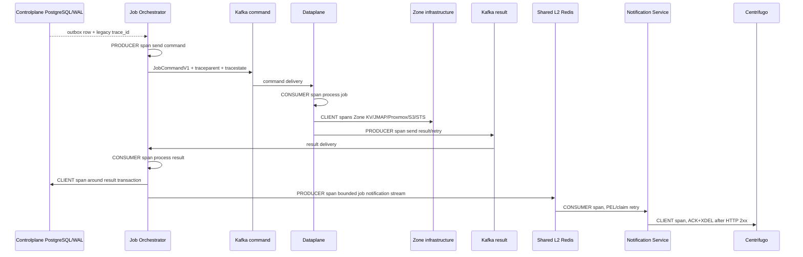

# Runtime Telemetry — Dataplane, Job Orchestrator và Zone Customer Read God View

> [!IMPORTANT]
> Đây là Source of Truth duy nhất cho telemetry lifecycle của Aurora Dataplane, Job
> Orchestrator và customer observability read path trong Zone.
> Logs, metrics và traces là diagnostic data; chúng không thay thế Kafka result/DLQ,
> PostgreSQL transaction, Zone Health KV hoặc broker settlement durability boundary.

## 1. Boundary và data flow

- Mỗi process Dataplane/JO emit log qua đúng một `tracing` subscriber và một stdout stream.
- `tracing-subscriber` sở hữu JSON serialization; callsite không tự ghép JSON string.
- `tracing-appender` tách stdout write khỏi Tokio executor bằng bounded queue.
- Queue đầy thì log bị drop và tăng `{dataplane,job_orchestrator}_logs_dropped_total`;
  job executor/CDC/result consumer không bị block.
- Filelog dùng persistent fingerprint/offset checkpoint, chỉ tail canonical Docker JSON log path.
- Không bật thêm OTLP Logs cho cùng stdout record, tránh dual-ingestion.
- OTel runtime metrics được ghi từ `NodeRuntimeSample` trong RAM. Admission và leader không
  đọc ngược từ Collector.
- Docker development dùng hai Collector độc lập: Central Collector chỉ export vào
  Central Victoria, Zone Collector chỉ export Dataplane service identity hoặc reviewed
  Zone Edge schema vào bộ
  Victoria của Zone. Hai Collector có file-storage/checkpoint và volume backend riêng;
  customer runtime có Zone identity không fallback/cross-write sang Central Victoria.
  Việc cùng tail canonical Docker host path là giới hạn riêng của dev và được chặn
  bằng filter trước customer exporter. Raw MinIO/Stalwart infrastructure logs không
  được đưa vào customer Zone store; chúng vẫn có thể thuộc Central operator plane.
  Kubernetes
  multi-replica Collector theo namespace/node boundary là deployment phase riêng.
- Development deployment nằm ở root `dev/`, không thuộc ownership của module
  Controlplane. Container vật lý dùng prefix `central-` hoặc `zone-`; connection
  string giữa service dùng Compose service DNS, không bind vào `container_name`.

## 2. Unified identity và correlation

Mọi telemetry record mang process identity chung; các nhóm còn lại chỉ xuất hiện khi
signal/event thực sự có ngữ cảnh đó:

| Nhóm | Field |
|---|---|
| Process | `service_name`, `service_version`, `service_instance_id` |
| Routing | Dataplane trace/metric có `zone_id`; JO chỉ gắn Zone lên event/span của workload cụ thể |
| Event | `op`, `event_code`, `severity_text`, `severity_number`, `message` |
| Correlation | `trace_id`, `span_id`, `event_id`, `operation_id` |
| Kafka | `kafka_topic`, `kafka_partition`, `kafka_offset`, `assignment_epoch` |
| Fencing | `leader_fencing_token`, `fencing_token`, `runtime_generation`, `slot` |

`service_instance_id` là process incarnation identity. Không tạo field sequence riêng và
không suy luận global ordering chỉ từ timestamp giữa các node.

`event_id` là logical identity ổn định qua retry/failover. DLQ event ID được derive xác định từ
`source topic + partition + offset + error code`; publish-before-settle replay vẫn giữ cùng ID.
Dataplane job DLQ không mang raw command chưa validation; diagnostic chỉ giữ bounded/redacted error,
payload byte length và SHA-256 fingerprint.

`trace_id + span_id` được đọc từ active OpenTelemetry `Context`. Logger không giữ task-local
correlation string riêng có thể lệch khỏi span thực tế.

JO là process Central đa-Zone: OTel Resource mang `aurora.component.scope=central`, không mang
`aurora.zone.id`. `service.instance.id` của log, metric và trace cùng dùng một `boot_id`; Zone chỉ
được gắn trên command/report span tương ứng để không biến một pod JO thành resource thuộc một Zone giả.

### 2.1. Zone Runtime Stream customer read path (staged platform path)

Customer runtime telemetry của Managed Service, Hypervisor, Mail và Storage không
đọc Central state, không subscribe NATS và không đi qua JO/Notification/Centrifugo.
Managed Service là adapter đầu tiên của generic Zone Runtime Stream:

Dataplane renderer đã inject protected metadata
`platform.aurora.io/{workspace-id,owner-id,owner-type,managed-service-instance-id}`
và protected component label. Zone OTel Collector lookup metadata từ Kubernetes API,
derive `aurora_workspace_id`, `aurora_owner_id`,
`aurora_managed_service_instance_id`, `aurora_component_id` rồi overwrite attribute
cùng tên do workload tự gửi. Đây là telemetry-only dimension: không phải Kubernetes
traffic label, không được user payload điều khiển và không làm network policy thay đổi.

`aurora_workspace_id`, `aurora_owner_id` và
`aurora_managed_service_instance_id` có cardinality cao nên chỉ tồn tại dưới dạng
ordinary attributes trong customer Victoria read plane với series/retention budget riêng
theo Zone. Chúng không được dùng làm stream dimension, metric label health/alert platform
hoặc query fan-out qua nhiều instance ngoài scope đã verify.

`zone-runtime-stream` là Rust Deployment riêng trong Zone. Nó chỉ dùng
read-only VictoriaMetrics/VictoriaLogs identity và trusted scope mà Zone Public Edge
inject sau Authorization check. Nó không có Dataplane, NATS, Kafka, Redis,
PostgreSQL, Zone KV, Kubernetes API hoặc Vault credential. Browser không có Victoria
credential và không thể gửi raw PromQL/LogsQL, arbitrary label selector hay namespace;
service derive fixed query từ generic `panel_id`/module registry allow-list và append telemetry filters từ scope.

Workload boundary của read plane nằm trong
`k8s/zone-runtime-stream.yaml`: ba replica stateless, ingress chỉ từ Zone Public
Edge và egress chỉ tới VictoriaMetrics/VictoriaLogs. Việc deploy workload này không
tự enable public route; `runtime.read` ticket và Edge authorization vẫn là gate
riêng.

V1 retention của customer Victoria plane là metrics 7 ngày và logs 3 ngày. Metrics là
sampled/eventual observation; logs tail là best-effort stream và không cam kết
ordering/replay sau reconnect. Không result, state machine, billing, audit timeline
hay authorization decision nào được suy luận từ Victoria. `SUCCESS`/`FAILED` chỉ đến
từ durable Kafka result/Controlplane settlement.

Service/Public Edge enforce fixed maximum range, sample point, log-line, byte,
connection duration và in-flight budget. Slow metrics client có thể receive coalesced
sample; slow logs client bị close/cancel upstream thay vì tạo queue RAM vô hạn. Mất
Victoria/Collector/stream service chỉ làm observability unavailable/stale, không
block Dataplane executor hoặc thay đổi business lifecycle.

## 3. Structured logging

### 3.1 Ownership và schema

- Log là diagnostic at-least-once, không phải business state.
- `tracing-subscriber` serialize thành NDJSON thật; không phải JSON được nhét trong string.
- Mọi log state transition cần `op`, `event_code` và correlation/fencing fields phù hợp.
- `result`/`reason`, actor/ownership, retry và transport coordinates chỉ được emit khi event
  thật sự có các giá trị đó; không điền `0`, `-1`, `false`, `unknown` hoặc chuỗi rỗng làm sentinel.
- `service_name` là stream identity duy nhất. Pod, node, container, workspace và resource
  identity chỉ là ordinary attributes.
- Error raw chỉ được bounded; không ghi raw payload, encrypted envelope, credential, Authorization
  header, customer secret hoặc message body.
- `Config` chứa secret không được derive/log `Debug`.
- `APP_LOG_MAX_FIELD_BYTES` giới hạn mọi string field trước serialization; UTF-8 không bị cắt giữa
  code point. `APP_LOG_BUFFERED_LINES` và `APP_LOG_RATE_LIMIT_MS` đều bị clamp.
- JO không log raw Kafka/NATS/Redis/PostgreSQL/OTLP endpoint; `Config` chứa secret không derive
  `Debug`. URL có user-info, Authorization/bearer/password/secret/token marker bị redact trước queue.
- Collector đánh dấu `app_json_parse_error=true` nếu input-looking JSON không parse được.

### 3.2 Coverage và volume

Log bắt buộc tại:

1. Bootstrap/shutdown và observability pipeline health.
2. Leader election/fencing, worker scale follower và mail consumer state transition.
3. Kafka decode/contract rejection, durable DLQ publish và source settlement.
4. Zone KV read/write lỗi có thể biến snapshot/report/scale thành stale.
5. External infrastructure transition, timeout và recovery.

Không log mỗi successful poll, heartbeat hoặc renew tick. Warning/error trùng theo
`op + event_code + error` bị suppress trong bounded window; lần emit tiếp theo có `suppressed_count`.

## 4. Runtime metrics và in-memory sampler

- Mỗi pod có đúng một `NodeRuntimeSampler`, chu kỳ 5 giây.
- Snapshot nằm trong RAM dưới dạng immutable `ArcSwap`; local admission đọc trực tiếp snapshot đó.
- Cùng snapshot được ghi vào `AURORA_ZONE_HEALTH/zone.node.{node_id}` để leader aggregate.
- Snapshot gồm CPU, RAM, CPU throttling, working set, active workers, Kafka lag, freshness và
  `sample_valid`.
- `sample_valid=false`, timestamp tương lai hoặc age quá 15 giây là stale; leader giữ target scale
  trước đó thay vì scale mù.
- OTel gauges gồm CPU, memory, throttled ratio, working set, active workers, Kafka lag, sample age
  và sample validity. Job runtime bổ sung `dataplane_kafka_unsettled_records`,
  `dataplane_watchdog_completion_queue_depth`, retry queue depth và bounded watchdog event counters.
- OTel là export/diagnostic path. Collector outage không được làm admission hoặc scale loop dừng.

Metrics job execution vẫn tách riêng: latency histogram và processed counter không sở hữu node sampler.

### 4.1 Job Orchestrator transport metrics

JO export push metric qua cùng OTLP MeterProvider; không mở `METRICS_PORT`/Prometheus listener và
không dùng metric để ACK Kafka, advance LSN hoặc quyết định business state:

| Metric | Semantics |
|---|---|
| `job_orchestrator_wal_records_accepted_total` | Outbox WAL record đã strict-validate và được nhận để publish |
| `job_orchestrator_kafka_commands_published_total` | Zone command đã nhận Kafka ACK |
| `job_orchestrator_results_received_total` | Result đã decode và strict-validate |
| `job_orchestrator_notifications_enqueued_total` | Notification đã `XADD` thành công vào bounded Shared Redis Stream |
| `job_orchestrator_record_outcomes_total` | Bounded `record_type + outcome` cho WAL/result/DLQ/notification |
| `job_orchestrator_record_outcomes_total{record_type="resource_ownership"}` | Ownership Redis fast-path/recovery outcome, không mang resource ID |
| `job_orchestrator_kafka_operations_total` | Logical `publish/commit` terminal outcome sau bounded retry |
| `job_orchestrator_kafka_operation_duration_seconds` | Latency logical publish/commit, gồm retry/backoff |
| `job_orchestrator_worker_terminations_total` | Critical worker thoát ngoài shutdown signal |
| `job_orchestrator_logs_{emitted,suppressed,dropped}_total` | Sức khỏe bounded log pipeline |

Label metric chỉ dùng taxonomy do code sở hữu; không dùng Zone UUID, topic per-Zone, event/job/user ID
hoặc raw error. Hai gauge Redis `job_proxy_queue_len`/`job_proxy_pending_len` không bao giờ record và
metric `job_proxy_stream_jobs_pushed_total` sai transport đã bị retire thay vì tiếp tục phát số liệu giả.

## 5. Distributed tracing — per-Zone job

- `traceparent` và `tracestate` là propagation contract chuẩn W3C.
- `trace_id` bytes cũ chỉ là correlation ID cho rolling compatibility; không tạo fake parent span.
- Message cũ không có context tạo root trace mới tại consumer. Context quá giới hạn hoặc parse sai
  phải reject/quarantine.
- Dataplane job span chỉ terminal `OK` khi result/retry đã durable và source Kafka offset settle.
- Executor thành công nhưng result hoặc settlement lỗi là span error.
- PROCESSING, terminal result và retry record inject context của đúng producer span.
- Job notification nội vùng Central dùng Redis Stream `stream:{job_notifications}`; NATS Core chỉ
  chở soft-state realtime, không nằm trên job-result/notification path.
- Notification là best-effort wake-up sau business DB commit; enqueue failure không giữ Kafka
  result offset. UI phục hồi terminal state qua authoritative API, merge progression bằng
  `transaction_id=job_id` và có `notification_id` ổn định cho từng exact status delivery.
- `XACK + XDEL` chỉ sau Centrifugo HTTP `2xx`; crash ở giữa giữ PEL và có thể tạo duplicate.

## 6. Distributed tracing — mail runtime

- Customer broker context là untrusted input; Dataplane không nhận baggage hoặc sampled flag của
  customer để điều khiển telemetry platform.
- Mỗi message bắt đầu fresh `CONSUMER` trace tại security boundary.
- Message span bao phủ validate, template load/render, enqueue và JMAP result.
- Batcher giữ context cùng queue item. Một JMAP batch nhiều message dùng span links bounded,
  không chọn tùy ý một message làm parent.
- JMAP HTTP span inject `traceparent`/`tracestate`; credential và body không xuất hiện trong trace.
- Broker ACK/commit vẫn do Kafka/Redis/NATS/RabbitMQ suite sở hữu. Trace không biến at-least-once
  thành exactly-once.

## 7. Span topology và cardinality

| Boundary | Kind | Tên low-cardinality |
|---|---|---|
| JO command publish | `PRODUCER` | `send <job-topic>` |
| Dataplane job | `CONSUMER` | `process <job-topic>` |
| Kafka result/retry publish | `PRODUCER` | `send <topic>` |
| Kafka settlement | `CLIENT` | `commit <topic>` |
| PostgreSQL result update | `CLIENT` | `UPDATE controlplane job result` |
| Shared Redis notification | `PRODUCER` / `CONSUMER` | `send/process stream:{job_notifications}` |
| Shared Redis ownership | `PRODUCER` | `send stream:{billing}:resource_ownership` |
| Centrifugo publish | `CLIENT` | `POST centrifugo.publish` |
| Zone KV | `CLIENT` | `KV GetZoneMetadata`, `KV AcquireLease`, `KV ReleaseLease` |
| Proxmox/JMAP | `CLIENT` | method + stable service operation |
| S3/STS | `CLIENT` | AWS operation name |

- Không đưa payload, secret, recipient, bucket name, user ID hoặc raw URL vào span.
- Job ID, version, attempt, topic, Zone và Kafka coordinates được phép trên trace nhưng không dùng
  làm metric label không giới hạn.
- Error status dùng taxonomy ổn định; raw downstream error chỉ nằm trong bounded log.

## 8. Sampling, HA, duplicate và failure semantics

- JO và Dataplane dùng `ParentBased(TraceIdRatioBased(...))`.
- Upstream W3C sampled flag chỉ được giữ khi context hợp lệ; không cưỡng ép sampled.
- Root ratio do `OTEL_TRACE_SAMPLE_RATIO` điều khiển; Docker development đặt `0.25`.
- SDK batch queue dùng `OTEL_BSP_*`; queue đầy được phép drop trace thay vì block job.
- JO clamp `OTEL_METRIC_EXPORT_INTERVAL_SECS` trong `5..300s` và
  `OTEL_EXPORT_TIMEOUT_SECS` trong `1..30s` không vượt interval. Span name tối đa 128 bytes và
  `error.type` chỉ dùng taxonomy ổn định.
- Kafka redelivery tạo processing span mới vì đó là execution attempt thật.
- Không deduplicate trace bằng message text hoặc trace ID; phân biệt replay bằng job ID/version/attempt
  và Kafka topic/partition/offset.
- Log transport, trace export và notification đều at-least-once; backend chỉ deduplicate logical
  event theo contract `event_id`.
- Leader transition/singleton failure phải mang `leader_fencing_token`; runtime slot transition
  phải mang slot lease `fencing_token` và `runtime_generation`.
- Mất leader lease hoặc không verify current owner làm side effect fail-closed và phát diagnostic
  có rate limit.

## 9. Security, backpressure và shutdown

| Failure | Outcome |
|---|---|
| stdout/collector chậm | Bounded log/trace queue drop có metric; job path không block |
| Repeated broker/KV error | First event + periodic summary; suppress/drop vẫn có metrics |
| Collector/backend outage | Persistent collector queue retry; business durability không phụ thuộc telemetry |
| OTel Collector restart | Filelog fingerprint/offset và exporter queue resume |
| Normal SIGTERM | Drain worker, flush OTel providers, flush/drop `LoggerGuard` ở cuối process |
| Process abort/SIGKILL | Tail telemetry có thể mất; Kafka/PostgreSQL/Zone KV durability không đổi |
| Leader cũ resume sau TTL | Owner check + fencing chặn probe/publish stale |
| Runtime sampler stale | Admission fail-closed; leader giữ scale target trước |
| Critical intake/retry/completion/watchdog exit | Active execution bị cancel/fence, process graceful-stop rồi exit lỗi để container restart |
| JO CDC/result/reverse-provider/reconciler exit | Tăng worker termination metric, trả lỗi để container restart; offset chưa durable không commit |

Deployment phải đặt termination grace period đủ cho worker drain, OTel provider shutdown và logger
queue flush. Telemetry không được trở thành command path hoặc business source of truth.

## 10. Contract và code map

### Contracts

- `proto/platform_transport.proto`
- `proto/zone_report.proto`
- `proto/dataplane/job_result.proto`
- `proto/job-orchestrator/job_result.proto`

### Dataplane

- `dataplane/src/observability/logger.rs`: structured log schema, queue, rate limit, identity.
- `dataplane/src/observability/metrics.rs`: cgroup/proc sampler, RAM snapshot, admitted jobs,
  worker slot states, bounded-cardinality job, watchdog và worker-scale OTel instruments.
- `dataplane/src/observability/otel.rs`: W3C propagation, tracer/meter provider và shutdown.
- `dataplane/src/job_runtime/execution.rs`: job consumer span và executor boundary.
- `dataplane/src/job_runtime/completion.rs`: result/retry/DLQ spans và durable settlement boundary.
- `dataplane/src/job_runtime/coordination/`: execution lease/deadline, renew watchdog và timeout queue metrics.
- `dataplane/src/executor/mail/processor/batcher.rs`: mail batch context propagation.
- `dataplane/src/leader/`: fencing và Zone-wide singleton telemetry.

### JO/Notification/Collector

- `job-orchestrator/src/observability/logger.rs`: NDJSON queue, identity, redaction, rate limit,
  field bound và pipeline loss counters.
- `job-orchestrator/src/observability/metrics.rs`: bounded-cardinality transport/outcome metrics
  và logger health sampler.
- `job-orchestrator/src/observability/otel.rs`: Central resource identity, W3C propagation,
  batch exporter bounds và shutdown.
- `job-orchestrator/src/changefeed/worker.rs`: WAL acceptance và command producer span.
- `job-orchestrator/src/infra/kafka.rs`: logical publish/commit latency và outcome.
- `job-orchestrator/src/results/worker.rs`: validation, quarantine, consumer/settlement spans.
- `job-orchestrator/src/results/apply.rs`: PostgreSQL transaction và ownership fast path.
- `job-orchestrator/src/results/notify.rs`: best-effort Shared Redis notification outcome.
- `dev/central/grafana/provisioning/dashboards/job-runtime.json`: JO throughput,
  Kafka latency/failure, DLQ, worker-exit và log-loss panels.
- `dev/central/grafana/provisioning/dashboards/job-logs.json`: cross-service job/trace log search.
- `notification-service/src/inbound/job_stream.rs`
- `notification-service/src/infra/centrifugo.rs`
- `dev/central/otel/otel-collector.yml`: Central Collector.
- `dev/zone/otel/otel-collector.yml`: Zone-local Collector cho dev.
- `dev/central/compose.yml` và `dev/zone/compose.yml`:
  hai stack độc lập; chỉ Kafka/NATS Core nằm trên shared transport network.
