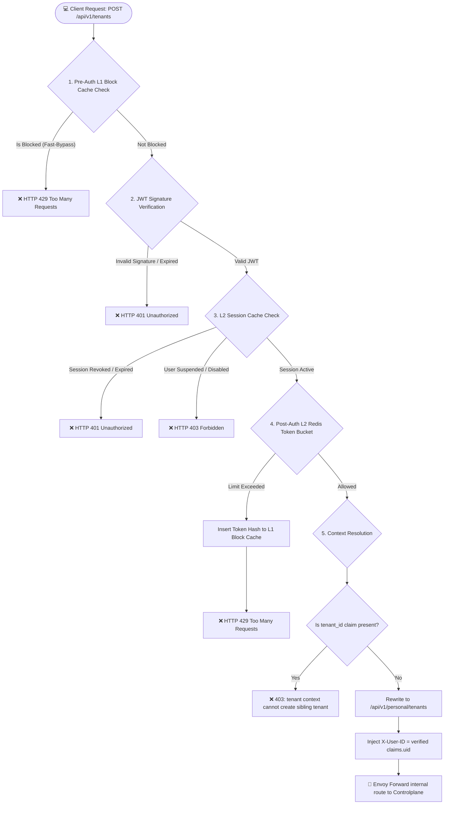
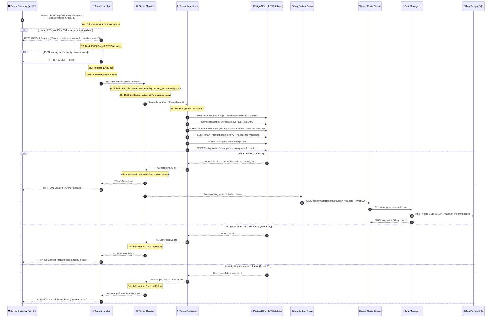

# User Create Tenant - Workflow God View

> [!NOTE]
> Tài liệu này đóng vai trò là **Source of Truth (SoT) / God View** cho luồng **Tạo Mới Tổ Chức (Create Tenant)**.
> Mọi thay đổi logic tại UI, acr edge proxy, và Controlplane backend liên quan đến việc chặn tạo tenant lồng nhau, xác thực quyền sở hữu, và thiết lập quan hệ thành viên sáng lập bắt buộc phải tuân thủ nghiêm ngặt đặc tả này.

---

## 🗺️ 1. Giới Thiệu & Nguyên Tắc Thiết Kế

Để hỗ trợ mô hình Multi-Tenant SaaS bền vững, an toàn và có hiệu năng cao, luồng Tạo Tenant tuân thủ các quy tắc thiết kế cốt lõi sau:

1. **No Tenant-in-Tenant Context**: Một tổ chức (Tenant) không được phép chứa hoặc tạo thêm tổ chức con bên trong nó. Yêu cầu tạo mới tenant chỉ hợp lệ từ ngữ cảnh cá nhân (khi header `X-Tenant-ID` trống hoặc không tồn tại).
2. **Creator Member Binding**: Khi một người dùng (`owner_id`) tạo một tổ chức mới thành công, hệ thống phải tự động liên kết người dùng này làm thành viên đầu tiên ở trạng thái hoạt động (`active`) trong tổ chức đó.
3. **Zone Independence**: Tổ chức (Tenant) chỉ mang tính cấu trúc logic (Logical Organization) nên độc lập hoàn toàn và không thuộc về bất kỳ phân vùng hạ tầng (`Zone`) nào ở mức vật lý.
4. **Canonical Primary Domain**: Create tenant phải persist lowercase primary
   domain trong cùng transaction. Tenant login/switch không được tồn tại nếu
   domain chỉ xuất hiện ở UI nhưng không có trong PostgreSQL.
5. **Atomic Tenant Root & Billing Intent**: Tenant, owner membership, đúng một
   `tenant_root` definition, normalized permission mappings, compiled
   `membership_role` và tenant-wallet outbox phải commit trong cùng PostgreSQL
   transaction. Không copy danh sách tenant role từ seed.

---

## 🏛️ 2. Luồng Nghiệp Vụ Tạo Mới Tenant (Sequence Diagram)

Quy trình xử lý yêu cầu tạo Tenan#### 🗺️ Sơ Đồ Pipeline Xử Lý Yêu Cầu Tại acr Edge Proxy


---

#### 🔀 Đặc Tả Chi Tiết Các Nhánh Xử Lý (Failure & Success Branches)

##### 1. Nhánh Giới Hạn Tần Suất 2 Lớp (2-Tier Rate Limiting Branch)
Hệ thống sử dụng cơ chế bảo vệ phân tầng hiệu năng cao nhằm giảm tải tối đa cho cơ sở dữ liệu và hạ tầng:
* **Lớp 1: L1 Block Cache (Pre-Auth / Fast-Bypass)**:
  * **Cơ chế**: Sử dụng in-memory concurrent cache (`moka` cache) nội bộ ngay tại RAM của `acr`.
  * **Kịch bản**: 
    * Khi một token hash được phát hiện đang nằm trong danh sách chặn (L1 Block), yêu cầu lập tức bị từ chối với lỗi `HTTP 429 Too Many Requests` trong vòng **<0.1ms** mà không tốn tài nguyên giải mã chữ ký JWT hay gọi sang Redis.
* **Lớp 2: L2 Token Bucket (Post-Auth / Redis + Lua Script)**:
  * **Cơ chế**: Chạy Lua script `LUA_TOKEN_BUCKET` trên Redis một cách nguyên tử (atomic) để kiểm tra dung lượng còn lại của bucket. Cấu hình bucket được quyết định linh hoạt theo vai trò người dùng (SRE Critical: 5 req/min, SRE Non-Critical: 60 req/min, User: 100 req/min).
  * **Kịch bản**:
    * Nếu vượt quá giới hạn (hết token): `acr` ghi nhận token hash vào L1 Block Cache (mặc định TTL 60 giây) và trả về lỗi `HTTP 429 Too Many Requests`.
    * Nếu hợp lệ: Giảm token đi 1 đơn vị và cho phép request đi tiếp.

##### 2. Nhánh Xác Thực Token (Cryptographic JWT Verification Branch)
* **Mục tiêu**: Giải mã và kiểm tra chữ ký số mật mã học của Token JWT bằng khóa công khai JWKS.
* **Kịch bản**:
  * **Thất bại (Expired/Invalid Token)**: Nếu chữ ký bị sửa đổi, thuật toán mã hóa không khớp, hoặc trường `exp` nhỏ hơn thời gian hệ thống hiện tại -> Trả về mã lỗi `HTTP 401 Unauthorized`.
  * **Thành công**: Trích xuất payload an toàn.

##### 3. Nhánh Trạng Thái Phiên Làm Việc (L2 Session Cache Branch)
* **Mục tiêu**: Truy vấn bộ nhớ đệm `Redis L2 Session` (`iam:admin_access_session:<token_hash>`) để xác minh trạng thái thời gian thực của phiên.
* **Kịch bản**:
  * **Thất bại (Session Revoked/Suspended)**:
    * Nếu Session đã bị Admin thu hồi/đăng xuất cưỡng bức -> Trả về `HTTP 401 Unauthorized`.
    * Nếu trạng thái của tài khoản người dùng (`User.Status`) chuyển sang `suspended` hoặc `disabled` -> Trả về `HTTP 403 Forbidden` (User blocked).
  * **Thành công**: Cho phép tiếp tục xử lý.

##### 4. Nhánh Phân Giải Ngữ Cảnh & Gắn Header (Context Resolution & Header Mutation Branch)
* **Mục tiêu**: Đọc các claims từ Token được giải mã để phân giải ngữ cảnh hoạt động và truyền tải an toàn vào mạng nội bộ.
* **Các kịch bản ánh xạ**:
  * **Inject User Identity**: `claims.uid` (UUID của User) được gán vào
    `X-User-ID`; `claims.sub` là canonical username và không được dùng thay UUID.
  * **Owner route selection**:
    * Client luôn gọi generic `POST /api/v1/tenants`.
    * Nếu verified session có tenant, ACR từ chối; không forward.
    * Nếu session là personal, ACR rewrite sang internal
      `POST /api/v1/personal/tenants`. Direct client call tới internal prefix bị
      từ chối.

---

#### 🔌 Contract Hợp Giao Tiếp (Hop 1: Client → acr)
* **Input (Request từ Client)**:
  * **Headers**: `Authorization: Bearer <JWT_token>` (Bắt buộc)
  * **Body**:
    * `name`: `string` (Tên hiển thị tổ chức)
    * `code`: `string` (Mã viết tắt unique, ví dụ: `acme`)
* **Output (Sự kiện lỗi của Phase 1)**:
  * **Event 1A (Rate Limited L1/L2)**: HTTP `429 Too Many Requests`.
  * **Event 1B (Expired/Invalid Token)**: HTTP `401 Unauthorized`.
  * **Event 1C (Session Revoked)**: HTTP `401 Unauthorized`.
  * **Event 1D (User Suspended)**: HTTP `403 Forbidden`.

---

### Phase 2: Envoy Forward → Controlplane Backend (Quyết Định Nghiệp Vụ)

Quy trình xử lý nội bộ tại Controlplane được phân tầng rõ rệt qua các lớp Handler (Transport) → Service (Business Logic) → Repository (Data Access):



#### 🔌 Contract Hợp Giao Tiếp (Hop 2: Envoy/acr → Controlplane)
* **Input**:
  * **Headers**:
    * `X-User-ID`: `<uuid>` (Bắt buộc - người sáng lập/owner)
    * `X-Tenant-ID`: `<uuid>` (Tuỳ chọn; nếu có sẽ bị CP reject)
  * **Body**:
    * `name`: `string`
    * `code`: `string`
* **Output (HTTP Response từ Backend)**:
  * **Success Output (201 Created)**: Trả về thông tin Tenant mới.
  * **Conflict Output (409 Conflict)**: Khi mã `code` đã được đăng ký bởi tổ chức khác.
  * **Bad Request Output (400 Bad Request)**: 
    * Xảy ra khi vi phạm format regex `ck_tenants_code_format` của cột code.
    * Xảy ra khi yêu cầu tạo tenant chứa `X-Tenant-ID` (Nest Context Blocked).

---

## 🗃️ 3. Đặc Tả Dữ Liệu & Ràng Buộc Cơ Sở Dữ Liệu (Database Constraints)

Các ràng buộc chặt chẽ được thực thi tại database schema `hierarchy`:

### 1. Ràng buộc mã Tenant (`code` format)
* Chỉ cho phép chữ thường, số, dấu gạch ngang, gạch dưới. Không có khoảng trắng.
  ```sql
  CONSTRAINT ck_tenants_code_format CHECK (code ~ '^[a-z0-9-_]+$')
  ```

### 2. Ràng buộc duy nhất toàn cục (`code` uniqueness)
* Không được phép có 2 Tenant trùng mã code để đảm bảo URL namespace toàn cục không bị xung đột.
  ```sql
  CONSTRAINT ux_tenants_code UNIQUE (code)
  ```

### 3. Ràng buộc thành viên sáng lập (Atomic membership creation)
* Việc tạo bản ghi tenant và bản ghi hội viên quản trị đầu tiên bắt buộc phải diễn ra đồng thời. Nếu một trong hai thất bại, toàn bộ hành động bị hủy bỏ (Rollback).
* Membership không chứa role string. Quyền sáng lập nằm ở một global
  `membership_role` tham chiếu `tenant_root`, role level 3, version 1 và
  permission snapshot năm bậc.
* `tenant_root` được tạo riêng cho đúng tenant. Baseline seed không có tenant
  role vì role đó chưa thể có ownership khi tenant chưa tồn tại.

### 4. Tenant wallet provisioning

* Event ID được sinh deterministic từ tenant ID; duplicate relay/delivery là hợp lệ.
* Protobuf chứa `event_id`, `schema_version=1`, `tenant_id`, `actor_user_id`, `currency=USD`, `occurred_at`.
* Outbox row và tenant aggregate cùng commit. Relay failure để row `PENDING/PUBLISHING` cho cold-start/periodic
  reconciliation; không rollback tenant sau khi HTTP đã trả thành công.
* Cost `tenant_wallet_provision_inbox` kiểm tra event ID + tenant ID + actor ID + payload hash trước khi
  upsert unique `(owner_id, owner_type='TENANT', currency='USD')`. Không dùng chung inbox với personal.
* Tenant không có referral/promo onboarding. Verified tenant top-up cần exact
  `{tenant}:nil:billing:wallet:top_up`.
