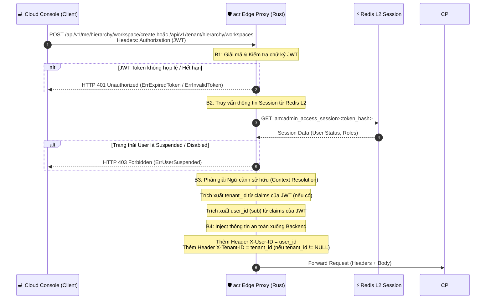
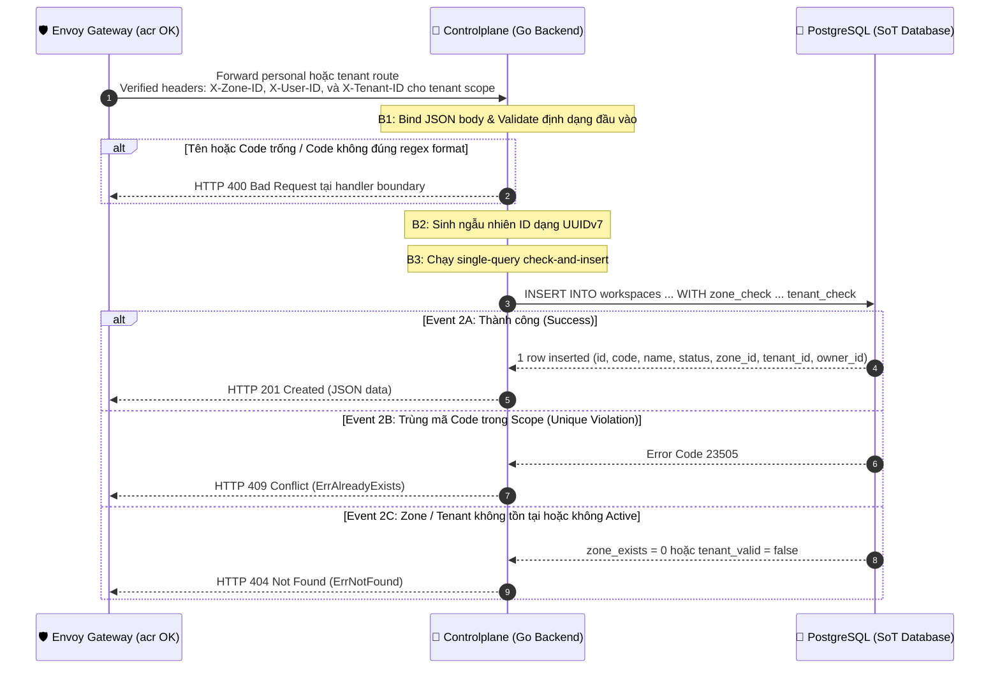

# Organizational Hierarchy & Workspace Creation - Workflow God View

> [!NOTE]
> Tài liệu này đóng vai trò là **Source of Truth (SoT) / God View** cho phân hệ Cấu trúc Tổ chức (Organizational Hierarchy) bao gồm: **Zone -> Tenant -> Workspace** và luồng nghiệp vụ **Tạo Mới Không Gian Làm Việc (Create Workspace)**.
> Mọi thay đổi logic ở client (Cloud Console), edge proxy (acr), và controlplane (Go backend) liên quan đến việc phân giải zone, quản lý tenant, và phân quyền/quản lý workspace bắt buộc phải tuân thủ nghiêm ngặt đặc tả này.

---

## 🗺️ 1. Kiến Trúc Tổng Quan & Mô Hình Phân Cấp (Hierarchy Model)

Hệ thống quản lý tài nguyên ảo hóa và hạ tầng theo mô hình phân cấp 3 lớp chặt chẽ nhằm đáp ứng mô hình Multi-Tenant SaaS và môi trường HA Cloud-Native:

```mermaid
graph TD
    classDef global fill:#332244,stroke:#8844ff,stroke-width:2px;
    classDef tenant fill:#112233,stroke:#3388ff,stroke-width:2px;
    classDef personal fill:#113322,stroke:#33cc88,stroke-width:2px;

    GlobalZone["🌍 Global / Specific Zone (Mandatory)"]:::global
    
    Tenant["🏢 Tenant (Optional Enterprise Scope)"]:::tenant
    TenantWS1["📁 Tenant Workspace 1<br/>slug: tenant_code/ws_code"]:::tenant
    TenantWS2["📁 Tenant Workspace 2<br/>slug: tenant_code/ws_code"]:::tenant

    User["👤 Personal Owner (Individual Scope)"]:::personal
    PersonalWS["📁 Personal Workspace<br/>slug: username/ws_code"]:::personal

    GlobalZone --> Tenant
    GlobalZone --> User

    Tenant --> TenantWS1
    Tenant --> TenantWS2
    User --> PersonalWS
```



### 1. Phân Vùng Hạ Tầng (Zone)
* Là thực thể bắt buộc (`Mandatory`) phân cấp ở mức vật lý/logic hạ tầng.
* Một Workspace bắt buộc phải nằm trong duy nhất 1 Zone cụ thể tại một thời điểm để quyết định vị trí đặt (placement) tài nguyên.
* Hỗ trợ ngữ cảnh `global` zone cho mục đích quản trị hệ thống của SRE/Admin.

### 2. Tổ Chức / Doanh Nghiệp (Tenant)
* Là thực thể tùy chọn (`Optional`), đại diện cho một tổ chức hoặc doanh nghiệp.
* Mỗi Tenant sở hữu một mã định danh duy nhất (`code`) phục vụ việc phân chia tài nguyên và xây dựng namespace độc lập.
* Tenant độc lập với Zone (một doanh nghiệp có thể có tài nguyên/workspace trải dài trên nhiều Zone khác nhau).

### 3. Không Gian Làm Việc (Workspace)
* Là thực thể bắt buộc (`Mandatory`), chứa toàn bộ tài nguyên ảo hóa thực tế của khách hàng.
* Workspace có hai phạm vi sở hữu:
  * **Enterprise Scope**: Thuộc về một Tenant cụ thể (`tenant_id IS NOT NULL`). Logical ownership namespace có dạng: `tenant_code/workspace_code` (Ví dụ: `acme/prod-db`).
  * **Personal Scope**: Workspace cá nhân trực tiếp thuộc về một User (`tenant_id IS NULL`). Logical ownership namespace có dạng: `username/workspace_code` (Ví dụ: `phucle/personal-dev`).

Logical ownership namespace phục vụ hierarchy, UI và authorization; nó không phải
Kubernetes `Namespace` name. Managed Service tạo physical namespace riêng trong
đúng Zone cluster theo format bijective sau, với `t` cho tenant và `p` cho personal:

```text
aur-ms-{t|p}-{base32lower_no_padding(owner_uuid_bytes || workspace_uuid_bytes)}
```

Format này dài 61 ký tự, hợp lệ DNS label và không truncate/hash UUID. Dataplane là
owner duy nhất của physical namespace. Nó inject `platform.aurora.io/workspace-id`,
`platform.aurora.io/owner-id`, `platform.aurora.io/managed-service-instance-id` và
ownership marker Managed Service lên namespace/mọi object namespaced; client,
Controlplane và SRE template không override reserved metadata. Zone OTel Collector
chỉ được copy metadata protected này thành telemetry scope, không biến chúng thành
Kubernetes traffic label.

---

## 🏛️ 2. Luồng Nghiệp Vụ Tạo Mới Workspace (Create Workspace Flow)

Quy trình xử lý yêu cầu tạo mới Workspace được chia làm 2 giai đoạn (Phase) độc lập nhằm tách biệt ranh giới bảo mật biên (Edge Security) và nghiệp vụ lưu trữ (Backend Processing):

---

### 🔄 Phase 1: Client → acr Edge Proxy (Xác Thực & Phân Quyền Biên)

Giai đoạn kiểm tra danh tính người dùng tại biên giới hệ thống và trích xuất ngữ cảnh hoạt động (User ID, Tenant ID) trực tiếp từ Token mã hóa.



#### 🔌 Contract Hợp Giao Tiếp (Hop 1: Client → acr)
* **Input (Request từ Client)**:
  * **Headers**:
    * `Authorization: Bearer <JWT_token>` (Bắt buộc - chứa thông tin `user_id` và `tenant_id` của phiên làm việc hiện tại)
    * `X-Zone-ID`: `<uuid>` (Bắt buộc - phân vùng hạ tầng đích)
  * **Body**:
    * `name`: `string` (Tên Workspace hiển thị)
    * `code`: `string` (Mã định danh slug viết liền không dấu)
* **Output (Sự kiện lỗi của Phase 1)**:
  * **Event 1A (Expired/Invalid Token)**: HTTP `401 Unauthorized`.
  * **Event 1B (User Suspended/Disabled)**: HTTP `403 Forbidden` (User đã bị khóa tài khoản).
  * **Event 1C (Invalid Context)**: HTTP `403 Forbidden` (Nếu session lưu trên Redis đã bị thu hồi hoặc thay đổi).

#### 📑 Bảng Đặc Tả Headers Do acr Trả Về Envoy (Để Inject Vào Upstream)

| Header Name | Giá trị (Value) | Điều kiện Inject (Condition) | Ý nghĩa / Mục tiêu |
|:---|:---|:---|:---|
| `X-User-ID` | UUID của User (lấy từ `sub` claim của JWT) | Luôn luôn được inject khi xác thực token thành công. | Nhận diện chủ sở hữu (`owner_id`) thực hiện thao tác tạo tài nguyên. |
| `X-Tenant-ID` | UUID của Tenant (lấy từ `tenant_id` claim của JWT) | Chỉ inject khi token JWT được phát hành cho ngữ cảnh hoạt động của một Tenant cụ thể. | Định danh tổ chức sở hữu Workspace. Nếu trống/không inject, CP tự động coi là Workspace cá nhân. |

---

### 🔄 Phase 2: Envoy (acr) Forward → Controlplane Backend (Xử Lý Nghiệp Vụ)

Giai đoạn thực thi ghi nhận nghiệp vụ lưu trữ SoT và kiểm tra các ràng buộc vật lý tại Database.



#### 🔌 Contract Hợp Giao Tiếp (Hop 2: Envoy/acr → Controlplane)
* **Input (Request sau khi đã qua Edge Authz)**:
  * **Headers**:
    * `X-Zone-ID`: `<uuid>` (Bắt buộc)
    * `X-Tenant-ID`: `<uuid>` (Tuỳ chọn)
    * `X-User-ID`: `<uuid>` (Bắt buộc - được acr sinh từ sub claim của JWT)
  * **Body**:
    * `name`: `string`
    * `code`: `string`
* **Output (HTTP Response từ Backend)**:
  * **Success Output (201 Created)**: Trả về đầy đủ thực thể Workspace vừa tạo cùng `slug` hoặc thông tin meta.
  * **Conflict Output (409 Conflict)**: Xảy ra khi vi phạm một trong các chỉ mục `ux_workspaces_tenant_code` hoặc `ux_workspaces_owner_code`.
  * **Not Found Output (404 Not Found)**: Xảy ra khi ngoại lệ liên quan đến phân vùng (`zones`) hoặc doanh nghiệp (`tenants`) không ở trạng thái khả dụng.
  * **Bad Request Output (400 Bad Request)**: Vi phạm ràng buộc format check constraint `ck_workspaces_code_format`.

---

## 🗃️ 3. Đặc Tả Thiết Kế Cơ Sở Dữ Liệu & Ràng Buộc (Constraints)

Các ràng buộc nghiệp vụ được siết chặt và thực thi tuyệt đối ở tầng CSDL để tránh race-condition giữa luồng kiểm tra (check) và ghi (insert):

### 1. Quy Tắc Định Dạng Code (Slug Validation)
* Cả `tenants.code` và `workspaces.code` bắt buộc chỉ chứa chữ thường, số, dấu gạch ngang (`-`), và gạch dưới (`_`).
* Thực thi bằng Check Constraint regex ở tầng Database:
  ```sql
  CONSTRAINT ck_tenants_code_format CHECK (code ~ '^[a-z0-9-_]+$')
  CONSTRAINT ck_workspaces_code_format CHECK (code ~ '^[a-z0-9-_]+$')
  ```

### 2. Quy Tắc Uniqueness theo Từng Scope (Unique Indexes)
Để hỗ trợ định danh kiểu GitHub `owner/repository` mà không bị xung đột tài nguyên toàn cục, database áp dụng cơ chế partial unique index:
* **Tenant Scope**: Mã code của workspace chỉ cần là duy nhất trong nội bộ Tenant.
  ```sql
  CREATE UNIQUE INDEX IF NOT EXISTS ux_workspaces_tenant_code
  ON workspaces(tenant_id, code)
  WHERE tenant_id IS NOT NULL;
  ```
* **Personal Scope**: Mã code của workspace cá nhân chỉ cần là duy nhất đối với User sở hữu.
  ```sql
  CREATE UNIQUE INDEX IF NOT EXISTS ux_workspaces_owner_code
  ON workspaces(owner_id, code)
  WHERE tenant_id IS NULL;
  ```

### 3. Quy Tắc Ràng Buộc Khóa Ngoại (Foreign Keys)
* **Zone Constraint**: Tránh việc xoá Zone đang vận hành tài nguyên.
  ```sql
  zone_id UUID NOT NULL REFERENCES zones(id) ON DELETE RESTRICT
  ```
* **Tenant Constraint**: Xoá Tenant sẽ dọn dẹp toàn bộ dữ liệu Workspace đi kèm.
  ```sql
  tenant_id UUID NULL REFERENCES tenants(id) ON DELETE CASCADE
  ```

---

## 🎛️ 4. Đặc Tả Giao Diện Lập Trình (API Spec)

### HTTP Request

- Personal: `POST /api/v1/me/hierarchy/workspace/create`.
- Tenant: `POST /api/v1/tenant/hierarchy/workspaces`.

#### 📥 Header Parameters:
* `X-Zone-ID` (String/UUID - Bắt buộc): ID của Zone khởi tạo.
* `X-Tenant-ID` (String/UUID): Bắt buộc ở tenant route và không được dùng để đổi scope của personal route.
* `X-User-ID` (String/UUID - Bắt buộc): ID của User thực hiện request (injected bởi Edge proxy).

#### 📥 Body Parameters (JSON):
```json
{
  "name": "Production Database",
  "code": "prod-db"
}
```

#### 📤 Response (201 Created):
```json
{
  "message": "workspace created",
  "data": {
    "id": "018f2ab1-2b3d-712f-981f-81abdc71ab23",
    "name": "Production Database",
    "code": "prod-db",
    "status": "active",
    "zone_id": "018f2ab1-2b3d-712f-981f-8012abc32109",
    "tenant_id": "018f2ab1-2b3d-712f-981f-8023def45610",
    "owner_id": "018f2ab1-2b3d-712f-981f-803456789abc",
    "created_at": "2026-06-28T14:00:00Z"
  }
}
```

#### ❌ Bảng Mã Lỗi Lập Trình:
| HTTP Status | Error Sentinel | Nguyên nhân |
|:---|:---|:---|
| `400 Bad Request` | Handler validation | `name`, `code` hoặc verified context header không hợp lệ. |
| `404 Not Found` | `ErrNotFound` | Zone hoặc Tenant durable precondition không còn thỏa tại thời điểm ghi. |
| `409 Conflict` | `ErrAlreadyExists` | Trùng mã `code` trong cùng phạm vi Tenant hoặc cá nhân. |
